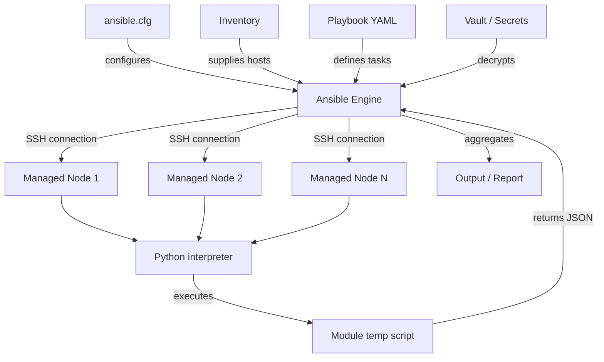
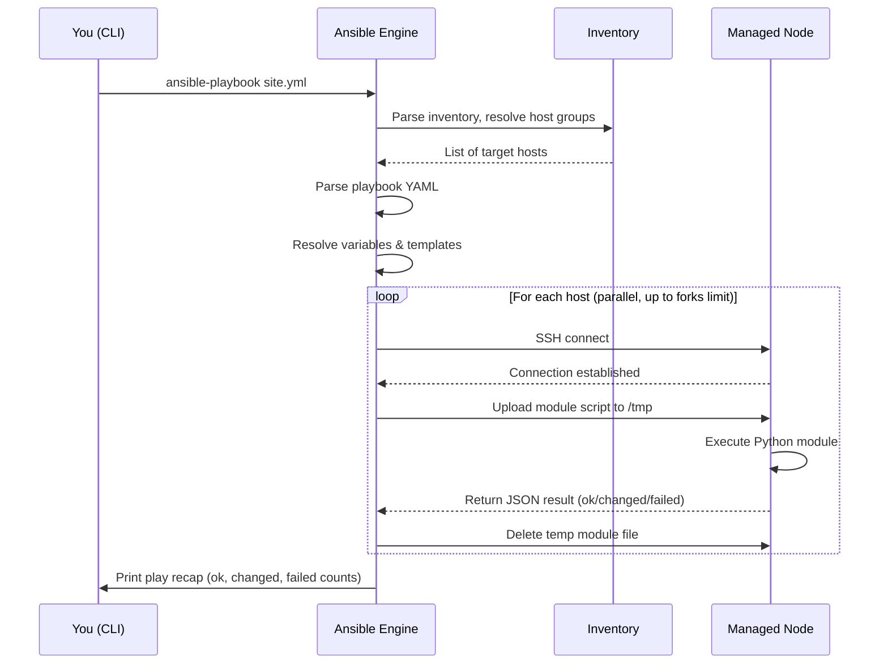

# Topic 1: What is Ansible?

> 📍 Phase 1 — Fundamentals | Topic 1 of 28 | File: `01-what-is-ansible.md`
> 🔗 Prev: *(start of course)* | Next: `02-installation-and-setup.md`

---

## 🧠 Concept Overview

Ansible is an **open-source IT automation engine** that lets you configure systems, deploy applications, and orchestrate complex multi-tier workflows — all from a single control machine, with no software installed on the machines you manage.

It was created by Michael DeHaan in 2012, acquired by Red Hat in 2015, and is now part of IBM. It is one of the most widely adopted automation tools in the industry — used by startups and Fortune 500 companies alike.

The genius of Ansible is its **simplicity**:
- You write automation in **YAML** (human-readable)
- You push commands over **SSH** (no agent to install)
- Tasks are **idempotent** (safe to re-run anytime)
- The learning curve is shallow but the depth is vast

If you can describe what a server should look like, Ansible can make it so — and keep it that way.

---

## 📖 In-Depth Explanation

### Subtopic 1.1 — Agentless Push Model vs Agent-Based Tools

Most configuration management tools fall into one of two camps:

**Agent-based (Pull model):**
| Tool | How it works |
|------|-------------|
| Puppet | Agent runs on every node, polls a master server every 30 min for its desired state |
| Chef | Agent (chef-client) runs on nodes, pulls config from Chef Server |
| SaltStack | Has both agentless and agent (minion) modes; default is agent |

Problems with agents:
- You must **bootstrap** every new node with the agent before you can manage it
- Agents consume CPU/RAM on every managed node
- Agent versioning becomes a maintenance burden at scale
- Agents open inbound ports — an attack surface

**Agentless (Push model) — Ansible's approach:**

Ansible pushes instructions **from the control node outward** over SSH (Linux/Unix) or WinRM (Windows). There is nothing to install on managed nodes except Python (already present on virtually every Linux server).

```
Control Node ──SSH──► Managed Node 1
             ──SSH──► Managed Node 2
             ──SSH──► Managed Node 3
```

Ansible:
1. Connects to the target via SSH
2. Copies a small Python script to a temp directory on the target
3. Executes it
4. Captures the result
5. Cleans up the temp script

The target node has no idea it's being "managed" — it just sees SSH connections and Python executions.

**When agent-based wins:** If you need continuous enforcement (a node drifting back to desired state automatically, without being triggered), Puppet/Chef have an edge. Ansible requires a human or scheduler (cron, AWX) to push changes.

---

### Subtopic 1.2 — Control Node, Managed Nodes, Inventory, and SSH Trust

**The four components you need to understand before writing a single line of YAML:**

#### Control Node
The machine where Ansible is installed and from which you run commands. This is typically:
- Your laptop (for learning)
- A dedicated automation server (production)
- A CI/CD runner (GitHub Actions, GitLab CI)

Requirements: Python 3.9+, Ansible installed, SSH access to managed nodes.

> ⚠️ Ansible **cannot** run on Windows as a control node (natively). Use WSL2 on Windows.

#### Managed Nodes (Hosts)
The servers, VMs, containers, or network devices you're automating. They only need:
- SSH daemon running
- Python 2.7+ or Python 3.5+ installed (most have this by default)
- A user with appropriate sudo privileges

#### Inventory
A file (or dynamic source) that tells Ansible **which hosts exist** and **how to group them**. The simplest inventory is a plain text file:

```ini
# inventory.ini
[webservers]
web1.example.com
web2.example.com

[databases]
db1.example.com ansible_port=5522
```

#### SSH Trust
Ansible authenticates using standard SSH — either:
- **SSH key pairs** (recommended) — generate with `ssh-keygen`, copy public key to nodes with `ssh-copy-id`
- **Passwords** — works but requires `sshpass` and is less secure

Before running Ansible against a host for the first time, SSH must already trust that host (known_hosts). You can disable strict host key checking in `ansible.cfg` for lab environments:

```ini
[defaults]
host_key_checking = False
```

> ⚠️ Never disable `host_key_checking` in production — you lose protection against MITM attacks.

---

### Subtopic 1.3 — Idempotency: What It Means and Why It Matters

**Idempotency** is the property where running the same operation multiple times produces the same result as running it once.

In traditional shell scripting:
```bash
useradd deploy          # Fails with "user already exists" if run twice
mkdir /opt/app          # Fails if directory already exists
```

In Ansible:
```yaml
- name: Ensure deploy user exists
  ansible.builtin.user:
    name: deploy
    state: present       # "Make it so" — not "run useradd"

- name: Ensure /opt/app directory exists
  ansible.builtin.file:
    path: /opt/app
    state: directory
```

Ansible's modules check **current state** before acting:
- If the user already exists → **no action, reports `ok`**
- If the user doesn't exist → **creates it, reports `changed`**

This has profound implications:
1. **Safe to re-run** — your playbooks become self-healing. Re-run after a partial failure and Ansible picks up where it left off.
2. **Drift detection** — if someone manually changes a server, your next Ansible run corrects it.
3. **`--check` mode** — dry-run your playbooks against live servers to see what *would* change before touching anything.

**The golden rule:** Write tasks that describe **desired state**, not imperative commands.

```yaml
# ❌ Imperative (not idempotent)
- name: Install nginx
  ansible.builtin.command: apt-get install -y nginx

# ✅ Declarative (idempotent)
- name: Ensure nginx is installed
  ansible.builtin.apt:
    name: nginx
    state: present
```

The `command` module runs the command every time (always reports `changed`). The `apt` module checks if nginx is installed first.

---

## 🏗️ Architecture & System Design

Ansible's runtime architecture during a playbook run:



Key architectural facts:
- **Parallelism:** Ansible connects to multiple hosts simultaneously, controlled by the `forks` setting (default: 5)
- **No central server required:** The control node IS the server — there's no persistent daemon
- **Module execution:** Ansible copies a self-contained Python script to the target, executes it, reads the JSON output, then deletes it
- **Connection plugins:** SSH is the default, but Ansible supports `local`, `docker`, `kubectl`, `winrm`, `network_cli`, and more

---

## 🔄 Flow / Lifecycle

What happens when you run `ansible-playbook site.yml`:



**Play Recap** — the final output of every playbook run:
```
PLAY RECAP *******************
web1  : ok=5  changed=2  unreachable=0  failed=0
web2  : ok=5  changed=0  unreachable=0  failed=0
db1   : ok=3  changed=1  unreachable=0  failed=0
```
- `ok` = task ran, no change needed (idempotent)
- `changed` = task ran and modified something
- `failed` = task errored
- `unreachable` = SSH could not connect

---

## 💻 Code Examples

### ✅ Example 1: Your first ad-hoc command (ping all hosts)
```bash
# Test SSH connectivity to all hosts in inventory
ansible all -i inventory.ini -m ping

# Expected output:
# web1 | SUCCESS => { "ping": "pong" }
# web2 | SUCCESS => { "ping": "pong" }
```

### ✅ Example 2: Minimal playbook — install and start nginx
```yaml
# site.yml
---
- name: Configure web servers
  hosts: webservers        # Matches a group in your inventory
  become: true             # sudo privilege escalation

  tasks:
    - name: Ensure nginx is installed
      ansible.builtin.apt:
        name: nginx
        state: present
        update_cache: true

    - name: Ensure nginx is running and enabled
      ansible.builtin.service:
        name: nginx
        state: started
        enabled: true
```

```bash
# Run it
ansible-playbook -i inventory.ini site.yml

# Dry run — see what WOULD change without touching anything
ansible-playbook -i inventory.ini site.yml --check --diff
```

### ✅ Example 3: Minimal inventory (INI format)
```ini
# inventory.ini
[webservers]
web1.example.com ansible_user=ubuntu ansible_private_key_file=~/.ssh/mykey.pem
web2.example.com

[databases]
db1.example.com ansible_user=ec2-user

[all:vars]
ansible_python_interpreter=/usr/bin/python3
```

### ❌ Anti-pattern — Using `command` when a module exists
```yaml
# ❌ Don't do this — not idempotent, always reports "changed"
- name: Install nginx
  ansible.builtin.command: apt-get install -y nginx

# ✅ Do this instead — idempotent, uses the proper module
- name: Ensure nginx is installed
  ansible.builtin.apt:
    name: nginx
    state: present
```

---

## ⚙️ Configuration & Options

The `ansible.cfg` file controls Ansible's default behaviour. Ansible searches for it in this order:
1. `ANSIBLE_CONFIG` environment variable
2. `./ansible.cfg` (current directory) ← most common for projects
3. `~/.ansible.cfg`
4. `/etc/ansible/ansible.cfg`

Key settings:

| Setting | Default | Description |
|---------|---------|-------------|
| `inventory` | `/etc/ansible/hosts` | Path to default inventory file |
| `remote_user` | current OS user | Default SSH username |
| `private_key_file` | SSH default | Path to private key |
| `forks` | `5` | Parallel connections to hosts |
| `host_key_checking` | `True` | Verify SSH host keys |
| `become` | `False` | Default privilege escalation |
| `become_method` | `sudo` | How to escalate (sudo, su, pbrun) |
| `retry_files_enabled` | `True` | Create `.retry` files on failure |
| `stdout_callback` | `default` | Output format (`yaml`, `json`, `minimal`) |

```ini
# Example ansible.cfg for a project
[defaults]
inventory       = ./inventory
remote_user     = ubuntu
private_key_file = ~/.ssh/project-key.pem
forks           = 10
host_key_checking = False
stdout_callback = yaml

[privilege_escalation]
become          = True
become_method   = sudo
become_user     = root
```

---

## 🧩 Patterns & Best Practices

**What experienced engineers do:**
- Always use **FQCN (Fully Qualified Collection Names)** for modules: `ansible.builtin.apt` not just `apt` — it's explicit and won't break when collections are updated
- Commit `ansible.cfg` to the repo alongside your playbooks — it makes the project self-contained
- Use `--check --diff` before every production run — treat it like a `terraform plan`
- Name every task descriptively: `Ensure nginx is installed and latest` beats `nginx`
- Use the `state` parameter over imperative commands — always

**What beginners typically get wrong:**
- Using `shell` or `command` for tasks that have proper modules (package installs, file ops, service management)
- Not testing with `--check` mode before running against production
- Hardcoding usernames, IPs, and paths in tasks instead of using variables
- Writing non-idempotent tasks and being surprised when re-runs cause errors or duplicate resources

**Senior-level nuance:**
- Ansible is a **configuration tool**, not a provisioning tool. Use Terraform/Pulumi to create infrastructure, Ansible to configure it
- Ansible's agentless model means you need something else to handle **continuous compliance** — either scheduled AWX jobs or a complementary tool like InSpec

---

## 🔗 How It Connects

- **Builds on:** Nothing — this is the foundation
- **Leads to:** `02-installation-and-setup.md` — now that you understand the model, let's get it running
- **Related concepts:** Topic 20 (performance/forks), Topic 21 (AWX as a scheduler), Topic 28 (architecture decisions)

---

## 🎯 Interview Questions (Conceptual)

**Q1: What does "agentless" mean in Ansible's context, and what are its trade-offs?**
> **A:** Agentless means Ansible communicates with managed nodes purely over SSH, with no persistent agent software installed. This removes bootstrapping overhead and attack surface, but means you lose the continuous drift correction you'd get from an agent that polls a server every 30 minutes. You must actively trigger Ansible runs via cron or a scheduler like AWX.

**Q2: What is idempotency and why is it critical in configuration management?**
> **A:** Idempotency means running a task multiple times produces the same result as running it once. It's critical because it lets you safely re-run playbooks after failures, use `--check` mode for dry runs, and treat automation as self-healing — if a server drifts from its desired state, the next Ansible run corrects it without side effects.

**Q3: How does Ansible execute a module on a remote node?**
> **A:** Ansible SSHes into the node, copies a self-contained Python script representing the module to a temp directory, executes it, reads the JSON result, then cleans up the temp file. The remote node requires only SSH access and a Python interpreter.

**Q4: What is the difference between `ok` and `changed` in Ansible's play recap?**
> **A:** `ok` means the task ran, checked the current state, and found it already matches the desired state — no changes were made. `changed` means the task had to take an action to bring the node into the desired state. Both are successful outcomes; `changed` just means work was done.

**Q5: Why should you prefer `ansible.builtin.apt` over `ansible.builtin.command: apt-get install`?**
> **A:** The `apt` module is idempotent — it checks if the package is already installed before acting, and reports `ok` if so. The `command` module simply executes the shell command every time and always reports `changed`, regardless of whether the package was already present. Using proper modules also gives you structured output and proper error handling.

**Q6: What is a control node and what are its requirements?**
> **A:** The control node is the machine where Ansible is installed and playbooks are run from. It needs Python 3.9+, Ansible installed, and SSH access to managed nodes. It cannot natively be a Windows machine — use WSL2 on Windows. In production, this is typically a dedicated automation server or CI/CD runner.

**Q7: Where does Ansible look for `ansible.cfg` and what is the recommended practice?**
> **A:** Ansible checks in this order: `ANSIBLE_CONFIG` env var, `./ansible.cfg` in the current directory, `~/.ansible.cfg`, then `/etc/ansible/ansible.cfg`. Best practice is to keep an `ansible.cfg` in your project root alongside your playbooks so the configuration is version-controlled and self-contained.

---

## 🧠 Scenario-Based Interview Problems

**Scenario 1: "You've inherited 200 servers that were configured manually over years. Your manager wants you to bring them under Ansible management. Where do you start?"**
> **Problem:** You have no existing inventory, no known state, and SSH trust is inconsistent.
> **Approach:** First, audit connectivity — build a static inventory from your CMDB or cloud console, then run `ansible all -m ping` to establish which hosts are reachable. Run `ansible all -m setup` to gather facts and understand current state. Write playbooks in `--check` mode first to see drift before making changes. Start with non-destructive playbooks (fact gathering, monitoring agent setup) before touching critical config.
> **Trade-offs:** Jumping straight to enforcing desired state risks outages. The "inventory first, observe second, enforce third" approach is slower but far safer for brownfield environments.

**Scenario 2: "A junior engineer asks — can we use Ansible to replace Terraform for spinning up our AWS EC2 instances?"**
> **Problem:** Conflating provisioning (creating infrastructure) with configuration management (configuring it).
> **Approach:** Technically Ansible can provision EC2 via the `amazon.aws` collection, but it's not the right tool for the job. Ansible lacks a state file — it doesn't track what infrastructure it created, making teardown and drift detection difficult. The right answer is Terraform for provisioning, Ansible for configuration. Use Terraform's `remote-exec` provisioner or a CI/CD pipeline to hand off to Ansible after infrastructure is created.
> **Trade-offs:** Using Ansible alone for infra provisioning is acceptable for small, simple environments where Terraform overhead isn't worth it. At scale, you'll regret not having a state file.

**Scenario 3: "Your playbook runs fine locally but a colleague running it from the same repo gets different results. How do you debug this?"**
> **Problem:** Non-deterministic behaviour from environment differences.
> **Approach:** Check `ansible --version` — are you on the same Ansible version? Check if there's an `ansible.cfg` in the home directory overriding project config. Compare inventory sources. Check variable precedence — `--extra-vars` at the CLI always wins. Use `ansible-playbook --list-vars` and `-v`/`-vvv` for verbose output. Ideally, pin Ansible version in a `requirements.txt` and use a virtual environment.
> **Trade-offs:** The real fix is reproducible environments — venv + pinned versions + committed `ansible.cfg` eliminates the "works on my machine" class of bugs entirely.

---

## ⚡ Quick Notes — Revision Card

- 📌 Ansible is **agentless** — communicates via SSH, no software on managed nodes
- 📌 **Control node** = where Ansible runs | **Managed nodes** = what Ansible configures
- 📌 **Inventory** = the list of hosts Ansible manages (static file or dynamic script)
- 📌 **Idempotency** = running tasks twice has the same result as running them once
- 📌 `ok` = no change needed | `changed` = action was taken | `failed` = task errored
- ⚠️ Ansible cannot run natively on Windows as a control node — use WSL2
- ⚠️ Using `command`/`shell` instead of proper modules breaks idempotency
- 💡 Use `--check --diff` before every production run — it's your dry-run safety net
- 💡 Ansible = **configuration management**, not provisioning. Use Terraform for infra creation
- 🔑 Use FQCN for modules (`ansible.builtin.apt` not `apt`) for clarity and future-proofing

---

## 🔖 References & Further Reading

- 📄 [Official Ansible Docs — Getting Started](https://docs.ansible.com/ansible/latest/getting_started/index.html)
- 📄 [How Ansible Works](https://www.ansible.com/overview/how-ansible-works)
- 📝 [Ansible vs Puppet vs Chef vs Salt — Comparison](https://www.digitalocean.com/community/tutorials/an-introduction-to-configuration-management)
- 🎥 [Ansible 101 — Jeff Geerling (YouTube)](https://www.youtube.com/playlist?list=PL2_OBreMn7FqZkvMYt6ATmgC0KAGGJNAN)
- 📚 *Ansible for DevOps* — Jeff Geerling (Chapter 1)
- ➡️ Related in this course: *(start)* · [`02-installation-and-setup.md`]

---
