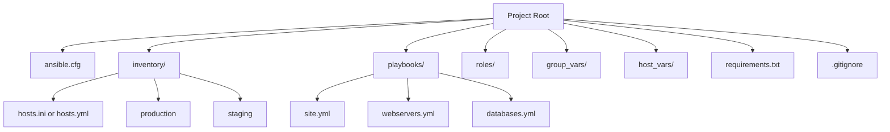
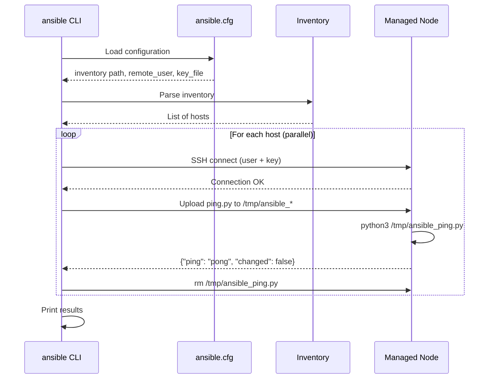

# Topic 2: Installation & Setup

> 📍 Phase 1 — Fundamentals | Topic 2 of 28 | File: `02-installation-and-setup.md`
> 🔗 Prev: `01-what-is-ansible.md` | Next: `03-inventory.md`

---

## 🧠 Concept Overview

Before you can automate anything, you need a working Ansible environment. This means:

1. Installing Ansible on your **control node**
2. Configuring it with a sensible `ansible.cfg`
3. Setting up SSH trust to your managed nodes
4. Confirming everything works with `ansible -m ping`

This sounds trivial but getting the setup right — particularly virtual environments, config file precedence, and SSH — saves you hours of head-scratching later. This topic covers all three installation methods, the most important `ansible.cfg` settings, and how to test your environment before writing a single playbook.

---

## 📖 In-Depth Explanation

### Subtopic 2.1 — Installing via pip, OS Package Managers, and Virtual Environments

There are three ways to install Ansible. Each has a different use case.

---

#### Method 1: pip (Recommended for most users)

`pip` installs the latest Ansible from PyPI and gives you fine-grained version control.

```bash
# Install pip if not present
sudo apt install python3-pip   # Debian/Ubuntu
sudo dnf install python3-pip   # RHEL/Fedora

# Install Ansible
pip3 install ansible

# Verify
ansible --version
```

**Why pip is usually the right choice:**
- You get the latest stable release, not a distro-packaged (often outdated) version
- Easy to upgrade: `pip3 install --upgrade ansible`
- Works identically across all Linux distros and macOS

---

#### Method 2: OS Package Managers

Distro-packaged Ansible is convenient but often lags behind the current release.

```bash
# Ubuntu / Debian — add the official PPA for a fresher version
sudo apt update
sudo apt install software-properties-common
sudo add-apt-repository --yes --update ppa:ansible/ansible
sudo apt install ansible

# RHEL / CentOS / Rocky Linux — requires EPEL
sudo dnf install epel-release
sudo dnf install ansible

# macOS (Homebrew)
brew install ansible
```

**Use OS packages when:** You're on a locked-down enterprise system where pip is restricted, or you want ansible managed as a system service.

---

#### Method 3: Virtual Environments (Best Practice for Projects)

Using a virtual environment (venv) isolates Ansible and its Python dependencies per project. This prevents version conflicts when you have multiple Ansible projects or need different Ansible versions.

```bash
# Create a venv for your project
python3 -m venv ~/ansible-env

# Activate it
source ~/ansible-env/bin/activate

# Install Ansible into the venv
pip install ansible

# Optionally pin the version for reproducibility
pip install ansible==9.3.0

# Save your dependencies
pip freeze > requirements.txt

# Deactivate when done
deactivate
```

**For team projects** — commit `requirements.txt` and add this to your README:
```bash
python3 -m venv venv && source venv/bin/activate && pip install -r requirements.txt
```

This guarantees every team member runs the same Ansible version.

> 💡 **Pro tip:** Use `pipx` to install Ansible globally but still isolated:
> ```bash
> pipx install ansible
> ```
> `pipx` installs tools in isolated environments but makes them available system-wide — best of both worlds.

---

#### Verifying your installation

```bash
ansible --version
# Expected output:
# ansible [core 2.17.x]
#   config file = /home/user/myproject/ansible.cfg
#   configured module search path = [...]
#   ansible python module location = ...
#   ansible collection location = ...
#   executable location = /usr/bin/ansible
#   python version = 3.11.x
#   jinja version = 3.1.x
#   libyaml = True

# Check which config file is being used
ansible --version | grep "config file"
```

---

### Subtopic 2.2 — `ansible.cfg` — Key Settings

`ansible.cfg` is the heart of your project configuration. It tells Ansible where to find your inventory, how to connect, and how to behave.

**Config file search order** (first found wins):
1. `$ANSIBLE_CONFIG` environment variable
2. `./ansible.cfg` — **current working directory** ← put it here for project configs
3. `~/.ansible.cfg` — user home directory
4. `/etc/ansible/ansible.cfg` — system-wide default

---

#### A production-ready `ansible.cfg`

```ini
[defaults]
# ── Inventory ──────────────────────────────────────────────────
inventory           = ./inventory          # path to inventory file or dir
# inventory         = ./inventory.yml      # YAML inventory
# inventory         = ./inventory/         # directory of inventory files

# ── Connection ─────────────────────────────────────────────────
remote_user         = ubuntu               # default SSH user
private_key_file    = ~/.ssh/project.pem   # default SSH private key
# host_key_checking = False               # ONLY for lab/dev environments

# ── Execution ──────────────────────────────────────────────────
forks               = 10                   # parallel host connections (default: 5)
timeout             = 30                   # SSH connection timeout in seconds
gather_facts        = smart                # cache facts, re-gather if stale

# ── Output ─────────────────────────────────────────────────────
stdout_callback     = yaml                 # cleaner output (also: json, minimal)
# callback_whitelist = profile_tasks       # uncomment to time each task

# ── Retry files ────────────────────────────────────────────────
retry_files_enabled = False                # disable .retry files cluttering your dir

# ── Roles ──────────────────────────────────────────────────────
roles_path          = ./roles:~/.ansible/roles:/etc/ansible/roles

[privilege_escalation]
become              = False                # don't become by default (use per-play)
become_method       = sudo
become_user         = root
become_ask_pass     = False

[ssh_connection]
ssh_args            = -o ControlMaster=auto -o ControlPersist=60s
pipelining          = True                 # big performance boost (see Topic 20)
```

> ⚠️ **Security note:** Never commit `private_key_file` paths or passwords into `ansible.cfg` if your repo is public. Use environment variables or Ansible Vault for secrets.

---

#### The most important settings explained

| Setting | What it does | Why it matters |
|---------|-------------|----------------|
| `inventory` | Points to your hosts | Without this, Ansible doesn't know what to manage |
| `remote_user` | Default SSH login user | Saves typing `-u ubuntu` on every command |
| `forks` | Max parallel connections | Default 5 is too low for large inventories — bump to 20-50 |
| `pipelining = True` | Reuses SSH connections | Speeds up playbooks by 2-5x (requires `requiretty` disabled in sudoers) |
| `stdout_callback = yaml` | Cleaner task output | Makes debugging playbooks significantly easier |
| `gather_facts = smart` | Cache host facts | Avoids re-running the slow setup module on repeated runs |
| `retry_files_enabled = False` | No `.retry` files | Keeps your project directory clean |

---

### Subtopic 2.3 — Testing Connectivity with `ansible -m ping all`

Before writing any playbooks, always verify Ansible can reach your hosts.

#### Step 1: Set up SSH key trust

```bash
# Generate a key pair (if you don't have one)
ssh-keygen -t ed25519 -C "ansible-control" -f ~/.ssh/ansible_key

# Copy the public key to each managed node
ssh-copy-id -i ~/.ssh/ansible_key.pub ubuntu@192.168.1.10
ssh-copy-id -i ~/.ssh/ansible_key.pub ubuntu@192.168.1.11

# Test raw SSH first — never assume Ansible works if SSH doesn't
ssh -i ~/.ssh/ansible_key ubuntu@192.168.1.10
```

#### Step 2: Create a minimal inventory

```ini
# inventory.ini
[webservers]
web1 ansible_host=192.168.1.10 ansible_user=ubuntu ansible_private_key_file=~/.ssh/ansible_key
web2 ansible_host=192.168.1.11 ansible_user=ubuntu ansible_private_key_file=~/.ssh/ansible_key
```

#### Step 3: Ping all hosts

```bash
# The ping module tests SSH + Python availability — not ICMP
ansible all -i inventory.ini -m ping

# Success output:
# web1 | SUCCESS => {
#     "ansible_facts": { "discovered_interpreter_python": "/usr/bin/python3" },
#     "changed": false,
#     "ping": "pong"
# }
# web2 | SUCCESS => { ... "ping": "pong" }

# Ping a specific group
ansible webservers -i inventory.ini -m ping

# Ping with verbose output (-v, -vv, -vvv for increasing detail)
ansible all -i inventory.ini -m ping -v
```

> ⚠️ The `ansible.builtin.ping` module is **not ICMP ping**. It verifies: SSH connectivity, Python is available, and Ansible can write temp files on the node. If ping fails, Ansible won't work — fix SSH first.

---

#### Common ping failure causes and fixes

| Error | Cause | Fix |
|-------|-------|-----|
| `UNREACHABLE! SSH Error` | No SSH trust or wrong user | Check `ansible_user`, run `ssh-copy-id` |
| `Python not found` | No Python on target | Install python3: `apt install python3` |
| `Permission denied` | Wrong key or user | Verify `ansible_private_key_file` |
| `Host key verification failed` | Host not in known_hosts | SSH manually first, or set `host_key_checking = False` in dev |
| `sudo: requiretty` | pipelining blocked by sudoers | Add `Defaults !requiretty` to `/etc/sudoers` |

---

## 🏗️ Architecture & System Design

How your project directory should be structured from day one:



**What goes in `.gitignore`:**
```
*.retry
*.pyc
__pycache__/
.vault_pass
*.pem
venv/
.ansible/
```

---

## 🔄 Flow / Lifecycle

What happens during `ansible -m ping all`:



---

## 💻 Code Examples

### ✅ Example 1: Full project bootstrap (copy-paste to get started)

```bash
# 1. Create project directory
mkdir my-ansible-project && cd my-ansible-project

# 2. Create virtual environment
python3 -m venv venv
source venv/bin/activate
pip install ansible

# 3. Create ansible.cfg
cat > ansible.cfg << 'EOF'
[defaults]
inventory           = ./inventory
remote_user         = ubuntu
private_key_file    = ~/.ssh/ansible_key
forks               = 10
stdout_callback     = yaml
retry_files_enabled = False
host_key_checking   = False

[privilege_escalation]
become       = False
become_method = sudo

[ssh_connection]
pipelining   = True
EOF

# 4. Create inventory
mkdir inventory
cat > inventory/hosts.ini << 'EOF'
[webservers]
web1 ansible_host=10.0.0.1
web2 ansible_host=10.0.0.2

[databases]
db1 ansible_host=10.0.0.10
EOF

# 5. Test connectivity
ansible all -m ping
```

### ✅ Example 2: Using environment variables to override config

```bash
# Override inventory without touching ansible.cfg
ANSIBLE_INVENTORY=./staging/hosts ansible all -m ping

# Override forks for a one-off run
ANSIBLE_FORKS=20 ansible-playbook site.yml

# Disable host key checking for a single run
ANSIBLE_HOST_KEY_CHECKING=False ansible all -m ping
```

### ✅ Example 3: Testing specific modules ad-hoc

```bash
# Check OS info on all hosts
ansible all -m ansible.builtin.setup -a "filter=ansible_distribution*"

# Run a quick command
ansible webservers -m ansible.builtin.command -a "uptime"

# Check disk space
ansible all -m ansible.builtin.command -a "df -h" -b
```

### ❌ Anti-pattern — Polluting the global Python environment

```bash
# ❌ Don't do this — installs Ansible globally, causes version conflicts
sudo pip3 install ansible

# ✅ Do this — use a venv per project
python3 -m venv venv && source venv/bin/activate && pip install ansible==9.3.0
```

---

## ⚙️ Configuration & Options

### Useful `ansible.cfg` settings reference

| Section | Key | Recommended Value | Notes |
|---------|-----|------------------|-------|
| `[defaults]` | `forks` | `20` (prod), `5` (dev) | More forks = faster but more load on control node |
| `[defaults]` | `pipelining` | `True` | Requires `Defaults !requiretty` in sudoers |
| `[defaults]` | `stdout_callback` | `yaml` | Much more readable than default |
| `[defaults]` | `interpreter_python` | `auto_silent` | Avoids interpreter discovery warnings |
| `[defaults]` | `collections_path` | `./collections` | For offline/air-gapped environments |
| `[ssh_connection]` | `ControlPersist` | `60s` | Reuses SSH connections within a run |
| `[ssh_connection]` | `ssh_args` | `-o ControlMaster=auto` | Multiplexes SSH connections |

---

## 🧩 Patterns & Best Practices

**What experienced engineers do:**
- Always use **venv + `requirements.txt`** — commit both to the repo. Anyone can reproduce your exact environment with one command.
- Keep `ansible.cfg` in the **project root** — this is the authoritative config for that project, version-controlled alongside the playbooks.
- Use `ansible --version` to confirm which `ansible.cfg` is being loaded before debugging weird behaviour.
- Add a `Makefile` with common commands for the team:
  ```makefile
  ping:
      ansible all -m ping
  
  check:
      ansible-playbook site.yml --check --diff
  
  deploy:
      ansible-playbook site.yml
  ```

**What beginners typically get wrong:**
- Installing Ansible globally with `sudo pip` and wondering why versions conflict across projects
- Forgetting to test raw SSH before blaming Ansible when ping fails
- Not committing `ansible.cfg` — teammates use a different inventory path and nothing works
- Setting `host_key_checking = False` globally (even in `~/.ansible.cfg`) and forgetting about it in production

**Senior-level nuance:**
- On large teams, consider using `pipx` or container-based Ansible (execution environments) so every engineer runs identical tooling — eliminate "works on my machine" entirely
- Ansible Execution Environments (EEs) are OCI-compliant containers with Ansible + collections + Python deps bundled — the future of reproducible Ansible environments, especially in AWX/AAP

---

## 🔗 How It Connects

- **Builds on:** `01-what-is-ansible.md` — you now have the model, now we install the tool
- **Leads to:** `03-inventory.md` — with Ansible running, we need to tell it what hosts to manage
- **Related concepts:** Topic 20 (pipelining & forks for performance), Topic 21 (AWX/AAP uses Execution Environments)

---

## 🎯 Interview Questions (Conceptual)

**Q1: What is the recommended way to install Ansible for a team project and why?**
> **A:** Use a Python virtual environment with a pinned version in `requirements.txt`. This ensures every team member and CI runner uses the same Ansible version, avoiding "works on my machine" bugs caused by version differences. Commit both `requirements.txt` and `ansible.cfg` to the repo.

**Q2: In what order does Ansible search for `ansible.cfg`?**
> **A:** First the `ANSIBLE_CONFIG` environment variable, then `./ansible.cfg` in the current directory, then `~/.ansible.cfg` in the user's home, then `/etc/ansible/ansible.cfg`. The first file found wins — later files in the chain are not merged.

**Q3: What does `ansible -m ping` actually test?**
> **A:** It tests SSH connectivity, verifies Python is available on the target, and confirms Ansible can write and execute temp files. It is NOT an ICMP ping. If ping succeeds, Ansible can run modules on that host.

**Q4: What is `pipelining = True` and what's its trade-off?**
> **A:** Pipelining makes Ansible reuse the same SSH connection to execute multiple tasks rather than opening a new connection per task, giving a 2-5x performance improvement. The trade-off is that it requires `Defaults !requiretty` to be set in the target's `/etc/sudoers`, otherwise sudo operations will fail.

**Q5: How would you manage multiple Ansible projects that need different Ansible versions?**
> **A:** Use a Python virtual environment per project with a pinned Ansible version in `requirements.txt`. Alternatively, use Ansible Execution Environments (OCI containers) which bundle the exact Ansible + collection + Python versions, guaranteeing identical environments everywhere.

---

## 🧠 Scenario-Based Interview Problems

**Scenario 1: "Your CI/CD pipeline's Ansible run works fine today but fails after a dependency update last week. How do you prevent this going forward?"**
> **Problem:** Unpinned Ansible or collection versions in CI causing breakage.
> **Approach:** Pin Ansible in `requirements.txt` (`ansible==9.3.0`). Pin collection versions in `requirements.yml`. In CI, always install from these files: `pip install -r requirements.txt && ansible-galaxy collection install -r requirements.yml`. Consider switching to Ansible Execution Environments for complete immutability.
> **Trade-offs:** Pinning means you must consciously upgrade. Set a quarterly calendar reminder to test and bump versions — the pain of planned upgrades beats the pain of surprise breakage.

**Scenario 2: "A new engineer joined your team. They cloned the repo, ran `ansible all -m ping`, and got `UNREACHABLE` errors. Walk them through debugging."**
> **Problem:** SSH trust not established, wrong user, or config not loading correctly.
> **Approach:** Step 1 — `ansible --version` to confirm ansible.cfg is loading from the project root. Step 2 — test raw SSH manually: `ssh -i key.pem ubuntu@host`. If that fails, the problem is SSH, not Ansible. Step 3 — check `ansible_user` and `ansible_private_key_file` in the inventory. Step 4 — add `-vvv` to the ping command for connection-level debug output. Step 5 — verify the target's `~/.ssh/authorized_keys` contains the control node's public key.
> **Trade-offs:** The fastest onboarding fix is a documented `make setup` target that generates keys and runs `ssh-copy-id` automatically.

---

## ⚡ Quick Notes — Revision Card

- 📌 Three install methods: **pip** (recommended), **OS package manager**, **venv** (best practice for projects)
- 📌 `ansible.cfg` search order: `$ANSIBLE_CONFIG` → `./ansible.cfg` → `~/.ansible.cfg` → `/etc/ansible/ansible.cfg`
- 📌 `ansible -m ping` = tests SSH + Python + temp file write — NOT ICMP ping
- 📌 Always test raw SSH before debugging Ansible connectivity
- ⚠️ Never use `sudo pip install ansible` — use venv to avoid version conflicts
- ⚠️ `host_key_checking = False` is for dev only — always on in production
- ⚠️ `pipelining = True` needs `Defaults !requiretty` in sudoers to work with sudo
- 💡 Commit `ansible.cfg` + `requirements.txt` to every project repo
- 💡 `ANSIBLE_FORKS=20` env var overrides config for one-off fast runs
- 🔑 `ansible --version` shows which config file is loaded — use it to debug config issues

---

## 🔖 References & Further Reading

- 📄 [Ansible Installation Guide](https://docs.ansible.com/ansible/latest/installation_guide/index.html)
- 📄 [ansible.cfg — All Settings Reference](https://docs.ansible.com/ansible/latest/reference_appendices/config.html)
- 📝 [Ansible Best Practices — Project Layout](https://docs.ansible.com/ansible/latest/tips_tricks/ansible_tips_tricks.html)
- 🎥 [Jeff Geerling — Ansible 101 Episode 1 (Setup)](https://www.youtube.com/watch?v=goclfp6a2IQ)
- 📚 *Ansible for DevOps* — Jeff Geerling (Chapter 1-2)
- ➡️ Related in this course: [`01-what-is-ansible.md`] · [`03-inventory.md`]

---
