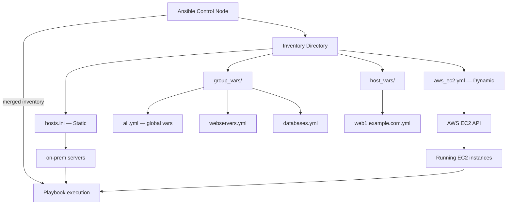
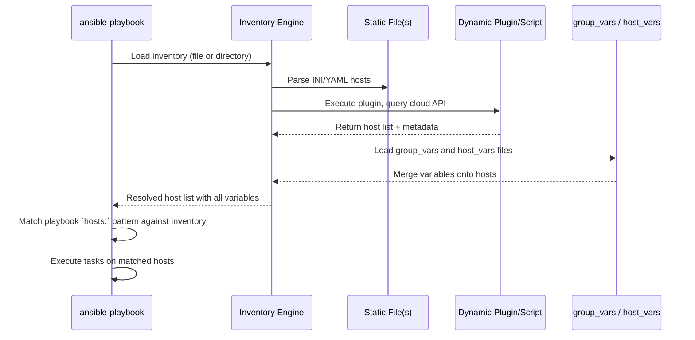

# Topic 3: Inventory

> 📍 Phase 1 — Fundamentals | Topic 3 of 28 | File: `03-inventory.md`
> 🔗 Prev: `02-installation-and-setup.md` | Next: `04-ad-hoc-commands.md`

---

## 🧠 Concept Overview

Inventory is Ansible's answer to the question: **"What machines am I managing?"**

At its simplest, inventory is a text file listing hostnames or IP addresses. At its most powerful, it is a dynamic system that queries your cloud provider in real time and automatically groups instances by region, tag, OS, or any attribute you care about.

Everything in Ansible — playbooks, ad-hoc commands, roles — operates against inventory. Understanding inventory deeply means you can:
- Target the right machines with surgical precision
- Share variables cleanly without repeating yourself
- Scale from 3 hosts to 30,000 without changing your playbooks

---

## 📖 In-Depth Explanation

### Subtopic 3.1 — INI vs YAML Inventory Formats

Ansible supports two formats for static inventory files. They are equivalent in capability — choose the one your team prefers.

---

#### INI Format (concise, most common)

```ini
# inventory/hosts.ini

# Ungrouped hosts
mail.example.com

# A group of web servers
[webservers]
web1.example.com
web2.example.com ansible_port=2222    # host-specific variable inline

# A group of database servers
[databases]
db1.example.com ansible_user=postgres
db2.example.com

# A group that contains other groups (parent group)
[production:children]
webservers
databases

# Variables applied to an entire group
[webservers:vars]
http_port=80
max_connections=200
ansible_user=ubuntu
```

---

#### YAML Format (verbose but structured)

```yaml
# inventory/hosts.yml
all:
  hosts:
    mail.example.com:

  children:
    webservers:
      hosts:
        web1.example.com:
        web2.example.com:
          ansible_port: 2222          # host-specific variable
      vars:
        http_port: 80
        max_connections: 200
        ansible_user: ubuntu

    databases:
      hosts:
        db1.example.com:
          ansible_user: postgres
        db2.example.com:

    production:
      children:
        webservers:
        databases:
```

**YAML inventory wins when:**
- Your inventory has deep nesting or complex variable structures
- You want to store inventory in a format consistent with your playbooks
- You're building dynamic inventory that generates YAML programmatically

**INI inventory wins when:**
- You have a small, simple host list
- You want a format operators can edit without YAML knowledge

---

#### The implicit groups: `all` and `ungrouped`

Every inventory has two built-in groups you never have to define:
- **`all`** — contains every host in the inventory
- **`ungrouped`** — contains hosts that don't belong to any explicit group

```bash
# Target all hosts
ansible all -m ping

# Target only ungrouped hosts
ansible ungrouped -m ping
```

---

### Subtopic 3.2 — Host Groups, Group Nesting, and `all`/`ungrouped`

Groups are how you target subsets of your infrastructure. A host can belong to multiple groups.

#### Basic grouping

```ini
[webservers]
web1.example.com
web2.example.com

[app_servers]
app1.example.com

[load_balancers]
lb1.example.com
```

#### Group nesting with `:children`

Nest groups to create hierarchies. This is essential for organizing large inventories.

```ini
[webservers]
web1.example.com
web2.example.com

[app_servers]
app1.example.com
app2.example.com

[databases]
db1.example.com

# Parent group: contains the other groups
[backend:children]
app_servers
databases

# Top-level environment groups
[production:children]
webservers
backend

[staging]
staging-web1.example.com
staging-app1.example.com
staging-db1.example.com
```

This lets you run:
```bash
ansible production -m ping       # all production hosts
ansible backend -m ping          # only app_servers + databases
ansible webservers -m ping       # only webservers
```

#### Patterns for targeting

Ansible accepts flexible patterns in the `hosts` field:

```bash
# All hosts
ansible all -m ping

# Specific group
ansible webservers -m ping

# Specific host
ansible web1.example.com -m ping

# Multiple groups (union)
ansible webservers:databases -m ping

# Intersection (hosts in BOTH groups)
ansible 'webservers:&staging' -m ping

# Exclusion (hosts in webservers but NOT in staging)
ansible 'webservers:!staging' -m ping

# Wildcard
ansible 'web*' -m ping

# Regex (prefix with ~)
ansible '~web[0-9]+\.example\.com' -m ping
```

---

### Subtopic 3.3 — Host and Group Variables in `host_vars/` and `group_vars/`

Putting variables inline in inventory files gets messy fast. The proper way is to use dedicated variable files in `host_vars/` and `group_vars/` directories.

#### Directory structure

```
inventory/
├── hosts.ini           ← host/group definitions only
├── group_vars/
│   ├── all.yml         ← variables for ALL hosts
│   ├── webservers.yml  ← variables for the webservers group
│   ├── databases.yml   ← variables for the databases group
│   └── production/     ← can also be a directory
│       ├── vars.yml
│       └── vault.yml   ← encrypted vars (Ansible Vault — Topic 13)
└── host_vars/
    ├── web1.example.com.yml   ← variables for web1 only
    └── db1.example.com.yml
```

#### `group_vars/all.yml` — applies to every host

```yaml
# group_vars/all.yml
ansible_user: ubuntu
ansible_python_interpreter: /usr/bin/python3
ntp_server: pool.ntp.org
timezone: UTC
```

#### `group_vars/webservers.yml` — applies only to the webservers group

```yaml
# group_vars/webservers.yml
http_port: 80
https_port: 443
nginx_worker_processes: auto
nginx_worker_connections: 1024
```

#### `host_vars/web1.example.com.yml` — applies only to web1

```yaml
# host_vars/web1.example.com.yml
ansible_host: 10.0.1.10
ansible_port: 22
nginx_server_name: www.example.com
is_primary: true
```

#### Variable precedence (simplified — full 22-level order in Topic 6)

For inventory variables specifically:
1. `host_vars/` — highest priority (most specific)
2. `group_vars/<groupname>` — applies to all hosts in that group
3. `group_vars/all` — applies to every host (lowest priority)

This means a value in `host_vars/web1.yml` overrides the same key in `group_vars/webservers.yml`.

---

### Subtopic 3.4 — Dynamic Inventory Scripts and Plugins

Static inventory files break down when your infrastructure is ephemeral (cloud VMs that come and go). Dynamic inventory solves this by querying your cloud/CMDB in real time.

#### Inventory Plugins (modern approach — Ansible 2.8+)

Inventory plugins are the recommended way to do dynamic inventory. They are configured via YAML files ending in `.aws_ec2.yml`, `.azure_rm.yml`, etc.

**AWS EC2 Example:**

```bash
# Install the AWS collection
ansible-galaxy collection install amazon.aws

# aws_ec2.yml — place in your inventory directory
```

```yaml
# inventory/aws_ec2.yml
plugin: amazon.aws.aws_ec2
regions:
  - eu-west-1
  - eu-central-1

# Filter to only running instances
filters:
  instance-state-name: running
  tag:Environment: production

# How to generate group names
keyed_groups:
  - key: tags.Role               # group by the "Role" EC2 tag
    prefix: role
  - key: placement.region        # group by region
    prefix: region
  - key: instance_type           # group by instance type
    prefix: type

# Add host vars from EC2 metadata
hostnames:
  - private-ip-address           # use private IP as hostname

compose:
  ansible_host: private_ip_address
```

```bash
# List what the dynamic inventory sees
ansible-inventory -i inventory/aws_ec2.yml --list

# Graph view of groups
ansible-inventory -i inventory/aws_ec2.yml --graph

# Run against it
ansible -i inventory/aws_ec2.yml role_webserver -m ping
```

**Other popular inventory plugins:**

| Plugin | Collection | Use case |
|--------|-----------|---------|
| `aws_ec2` | `amazon.aws` | AWS EC2 instances |
| `azure_rm` | `azure.azcollection` | Azure VMs |
| `gcp_compute` | `google.cloud` | GCP instances |
| `vmware_vm_inventory` | `community.vmware` | VMware vSphere |
| `openstack` | `openstack.cloud` | OpenStack |
| `kubevirt` | `community.kubevirt` | KubeVirt VMs |

#### Combining static and dynamic inventory

Use an **inventory directory** (not a single file) to mix sources:

```
inventory/
├── hosts.ini               ← static hosts (on-prem, permanent)
├── aws_ec2.yml             ← dynamic AWS inventory
└── group_vars/
    └── all.yml
```

```ini
# ansible.cfg
[defaults]
inventory = ./inventory     # point at the directory, not a file
```

Ansible merges all sources automatically. Groups from both sources coexist.

#### Inventory caching (performance)

For large dynamic inventories, querying AWS/Azure on every Ansible run is slow. Enable caching:

```ini
# ansible.cfg
[inventory]
cache            = True
cache_plugin     = jsonfile
cache_timeout    = 3600        # cache for 1 hour
cache_connection = /tmp/ansible_inventory_cache
```

---

## 🏗️ Architecture & System Design

How inventory fits into a real multi-environment setup:



---

## 🔄 Flow / Lifecycle

How Ansible resolves inventory before a playbook runs:



---

## 💻 Code Examples

### ✅ Example 1: A real-world production inventory layout

```
project/
├── ansible.cfg
├── inventory/
│   ├── production/
│   │   ├── hosts.ini
│   │   ├── aws_ec2.yml
│   │   └── group_vars/
│   │       ├── all.yml
│   │       ├── webservers.yml
│   │       └── databases/
│   │           ├── vars.yml
│   │           └── vault.yml       ← encrypted DB passwords
│   └── staging/
│       ├── hosts.ini
│       └── group_vars/
│           └── all.yml
```

```ini
# ansible.cfg
[defaults]
inventory = ./inventory/production
```

### ✅ Example 2: Testing your inventory structure

```bash
# Show all hosts in inventory (flat list)
ansible-inventory --list

# Show inventory as a graph (groups + children)
ansible-inventory --graph

# Show variables resolved for a specific host
ansible-inventory --host web1.example.com

# Check inventory with a specific file
ansible-inventory -i inventory/hosts.ini --graph
```

**`--graph` output:**
```
@all:
  |--@ungrouped:
  |--@webservers:
  |  |--web1.example.com
  |  |--web2.example.com
  |--@databases:
  |  |--db1.example.com
  |--@production:
  |  |--@webservers:
  |  |--@databases:
```

### ✅ Example 3: Numeric host ranges (for large clusters)

```ini
# INI shorthand for numbered hosts
[webservers]
web[01:10].example.com    # web01 through web10

[databases]
db[a:c].example.com       # dba, dbb, dbc
```

### ❌ Anti-pattern — Stuffing all variables inline in the hosts file

```ini
# ❌ Hard to read, impossible to audit, can't be encrypted
[webservers]
web1 ansible_host=10.0.0.1 ansible_user=ubuntu http_port=80 ssl_cert=/etc/ssl/cert.pem db_password=super_secret

# ✅ Clean hosts file — variables live in group_vars/host_vars
[webservers]
web1 ansible_host=10.0.0.1
```

```yaml
# group_vars/webservers.yml
http_port: 80
ssl_cert: /etc/ssl/cert.pem

# group_vars/webservers/vault.yml  ← encrypted with ansible-vault
db_password: !vault |
  $ANSIBLE_VAULT;1.1;AES256
  ...
```

---

## ⚙️ Configuration & Options

Key inventory-related connection variables:

| Variable | Example | Description |
|----------|---------|-------------|
| `ansible_host` | `10.0.0.1` | IP/hostname to connect to (overrides inventory name) |
| `ansible_port` | `2222` | SSH port (default: 22) |
| `ansible_user` | `ubuntu` | SSH login user |
| `ansible_password` | `secret` | SSH password (use vault!) |
| `ansible_private_key_file` | `~/.ssh/key.pem` | Path to SSH private key |
| `ansible_python_interpreter` | `/usr/bin/python3` | Explicit Python path on target |
| `ansible_connection` | `ssh` / `local` / `winrm` | Connection type |
| `ansible_become` | `true` | Enable sudo for this host |
| `ansible_become_user` | `root` | User to become |

---

## 🧩 Patterns & Best Practices

**What experienced engineers do:**
- Always use a **directory** as inventory (`inventory = ./inventory`) not a single file — it scales as you add dynamic sources or multiple environments
- Split inventory by **environment** (production/, staging/, dev/) not by server type — it's far less risky to accidentally run on staging than production
- Use `group_vars/all.yml` sparingly — only for truly universal settings. Over-using `all` makes variables hard to track
- Run `ansible-inventory --graph` after any inventory change to verify structure before running playbooks
- Treat `host_vars/` files like individual server documentation — add comments explaining why a host has a special setting

**What beginners typically get wrong:**
- Mixing variable definitions and host definitions in the same file — the file becomes unmanageable at 30+ hosts
- Creating a flat inventory with no groups — then having to type long host lists in every playbook
- Not using group nesting — they create massive groups instead of composable hierarchies
- Using `localhost` in inventory without setting `ansible_connection=local`

**Senior-level nuance:**
- In AWS/GCP environments, **never maintain a static inventory** — use dynamic inventory plugins exclusively. Static inventories drift out of sync with reality within days
- Use the `constructed` inventory plugin to build logical groups from facts or tags — e.g., automatically group all instances with `tag:Role=webserver` into a `webservers` group without manually maintaining membership

---

## 🔗 How It Connects

- **Builds on:** `02-installation-and-setup.md` — you need a working Ansible install to use inventory
- **Leads to:** `04-ad-hoc-commands.md` — with inventory in place, you can now run commands against groups of hosts
- **Related concepts:** Topic 6 (variable precedence — inventory vars are part of the 22-level order), Topic 22 (advanced dynamic inventory), Topic 13 (Vault for encrypting sensitive vars in inventory)

---

## 🎯 Interview Questions (Conceptual)

**Q1: What is the difference between `host_vars` and `group_vars`?**
> **A:** `host_vars/<hostname>.yml` contains variables that apply only to that specific host. `group_vars/<groupname>.yml` contains variables that apply to all hosts in that group. Host vars take priority over group vars when the same variable name exists in both, because they are more specific.

**Q2: How does Ansible handle a host that belongs to multiple groups?**
> **A:** A host can belong to multiple groups simultaneously, and it inherits variables from all of them. If the same variable is defined in multiple groups, the variable with the highest precedence wins — generally determined by group naming order. To avoid ambiguity, use `host_vars` for host-specific overrides.

**Q3: What is the difference between static and dynamic inventory?**
> **A:** Static inventory is a file you maintain manually — it's simple but drifts out of sync with reality in cloud environments. Dynamic inventory queries an external source (AWS, Azure, a CMDB) at runtime, always reflecting current infrastructure. Modern Ansible uses inventory plugins (configured via YAML) rather than the older executable script approach.

**Q4: What is the purpose of the `all` and `ungrouped` built-in groups?**
> **A:** `all` contains every host in the inventory — useful for targeting everything or setting universal variables in `group_vars/all.yml`. `ungrouped` contains hosts that were defined in the inventory but not placed in any explicit group.

**Q5: How would you structure inventory for multiple environments (production, staging)?**
> **A:** Use separate inventory directories per environment: `inventory/production/` and `inventory/staging/`. Each has its own `hosts.ini` and `group_vars/`. Point `ansible.cfg` at the environment you're targeting, or override with `-i inventory/staging` at the CLI. This eliminates the risk of accidentally running production playbooks against staging hosts.

**Q6: What is the `constructed` inventory plugin used for?**
> **A:** It allows you to build new groups and host variables dynamically from existing host facts or variables. For example, you can automatically create a `region_eu_west_1` group from EC2 instances where `placement.region == 'eu-west-1'`, without manually managing group membership. Extremely useful for building logical groupings from cloud metadata.

---

## 🧠 Scenario-Based Interview Problems

**Scenario 1: "You have 500 EC2 instances across 3 AWS regions and 2 environments. Your teammate is manually updating a hosts.ini file every time a new instance launches. What do you propose?"**
> **Problem:** Static inventory can't keep up with dynamic cloud infrastructure.
> **Approach:** Replace `hosts.ini` with an `aws_ec2.yml` inventory plugin config. Use EC2 tags (`Environment: production`, `Role: webserver`) to drive grouping via `keyed_groups`. Enable inventory caching with a 1-hour TTL to avoid API calls on every run. Ensure all new EC2 instances are launched with the correct tags — enforce this via your Terraform modules or AWS SCPs.
> **Trade-offs:** Dynamic inventory requires cloud API credentials on the control node. For air-gapped or highly regulated environments, a CMDB-backed custom inventory plugin may be more appropriate.

**Scenario 2: "A playbook that targets `[webservers]` is accidentally also running on your database hosts. How did this happen and how do you prevent it?"**
> **Problem:** Likely the `databases` group is nested under `webservers`, or a wildcard pattern is too broad.
> **Approach:** Run `ansible-inventory --graph` to inspect the actual group hierarchy. Check if someone used `all` or a broad pattern in the playbook's `hosts:` field. Implement a `--limit` flag in your deployment pipeline (`--limit webservers`) as a safety net. Consider using separate inventory directories per server type so cross-contamination is structurally impossible.
> **Trade-offs:** Over-restrictive limiting can cause playbooks to silently skip hosts. Add a task at the top of critical playbooks that uses `assert` to verify the hosts being targeted are what you expect.

---

## ⚡ Quick Notes — Revision Card

- 📌 Two static formats: **INI** (concise) and **YAML** (structured) — functionally equivalent
- 📌 Built-in groups: **`all`** (every host) and **`ungrouped`** (hosts with no group)
- 📌 Group nesting: use `:children` in INI or `children:` in YAML to build hierarchies
- 📌 Variables: **`group_vars/<group>.yml`** for group-level, **`host_vars/<host>.yml`** for host-level
- 📌 Variable priority: `host_vars` > named `group_vars` > `group_vars/all`
- 📌 Dynamic inventory: use **inventory plugins** (`.aws_ec2.yml`, `.azure_rm.yml`) not legacy scripts
- ⚠️ Never mix variable definitions and host definitions in the same file at scale
- ⚠️ Static inventory drifts in cloud environments — use dynamic inventory for ephemeral infra
- 💡 Use `ansible-inventory --graph` to visualise and verify inventory structure
- 💡 Use **inventory directories** not single files — allows mixing static + dynamic sources
- 🔑 Enable inventory caching for large dynamic inventories to avoid slow cloud API calls

---

## 🔖 References & Further Reading

- 📄 [Ansible Inventory — Official Docs](https://docs.ansible.com/ansible/latest/inventory_guide/index.html)
- 📄 [Inventory Plugins Reference](https://docs.ansible.com/ansible/latest/plugins/inventory.html)
- 📄 [amazon.aws.aws_ec2 Inventory Plugin](https://docs.ansible.com/ansible/latest/collections/amazon/aws/aws_ec2_inventory.html)
- 📝 [Dynamic Inventory Guide](https://docs.ansible.com/ansible/latest/inventory_guide/intro_dynamic_inventory.html)
- 🎥 [Jeff Geerling — Ansible Inventory Deep Dive](https://www.youtube.com/watch?v=HU-dkXBCPdU)
- ➡️ Related in this course: [`02-installation-and-setup.md`] · [`04-ad-hoc-commands.md`]

---
