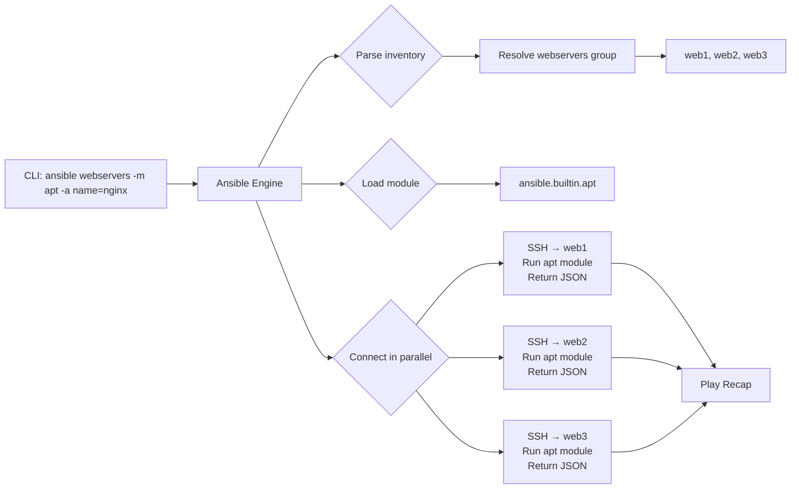
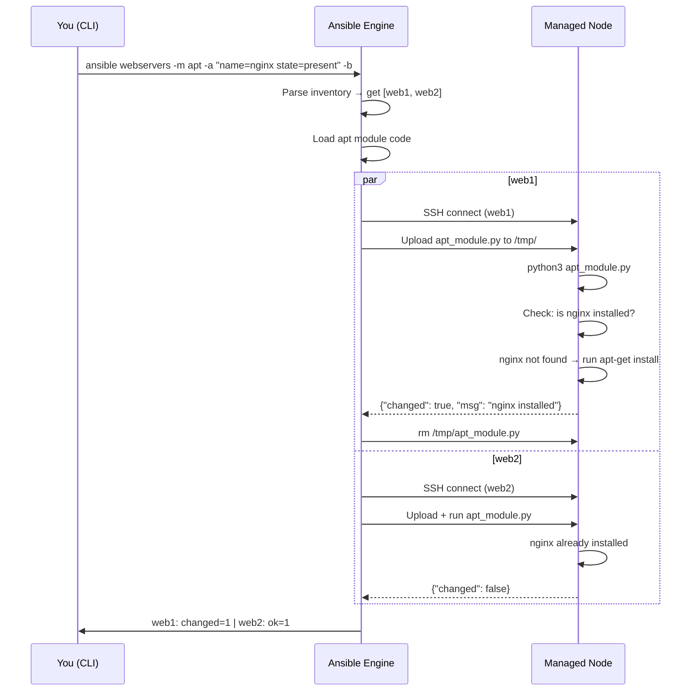

# Topic 4: Ad-Hoc Commands

> 📍 Phase 1 — Fundamentals | Topic 4 of 28 | File: `04-ad-hoc-commands.md`
> 🔗 Prev: `03-inventory.md` | Next: `05-playbook-basics.md`

---

## 🧠 Concept Overview

Ad-hoc commands let you run a **single Ansible module against your inventory directly from the CLI** — no playbook file required. Think of them as one-liners for quick tasks: checking disk space across 50 servers, restarting a service, copying a file, or running a shell command — all in one line.

They're not a replacement for playbooks (which are repeatable, documented, version-controlled). Ad-hoc commands are your **Swiss Army knife for operational tasks** — investigation, quick fixes, and smoke testing before you commit something to a playbook.

Understanding ad-hoc commands also builds your intuition for how modules work, which directly transfers to writing playbook tasks.

---

## 📖 In-Depth Explanation

### Subtopic 4.1 — Module Syntax: `-m`, `-a`, `-b`

Every ad-hoc command follows the same structure:

```
ansible <pattern> -i <inventory> -m <module> -a "<arguments>" [options]
```

| Flag | Long form | Meaning |
|------|-----------|---------|
| `-m` | `--module-name` | The module to run (e.g. `ping`, `command`, `apt`) |
| `-a` | `--args` | Arguments to pass to the module (key=value pairs) |
| `-b` | `--become` | Use privilege escalation (sudo) |
| `-u` | `--user` | SSH user to connect as |
| `-i` | `--inventory` | Inventory file/directory |
| `-v` | `--verbose` | Verbose output (`-vv`, `-vvv` for more detail) |
| `-f` | `--forks` | Number of parallel connections |
| `-C` | `--check` | Dry run — show what would change |
| `--diff` | `--diff` | Show file diffs for changed content |
| `-K` | `--ask-become-pass` | Prompt for sudo password |
| `-k` | `--ask-pass` | Prompt for SSH password |

#### Anatomy of a real ad-hoc command

```bash
ansible webservers \        # target: group from inventory
  -i ./inventory \          # inventory path
  -m ansible.builtin.apt \  # module: apt package manager
  -a "name=nginx state=present update_cache=yes" \  # module args
  -b \                      # become: run as sudo
  -v                        # verbose output
```

---

#### The default module: `command`

If you omit `-m`, Ansible defaults to the `command` module:

```bash
# These are equivalent
ansible all -a "uptime"
ansible all -m ansible.builtin.command -a "uptime"
```

---

### Subtopic 4.2 — Common Modules You'll Use Daily

#### 🔹 `ping` — Test connectivity

```bash
# Test SSH + Python on all hosts
ansible all -m ping

# Test a specific group
ansible webservers -m ping

# Test a single host
ansible web1.example.com -m ping
```

---

#### 🔹 `command` — Run a command (no shell features)

The `command` module runs a binary directly. It does **not** invoke a shell, so pipes (`|`), redirects (`>`), and environment variables (`$VAR`) do not work.

```bash
# Check uptime
ansible all -m ansible.builtin.command -a "uptime"

# Check who's logged in
ansible all -m ansible.builtin.command -a "who"

# Free memory
ansible all -m ansible.builtin.command -a "free -m"

# Pass multiple args as a list (handles spaces in args correctly)
ansible webservers -m ansible.builtin.command -a "df -h /var"
```

---

#### 🔹 `shell` — Run a command through `/bin/sh`

Use `shell` when you need pipes, redirects, wildcards, or environment variable expansion.

```bash
# Count lines in a log file (needs pipe)
ansible webservers -m ansible.builtin.shell -a "wc -l /var/log/nginx/access.log"

# Check if a process is running (needs pipe)
ansible all -m ansible.builtin.shell -a "ps aux | grep nginx | grep -v grep"

# Read an environment variable
ansible all -m ansible.builtin.shell -a "echo $HOME"
```

> ⚠️ Prefer `command` over `shell` whenever possible. `shell` runs user input through `/bin/sh`, which creates a risk of shell injection if any input comes from untrusted sources.

---

#### 🔹 `copy` — Copy a file to remote hosts

```bash
# Copy a local file to all web servers
ansible webservers -m ansible.builtin.copy \
  -a "src=./files/nginx.conf dest=/etc/nginx/nginx.conf owner=root group=root mode=0644" \
  -b

# Copy inline content (no local file needed)
ansible all -m ansible.builtin.copy \
  -a "content='Hello from Ansible\n' dest=/tmp/hello.txt"
```

---

#### 🔹 `file` — Manage files, directories, symlinks

```bash
# Create a directory
ansible all -m ansible.builtin.file \
  -a "path=/opt/myapp state=directory mode=0755 owner=app group=app" \
  -b

# Create a symlink
ansible all -m ansible.builtin.file \
  -a "src=/opt/myapp/current dest=/opt/myapp/live state=link"

# Delete a file
ansible all -m ansible.builtin.file \
  -a "path=/tmp/old-config.txt state=absent"
```

---

#### 🔹 `apt` / `yum` / `dnf` — Package management

```bash
# Install a package (Ubuntu/Debian)
ansible webservers -m ansible.builtin.apt \
  -a "name=nginx state=present update_cache=yes" -b

# Remove a package
ansible webservers -m ansible.builtin.apt \
  -a "name=apache2 state=absent" -b

# Install multiple packages
ansible webservers -m ansible.builtin.apt \
  -a "name=nginx,certbot,python3-certbot-nginx state=present" -b

# Update all packages
ansible all -m ansible.builtin.apt \
  -a "upgrade=dist update_cache=yes" -b

# RHEL / CentOS
ansible all -m ansible.builtin.yum \
  -a "name=httpd state=latest" -b
```

---

#### 🔹 `service` — Manage system services

```bash
# Start nginx
ansible webservers -m ansible.builtin.service \
  -a "name=nginx state=started" -b

# Restart nginx
ansible webservers -m ansible.builtin.service \
  -a "name=nginx state=restarted" -b

# Enable a service (start on boot)
ansible webservers -m ansible.builtin.service \
  -a "name=nginx enabled=yes state=started" -b

# Stop a service
ansible webservers -m ansible.builtin.service \
  -a "name=nginx state=stopped" -b
```

---

#### 🔹 `user` — Manage user accounts

```bash
# Create a user
ansible all -m ansible.builtin.user \
  -a "name=deploy shell=/bin/bash groups=sudo append=yes state=present" -b

# Delete a user
ansible all -m ansible.builtin.user \
  -a "name=olduser state=absent remove=yes" -b
```

---

#### 🔹 `setup` — Gather host facts

```bash
# Gather ALL facts for all hosts (verbose — lots of output)
ansible all -m ansible.builtin.setup

# Filter facts by pattern
ansible all -m ansible.builtin.setup -a "filter=ansible_distribution*"
ansible all -m ansible.builtin.setup -a "filter=ansible_memory_mb"
ansible all -m ansible.builtin.setup -a "filter=ansible_interfaces"
ansible all -m ansible.builtin.setup -a "filter=ansible_default_ipv4"
```

---

#### 🔹 `fetch` — Pull files from remote hosts to control node

```bash
# Pull a log file from all web servers (saved per-host)
ansible webservers -m ansible.builtin.fetch \
  -a "src=/var/log/nginx/error.log dest=./fetched/ flat=no"
# Creates: ./fetched/web1/var/log/nginx/error.log
#          ./fetched/web2/var/log/nginx/error.log
```

---

#### 🔹 `reboot` — Reboot hosts gracefully

```bash
# Reboot all servers and wait for them to come back
ansible all -m ansible.builtin.reboot \
  -a "reboot_timeout=300 msg='Rebooting for kernel update'" -b
```

---

### Subtopic 4.3 — When to Use Ad-Hoc vs Playbooks

This is a judgment call experienced engineers make constantly:

| Situation | Use |
|-----------|-----|
| Quick health check across servers | Ad-hoc |
| Debugging — "what's the disk usage right now?" | Ad-hoc |
| One-time emergency fix during an incident | Ad-hoc |
| Testing a module before writing a playbook task | Ad-hoc |
| Gathering facts to understand a new environment | Ad-hoc |
| Anything you need to repeat, audit, or share | **Playbook** |
| Multi-step tasks (install + configure + start) | **Playbook** |
| Any change going to production | **Playbook** |
| Anything with variables, conditionals, or loops | **Playbook** |
| Anything that should be in version control | **Playbook** |

**The rule of thumb:** If you'll run it more than once, or if it changes system state in a meaningful way, write a playbook.

---

## 🏗️ Architecture & System Design

How an ad-hoc command flows through the Ansible stack:



---

## 🔄 Flow / Lifecycle



---

## 💻 Code Examples

### ✅ Example 1: Operational health check — gather key facts fast

```bash
# OS distribution across all hosts
ansible all -m ansible.builtin.setup -a "filter=ansible_distribution" \
  | grep -A2 "ansible_distribution"

# Disk usage on web servers
ansible webservers -m ansible.builtin.command -a "df -h /"

# Memory usage
ansible all -m ansible.builtin.command -a "free -h"

# Kernel version
ansible all -m ansible.builtin.command -a "uname -r"

# Check if a specific process is running
ansible webservers -m ansible.builtin.shell -a "pgrep -x nginx && echo running || echo stopped"
```

### ✅ Example 2: Emergency incident — restart a hung service across a group

```bash
# First check the service status (read-only)
ansible webservers -m ansible.builtin.service -a "name=nginx state=started" -b --check

# Restart nginx across all web servers
ansible webservers -m ansible.builtin.service -a "name=nginx state=restarted" -b

# Verify it came back up
ansible webservers -m ansible.builtin.command -a "systemctl status nginx --no-pager" -b
```

### ✅ Example 3: Deploy an emergency config change (one-off)

```bash
# Copy a hotfixed config to all web servers
ansible webservers -m ansible.builtin.copy \
  -a "src=./hotfix/nginx.conf dest=/etc/nginx/nginx.conf backup=yes" -b

# Test nginx config validity
ansible webservers -m ansible.builtin.command \
  -a "nginx -t" -b

# Reload nginx (graceful — no dropped connections)
ansible webservers -m ansible.builtin.service \
  -a "name=nginx state=reloaded" -b
```

### ✅ Example 4: Useful one-liners for ops work

```bash
# Show ansible_host IP for all hosts
ansible all -m ansible.builtin.debug -a "msg={{ ansible_host }}"

# Get the hostname of every server
ansible all -m ansible.builtin.command -a "hostname"

# Check if port 80 is listening
ansible webservers -m ansible.builtin.shell -a "ss -tlnp | grep ':80'"

# Find large files (needs shell for pipe + awk)
ansible all -m ansible.builtin.shell \
  -a "find /var/log -size +100M -type f 2>/dev/null"

# Get the last 20 lines of a log file
ansible webservers -m ansible.builtin.command \
  -a "tail -20 /var/log/nginx/error.log" -b
```

### ❌ Anti-pattern — Using `shell` when `command` is sufficient

```bash
# ❌ Unnecessary shell invocation — no shell features needed
ansible all -m ansible.builtin.shell -a "uptime"

# ✅ Use command — safer, no shell injection risk
ansible all -m ansible.builtin.command -a "uptime"

# ❌ Using command/shell for package installation — not idempotent
ansible webservers -m ansible.builtin.shell -a "apt-get install -y nginx"

# ✅ Use the apt module — idempotent
ansible webservers -m ansible.builtin.apt -a "name=nginx state=present" -b
```

---

## ⚙️ Configuration & Options

### Useful ad-hoc flags reference

| Flag | When to use |
|------|------------|
| `-v` / `-vv` / `-vvv` | Debugging — each level adds more SSH/module detail |
| `-C` `--check` | Dry run — see what would change without touching anything |
| `--diff` | Show line-level diffs for file changes (`copy`, `template`) |
| `-f 20` | Increase parallel forks for large inventories |
| `--limit web1` | Run against only one host from a group (safety net) |
| `-e "var=value"` | Pass extra variables to the module |
| `--one-line` | Compact output — one line per host |
| `-o` | Same as `--one-line` |
| `--list-hosts` | Show which hosts would be targeted (no execution) |

```bash
# Useful: see which hosts would be targeted before running
ansible webservers --list-hosts

# Compact one-line output (great for large host counts)
ansible all -m ping -o

# Limit to a single host for safety
ansible webservers -m service -a "name=nginx state=restarted" -b --limit web1
```

---

## 🧩 Patterns & Best Practices

**What experienced engineers do:**
- Always use `--list-hosts` before a destructive ad-hoc command to confirm the target set
- Use `--check` + `--diff` before any file-changing ad-hoc command (`copy`, `file`) to preview the change
- Use `--limit` to scope ad-hoc commands to a single host first in production — then broaden if it looks good
- Prefer `-m command` over `-m shell` unless you actually need shell features — it's safer and clearer
- Use `-o` (one-line output) when running against large inventories — makes spotting failures much faster

**What beginners typically get wrong:**
- Using `shell` for everything because "it's familiar" — loses idempotency and adds injection risk
- Not using `--check` before running ad-hoc commands that modify state
- Running against `all` in production without thinking — always start with `--list-hosts`
- Forgetting `-b` (become) when the task needs sudo, then being confused by permission errors

**Senior-level nuance:**
- Ad-hoc commands leave **no audit trail** by default — if you're changing production state, consider using AWX/Tower so every run is logged with who ran it and when
- For any change that might need to be rolled back, write a playbook instead — ad-hoc commands with `backup=yes` on `copy` give you file backups, but that's the limit of ad-hoc rollback capability
- The `--diff` flag is underused — it's invaluable for verifying what a `copy` or `template` would actually change before you do it

---

## 🔗 How It Connects

- **Builds on:** `03-inventory.md` — ad-hoc commands target groups and patterns you define in inventory
- **Leads to:** `05-playbook-basics.md` — ad-hoc tasks become playbook tasks; the module + args syntax is identical
- **Related concepts:** Topic 7 (`setup` module and facts), Topic 20 (forks for parallel execution)

---

## 🎯 Interview Questions (Conceptual)

**Q1: What is the difference between the `command` and `shell` modules?**
> **A:** `command` runs a binary directly without invoking a shell — it's safer (no shell injection risk) and preferred when shell features aren't needed. `shell` invokes `/bin/sh` and supports pipes, redirects, wildcards, and environment variables. Use `command` by default; only reach for `shell` when you need actual shell features.

**Q2: When should you use ad-hoc commands vs playbooks?**
> **A:** Ad-hoc commands suit quick, one-off operational tasks — health checks, emergency fixes, fact gathering. Playbooks are for anything you'll repeat, need to version-control, share with a team, or want to audit. Any production state change should be a playbook; ad-hoc is for investigation and tactical ops work.

**Q3: What does `-b` do in an ad-hoc command?**
> **A:** `-b` stands for `--become` — it enables privilege escalation, running the task as another user (typically root via sudo). It's required for tasks like installing packages, managing services, or modifying system files. You can specify the escalation method and target user in `ansible.cfg` or with `--become-method` and `--become-user`.

**Q4: How would you safely test an ad-hoc command before executing it on production?**
> **A:** Use `--list-hosts` to verify which hosts would be targeted. Then use `-C` (`--check`) with `--diff` to see exactly what would change without touching anything. Finally, use `--limit <single_host>` to run against one host first, verify the result, then broaden the scope.

**Q5: Why does `ansible all -a "echo $HOME"` not expand the variable?**
> **A:** Because `-a` defaults to the `command` module, which does not invoke a shell. `$HOME` is a shell variable — it only expands inside a shell. Use `-m shell` instead: `ansible all -m shell -a "echo $HOME"`. Or better, use the `setup` module to gather the `ansible_env.HOME` fact.

---

## 🧠 Scenario-Based Interview Problems

**Scenario 1: "At 2am, your monitoring alerts that nginx is down on 12 of your 40 web servers. You have 5 minutes to fix it. Walk me through your ad-hoc response."**
> **Problem:** Rapid triage and remediation without time to write a playbook.
> **Approach:** Step 1 — `ansible webservers -m ping -o` to identify which hosts are reachable. Step 2 — `ansible webservers -m service -a "name=nginx state=started" -b --check` dry-run to confirm what would happen. Step 3 — `ansible webservers -m service -a "name=nginx state=started" -b` to start nginx. Step 4 — verify with `ansible webservers -m shell -a "systemctl is-active nginx" -b`. If nginx keeps crashing, `ansible webservers -m command -a "journalctl -u nginx -n 50 --no-pager" -b` to pull logs.
> **Trade-offs:** This is a valid emergency use case for ad-hoc. After the incident, write a monitoring + auto-remediation playbook and schedule it in AWX so humans don't need to wake up for this.

**Scenario 2: "You need to audit whether a critical security patch (OpenSSL 3.0.8) is installed across 200 servers. How do you do it with ad-hoc commands?"**
> **Problem:** Querying installed package versions at scale without a playbook.
> **Approach:** `ansible all -m ansible.builtin.command -a "openssl version" -o` gives one-line output per host. Pipe to grep: `... | grep -v "3.0.8"` to find servers that need patching. For a structured approach, use `ansible all -m ansible.builtin.package_facts` which populates `ansible_packages` — then filter in the output. Save results: `ansible all -m command -a "openssl version" -o > audit.txt 2>&1`.
> **Trade-offs:** Ad-hoc is fine for one-time audits. For regular compliance checks, a playbook that generates a structured report (or feeds into a CMDB) is far more valuable.

---

## ⚡ Quick Notes — Revision Card

- 📌 Syntax: `ansible <pattern> -m <module> -a "<args>" [flags]`
- 📌 Default module (no `-m`): `ansible.builtin.command`
- 📌 `-b` = become (sudo) | `-v/-vv/-vvv` = verbosity | `-C` = check (dry run) | `-o` = one-line output
- 📌 `command` = no shell features | `shell` = full `/bin/sh` (pipes, redirects, `$VAR`)
- 📌 `--list-hosts` → preview targets | `--check --diff` → preview changes | `--limit` → scope to one host
- ⚠️ Don't use `shell` when `command` works — shell injection risk
- ⚠️ Don't use `command`/`shell` for package installs — use `apt`/`yum` for idempotency
- ⚠️ Ad-hoc commands leave no audit trail — use AWX for production state changes
- 💡 `ansible all -m setup -a "filter=ansible_distribution*"` is your fastest fact-gathering tool
- 💡 `ansible webservers -m ping -o` + `--list-hosts` before any destructive command
- 🔑 Ad-hoc = investigation + tactical ops | Playbook = repeatable + production + auditable

---

## 🔖 References & Further Reading

- 📄 [Ansible Ad-Hoc Commands — Official Docs](https://docs.ansible.com/ansible/latest/command_guide/intro_adhoc.html)
- 📄 [All Built-in Modules Reference](https://docs.ansible.com/ansible/latest/collections/ansible/builtin/index.html)
- 📝 [command vs shell vs raw — When to use each](https://docs.ansible.com/ansible/latest/collections/ansible/builtin/command_module.html#notes)
- 🎥 [Jeff Geerling — Ansible Ad-hoc Commands](https://www.youtube.com/watch?v=7anp5RBCMxM)
- ➡️ Related in this course: [`03-inventory.md`] · [`05-playbook-basics.md`]

---
