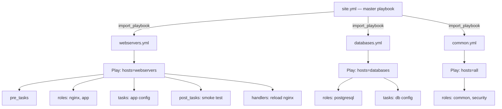
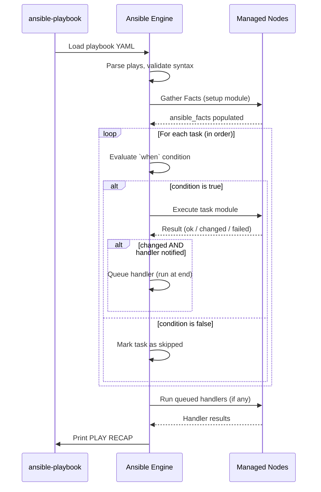

# Topic 5: Playbook Basics

> 📍 Phase 1 — Fundamentals | Topic 5 of 28 | File: `05-playbook-basics.md`
> 🔗 Prev: `04-ad-hoc-commands.md` | Next: `06-variables.md`

---

## 🧠 Concept Overview

A **playbook** is an ordered list of plays, written in YAML, that defines the desired state of your infrastructure. Where ad-hoc commands are single-module one-liners, playbooks are complete automation programs — multi-step, repeatable, version-controlled, and reviewable.

Every Ansible automation you care about ends up as a playbook. They are the primary deliverable of Ansible work — the thing you commit to Git, run in CI/CD, schedule in AWX, and hand off to your team.

Understanding playbook structure deeply — plays, tasks, modules, and execution order — is the foundation everything else in this course builds on.

---

## 📖 In-Depth Explanation

### Subtopic 5.1 — YAML Syntax for Ansible

Ansible playbooks are YAML files. You don't need to be a YAML expert, but you need to know the patterns Ansible uses — and the pitfalls that cause cryptic errors.

#### YAML essentials

```yaml
# Comments start with #

# Strings — quotes are optional unless the string contains special chars
name: nginx
name: "nginx:latest"      # colon in value → must quote

# Booleans — Ansible follows YAML 1.1
enabled: true             # also: yes, on, True, TRUE
disabled: false           # also: no, off, False, FALSE

# Numbers
port: 80
timeout: 30.5

# Lists — two syntaxes
packages:
  - nginx
  - certbot
  - python3

# Inline list
packages: [nginx, certbot, python3]

# Dictionaries (mappings)
user:
  name: deploy
  shell: /bin/bash
  groups:
    - sudo
    - www-data

# Inline dictionary
user: {name: deploy, shell: /bin/bash}

# Multiline strings
message: |
  Line 1
  Line 2
  Line 3

# Folded string (newlines become spaces)
description: >
  This is a very long description
  that wraps across lines.
```

#### The most common YAML mistakes in Ansible

```yaml
# ❌ Missing space after colon — YAML parse error
name:nginx

# ✅ Always space after colon
name: nginx

# ❌ Inconsistent indentation — YAML is sensitive
tasks:
  - name: Install nginx
      ansible.builtin.apt:        # wrong indent level
        name: nginx

# ✅ Consistent 2-space indentation
tasks:
  - name: Install nginx
    ansible.builtin.apt:
      name: nginx

# ❌ Unquoted string with colon
msg: Error: connection refused   # YAML parses this as a mapping

# ✅ Quote strings with colons
msg: "Error: connection refused"

# ❌ Tab characters — YAML does not allow tabs
	name: nginx   # tab indent = parse error

# ✅ Use spaces only (configure your editor)
  name: nginx
```

> 💡 Use `yamllint` to catch YAML errors before Ansible sees them: `pip install yamllint && yamllint site.yml`

---

### Subtopic 5.2 — Plays, Tasks, Modules, and the `hosts` Keyword

A playbook is a **list of plays**. A play is a **mapping of hosts to tasks**. A task is a **call to a module with arguments**.

```
Playbook
└── Play 1 (targets webservers)
│   ├── Task 1: Install nginx        → module: apt
│   ├── Task 2: Copy nginx config    → module: copy
│   └── Task 3: Start nginx          → module: service
└── Play 2 (targets databases)
    ├── Task 1: Install PostgreSQL   → module: apt
    └── Task 2: Start PostgreSQL     → module: service
```

#### Full annotated playbook structure

```yaml
---                                   # YAML document start (optional but conventional)

# ─── PLAY 1 ────────────────────────────────────────────────────────────────────
- name: Configure web servers         # Play name — shown in output
  hosts: webservers                   # Inventory pattern: group, host, all, wildcard
  become: true                        # Enable sudo for all tasks in this play
  gather_facts: true                  # Run the setup module first (default: true)
  any_errors_fatal: false             # Continue other hosts if one fails (default)
  max_fail_percentage: 10             # Abort if >10% of hosts fail
  serial: 2                           # Process 2 hosts at a time (rolling update)

  # Play-level variables
  vars:
    http_port: 80
    app_name: myapp

  # Play-level environment variables (set on remote host)
  environment:
    DEPLOY_ENV: production

  # Tasks run in order, top to bottom
  tasks:

    - name: Ensure nginx is installed
      ansible.builtin.apt:
        name: nginx
        state: present
        update_cache: true
      tags: [nginx, install]          # Optional: tag this task for selective runs

    - name: Copy nginx configuration
      ansible.builtin.copy:
        src: files/nginx.conf
        dest: /etc/nginx/nginx.conf
        owner: root
        group: root
        mode: '0644'
      notify: Reload nginx            # Trigger handler if this task changes

    - name: Ensure nginx is running
      ansible.builtin.service:
        name: nginx
        state: started
        enabled: true

  # Handlers: only run if notified AND something changed
  handlers:
    - name: Reload nginx
      ansible.builtin.service:
        name: nginx
        state: reloaded


# ─── PLAY 2 ────────────────────────────────────────────────────────────────────
- name: Configure database servers
  hosts: databases
  become: true

  tasks:
    - name: Ensure PostgreSQL is installed
      ansible.builtin.apt:
        name: postgresql
        state: present
```

---

#### The `hosts` keyword patterns

```yaml
# Target a group
hosts: webservers

# Target all hosts
hosts: all

# Target a specific host
hosts: web1.example.com

# Target multiple groups (union)
hosts: webservers:databases

# Target intersection (in webservers AND staging)
hosts: webservers:&staging

# Exclude a group
hosts: webservers:!maintenance

# Target localhost (control node itself)
hosts: localhost
connection: local    # Don't SSH — run locally
```

---

#### Task anatomy

Every task has at minimum a `name` and a module call:

```yaml
tasks:
  # Minimal task
  - name: Install nginx
    ansible.builtin.apt:
      name: nginx
      state: present

  # Task with all common optional keywords
  - name: Copy application config
    ansible.builtin.template:         # module (FQCN preferred)
      src: app.conf.j2                # module argument
      dest: /etc/app/app.conf         # module argument
    become: true                      # override play-level become
    become_user: app                  # become this specific user
    when: ansible_os_family == "Debian"  # conditional execution
    loop: "{{ config_files }}"        # loop over a list
    notify: Restart app               # trigger a handler on change
    tags: [config]                    # tag for selective execution
    ignore_errors: false              # fail the play if this fails (default)
    timeout: 30                       # task-level timeout in seconds
    register: config_result           # save output to a variable
    no_log: true                      # don't log task output (for secrets)
```

---

### Subtopic 5.3 — Running Playbooks: `ansible-playbook`, `-v`, `--check`, `--diff`

#### The `ansible-playbook` command

```bash
# Basic run
ansible-playbook site.yml

# Specify inventory (overrides ansible.cfg)
ansible-playbook -i inventory/production site.yml

# Dry run — see what would change
ansible-playbook site.yml --check

# Dry run with file diffs
ansible-playbook site.yml --check --diff

# Verbose output
ansible-playbook site.yml -v       # task results
ansible-playbook site.yml -vv      # include task input/output
ansible-playbook site.yml -vvv     # include SSH connection detail
ansible-playbook site.yml -vvvv    # include SSH config detail (rarely needed)

# Run only specific tags
ansible-playbook site.yml --tags "nginx,config"
ansible-playbook site.yml --skip-tags "install"

# Limit to specific hosts
ansible-playbook site.yml --limit webservers
ansible-playbook site.yml --limit web1.example.com

# Pass extra variables (highest precedence)
ansible-playbook site.yml -e "http_port=8080 app_env=staging"
ansible-playbook site.yml -e "@vars/extra.yml"   # load from file

# List all hosts that would be targeted
ansible-playbook site.yml --list-hosts

# List all tasks that would run (with tags)
ansible-playbook site.yml --list-tasks

# Start from a specific task
ansible-playbook site.yml --start-at-task "Copy nginx configuration"

# Prompt for sudo password (no key-based auth)
ansible-playbook site.yml -K
```

---

#### Understanding playbook output

```
PLAY [Configure web servers] ***********************************************

TASK [Gathering Facts] *****************************************************
ok: [web1.example.com]
ok: [web2.example.com]

TASK [Ensure nginx is installed] *******************************************
changed: [web1.example.com]     ← nginx was installed
ok: [web2.example.com]          ← nginx was already there

TASK [Copy nginx configuration] ********************************************
changed: [web1.example.com]     ← config file was updated
ok: [web2.example.com]

RUNNING HANDLERS ***********************************************************
TASK [Reload nginx] ********************************************************
changed: [web1.example.com]     ← handler ran because config changed

PLAY RECAP *****************************************************************
web1  : ok=4  changed=3  unreachable=0  failed=0  skipped=0  rescued=0  ignored=0
web2  : ok=3  changed=0  unreachable=0  failed=0  skipped=0  rescued=0  ignored=0
```

Key recap fields:
| Field | Meaning |
|-------|---------|
| `ok` | Task ran, no change needed |
| `changed` | Task ran and modified something |
| `unreachable` | SSH connection failed |
| `failed` | Task returned an error |
| `skipped` | Task was skipped (`when` was false) |
| `rescued` | Task failed but was caught by a `rescue` block |
| `ignored` | Task failed but `ignore_errors: true` was set |

---

### Subtopic 5.4 — Task Execution Order and Play-Level Settings

#### Execution order within a play

Tasks in a play always execute in this fixed order:

```
1. pre_tasks          ← run before roles and tasks
2. roles              ← roles listed under `roles:` key
3. tasks              ← main task list
4. post_tasks         ← run after tasks and roles
5. handlers           ← run at the END (not inline) when notified
```

```yaml
- name: Configure web server
  hosts: webservers
  become: true

  pre_tasks:
    - name: Ensure apt cache is fresh
      ansible.builtin.apt:
        update_cache: true
        cache_valid_time: 3600

  roles:
    - common
    - nginx

  tasks:
    - name: Deploy application config
      ansible.builtin.template:
        src: app.conf.j2
        dest: /etc/app/app.conf

  post_tasks:
    - name: Verify nginx is responding
      ansible.builtin.uri:
        url: http://localhost/health
        status_code: 200
```

#### Important play-level settings

```yaml
- name: Rolling update — web servers
  hosts: webservers
  become: true
  serial: 1                  # Process 1 host at a time (rolling update)
  # serial: "25%"            # Process 25% of hosts at a time
  # serial: [1, 3, 10]       # Canary: start with 1, then 3, then 10 at a time

  any_errors_fatal: true     # Stop ALL hosts if ANY host fails
  max_fail_percentage: 20    # Allow up to 20% of hosts to fail before aborting

  gather_facts: false         # Skip fact gathering (faster for simple playbooks)
  # gather_subset: min        # Gather only minimal facts (faster than full)

  run_once: false             # Default: run tasks on every matched host
  # run_once: true            # Run the task on only ONE host in the group

  order: sorted              # Host execution order: default, sorted, reverse_sorted,
                             # reverse_inventory, shuffle
```

---

## 🏗️ Architecture & System Design

Structure of a real-world Ansible project using playbooks:



---

## 🔄 Flow / Lifecycle

Execution flow of a single play:



---

## 💻 Code Examples

### ✅ Example 1: A complete, real-world web server playbook

```yaml
---
# site.yml — deploy and configure a web application

- name: Ensure all servers are up to date
  hosts: all
  become: true
  gather_facts: false   # skip facts — this play just needs apt

  tasks:
    - name: Update apt cache
      ansible.builtin.apt:
        update_cache: true
        cache_valid_time: 3600


- name: Configure web servers
  hosts: webservers
  become: true

  vars:
    nginx_port: 80
    app_dir: /opt/myapp

  pre_tasks:
    - name: Ensure required directories exist
      ansible.builtin.file:
        path: "{{ app_dir }}"
        state: directory
        mode: '0755'

  tasks:
    - name: Install nginx
      ansible.builtin.apt:
        name: nginx
        state: present
      tags: [nginx]

    - name: Deploy nginx configuration
      ansible.builtin.template:
        src: templates/nginx.conf.j2
        dest: /etc/nginx/sites-available/myapp
        owner: root
        group: root
        mode: '0644'
      notify: Reload nginx
      tags: [nginx, config]

    - name: Enable nginx site
      ansible.builtin.file:
        src: /etc/nginx/sites-available/myapp
        dest: /etc/nginx/sites-enabled/myapp
        state: link
      notify: Reload nginx
      tags: [nginx, config]

  post_tasks:
    - name: Verify nginx responds with HTTP 200
      ansible.builtin.uri:
        url: "http://localhost:{{ nginx_port }}/health"
        status_code: 200
      register: health_check
      tags: [verify]

    - name: Show health check result
      ansible.builtin.debug:
        msg: "Health check: {{ health_check.status }}"
      tags: [verify]

  handlers:
    - name: Reload nginx
      ansible.builtin.service:
        name: nginx
        state: reloaded
```

### ✅ Example 2: Multi-play playbook (web + db)

```yaml
---
- name: Configure databases
  hosts: databases
  become: true
  gather_facts: true

  tasks:
    - name: Install PostgreSQL
      ansible.builtin.apt:
        name:
          - postgresql
          - postgresql-client
          - python3-psycopg2    # required for Ansible's postgresql modules
        state: present

    - name: Ensure PostgreSQL is started and enabled
      ansible.builtin.service:
        name: postgresql
        state: started
        enabled: true


- name: Configure web servers
  hosts: webservers
  become: true

  tasks:
    - name: Install application dependencies
      ansible.builtin.apt:
        name: [nginx, python3, python3-pip]
        state: present

    - name: Deploy application
      ansible.builtin.copy:
        src: app/
        dest: /opt/myapp/
        owner: www-data
        group: www-data
```

### ✅ Example 3: Using `register` + `debug` to inspect task output

```yaml
tasks:
  - name: Check if config file exists
    ansible.builtin.stat:
      path: /etc/myapp/config.yml
    register: config_stat         # save the result to config_stat variable

  - name: Show config file status
    ansible.builtin.debug:
      msg: "Config file exists: {{ config_stat.stat.exists }}"

  - name: Create config only if it does not exist
    ansible.builtin.copy:
      src: files/config.yml
      dest: /etc/myapp/config.yml
    when: not config_stat.stat.exists   # conditional based on register result
```

### ❌ Anti-pattern — A playbook that targets `all` with destructive tasks

```yaml
# ❌ Never target 'all' with package installs or restarts
- name: Install and restart everything
  hosts: all          # This will run on EVERY host — DBs, load balancers, everything
  become: true
  tasks:
    - name: Install nginx
      ansible.builtin.apt:
        name: nginx
        state: present

# ✅ Always be explicit about which group a task applies to
- name: Install nginx on web servers only
  hosts: webservers
  become: true
  tasks:
    - name: Install nginx
      ansible.builtin.apt:
        name: nginx
        state: present
```

---

## ⚙️ Configuration & Options

### Common play-level keywords

| Keyword | Type | Description |
|---------|------|-------------|
| `name` | string | Play name shown in output |
| `hosts` | pattern | Target inventory pattern |
| `become` | bool | Enable sudo for all tasks |
| `become_user` | string | User to sudo into (default: root) |
| `gather_facts` | bool | Run setup module before tasks (default: true) |
| `vars` | dict | Play-scoped variables |
| `vars_files` | list | External YAML files to load as variables |
| `roles` | list | Roles to apply (run before tasks) |
| `tasks` | list | Task list |
| `handlers` | list | Handlers for this play |
| `pre_tasks` | list | Tasks to run before roles |
| `post_tasks` | list | Tasks to run after tasks |
| `serial` | int/str/list | Hosts to process per batch |
| `any_errors_fatal` | bool | Abort all hosts if one fails |
| `max_fail_percentage` | int | Max % of host failures before abort |
| `run_once` | bool | Run task on one host only |
| `environment` | dict | Environment vars set on remote host |
| `tags` | list | Tags for this play |
| `order` | string | Host processing order |
| `ignore_errors` | bool | Continue play even if tasks fail |

---

## 🧩 Patterns & Best Practices

**What experienced engineers do:**
- Always give every play and task a descriptive `name` — the output is the first place you look when something fails
- Use `--check --diff` as the first step of every production deployment — treat it like `terraform plan`
- Break large playbooks into multiple smaller playbooks imported from a `site.yml` master — one playbook per server role is a good rule of thumb
- Use `pre_tasks` for pre-flight checks (facts gathering, service availability) and `post_tasks` for smoke tests after deployment
- Use `serial: 1` or `serial: "20%"` for rolling updates — never restart all servers simultaneously

**What beginners typically get wrong:**
- Using `hosts: all` without thinking — leads to inadvertently targeting database and networking hosts during a web server playbook
- Writing playbooks without task names — the output is "TASK [unnamed task]" and debugging becomes impossible
- Not using `--check` before production runs — first time they run a new playbook is directly against live servers
- Putting handlers in the wrong place — handlers must be at the play level, not inside `tasks:`
- Forgetting that handlers only run **once at the end**, even if notified multiple times during the play

**Senior-level nuance:**
- `gather_facts: false` is a significant performance optimisation for large inventories. Each `setup` call takes ~1-2 seconds per host. On 500 hosts, disabling unnecessary fact gathering saves 10+ minutes per run. Use `gather_subset: min` when you need only a small set of facts.
- Use `import_playbook` (static, evaluated at parse time) over `include_playbook` (dynamic) for your master `site.yml` — you get `--list-tasks` and `--list-hosts` support, which is critical for large codebases.

---

## 🔗 How It Connects

- **Builds on:** `04-ad-hoc-commands.md` — task syntax is identical to ad-hoc module calls; now we write them in files
- **Leads to:** `06-variables.md` — static playbooks with hardcoded values only get you so far; variables make them reusable
- **Related concepts:** Topic 9 (handlers in depth), Topic 12 (roles — the evolution beyond tasks in playbooks), Topic 16 (import_playbook and include_tasks)

---

## 🎯 Interview Questions (Conceptual)

**Q1: What is the difference between a play and a task in Ansible?**
> **A:** A play is a top-level mapping that associates a set of hosts (via the `hosts` keyword) with a list of tasks and configuration. A task is a single call to a module within a play. A playbook can contain multiple plays, each targeting different host groups. Tasks always execute within the context of a play.

**Q2: When do handlers run in an Ansible playbook?**
> **A:** Handlers run at the end of a play, after all tasks have been executed — not immediately when notified. They only run if at least one task that notified them reported `changed`. If the same handler is notified multiple times by multiple tasks, it still only runs once. You can force handlers to run mid-play using `flush_handlers`.

**Q3: What is the purpose of `gather_facts` and when would you disable it?**
> **A:** `gather_facts: true` (the default) runs the `setup` module before any tasks, collecting system information like OS, IP addresses, memory, and CPU. You'd disable it with `gather_facts: false` when you don't need any facts in your playbook — for example, a simple service restart or a utility playbook — because setup takes 1-2 seconds per host and adds up significantly at scale.

**Q4: What is `serial` and why is it important for production deployments?**
> **A:** `serial` controls how many hosts Ansible processes in each batch. By default, Ansible runs all hosts in parallel. Setting `serial: 1` creates a rolling update — Ansible fully completes tasks on one host before moving to the next. This ensures you never take down all your web servers simultaneously. You can also set it to a percentage (`serial: "20%"`) or a canary sequence (`serial: [1, 5, 50]`).

**Q5: What is the difference between `pre_tasks`, `roles`, `tasks`, and `post_tasks`?**
> **A:** They define execution order within a play. `pre_tasks` run first — good for pre-flight checks. `roles` run next — encapsulated, reusable automation units. `tasks` run after roles — play-specific task list. `post_tasks` run last — good for smoke tests and verification. All share the same handler pool, which runs after `post_tasks`.

**Q6: What happens if a task fails in the middle of a playbook?**
> **A:** By default, Ansible marks that host as failed and stops executing tasks on it. Other hosts in the same play continue. After the failed host, the play recap shows `failed=1`. You can change this behaviour with `any_errors_fatal: true` (fail all hosts immediately), `ignore_errors: true` on the task (continue despite failure), or `block/rescue` (try/catch pattern — covered in Topic 14).

---

## 🧠 Scenario-Based Interview Problems

**Scenario 1: "You need to deploy a new version of your app to 100 web servers with zero downtime. How would you structure the playbook?"**
> **Problem:** A standard parallel deployment takes all servers out simultaneously.
> **Approach:** Use `serial: "10%"` to process 10 hosts at a time. Use `pre_tasks` to drain the load balancer for that batch (remove from LB rotation). In `tasks`, stop the app, deploy new code, start the app. In `post_tasks`, run a health check and re-add to LB only on success. Set `any_errors_fatal: true` so a bad deploy doesn't roll out further. Consider `serial: [1, 5, "25%"]` for a canary approach — validate on 1 host, then 5, then the rest.
> **Trade-offs:** `serial: 1` is safest but slowest. `serial: "25%"` deploys faster but exposes more hosts if there's a bug. Tune based on your risk tolerance and deployment window.

**Scenario 2: "A junior engineer's playbook targets `hosts: all` and accidentally restarts postgresql on every server in the company. How does this happen and how do you prevent it?"**
> **Problem:** Overly broad host targeting + lack of review process.
> **Approach:** Prevention at multiple levels: (1) Code review — all playbooks reviewed before merge. (2) Naming convention — playbooks named `webservers-deploy.yml` not `site.yml` make intent clear. (3) CI check — `ansible-playbook --list-hosts` in CI and require approval if `all` is in the output. (4) AWX RBAC — production job templates limit which inventory groups a user can target. (5) `assert` task at the start of critical playbooks: `assert: that: "'webservers' in group_names"` to abort if run against the wrong host.
> **Trade-offs:** More gates = slower deployments. Balance based on blast radius — database playbooks need more gates than monitoring agent deployments.

---

## ⚡ Quick Notes — Revision Card

- 📌 Playbook = list of plays | Play = hosts + tasks | Task = module call
- 📌 Execution order: `pre_tasks` → `roles` → `tasks` → `post_tasks` → `handlers`
- 📌 Handlers run **once at the end** of a play — only if notified AND `changed`
- 📌 `serial` = rolling update control | `any_errors_fatal` = stop all on first failure
- 📌 `--check --diff` = dry run with file diffs | `--list-tasks` = preview task list
- 📌 `register` = capture task output | `when` = conditional | `notify` = trigger handler
- ⚠️ Never use `hosts: all` with destructive tasks — always target specific groups
- ⚠️ Always name your plays and tasks — unnamed tasks are impossible to debug
- ⚠️ `gather_facts: true` is the default — disable it when you don't need facts (saves ~2s/host)
- 💡 `--check --diff` before EVERY production run — non-negotiable
- 💡 Use `serial: [1, 5, "25%"]` for canary deploys — validate before rolling out broadly
- 🔑 `import_playbook` in a master `site.yml` = clean, auditable, scalable project structure

---

## 🔖 References & Further Reading

- 📄 [Ansible Playbooks — Official Docs](https://docs.ansible.com/ansible/latest/playbook_guide/playbooks_intro.html)
- 📄 [Playbook Keywords Reference](https://docs.ansible.com/ansible/latest/reference_appendices/playbooks_keywords.html)
- 📄 [Rolling Updates with Serial](https://docs.ansible.com/ansible/latest/playbook_guide/playbooks_strategies.html)
- 📝 [yamllint — YAML linter for Ansible](https://yamllint.readthedocs.io/)
- 🎥 [Jeff Geerling — Writing Your First Playbook](https://www.youtube.com/watch?v=Z01b3vzDeXI)
- 📚 *Ansible for DevOps* — Jeff Geerling (Chapter 3-4)
- ➡️ Related in this course: [`04-ad-hoc-commands.md`] · [`06-variables.md`]

---
