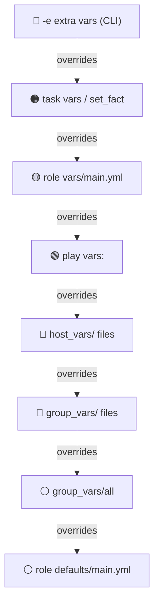
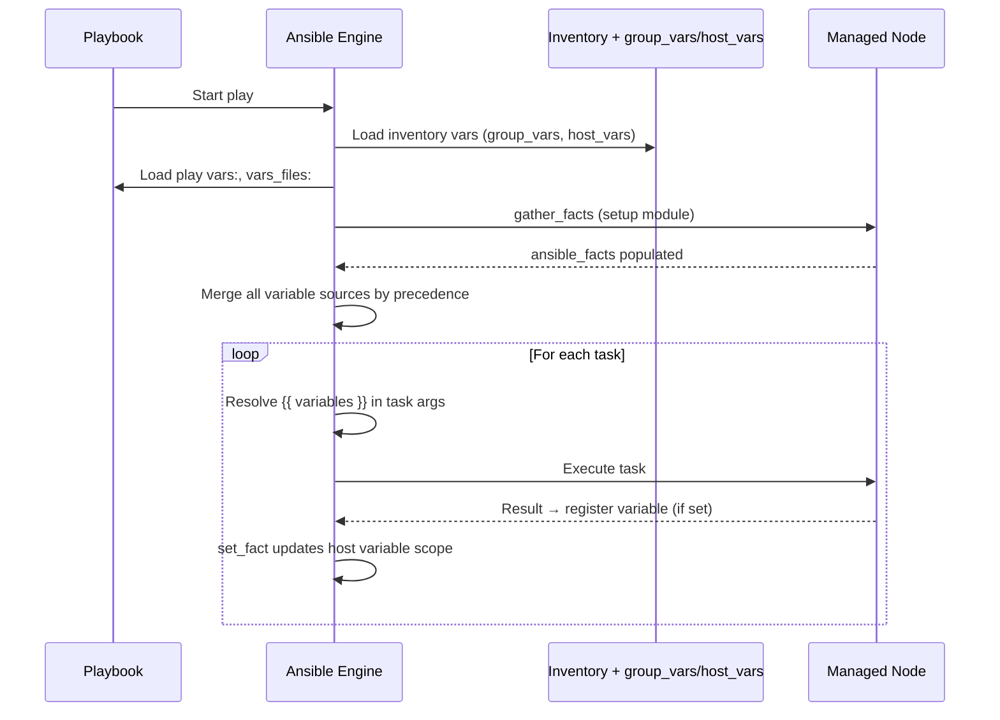

# Topic 6: Variables

> 📍 Phase 2 — Intermediate | Topic 6 of 28 | File: `06-variables.md`
> 🔗 Prev: `05-playbook-basics.md` | Next: `07-facts-and-magic-variables.md`

---

## 🧠 Concept Overview

Variables are what transform a static playbook into a reusable automation engine. Instead of hardcoding `ubuntu` as a username or `80` as a port in every task, you define them once and reference them everywhere with `{{ variable_name }}`.

Ansible's variable system is powerful but has one notorious complexity: **22 levels of precedence**. Variables can be defined in inventory, playbooks, roles, the CLI, and more — and when the same variable is defined in multiple places, precedence decides which one wins.

Master variables and you can write one playbook that deploys to dev, staging, and production — with each environment getting its own values automatically.

---

## 📖 In-Depth Explanation

### Subtopic 6.1 — Variable Types: play vars, inventory vars, `set_fact`, `register`, extra vars

#### Defining variables in a playbook (`vars:`)

```yaml
- name: Configure web server
  hosts: webservers
  vars:
    http_port: 80
    app_name: myapp
    app_dir: /opt/myapp
    allowed_hosts:
      - web1.example.com
      - web2.example.com
    db_config:
      host: db1.example.com
      port: 5432
      name: appdb

  tasks:
    - name: Create app directory
      ansible.builtin.file:
        path: "{{ app_dir }}"    # Jinja2 interpolation
        state: directory
```

#### Loading variables from external files (`vars_files:`)

```yaml
- name: Configure web server
  hosts: webservers
  vars_files:
    - vars/common.yml
    - vars/webservers.yml
    - "vars/{{ ansible_os_family }}.yml"   # dynamic file name using a fact

  tasks:
    - name: Install packages
      ansible.builtin.apt:
        name: "{{ packages }}"    # 'packages' defined in vars/webservers.yml
        state: present
```

```yaml
# vars/webservers.yml
packages:
  - nginx
  - certbot
  - python3-pip
http_port: 80
https_port: 443
```

#### Inventory variables

Defined in `group_vars/` and `host_vars/` — already covered in Topic 3. These integrate into the same variable precedence chain.

```yaml
# group_vars/webservers.yml
http_port: 80
nginx_worker_processes: auto
```

---

#### `register` — Capturing task output

`register` saves a task's return value as a variable for use in subsequent tasks.

```yaml
tasks:
  - name: Get current date
    ansible.builtin.command: date +%Y-%m-%d
    register: current_date          # save output to 'current_date'

  - name: Show the date
    ansible.builtin.debug:
      msg: "Today is {{ current_date.stdout }}"

  - name: Check if config file exists
    ansible.builtin.stat:
      path: /etc/myapp/config.yml
    register: config_file

  - name: Create config only if missing
    ansible.builtin.copy:
      src: files/config.yml
      dest: /etc/myapp/config.yml
    when: not config_file.stat.exists
```

Common `register` result fields:

| Field | Module | Description |
|-------|--------|-------------|
| `.stdout` | command, shell | Standard output as string |
| `.stdout_lines` | command, shell | stdout split into a list |
| `.stderr` | command, shell | Standard error |
| `.rc` | command, shell | Return code (0 = success) |
| `.changed` | any | Whether the task changed anything |
| `.failed` | any | Whether the task failed |
| `.stat.exists` | stat | Whether file/dir exists |
| `.results` | any with loop | List of results per loop item |

---

#### `set_fact` — Compute and set variables at runtime

`set_fact` creates or overrides variables mid-play, scoped to the current host.

```yaml
tasks:
  - name: Get OS major version
    ansible.builtin.set_fact:
      os_major_version: "{{ ansible_distribution_major_version | int }}"

  - name: Set app port based on environment
    ansible.builtin.set_fact:
      app_port: "{{ 8080 if env == 'staging' else 80 }}"

  - name: Build the full DB URL
    ansible.builtin.set_fact:
      db_url: "postgresql://{{ db_user }}:{{ db_pass }}@{{ db_host }}/{{ db_name }}"
    no_log: true    # don't log the password
```

> 💡 Facts set with `set_fact` persist for the rest of the play and are available to roles/handlers. They are **host-scoped** — each host has its own value.

---

#### `vars_prompt` — Interactive variable input

```yaml
- name: Deploy application
  hosts: webservers
  vars_prompt:
    - name: deploy_version
      prompt: "Which version to deploy?"
      private: false          # show input as typed
    - name: confirm_deploy
      prompt: "Deploy to production? (yes/no)"
      private: false

  tasks:
    - name: Abort if not confirmed
      ansible.builtin.fail:
        msg: "Deploy cancelled."
      when: confirm_deploy != "yes"
```

---

### Subtopic 6.2 — Variable Precedence (Ansible's 22-Level Order)

This is the most important thing to memorise about Ansible variables. When the same variable is defined in multiple places, the **highest precedence wins**.

**Listed from LOWEST to HIGHEST precedence:**

```
1.  command line values (e.g. -u user) — not variables
2.  role defaults           ← roles/myrole/defaults/main.yml
3.  inventory file or script group vars
4.  inventory group_vars/all
5.  playbook group_vars/all
6.  inventory group_vars/*
7.  playbook group_vars/*
8.  inventory file or script host vars
9.  inventory host_vars/*
10. playbook host_vars/*
11. host facts / cached set_facts
12. play vars                ← vars: in the play
13. play vars_prompt
14. play vars_files
15. role vars               ← roles/myrole/vars/main.yml
16. block vars              ← vars: at block level
17. task vars               ← vars: at task level
18. include_vars
19. set_facts / registered vars
20. role (and include_role) params
21. include params
22. extra vars              ← -e "var=value" on the CLI  ← ALWAYS WINS
```

#### The practical rules (what you actually need to remember)

```
CLI extra vars (-e)     ← HIGHEST — overrides everything
task vars               ← very high — only for that task
set_fact / register     ← high — computed during play
role vars/main.yml      ← beats group/host vars
play vars:              ← beats inventory vars
playbook group_vars/    ← beats inventory group_vars/
host_vars/              ← beats group_vars/ (more specific)
group_vars/all          ← low
role defaults/main.yml  ← LOWEST — meant to be overridden
```

#### Visualising precedence



#### Practical example — same variable at 3 levels

```yaml
# role defaults (lowest — fallback)
# roles/nginx/defaults/main.yml
http_port: 80

# group_vars/webservers.yml (mid — environment config)
http_port: 8080

# CLI override (highest — one-off change)
ansible-playbook site.yml -e "http_port=9090"
# Result: http_port = 9090
```

#### `defaults/` vs `vars/` in roles — KEY distinction

```yaml
# roles/nginx/defaults/main.yml   ← LOWEST precedence
# Meant to be overridden. Users can set http_port in group_vars and it wins.
http_port: 80

# roles/nginx/vars/main.yml       ← HIGH precedence (beats group_vars, host_vars)
# NOT meant to be overridden. Internal role constants only.
nginx_pid_file: /run/nginx.pid
nginx_log_dir: /var/log/nginx
```

> 🔑 **Rule:** Put user-facing role configuration in `defaults/main.yml`. Put internal implementation details in `vars/main.yml`.

---

### Subtopic 6.3 — Special Variables: `hostvars`, `group_names`, `ansible_facts`

Ansible provides built-in "magic" variables that expose inventory, group, and fact information at runtime.

#### `hostvars` — Access variables from other hosts

```yaml
tasks:
  - name: Configure app to connect to its database
    ansible.builtin.template:
      src: app.conf.j2
      dest: /etc/myapp/app.conf

# In the template (app.conf.j2):
# database_host = {{ hostvars['db1.example.com']['ansible_default_ipv4']['address'] }}
# Or with a group:
# database_host = {{ hostvars[groups['databases'][0]]['ansible_host'] }}
```

> ⚠️ `hostvars` for a host only contains facts if facts were gathered for that host during the current run. Use `gather_facts: true` on the play that runs against the source host.

#### `groups` — Access group membership

```yaml
tasks:
  - name: Show all hosts in webservers group
    ansible.builtin.debug:
      msg: "Web servers: {{ groups['webservers'] }}"

  - name: Build a list of all DB IPs
    ansible.builtin.set_fact:
      db_ips: "{{ groups['databases'] | map('extract', hostvars, 'ansible_host') | list }}"
```

#### `group_names` — Which groups does the current host belong to?

```yaml
tasks:
  - name: Only run on production hosts
    ansible.builtin.debug:
      msg: "This is a production host"
    when: "'production' in group_names"
```

#### `inventory_hostname` and `ansible_hostname`

```yaml
- name: Show host identity
  ansible.builtin.debug:
    msg: |
      Inventory name: {{ inventory_hostname }}         # name in inventory file
      Short name: {{ inventory_hostname_short }}       # stripped of domain
      Actual hostname: {{ ansible_hostname }}          # hostname from OS
      FQDN: {{ ansible_fqdn }}
```

#### `ansible_facts` — The structured fact namespace

```yaml
# Facts are available directly as variables:
ansible_os_family           # "Debian", "RedHat"
ansible_distribution        # "Ubuntu", "CentOS"
ansible_distribution_version  # "22.04"
ansible_default_ipv4.address  # Primary IPv4 address
ansible_memory_mb.real.total  # Total RAM in MB
ansible_processor_count     # Number of CPUs
ansible_hostname            # System hostname

# Or via the ansible_facts dict:
ansible_facts['os_family']
ansible_facts['distribution']
```

---

## 🏗️ Architecture & System Design

Where variables come from and how they merge:

```mermaid
graph TD
    A[CLI: -e extra_vars] -->|highest| M[Merged variable scope per host]
    B[task vars / set_fact] --> M
    C[role vars/main.yml] --> M
    D[play vars: / vars_files:] --> M
    E[host_vars/hostname.yml] --> M
    F[group_vars/groupname.yml] --> M
    G[group_vars/all.yml] --> M
    H[role defaults/main.yml] -->|lowest| M

    M --> T[Task execution\n{{ variable }} resolved here]
```

---

## 🔄 Flow / Lifecycle



---

## 💻 Code Examples

### ✅ Example 1: Environment-specific variables with group_vars

```
inventory/
├── hosts.ini
├── group_vars/
│   ├── all.yml          ← shared across all envs
│   ├── production.yml   ← production-specific
│   └── staging.yml      ← staging-specific
```

```yaml
# group_vars/all.yml
app_name: myapp
app_user: deploy
app_dir: "/opt/{{ app_name }}"

# group_vars/production.yml
app_version: "2.1.0"
db_host: prod-db.internal
http_port: 80
debug_mode: false

# group_vars/staging.yml
app_version: "2.2.0-beta"
db_host: staging-db.internal
http_port: 8080
debug_mode: true
```

```yaml
# site.yml — same playbook, different values per environment
- name: Deploy application
  hosts: all
  tasks:
    - name: Deploy {{ app_name }} version {{ app_version }}
      ansible.builtin.debug:
        msg: "Deploying to {{ db_host }} on port {{ http_port }}"
```

### ✅ Example 2: Using `register` + conditional logic

```yaml
tasks:
  - name: Check if service is running
    ansible.builtin.command: systemctl is-active nginx
    register: nginx_status
    ignore_errors: true     # don't fail if nginx is stopped

  - name: Start nginx if it was stopped
    ansible.builtin.service:
      name: nginx
      state: started
    when: nginx_status.rc != 0

  - name: Log result
    ansible.builtin.debug:
      msg: >-
        nginx was {{ 'already running' if nginx_status.rc == 0
        else 'stopped — started it' }}
```

### ✅ Example 3: `set_fact` for computed values

```yaml
tasks:
  - name: Compute memory threshold (75% of total RAM)
    ansible.builtin.set_fact:
      memory_threshold_mb: "{{ (ansible_memory_mb.real.total * 0.75) | int }}"

  - name: Set Java heap size to memory threshold
    ansible.builtin.lineinfile:
      path: /etc/myapp/jvm.options
      regexp: '^-Xmx'
      line: "-Xmx{{ memory_threshold_mb }}m"

  - name: Build DB connection string
    ansible.builtin.set_fact:
      db_url: "postgresql://{{ db_user }}@{{ db_host }}:{{ db_port }}/{{ db_name }}"
    no_log: true
```

### ❌ Anti-pattern — Using `role vars/main.yml` for user-configurable values

```yaml
# ❌ roles/nginx/vars/main.yml — high precedence, hard to override
http_port: 80          # User can't easily change this without editing the role

# ✅ roles/nginx/defaults/main.yml — lowest precedence, designed to be overridden
http_port: 80          # User sets http_port: 8080 in group_vars and it wins
```

---

## ⚙️ Configuration & Options

### Jinja2 variable syntax

```yaml
# Basic interpolation
dest: "/opt/{{ app_name }}/config"

# Default value if variable is undefined
port: "{{ http_port | default(80) }}"

# Ternary operator
env_label: "{{ 'prod' if env == 'production' else 'non-prod' }}"

# String operations
upper_name: "{{ app_name | upper }}"
trimmed: "{{ some_string | trim }}"

# List operations
first_db: "{{ groups['databases'][0] }}"
db_count: "{{ groups['databases'] | length }}"

# Type conversion
port_int: "{{ http_port | int }}"
flag_bool: "{{ some_string | bool }}"

# Undefined check
- when: my_var is defined
- when: my_var is undefined
- when: my_var | default('') != ''
```

---

## 🧩 Patterns & Best Practices

**What experienced engineers do:**
- Put all user-facing role config in `defaults/main.yml` — never `vars/main.yml` unless it's truly an internal constant
- Define variables at the **lowest appropriate scope** — group_vars for shared config, host_vars for host-specific overrides
- Use `-e` CLI extra vars for pipeline overrides (e.g. deploy version) — they always win, no surprise
- Always use `| default(value)` for optional variables in templates and tasks — prevents `undefined variable` errors
- Use `no_log: true` on tasks that handle secrets via `register` or `set_fact`

**What beginners typically get wrong:**
- Defining the same variable in both `defaults/main.yml` AND `group_vars/` and being confused which wins (group_vars wins — it has higher precedence than role defaults)
- Using `vars/main.yml` in roles for things users need to customise — it has very high precedence and is hard to override
- Not using `| default()` in templates — deployment breaks if a variable isn't set in every environment
- Putting secrets in plaintext in `group_vars/` files that are committed to Git (use Vault — Topic 13)

**Senior-level nuance:**
- The `include_vars` module (precedence level 18) can load variable files conditionally at runtime — useful for loading environment-specific secrets only on the right hosts
- `set_fact` with `cacheable: true` persists the fact across plays in the same run — useful for passing computed values between plays without re-computing

---

## 🔗 How It Connects

- **Builds on:** `05-playbook-basics.md` — you've seen `vars:` in plays; now we understand all the places variables come from
- **Leads to:** `07-facts-and-magic-variables.md` — facts are a special category of auto-populated variables; understanding them completes the picture
- **Related concepts:** Topic 10 (Jinja2 filters in templates), Topic 12 (role defaults vs vars), Topic 13 (Vault for secret variables)

---

## 🎯 Interview Questions (Conceptual)

**Q1: What is the difference between `role defaults` and `role vars`?**
> **A:** `defaults/main.yml` has the lowest precedence of any variable source — it's intentionally designed to be overridden by users via group_vars, host_vars, or play vars. `vars/main.yml` has very high precedence (beats group_vars and host_vars) — it's for internal role constants that shouldn't be changed. User-facing configuration always goes in defaults, never vars.

**Q2: What wins when the same variable is defined in both `group_vars/all.yml` and a play's `vars:` block?**
> **A:** The play's `vars:` block wins. Play vars (precedence 12) are higher than group_vars/all (precedence 4). The general rule is: the more specific and closer to execution the variable definition is, the higher its precedence.

**Q3: How does `register` work and where is its output available?**
> **A:** `register` captures the complete return value of a task and stores it as a host variable for subsequent tasks. The registered variable is available for the rest of the play on that host. Common fields are `.stdout`, `.rc`, `.changed`, `.failed`. Registered variables are at precedence level 19 — higher than most static definitions.

**Q4: How would you pass a different version string for each environment without modifying the playbook?**
> **A:** Define `app_version` in `group_vars/production.yml` and `group_vars/staging.yml` with different values. The same playbook references `{{ app_version }}` and picks up the right value based on which inventory group the host belongs to. For one-off pipeline overrides, use `-e "app_version=2.1.5"` which takes the highest precedence.

**Q5: What is `hostvars` and when do you use it?**
> **A:** `hostvars` is a magic variable that gives you access to variables and facts from any host in the inventory, not just the current host being iterated. It's used when you need cross-host information — for example, configuring a web server with the IP address of its database server: `{{ hostvars['db1']['ansible_default_ipv4']['address'] }}`.

---

## 🧠 Scenario-Based Interview Problems

**Scenario 1: "Your role deploys correctly in staging but the wrong port is used in production. You've defined the port in group_vars/production.yml, role defaults, and also in the play vars: block. Which one is winning?"**
> **Problem:** Variable precedence conflict with three sources for the same variable.
> **Approach:** Play `vars:` (precedence 12) beats `group_vars/production.yml` (precedence ~7) which beats `role defaults/main.yml` (precedence 2). The play vars block is winning. Fix: remove the hardcoded port from `vars:` and let `group_vars/production.yml` control it. Use `ansible -e "http_port=?" -m debug -a "var=http_port"` to inspect what value Ansible resolves for a given host, or add a debug task with `msg: "{{ http_port }}"` to trace the value at runtime.

**Scenario 2: "You need to configure 10 app servers so each one knows the IP address of every database server — without hardcoding IPs. How do you do it?"**
> **Problem:** Cross-host variable access for dynamic infrastructure.
> **Approach:** Use `hostvars` combined with the `groups` magic variable. In a template or task: `{{ groups['databases'] | map('extract', hostvars, 'ansible_host') | list }}`. This produces a list of IPs for all database hosts. Ensure fact gathering runs on the `databases` group in a play that executes before the app server configuration play — otherwise `hostvars['db1']['ansible_host']` may not be populated.

---

## ⚡ Quick Notes — Revision Card

- 📌 Variable sources: `vars:`, `vars_files:`, `group_vars/`, `host_vars/`, `set_fact`, `register`, `-e`
- 📌 Precedence: **role defaults** (lowest) → group_vars → host_vars → play vars → set_fact → **-e CLI** (highest)
- 📌 `role defaults/main.yml` = user-facing config (designed to be overridden)
- 📌 `role vars/main.yml` = internal constants (high precedence, NOT for users to override)
- 📌 `register` = capture task output | `set_fact` = compute + store a new variable
- 📌 `hostvars['hostname']['var']` = access another host's variables/facts
- 📌 `groups['groupname']` = list of hosts in a group
- ⚠️ Never put secrets in plaintext group_vars files committed to Git — use Vault
- ⚠️ Use `| default(value)` in templates to handle undefined variables gracefully
- ⚠️ `no_log: true` on tasks that register or set secret values
- 💡 `-e` on the CLI always wins — perfect for CI/CD pipeline version overrides
- 🔑 Debug variable resolution: `ansible hostname -m debug -a "var=myvar"`

---

## 🔖 References & Further Reading

- 📄 [Ansible Variables — Official Docs](https://docs.ansible.com/ansible/latest/playbook_guide/playbooks_variables.html)
- 📄 [Variable Precedence Reference](https://docs.ansible.com/ansible/latest/playbook_guide/playbooks_variables.html#variable-precedence-where-should-i-put-a-variable)
- 📄 [Special Variables (Magic Variables)](https://docs.ansible.com/ansible/latest/reference_appendices/special_variables.html)
- 📝 [Jinja2 Filters in Ansible](https://docs.ansible.com/ansible/latest/playbook_guide/playbooks_filters.html)
- 🎥 [Jeff Geerling — Ansible Variables Deep Dive](https://www.youtube.com/watch?v=Sh8nQ5O2mU0)
- 📚 *Ansible for DevOps* — Jeff Geerling (Chapter 5)
- ➡️ Related in this course: [`05-playbook-basics.md`] · [`07-facts-and-magic-variables.md`]

---
