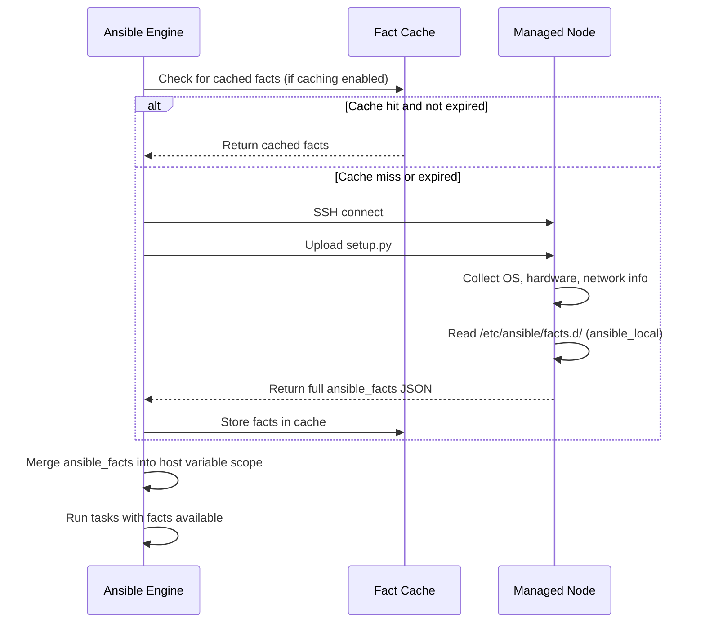

# Topic 7: Facts & Magic Variables

> 📍 Phase 2 — Intermediate | Topic 7 of 28 | File: `07-facts-and-magic-variables.md`
> 🔗 Prev: `06-variables.md` | Next: `08-conditionals-and-loops.md`

---

## 🧠 Concept Overview

**Facts** are variables automatically collected by Ansible about each managed host at the start of a play — the OS family, IP addresses, CPU count, memory, disk mounts, network interfaces, and much more. They arrive free of charge every time `gather_facts: true` runs (the default).

**Magic variables** are a related but distinct category: they're special built-in variables that Ansible populates with information about the *run itself* — which groups a host belongs to, what all the hosts in an inventory look like, the current host's name, and so on.

Together, facts and magic variables let you write smart, adaptive playbooks that behave differently based on what they discover — without you ever hardcoding a single IP address, OS name, or hostname.

---

## 📖 In-Depth Explanation

### Subtopic 7.1 — The `setup` Module and `gather_facts`

Every playbook starts with an implicit call to the `setup` module — unless you opt out. The setup module runs on the target host, collects a rich set of system information, and returns it as structured JSON.

#### What facts look like

```bash
# Run setup directly to see all facts for a host
ansible web1.example.com -m ansible.builtin.setup

# Filter to a specific namespace
ansible web1 -m setup -a "filter=ansible_distribution*"
```

Sample output:
```json
{
    "ansible_facts": {
        "ansible_architecture": "x86_64",
        "ansible_distribution": "Ubuntu",
        "ansible_distribution_major_version": "22",
        "ansible_distribution_release": "jammy",
        "ansible_distribution_version": "22.04",
        "ansible_fqdn": "web1.example.com",
        "ansible_hostname": "web1",
        "ansible_os_family": "Debian",
        "ansible_default_ipv4": {
            "address": "10.0.1.10",
            "interface": "eth0",
            "gateway": "10.0.1.1",
            "netmask": "255.255.255.0"
        },
        "ansible_memory_mb": {
            "real": {
                "free": 1024,
                "total": 4096,
                "used": 3072
            }
        },
        "ansible_processor_count": 2,
        "ansible_processor_vcpus": 4,
        "ansible_mounts": [
            {
                "device": "/dev/sda1",
                "mount": "/",
                "size_total": 42949672960,
                "size_available": 21474836480
            }
        ]
    }
}
```

#### Key facts you'll use constantly

| Fact | Example Value | Use case |
|------|--------------|---------|
| `ansible_os_family` | `Debian`, `RedHat` | Choose apt vs yum |
| `ansible_distribution` | `Ubuntu`, `CentOS` | Version-specific tasks |
| `ansible_distribution_major_version` | `22`, `8` | Major version conditionals |
| `ansible_hostname` | `web1` | Naming config files |
| `ansible_fqdn` | `web1.example.com` | SSL cert CNs, vhost names |
| `ansible_default_ipv4.address` | `10.0.1.10` | Service binding, LB config |
| `ansible_memory_mb.real.total` | `4096` | Tuning JVM/DB memory |
| `ansible_processor_vcpus` | `4` | Setting worker process counts |
| `ansible_mounts` | list of mounts | Disk space checks |
| `ansible_interfaces` | `['lo', 'eth0']` | Network config |
| `ansible_env` | dict of env vars | Reading `$PATH`, `$HOME` |
| `ansible_date_time` | current time dict | Timestamped backups |

#### Using facts in tasks

```yaml
tasks:
  - name: Install package (works on both Debian and RedHat)
    ansible.builtin.package:
      name: "{{ 'nginx' if ansible_os_family == 'Debian' else 'httpd' }}"
      state: present

  - name: Set nginx worker processes to match CPU count
    ansible.builtin.lineinfile:
      path: /etc/nginx/nginx.conf
      regexp: '^worker_processes'
      line: "worker_processes {{ ansible_processor_vcpus }};"

  - name: Only run on Ubuntu 22.04
    ansible.builtin.debug:
      msg: "Ubuntu Jammy specific task"
    when:
      - ansible_distribution == "Ubuntu"
      - ansible_distribution_major_version == "22"

  - name: Warn if less than 2GB RAM
    ansible.builtin.fail:
      msg: "Host has only {{ ansible_memory_mb.real.total }}MB RAM — minimum is 2048MB"
    when: ansible_memory_mb.real.total < 2048
```

---

#### Two ways to reference facts

```yaml
# Method 1: Direct variable name (legacy, still works)
ansible_distribution
ansible_default_ipv4.address

# Method 2: Via ansible_facts dict (explicit namespace, preferred)
ansible_facts['distribution']
ansible_facts['default_ipv4']['address']
```

> 💡 The `ansible_facts` dict namespace is clearer and avoids conflicts with user-defined variables that might accidentally share a name like `ansible_hostname`.

---

### Subtopic 7.2 — Custom Facts (`/etc/ansible/facts.d/`)

You can add your own custom facts to any managed host by placing files in `/etc/ansible/facts.d/`. These facts are loaded by the `setup` module and appear under `ansible_local`.

#### Supported formats

- **INI files** (`.fact` extension)
- **JSON files** (`.fact` extension)
- **Executable scripts** that output JSON to stdout (`.fact` extension, must be executable)

#### INI custom fact

```ini
# /etc/ansible/facts.d/app.fact  (on the managed node)
[application]
name=myapp
version=2.1.0
environment=production
deploy_user=deploy
```

Accessed in playbooks as:
```yaml
ansible_local.app.application.name        # → "myapp"
ansible_local.app.application.version     # → "2.1.0"
ansible_local.app.application.environment # → "production"
```

#### JSON custom fact

```json
// /etc/ansible/facts.d/app.fact
{
  "name": "myapp",
  "version": "2.1.0",
  "config_dir": "/etc/myapp",
  "last_deploy": "2026-03-15"
}
```

Accessed as:
```yaml
ansible_local.app.name        # → "myapp"
ansible_local.app.last_deploy # → "2026-03-15"
```

#### Executable script custom fact

```bash
#!/bin/bash
# /etc/ansible/facts.d/system_info.fact  (chmod +x)
cat << EOF
{
  "disk_free_gb": $(df -BG / | awk 'NR==2{print $4}' | tr -d 'G'),
  "load_average": "$(uptime | awk -F'load average:' '{print $2}' | tr -d ' ')"
}
EOF
```

#### Deploying custom facts with Ansible

```yaml
tasks:
  - name: Ensure facts.d directory exists
    ansible.builtin.file:
      path: /etc/ansible/facts.d
      state: directory
      mode: '0755'

  - name: Deploy application custom fact
    ansible.builtin.template:
      src: templates/app.fact.j2
      dest: /etc/ansible/facts.d/app.fact
      mode: '0644'

  - name: Reload facts after deploying custom fact file
    ansible.builtin.setup:
      filter: ansible_local     # only re-gather local facts (fast)

  - name: Show custom fact
    ansible.builtin.debug:
      msg: "App version on this host: {{ ansible_local.app.name }}"
```

#### Why custom facts are powerful

Custom facts let you **store state on the host itself**. Examples:
- Track which version of your app is currently deployed (`ansible_local.app.version`)
- Record the last successful deploy timestamp
- Store host-specific tuning parameters set during initial provisioning
- Track whether a one-time migration has been run

```yaml
# Idempotent one-time migration
- name: Check if migration has run
  ansible.builtin.stat:
    path: /etc/ansible/facts.d/migrations.fact
  register: migration_fact

- name: Run database migration (only once)
  ansible.builtin.command: /opt/myapp/migrate.sh
  when: not migration_fact.stat.exists

- name: Record that migration completed
  ansible.builtin.copy:
    content: '{"migration_v2": "completed", "run_date": "{{ ansible_date_time.date }}"}'
    dest: /etc/ansible/facts.d/migrations.fact
  when: not migration_fact.stat.exists
```

---

### Subtopic 7.3 — Disabling Fact Gathering for Performance

The `setup` module runs SSH + Python + a full system scan — it takes roughly 1–3 seconds per host. At 500 hosts, that's up to 25 minutes just in fact gathering across a run (at default `forks=5`). At `forks=50`, still 2.5 minutes.

#### Option 1: Disable entirely

```yaml
- name: Quick service restart — no facts needed
  hosts: webservers
  gather_facts: false    # skip setup completely
  tasks:
    - name: Restart nginx
      ansible.builtin.service:
        name: nginx
        state: restarted
      become: true
```

> ⚠️ With `gather_facts: false`, all `ansible_*` facts are unavailable. Any task that references `ansible_os_family`, `ansible_distribution`, etc. will fail with an undefined variable error.

---

#### Option 2: Gather a minimal subset

```yaml
- name: Deploy with minimal facts
  hosts: all
  gather_facts: true
  gather_subset:
    - '!all'          # exclude everything...
    - '!min'          # ...except the absolute minimum
    - network         # ...and add network facts back in
```

Common `gather_subset` values:

| Value | What it includes |
|-------|-----------------|
| `all` | Everything (default) |
| `min` | Minimal: hostname, OS, architecture |
| `network` | Network interfaces and addresses |
| `hardware` | CPU, memory, disk |
| `virtual` | Virtualisation type |
| `facter` | Facts from Puppet's Facter (if installed) |
| `!hardware` | All except hardware (prefix `!` to exclude) |

```yaml
# Common pattern: gather only what you need
gather_subset:
  - '!all'
  - '!min'
  - network      # I need ansible_default_ipv4.address
```

---

#### Option 3: Fact caching

Cache facts between runs so `setup` doesn't re-run on every execution:

```ini
# ansible.cfg
[defaults]
gathering          = smart          # only gather if not in cache
fact_caching       = jsonfile       # cache backend
fact_caching_connection = /tmp/ansible_fact_cache
fact_caching_timeout    = 86400     # cache valid for 24 hours (seconds)
```

With `gathering = smart`, Ansible only runs `setup` if the host's facts aren't in the cache yet. Subsequent runs in the 24-hour window skip fact gathering entirely.

Other cache backends:

| Backend | Use case |
|---------|---------|
| `jsonfile` | Simple file-based (development/small scale) |
| `redis` | Fast, shared cache for large teams |
| `memcached` | High-throughput environments |
| `mongodb` | When you want queryable fact history |

---

#### Option 4: Explicit `setup` call (pull on demand)

Sometimes you disable global fact gathering but need facts for specific hosts:

```yaml
- name: Configure all servers (no facts needed)
  hosts: all
  gather_facts: false
  tasks:
    - name: Restart services
      ansible.builtin.service:
        name: nginx
        state: restarted

- name: Configure load balancer (needs backend IPs)
  hosts: loadbalancers
  gather_facts: false
  tasks:
    - name: Gather facts from backend servers only
      ansible.builtin.setup:
      delegate_to: "{{ item }}"
      loop: "{{ groups['webservers'] }}"

    - name: Build backend IP list
      ansible.builtin.set_fact:
        backend_ips: "{{ groups['webservers'] | map('extract', hostvars, 'ansible_default_ipv4') | map(attribute='address') | list }}"
```

---

## 🏗️ Architecture & System Design

How facts flow through a play:

```mermaid
graph TD
    A[Play starts] --> B{gather_facts?}
    B -->|true| C[setup module runs on each host]
    B -->|false| D[Skip to tasks]
    C --> E[OS, network, hardware, mounts facts]
    E --> F[ansible_facts namespace populated]

    G[/etc/ansible/facts.d/] -->|local scripts/files| H[ansible_local namespace]
    H --> F

    I[fact_caching enabled?] -->|yes + cache hit| J[Load from cache, skip setup]
    I -->|no or cache miss| C

    F --> K[Tasks run with {{ ansible_* }} available]
    K --> L[set_fact adds to ansible_facts]
```

---

## 🔄 Flow / Lifecycle



---

## 💻 Code Examples

### ✅ Example 1: OS-adaptive package installation

```yaml
- name: Install web server
  hosts: all
  become: true

  tasks:
    - name: Install nginx (Debian/Ubuntu)
      ansible.builtin.apt:
        name: nginx
        state: present
        update_cache: true
      when: ansible_os_family == "Debian"

    - name: Install nginx (RHEL/CentOS)
      ansible.builtin.yum:
        name: nginx
        state: present
      when: ansible_os_family == "RedHat"

    # Or more concisely with the generic package module:
    - name: Install nginx (any OS)
      ansible.builtin.package:
        name: nginx
        state: present
```

### ✅ Example 2: Auto-tune application based on host resources

```yaml
tasks:
  - name: Calculate optimal worker count (75% of vCPUs)
    ansible.builtin.set_fact:
      worker_count: "{{ [1, (ansible_processor_vcpus * 0.75) | int] | max }}"

  - name: Calculate JVM heap (50% of total RAM, capped at 8GB)
    ansible.builtin.set_fact:
      jvm_heap_mb: "{{ [ansible_memory_mb.real.total // 2, 8192] | min }}"

  - name: Deploy tuned application config
    ansible.builtin.template:
      src: app.conf.j2
      dest: /etc/myapp/app.conf
    vars:
      workers: "{{ worker_count }}"
      heap_mb: "{{ jvm_heap_mb }}"
```

### ✅ Example 3: Using `ansible_date_time` for timestamped backups

```yaml
tasks:
  - name: Backup current config with timestamp
    ansible.builtin.copy:
      src: /etc/nginx/nginx.conf
      dest: "/etc/nginx/nginx.conf.{{ ansible_date_time.date }}.bak"
      remote_src: true    # copy on the remote host, not from control node
```

### ✅ Example 4: Checking disk space before deploying

```yaml
tasks:
  - name: Gather disk facts
    ansible.builtin.setup:
      filter: ansible_mounts

  - name: Check root filesystem has at least 2GB free
    ansible.builtin.fail:
      msg: >
        Root filesystem only has
        {{ (item.size_available / 1024 / 1024 / 1024) | round(1) }}GB free.
        Need at least 2GB.
    loop: "{{ ansible_mounts }}"
    when:
      - item.mount == "/"
      - item.size_available < 2147483648   # 2GB in bytes
```

### ❌ Anti-pattern — Hardcoding OS-specific paths instead of using facts

```yaml
# ❌ Hardcoded for Ubuntu only — breaks on CentOS
- name: Restart nginx
  ansible.builtin.command: /usr/sbin/nginx -s reload

# ✅ Use the service module — works across OS families
- name: Reload nginx
  ansible.builtin.service:
    name: nginx
    state: reloaded

# ❌ Hardcoded package manager
- name: Install package
  ansible.builtin.command: apt-get install -y nginx

# ✅ Use facts to branch OR use the generic package module
- name: Install package
  ansible.builtin.package:
    name: nginx
    state: present
```

---

## ⚙️ Configuration & Options

### `gather_subset` reference

```yaml
gather_subset:
  - all            # everything (default when gather_facts: true)
  - min            # hostname, OS, Python version
  - hardware       # CPU, memory, disk
  - network        # interfaces, IPs, routes
  - virtual        # hypervisor type, container detection
  - ohai           # Chef Ohai facts (if installed)
  - facter         # Puppet Facter facts (if installed)
  - '!hardware'    # all except hardware (prefix with ! to exclude)
  - '!all'         # nothing (combine with inclusions)
```

### Fact caching `ansible.cfg` options

| Setting | Values | Description |
|---------|--------|-------------|
| `gathering` | `implicit` (default), `explicit`, `smart` | When to gather facts |
| `fact_caching` | `jsonfile`, `redis`, `memcached` | Cache backend |
| `fact_caching_timeout` | seconds (e.g. `86400`) | Cache TTL |
| `fact_caching_connection` | path or URL | Cache location |

| `gathering` value | Behaviour |
|------------------|-----------|
| `implicit` | Always gather (default) |
| `explicit` | Never gather unless `gather_facts: true` set per-play |
| `smart` | Gather if not cached; skip if cached and not expired |

---

## 🧩 Patterns & Best Practices

**What experienced engineers do:**
- Always use `gather_subset: ['!all', '!min', 'network']` style filtering when only specific facts are needed — avoids the full setup overhead for targeted plays
- Use fact caching with `gathering = smart` in large environments — transforms repeated runs from minutes to seconds
- Store application state in custom facts (`/etc/ansible/facts.d/`) rather than external databases — self-documenting, always local to the host, no external dependencies
- After deploying a custom fact file, always call `ansible.builtin.setup: filter: ansible_local` immediately to reload — otherwise the facts aren't available until the next play

**What beginners typically get wrong:**
- Referencing `ansible_*` facts in a play with `gather_facts: false` and getting undefined variable errors
- Not knowing that custom facts require `/etc/ansible/facts.d/` to exist on the managed node — the directory must be created first
- Assuming `hostvars['other_host']['ansible_default_ipv4']` is always populated — it's only available if that host had facts gathered in the current run
- Forgetting that `gather_subset: ['!all']` disables even the minimum facts — use `['!all', '!min']` carefully

**Senior-level nuance:**
- In large-scale environments (500+ hosts), consider a dedicated "fact gathering" play at the top of your `site.yml` that runs `setup` on all hosts first. This populates `hostvars` for cross-host variable access later in the run — without having to re-gather facts per play.
- Custom facts + fact caching together create a powerful lightweight CMDB: each host carries its own metadata, Ansible reads it on every run, and the cache avoids repeated SSH overhead.

---

## 🔗 How It Connects

- **Builds on:** `06-variables.md` — facts are a special category of auto-populated variables with their own namespace and precedence
- **Leads to:** `08-conditionals-and-loops.md` — facts are the primary input for `when` conditionals; `ansible_os_family` is the classic example
- **Related concepts:** Topic 20 (performance — fact caching at scale), Topic 22 (dynamic inventory also queries host metadata)

---

## 🎯 Interview Questions (Conceptual)

**Q1: What is the `setup` module and what triggers it?**
> **A:** The `setup` module collects system facts from the managed host — OS, hardware, network, mounts, and custom facts from `/etc/ansible/facts.d/`. It's triggered automatically at the start of every play when `gather_facts: true` (the default). You can also call it explicitly with `ansible.builtin.setup` in a task to refresh facts mid-play or gather facts for delegated hosts.

**Q2: What is `ansible_local` and how do you populate it?**
> **A:** `ansible_local` is the namespace for custom user-defined facts. You populate it by placing `.fact` files in `/etc/ansible/facts.d/` on the managed node — they can be INI files, JSON files, or executable scripts that print JSON. The `setup` module reads these files and exposes their contents under `ansible_local.<filename>.<key>`.

**Q3: What are the three `gathering` modes in `ansible.cfg` and when would you use each?**
> **A:** `implicit` (default) gathers facts on every run. `explicit` never gathers facts unless a play explicitly sets `gather_facts: true`. `smart` gathers facts only if they're not in the cache — ideal for large environments with fact caching enabled, as it avoids repeated slow SSH setup calls on unchanged hosts.

**Q4: How would you make an Ansible task run only on Ubuntu 20.04 hosts?**
> **A:** Use a `when` conditional combining two fact checks: `when: ansible_distribution == "Ubuntu" and ansible_distribution_major_version == "20"`. Both conditions must be true. This requires `gather_facts: true` on the play — which is the default.

**Q5: What happens if you reference `ansible_default_ipv4.address` in a play with `gather_facts: false`?**
> **A:** Ansible raises an "undefined variable" error because `ansible_default_ipv4` is a fact populated by the `setup` module, which is skipped when `gather_facts: false`. You either need to enable fact gathering for that play, add an explicit `ansible.builtin.setup` task before the reference, or use a different variable source like a host_var.

**Q6: How do you access the IP address of a host in a different group from the current task's host?**
> **A:** Use `hostvars['other_hostname']['ansible_default_ipv4']['address']`. For it to work, facts must have been gathered for `other_hostname` earlier in the same playbook run — either from a preceding play that targeted that host, or by using `delegate_to` with an explicit `setup` call.

---

## 🧠 Scenario-Based Interview Problems

**Scenario 1: "Your playbook takes 12 minutes to run against 300 hosts — 8 of those minutes are fact gathering. How do you fix it?"**
> **Problem:** Default `implicit` gathering runs setup on every host every run, even when facts haven't changed.
> **Approach:** Enable fact caching in `ansible.cfg`: set `gathering = smart`, `fact_caching = jsonfile`, `fact_caching_timeout = 86400`. First run still takes 12 minutes, but subsequent runs skip setup entirely for hosts whose cache hasn't expired. Additionally, audit which plays actually need facts — add `gather_facts: false` to plays that only restart services or push config files. Use `gather_subset` for plays that only need specific facts (e.g., only `network` for LB configuration).
> **Trade-offs:** Fact caching introduces stale data risk. If a host changes its IP, the cache won't reflect it until the TTL expires. Set TTL based on how frequently your infrastructure changes — 24 hours for stable infra, 1 hour for dynamic cloud environments.

**Scenario 2: "You need every web server to know the private IPs of all database servers, but database IPs change when you scale up. How do you wire this up in Ansible without hardcoding anything?"**
> **Problem:** Dynamic cross-host IP resolution at scale.
> **Approach:** Structure the playbook so the databases play runs first (gathering facts), then the webservers play uses `hostvars` and `groups` to build the IP list dynamically: `db_ips: "{{ groups['databases'] | map('extract', hostvars, 'ansible_default_ipv4') | map(attribute='address') | list }}"`. This variable feeds a Jinja2 template that renders the web app's upstream config. When you scale databases, just re-run the playbook — no manual IP management.
> **Trade-offs:** Requires that database facts are gathered in the same run. In a CI/CD pipeline, always run a full `ansible-playbook site.yml` (not a limited subset) so all fact namespaces are populated before the cross-host references are resolved.

---

## ⚡ Quick Notes — Revision Card

- 📌 Facts = auto-collected system info | Magic vars = info about the Ansible run itself
- 📌 `gather_facts: true` (default) runs `setup` module before any tasks
- 📌 Key fact namespaces: `ansible_os_family`, `ansible_distribution`, `ansible_default_ipv4`, `ansible_memory_mb`, `ansible_processor_vcpus`
- 📌 `ansible_local` = custom facts from `/etc/ansible/facts.d/` (INI, JSON, or executable)
- 📌 `gathering = smart` + `fact_caching = jsonfile` = major performance win for large inventories
- 📌 `gather_subset: ['!all', '!min', 'network']` = gather only network facts (faster)
- ⚠️ `gather_facts: false` = all `ansible_*` variables undefined — tasks that use them will fail
- ⚠️ `hostvars['other_host']['ansible_default_ipv4']` only works if that host had facts gathered this run
- ⚠️ Custom facts dir `/etc/ansible/facts.d/` must exist before deploying fact files
- 💡 After deploying a `.fact` file, call `ansible.builtin.setup: filter: ansible_local` to reload immediately
- 🔑 Custom facts = lightweight CMDB — store app version, deploy date, migration state on the host itself

---

## 🔖 References & Further Reading

- 📄 [Ansible Facts — Official Docs](https://docs.ansible.com/ansible/latest/playbook_guide/playbooks_vars_facts.html)
- 📄 [setup module reference](https://docs.ansible.com/ansible/latest/collections/ansible/builtin/setup_module.html)
- 📄 [Special Variables Reference](https://docs.ansible.com/ansible/latest/reference_appendices/special_variables.html)
- 📄 [Fact Caching](https://docs.ansible.com/ansible/latest/playbook_guide/playbooks_vars_facts.html#caching-facts)
- 📝 [Custom Facts Deep Dive](https://docs.ansible.com/ansible/latest/playbook_guide/playbooks_vars_facts.html#adding-custom-facts)
- 🎥 [Jeff Geerling — Ansible Facts](https://www.youtube.com/watch?v=AngB_LbIHMQ)
- ➡️ Related in this course: [`06-variables.md`] · [`08-conditionals-and-loops.md`]

---
