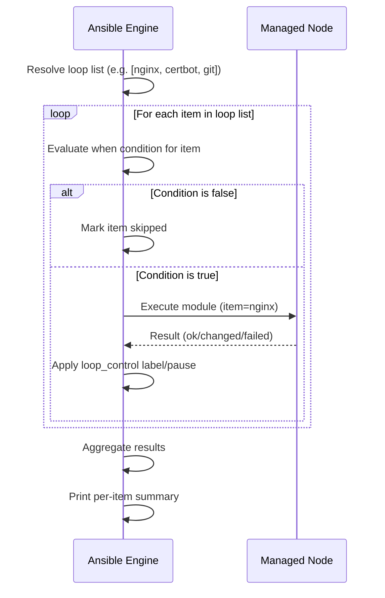

# Topic 8: Conditionals & Loops

> 📍 Phase 2 — Intermediate | Topic 8 of 28 | File: `08-conditionals-and-loops.md`
> 🔗 Prev: `07-facts-and-magic-variables.md` | Next: `09-handlers.md`

---

## 🧠 Concept Overview

Almost every real-world playbook needs to make decisions and repeat work. **Conditionals** let tasks run only when a specific condition is true — install a package only on Ubuntu, restart a service only if the config changed, skip a task on hosts with less than 2GB RAM. **Loops** let a single task act on multiple items — install a list of packages, create several users, deploy multiple config files — without copy-pasting the same task over and over.

Together, `when` and `loop` are the two most-used task keywords after `name` and the module itself. Get comfortable with them and you'll cut the length of your playbooks in half while making them far more powerful.

---

## 📖 In-Depth Explanation

### Subtopic 8.1 — `when` Clause with Jinja2 Expressions

The `when` keyword accepts any Jinja2 expression that evaluates to true or false. When the condition is false, Ansible skips the task and marks it as `skipped` in the output — it does not error.

#### Basic syntax

```yaml
tasks:
  - name: Install apache2 on Debian systems only
    ansible.builtin.apt:
      name: apache2
      state: present
    when: ansible_os_family == "Debian"

  - name: Install httpd on RedHat systems only
    ansible.builtin.yum:
      name: httpd
      state: present
    when: ansible_os_family == "RedHat"
```

> ⚠️ Variables inside `when` are **not** wrapped in `{{ }}`. Ansible evaluates the whole value as a Jinja2 expression automatically. Using `{{ }}` inside `when` is a common mistake that causes unexpected behaviour.

```yaml
# ❌ Wrong — double evaluation
when: "{{ ansible_os_family == 'Debian' }}"

# ✅ Correct
when: ansible_os_family == "Debian"
```

---

#### Multiple conditions — `and` / `or` / list syntax

```yaml
# AND — both must be true (list syntax, cleanest)
when:
  - ansible_distribution == "Ubuntu"
  - ansible_distribution_major_version == "22"

# AND — inline
when: ansible_distribution == "Ubuntu" and ansible_distribution_major_version == "22"

# OR
when: ansible_os_family == "Debian" or ansible_os_family == "RedHat"

# Complex: (A and B) or C
when: >
  (ansible_distribution == "Ubuntu" and ansible_distribution_major_version == "22")
  or ansible_distribution == "Debian"
```

> 💡 The **list syntax** (multiple `when` items as a YAML list) is treated as **AND**. It's the cleanest way to express multi-condition checks.

---

#### Conditions based on `register` results

```yaml
tasks:
  - name: Check if nginx config is valid
    ansible.builtin.command: nginx -t
    register: nginx_test
    ignore_errors: true
    changed_when: false      # nginx -t never changes state

  - name: Reload nginx only if config is valid
    ansible.builtin.service:
      name: nginx
      state: reloaded
    when: nginx_test.rc == 0

  - name: Alert if config is invalid
    ansible.builtin.debug:
      msg: "nginx config test FAILED: {{ nginx_test.stderr }}"
    when: nginx_test.rc != 0
```

---

#### Conditions based on variable definition

```yaml
tasks:
  - name: Set custom port only if variable is defined
    ansible.builtin.lineinfile:
      path: /etc/myapp/config
      line: "port={{ custom_port }}"
    when: custom_port is defined

  - name: Use default if variable is not set
    ansible.builtin.lineinfile:
      path: /etc/myapp/config
      line: "port=8080"
    when: custom_port is not defined

  # Check defined AND not empty
  - name: Only run if the variable has a value
    ansible.builtin.debug:
      msg: "{{ app_name }}"
    when: app_name is defined and app_name | length > 0
```

---

#### Jinja2 tests in `when`

```yaml
when: my_var is defined           # variable exists
when: my_var is undefined         # variable does not exist
when: my_var is none              # variable is null/None
when: my_list is iterable         # variable can be looped
when: result is failed            # registered result failed
when: result is succeeded         # registered result succeeded
when: result is changed           # registered result changed something
when: result is skipped           # registered result was skipped
when: "'nginx' in installed_packages"   # string/list contains value
when: my_var | bool               # variable is truthy
```

---

### Subtopic 8.2 — `loop`, `with_items`, `with_dict`, `with_fileglob`

#### `loop` — The modern standard (Ansible 2.5+)

`loop` replaces all the old `with_*` keywords. It iterates over a list and runs the task once per item. The current item is available as `{{ item }}`.

```yaml
tasks:
  - name: Install multiple packages
    ansible.builtin.apt:
      name: "{{ item }}"
      state: present
    loop:
      - nginx
      - certbot
      - python3-pip
      - git

  - name: Create multiple users
    ansible.builtin.user:
      name: "{{ item }}"
      state: present
      shell: /bin/bash
    loop:
      - alice
      - bob
      - carol

  - name: Create multiple directories
    ansible.builtin.file:
      path: "{{ item }}"
      state: directory
      mode: '0755'
    loop:
      - /opt/myapp
      - /opt/myapp/logs
      - /opt/myapp/config
      - /var/run/myapp
```

> 💡 For package installation, prefer passing a list directly to the `name` parameter — it's faster because it calls the package manager once rather than once per package:
> ```yaml
> ansible.builtin.apt:
>   name: [nginx, certbot, python3-pip]
>   state: present
> ```

---

#### Looping over a list of dictionaries

When you need multiple attributes per item:

```yaml
tasks:
  - name: Create users with specific attributes
    ansible.builtin.user:
      name: "{{ item.name }}"
      uid: "{{ item.uid }}"
      groups: "{{ item.groups }}"
      shell: "{{ item.shell | default('/bin/bash') }}"
      state: present
    loop:
      - { name: alice, uid: 1001, groups: sudo, shell: /bin/bash }
      - { name: bob,   uid: 1002, groups: www-data }
      - { name: carol, uid: 1003, groups: "sudo,www-data", shell: /bin/zsh }

  - name: Deploy multiple vhosts
    ansible.builtin.template:
      src: "templates/vhost.conf.j2"
      dest: "/etc/nginx/sites-available/{{ item.domain }}"
    loop:
      - { domain: example.com,    port: 80,   root: /var/www/example }
      - { domain: api.example.com, port: 8080, root: /var/www/api }
```

---

#### Looping over variables

```yaml
vars:
  packages:
    - nginx
    - certbot
    - ufw

tasks:
  - name: Install packages from variable
    ansible.builtin.apt:
      name: "{{ item }}"
      state: present
    loop: "{{ packages }}"
```

---

#### Legacy `with_*` keywords (still valid, still common)

You'll see these in older playbooks and many online examples. Know them:

```yaml
# with_items — equivalent to loop (flat list)
- name: Install packages
  ansible.builtin.apt:
    name: "{{ item }}"
    state: present
  with_items:
    - nginx
    - certbot

# with_dict — loop over a dictionary's key/value pairs
- name: Set sysctl params
  ansible.posix.sysctl:
    name: "{{ item.key }}"
    value: "{{ item.value }}"
  with_dict:
    net.ipv4.ip_forward: 1
    vm.swappiness: 10
    fs.file-max: 100000

# with_fileglob — loop over files matching a pattern on the control node
- name: Copy all config files
  ansible.builtin.copy:
    src: "{{ item }}"
    dest: /etc/myapp/
  with_fileglob:
    - "files/configs/*.conf"

# with_together — zip two lists together (parallel iteration)
- name: Create users with matching home dirs
  ansible.builtin.user:
    name: "{{ item.0 }}"
    home: "{{ item.1 }}"
  with_together:
    - [alice, bob, carol]
    - [/home/alice, /home/bob, /home/carol]

# with_sequence — generate a numeric sequence
- name: Create numbered log dirs
  ansible.builtin.file:
    path: "/var/log/worker-{{ item }}"
    state: directory
  with_sequence: start=1 end=5
  # Creates: worker-1, worker-2, worker-3, worker-4, worker-5

# with_subelements — loop over nested lists
- name: Add SSH keys for users
  ansible.posix.authorized_key:
    user: "{{ item.0.name }}"
    key: "{{ item.1 }}"
  with_subelements:
    - "{{ users }}"
    - ssh_keys
```

---

#### Modern `loop` equivalents for `with_*`

```yaml
# with_dict → loop + dict2items filter
- name: Set sysctl params
  ansible.posix.sysctl:
    name: "{{ item.key }}"
    value: "{{ item.value }}"
  loop: "{{ sysctl_params | dict2items }}"
  vars:
    sysctl_params:
      net.ipv4.ip_forward: 1
      vm.swappiness: 10

# with_fileglob → loop + fileglob lookup
- name: Copy all config files
  ansible.builtin.copy:
    src: "{{ item }}"
    dest: /etc/myapp/
  loop: "{{ lookup('fileglob', 'files/configs/*.conf', wantlist=True) }}"

# with_sequence → loop + range
- name: Create numbered directories
  ansible.builtin.file:
    path: "/var/log/worker-{{ item }}"
    state: directory
  loop: "{{ range(1, 6) | list }}"
```

---

### Subtopic 8.3 — Loop Control: `loop_control`, `label`, `pause`, `index_var`

By default, Ansible prints the full `item` value in the task output for each iteration. For complex items (large dicts, long strings), this floods the output. `loop_control` gives you fine-grained control.

#### `label` — Clean up loop output

```yaml
- name: Create users (clean output)
  ansible.builtin.user:
    name: "{{ item.name }}"
    uid: "{{ item.uid }}"
    groups: "{{ item.groups }}"
  loop: "{{ users }}"
  loop_control:
    label: "{{ item.name }}"    # show only name in output, not full dict
```

Without `label`:
```
TASK [Create users] ****
changed: [web1] => (item={'name': 'alice', 'uid': 1001, 'groups': 'sudo', 'shell': '/bin/bash', ...})
```

With `label: "{{ item.name }}"`:
```
TASK [Create users] ****
changed: [web1] => (item=alice)
```

---

#### `pause` — Add a delay between iterations

Useful for rate-limited APIs or services that need time to stabilise between operations:

```yaml
- name: Deploy to servers one at a time with a pause
  ansible.builtin.include_tasks: deploy.yml
  loop: "{{ groups['webservers'] }}"
  loop_control:
    pause: 5      # wait 5 seconds between each iteration
    label: "{{ item }}"
```

---

#### `index_var` — Track loop position

```yaml
- name: Create numbered config sections
  ansible.builtin.lineinfile:
    path: /etc/myapp/config
    line: "[worker-{{ idx }}]\nhost={{ item }}"
  loop: "{{ groups['workers'] }}"
  loop_control:
    index_var: idx    # 'idx' will be 0, 1, 2, 3...
    label: "worker-{{ idx }}: {{ item }}"
```

---

#### `loop_var` — Rename `item` to avoid conflicts in nested loops

When you have a task that calls `include_tasks` with its own loop, both loops would use `item` — causing a collision:

```yaml
# outer_play.yml
- name: Process each environment
  ansible.builtin.include_tasks: per_env_tasks.yml
  loop: "{{ environments }}"
  loop_control:
    loop_var: env_item    # rename outer loop variable to 'env_item'

# per_env_tasks.yml (uses its own 'item' loop safely)
- name: Deploy services in {{ env_item.name }}
  ansible.builtin.debug:
    msg: "Service {{ item }} in {{ env_item.name }}"
  loop: "{{ env_item.services }}"
```

---

#### Combining `loop` with `when`

The `when` condition is evaluated **per item** — items where the condition is false are skipped individually:

```yaml
- name: Install packages only on Ubuntu
  ansible.builtin.apt:
    name: "{{ item }}"
    state: present
  loop:
    - nginx
    - certbot
    - python3
  when: ansible_distribution == "Ubuntu"

- name: Create users only if they don't exist already
  ansible.builtin.user:
    name: "{{ item.name }}"
    state: present
  loop: "{{ users }}"
  when: item.name not in existing_users.stdout_lines
  loop_control:
    label: "{{ item.name }}"
```

---

## 🏗️ Architecture & System Design

How `when` and `loop` fit into task execution:

```mermaid
graph TD
    A[Task with loop and when] --> B{Has loop?}
    B -->|yes| C[Iterate over each item]
    B -->|no| E{Evaluate when condition}

    C --> D[For each item]
    D --> E

    E -->|condition false| F[Mark item as SKIPPED]
    E -->|condition true| G[Execute module with item value]

    G --> H{Result}
    H -->|ok| I[No change — idempotent]
    H -->|changed| J[State modified]
    H -->|failed| K[Task fails]

    I --> L{More items?}
    J --> L
    F --> L
    L -->|yes| D
    L -->|no| M[Task complete — show summary]
```



---

## 🔄 Flow / Lifecycle



---

## 💻 Code Examples

### ✅ Example 1: Full OS-adaptive setup play

```yaml
- name: Bootstrap servers
  hosts: all
  become: true

  vars:
    common_packages_debian: [nginx, certbot, python3-pip, ufw, fail2ban]
    common_packages_redhat: [nginx, python3-pip, firewalld, fail2ban]

  tasks:
    - name: Install packages (Debian/Ubuntu)
      ansible.builtin.apt:
        name: "{{ common_packages_debian }}"
        state: present
        update_cache: true
      when: ansible_os_family == "Debian"

    - name: Install packages (RedHat/CentOS)
      ansible.builtin.yum:
        name: "{{ common_packages_redhat }}"
        state: present
      when: ansible_os_family == "RedHat"

    - name: Create required directories
      ansible.builtin.file:
        path: "{{ item }}"
        state: directory
        mode: '0755'
      loop:
        - /opt/myapp
        - /opt/myapp/logs
        - /opt/myapp/config
        - /var/run/myapp

    - name: Create application users
      ansible.builtin.user:
        name: "{{ item.name }}"
        uid: "{{ item.uid }}"
        shell: "{{ item.shell | default('/bin/bash') }}"
        groups: "{{ item.groups | default([]) }}"
        state: present
      loop: "{{ app_users }}"
      loop_control:
        label: "{{ item.name }}"
      vars:
        app_users:
          - { name: deploy, uid: 1010, groups: www-data }
          - { name: monitor, uid: 1011 }
```

### ✅ Example 2: Conditional task based on previous task output

```yaml
tasks:
  - name: Get list of running services
    ansible.builtin.command: systemctl list-units --type=service --state=running --no-legend
    register: running_services
    changed_when: false

  - name: Stop conflicting services if running
    ansible.builtin.service:
      name: "{{ item }}"
      state: stopped
    loop:
      - apache2
      - lighttpd
    when: "item in running_services.stdout"
    loop_control:
      label: "{{ item }}"

  - name: Install and start nginx
    ansible.builtin.apt:
      name: nginx
      state: present
    when: "'nginx' not in running_services.stdout"
```

### ✅ Example 3: Loop with `dict2items` for sysctl tuning

```yaml
vars:
  sysctl_settings:
    net.ipv4.ip_forward: "1"
    net.core.somaxconn: "65535"
    vm.swappiness: "10"
    fs.file-max: "2097152"
    net.ipv4.tcp_tw_reuse: "1"

tasks:
  - name: Apply sysctl kernel parameters
    ansible.posix.sysctl:
      name: "{{ item.key }}"
      value: "{{ item.value }}"
      state: present
      reload: true
    loop: "{{ sysctl_settings | dict2items }}"
    loop_control:
      label: "{{ item.key }} = {{ item.value }}"
    become: true
```

### ❌ Anti-pattern — Separate tasks instead of a loop

```yaml
# ❌ Repetitive — 4 separate tasks for the same operation
- name: Create /opt/myapp
  ansible.builtin.file:
    path: /opt/myapp
    state: directory

- name: Create /opt/myapp/logs
  ansible.builtin.file:
    path: /opt/myapp/logs
    state: directory

- name: Create /opt/myapp/config
  ansible.builtin.file:
    path: /opt/myapp/config
    state: directory

# ✅ One task with a loop
- name: Create application directories
  ansible.builtin.file:
    path: "{{ item }}"
    state: directory
    mode: '0755'
  loop:
    - /opt/myapp
    - /opt/myapp/logs
    - /opt/myapp/config
```

---

## ⚙️ Configuration & Options

### `when` — Useful Jinja2 tests & filters

| Expression | Meaning |
|-----------|---------|
| `var is defined` | Variable exists |
| `var is undefined` | Variable does not exist |
| `var is none` | Variable is null |
| `var \| bool` | Variable is truthy |
| `'x' in var` | String/list contains 'x' |
| `var == 'value'` | Equality check |
| `var != 'value'` | Not equal |
| `var \| int > 0` | Numeric comparison after conversion |
| `result is failed` | Registered result is a failure |
| `result is changed` | Registered result changed something |
| `result is succeeded` | Registered result succeeded |

### `loop_control` options

| Option | Type | Description |
|--------|------|-------------|
| `label` | string | What to show in output per item |
| `pause` | int | Seconds to wait between iterations |
| `index_var` | string | Variable name for loop index (0-based) |
| `loop_var` | string | Rename `item` to avoid nested loop collision |
| `extended` | bool | Expose `ansible_loop` metadata per item |

---

## 🧩 Patterns & Best Practices

**What experienced engineers do:**
- Always add `loop_control: label:` when looping over dicts — output becomes unreadable without it
- Use list syntax for multi-condition `when` (YAML list = AND) — more readable than long inline expressions
- Use `changed_when: false` on read-only commands used in `register` — prevents false `changed` reporting
- Prefer passing a list to a module's `name` parameter over looping when the module supports it — one API call vs N
- Use `loop_var` whenever nesting `include_tasks` inside a loop — prevents the outer `item` being shadowed

**What beginners typically get wrong:**
- Wrapping `when` conditions in `{{ }}` — causes double evaluation and broken logic
- Using `with_items` for new playbooks — it still works but `loop` is the modern standard
- Forgetting that `when` with a list is AND not OR — use `when: a or b` for OR logic
- Using separate tasks instead of loops — 10 tasks to create 10 directories is a maintenance nightmare
- Not using `loop_control: label:` and then struggling to read the output

**Senior-level nuance:**
- `loop` with `include_tasks` is a powerful pattern for driving complex per-item workflows — but be aware it increases play complexity and can make debugging harder. Prefer it for genuinely reusable sub-task sets; for simple iteration, keep it inline.
- Very long loops (100+ items) with SSH tasks can be slow. Consider using modules that natively accept lists (e.g., `apt name: [...]`), or restructure to reduce per-item SSH overhead using `async`/`poll` (covered in Topic 20).

---

## 🔗 How It Connects

- **Builds on:** `07-facts-and-magic-variables.md` — facts like `ansible_os_family` are the most common `when` inputs
- **Leads to:** `09-handlers.md` — handlers are triggered by `notify`, which only fires when a task reports `changed` — understanding `changed_when` from this topic is a prerequisite
- **Related concepts:** Topic 10 (Jinja2 filters — `dict2items`, `selectattr`, `map` used in loops), Topic 16 (include_tasks with loop for dynamic task execution)

---

## 🎯 Interview Questions (Conceptual)

**Q1: What is the difference between using `when` with a list vs using `and` inline?**
> **A:** Both produce the same AND logic, but the list syntax is cleaner and more readable for multiple conditions. `when: [condition_a, condition_b]` is equivalent to `when: condition_a and condition_b`. Use list syntax for 2+ conditions; inline `and`/`or` for single-line expressions mixing AND and OR.

**Q2: Why should you not wrap `when` conditions in `{{ }}`?**
> **A:** Ansible automatically evaluates the `when` value as a Jinja2 expression. Wrapping it in `{{ }}` causes double evaluation — the inner expression is evaluated first (returning a string like "True" or "False"), then the outer expression evaluates that string, which can produce incorrect boolean results. Always write `when: variable == "value"` without braces.

**Q3: What is the difference between `loop` and `with_items`?**
> **A:** They are functionally equivalent for simple lists — `with_items` is the legacy keyword, `loop` is the modern replacement introduced in Ansible 2.5. `loop` is preferred for new playbooks. `with_items` flattens nested lists one level deep; `loop` does not flatten. `loop` also integrates with `loop_control` more cleanly and supports Jinja2 filters directly.

**Q4: What does `loop_control: label` do and why does it matter?**
> **A:** `label` controls what Ansible displays in the output for each loop iteration. Without it, Ansible prints the full `item` value — for a dict with 10 keys, that's 10 lines of output per host per iteration. Setting `label: "{{ item.name }}"` prints just the name, keeping output scannable even for large loops.

**Q5: How do you prevent a `when` condition from being evaluated globally when used with a loop?**
> **A:** There is no special syntax needed — `when` inside a loop is evaluated per item automatically. Each iteration independently evaluates the `when` condition using the current `item` value. Items where the condition is false are marked `skipped`; items where it's true are executed. This lets you filter items mid-loop without splitting into separate tasks.

**Q6: What is `loop_var` and when do you need it?**
> **A:** `loop_var` renames the `item` variable for the current loop. You need it when using `include_tasks` with its own loop inside a task that is itself looping — both loops would default to using `item`, causing the inner `item` to shadow the outer one. By setting `loop_var: outer_item` on the outer loop, both variables coexist without collision.

---

## 🧠 Scenario-Based Interview Problems

**Scenario 1: "You need to create 50 user accounts from a YAML variable file, each with a different username, UID, group membership, and SSH key. How do you structure this?"**
> **Problem:** Managing complex per-user data at scale without repeating tasks.
> **Approach:** Define a `users` list variable in `group_vars/all.yml` (or a dedicated `vars/users.yml`) where each entry is a dict with `name`, `uid`, `groups`, and `ssh_keys` fields. Write a single `user` task with `loop: "{{ users }}"` and `loop_control: label: "{{ item.name }}"`. Add a second task using `ansible.posix.authorized_key` with `with_subelements: [users, ssh_keys]` to deploy each user's keys. The entire user management is data-driven — adding a new user means adding one entry to the YAML file, not touching the playbook.
> **Trade-offs:** Large user lists slow down the play because each user is a separate SSH round-trip. For 500+ users, consider a single Python/shell script task that processes them all in one connection, or use `async` to parallelise the loop iterations.

**Scenario 2: "A conditional in your playbook is behaving unpredictably — sometimes tasks run when they shouldn't. How do you debug it?"**
> **Problem:** `when` condition evaluates differently than expected.
> **Approach:** First, check for the `{{ }}` anti-pattern — remove them if present. Second, add a `debug` task before the failing task: `ansible.builtin.debug: msg: "os_family={{ ansible_os_family }}, condition={{ ansible_os_family == 'Debian' }}"` to inspect what Ansible actually sees. Third, check variable type — string `"1"` and integer `1` are not equal; use `| int` or `| string` to coerce. Fourth, use `-v` verbosity to see the exact `when` evaluation in the output. Fifth, check variable precedence — a `vars:` block might be overriding what you think is set.
> **Trade-offs:** The fastest debugging tool is `ansible.builtin.debug: var: my_variable` — it shows the exact value and type Ansible resolved, eliminating guesswork.

---

## ⚡ Quick Notes — Revision Card

- 📌 `when: var == "value"` — no `{{ }}` inside when conditions
- 📌 `when:` as a list = **AND** logic | `when: a or b` = **OR** logic
- 📌 `loop:` = modern standard | `with_items:` = legacy (still works)
- 📌 `item` = current loop value | `loop_control: label:` = controls output display
- 📌 `loop_control: index_var: idx` = 0-based loop index counter
- 📌 `loop_control: loop_var: outer_item` = rename item for nested loops
- 📌 `dict2items` filter converts a dict to a list of `{key, value}` dicts for looping
- ⚠️ Never use `{{ }}` in `when:` — causes double evaluation
- ⚠️ `when:` list is AND not OR — easy to get wrong
- ⚠️ Add `loop_control: label:` when looping over dicts — output is unreadable without it
- 💡 `changed_when: false` on read-only registered commands prevents false `changed` counts
- 🔑 When a module supports a list natively (e.g. `apt name: [...]`), use it instead of a loop — faster

---

## 🔖 References & Further Reading

- 📄 [Ansible Conditionals — Official Docs](https://docs.ansible.com/ansible/latest/playbook_guide/playbooks_conditionals.html)
- 📄 [Ansible Loops — Official Docs](https://docs.ansible.com/ansible/latest/playbook_guide/playbooks_loops.html)
- 📄 [loop_control Reference](https://docs.ansible.com/ansible/latest/playbook_guide/playbooks_loops.html#adding-controls-to-loops)
- 📝 [Migrating from with_X to loop](https://docs.ansible.com/ansible/latest/playbook_guide/playbooks_loops.html#migrating-from-with-x-to-loop)
- 🎥 [Jeff Geerling — Ansible Loops and Conditionals](https://www.youtube.com/watch?v=BF7vIk9no14)
- ➡️ Related in this course: [`07-facts-and-magic-variables.md`] · [`09-handlers.md`]

---
