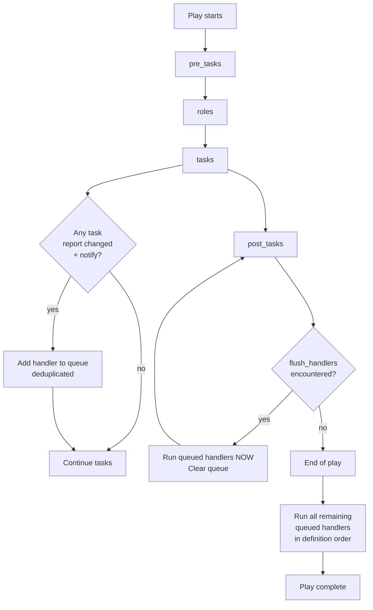
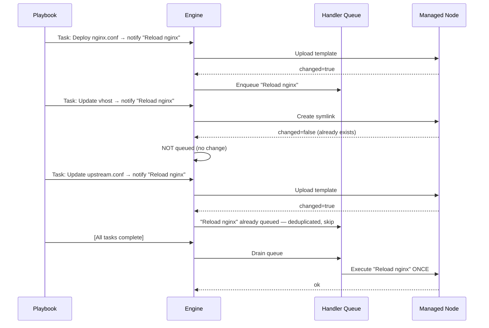

# Topic 9: Handlers

> 📍 Phase 2 — Intermediate | Topic 9 of 28 | File: `09-handlers.md`
> 🔗 Prev: `08-conditionals-and-loops.md` | Next: `10-templates-jinja2.md`

---

## 🧠 Concept Overview

**Handlers are tasks that only run when explicitly triggered — and only if something actually changed.** They are the canonical mechanism for reacting to configuration changes: reloading nginx after its config file is updated, restarting a service after a package upgrade, triggering a cache flush after a template renders.

Without handlers, you'd either restart services unconditionally (wasteful, causes downtime) or write complex conditional logic (`when: config_file.changed`) in every task that might need it. Handlers solve both problems elegantly: they are declared once, triggered by name, deduplicated automatically, and run in a well-defined order at the end of the play.

---

## 📖 In-Depth Explanation

### Subtopic 9.1 — Defining and Notifying Handlers

#### Declaring a handler

Handlers look exactly like tasks — they use a module and arguments. The difference is they live in the `handlers:` section of a play (or in a role's `handlers/main.yml`) and they only run when notified.

```yaml
- name: Configure web server
  hosts: webservers
  become: true

  tasks:
    - name: Deploy nginx configuration
      ansible.builtin.template:
        src: nginx.conf.j2
        dest: /etc/nginx/nginx.conf
        owner: root
        mode: '0644'
      notify: Reload nginx        # ← triggers the handler if this task changes

    - name: Enable new vhost
      ansible.builtin.file:
        src: /etc/nginx/sites-available/myapp
        dest: /etc/nginx/sites-enabled/myapp
        state: link
      notify: Reload nginx        # ← same handler — still only runs once

  handlers:
    - name: Reload nginx          # ← must match the notify string exactly
      ansible.builtin.service:
        name: nginx
        state: reloaded
```

**Key rules:**
1. The `notify` string must **exactly match** the handler `name`
2. Handlers run at the **end of the play** — not immediately when notified
3. A handler notified multiple times still runs **only once**
4. A handler only runs if at least one notifying task reported `changed`

---

#### `notify` — Multiple handlers from one task

A single task can notify multiple handlers:

```yaml
tasks:
  - name: Update application config
    ansible.builtin.template:
      src: app.conf.j2
      dest: /etc/myapp/app.conf
    notify:
      - Restart app service
      - Clear application cache
      - Send deploy notification

handlers:
  - name: Restart app service
    ansible.builtin.service:
      name: myapp
      state: restarted

  - name: Clear application cache
    ansible.builtin.command: /opt/myapp/bin/clear-cache.sh

  - name: Send deploy notification
    ansible.builtin.uri:
      url: https://hooks.slack.com/services/xxx
      method: POST
      body_format: json
      body:
        text: "App config updated on {{ inventory_hostname }}"
```

---

#### Handler execution order

Handlers execute in the **order they are defined** in the `handlers:` section — not in the order they were notified. This is a subtle but important distinction:

```yaml
handlers:
  - name: Stop app           # runs 1st (defined first)
    ansible.builtin.service:
      name: myapp
      state: stopped

  - name: Start app          # runs 2nd
    ansible.builtin.service:
      name: myapp
      state: started

tasks:
  - name: Update binary
    ansible.builtin.copy:
      src: myapp
      dest: /usr/local/bin/myapp
    notify:
      - Start app            # notified 2nd in code...
      - Stop app             # notified 1st in code...
    # BUT handlers still run in definition order: Stop first, then Start
```

> ⚠️ Don't rely on notification order to control handler execution sequence. Use definition order in `handlers:` instead.

---

### Subtopic 9.2 — Handler Execution Order and `flush_handlers`

#### When handlers run — the default

By default, handlers run **once, at the very end of the play**, after all tasks (and `post_tasks`) have completed. This batching is intentional — it means nginx is reloaded once even if 5 different tasks all updated config files.

```
[Task 1] Update nginx.conf       → notifies "Reload nginx"
[Task 2] Update upstream.conf    → notifies "Reload nginx"
[Task 3] Enable vhost            → notifies "Reload nginx"
[All tasks complete]
[Handlers run] → "Reload nginx" runs ONCE
```

---

#### `flush_handlers` — Force handlers to run mid-play

Sometimes you need handlers to run before the end of the play — for example, a service must be restarted before the next task can test it:

```yaml
tasks:
  - name: Update app config
    ansible.builtin.template:
      src: app.conf.j2
      dest: /etc/myapp/app.conf
    notify: Restart app

  - name: Force handlers to run now
    ansible.builtin.meta: flush_handlers    # handlers run here, not at end

  - name: Run smoke test (requires restarted app)
    ansible.builtin.uri:
      url: http://localhost:8080/health
      status_code: 200
    # This task requires the app to be restarted first — flush_handlers ensures it

  - name: Deploy more config
    ansible.builtin.template:
      src: extra.conf.j2
      dest: /etc/myapp/extra.conf
    notify: Restart app   # handler queued again — will run at play end
```

`ansible.builtin.meta: flush_handlers` is a special meta task that immediately executes all pending (queued) handlers, then clears the queue. Handlers notified after `flush_handlers` are queued again for the next flush or end-of-play run.

---

#### What happens when a task fails before handlers run

If a task fails mid-play, Ansible aborts further tasks on that host. **Pending handlers do NOT run** if the play exits due to failure — unless you use `--force-handlers` on the CLI or `force_handlers: true` at the play level.

```yaml
# Force handlers to run even if tasks fail
- name: Deploy application
  hosts: webservers
  force_handlers: true     # handlers run even on failure
  tasks:
    - name: Update config (might fail)
      ansible.builtin.template:
        src: app.conf.j2
        dest: /etc/myapp/app.conf
      notify: Restart app

    - name: This task fails
      ansible.builtin.command: /usr/bin/nonexistent
      # Without force_handlers, "Restart app" would NOT run
      # With force_handlers: true, it WILL run
```

> 💡 `force_handlers: true` is useful when handlers are needed for cleanup or notification regardless of whether the play succeeded.

---

### Subtopic 9.3 — Handlers Across Roles

When using roles (Topic 12), handlers live in `roles/<rolename>/handlers/main.yml`. They can be notified from any task within that role, and from tasks in any play that includes that role.

#### Role handler structure

```
roles/
└── nginx/
    ├── tasks/
    │   └── main.yml
    ├── handlers/
    │   └── main.yml       ← handlers for this role
    └── templates/
        └── nginx.conf.j2
```

```yaml
# roles/nginx/handlers/main.yml
---
- name: Reload nginx
  ansible.builtin.service:
    name: nginx
    state: reloaded

- name: Restart nginx
  ansible.builtin.service:
    name: nginx
    state: restarted

- name: Test nginx config
  ansible.builtin.command: nginx -t
  changed_when: false
```

```yaml
# roles/nginx/tasks/main.yml
- name: Deploy nginx config
  ansible.builtin.template:
    src: nginx.conf.j2
    dest: /etc/nginx/nginx.conf
  notify: Reload nginx       # references handler in handlers/main.yml
```

---

#### Notifying handlers across roles

A task in one role can notify a handler defined in another role — as long as both are included in the same play. The handler name must be unique across all roles in the play:

```yaml
# Playbook
- name: Configure full stack
  hosts: webservers
  roles:
    - common
    - nginx
    - myapp

# tasks in myapp can notify "Reload nginx" handler from the nginx role
```

> ⚠️ Handler names must be **globally unique** within a play when multiple roles are included. If two roles define a handler with the same name, the second definition overwrites the first. Use namespaced names like `nginx : reload` or `myapp : restart` in role handlers to avoid collisions.

---

#### `listen` — Handler topic subscriptions (Ansible 2.2+)

Instead of matching by exact name, handlers can `listen` to a topic string. Multiple handlers can subscribe to the same topic, and tasks `notify` the topic:

```yaml
handlers:
  - name: Reload nginx service
    ansible.builtin.service:
      name: nginx
      state: reloaded
    listen: "nginx config changed"    # subscribes to topic

  - name: Validate nginx config
    ansible.builtin.command: nginx -t
    changed_when: false
    listen: "nginx config changed"    # also subscribes

  - name: Log config change
    ansible.builtin.lineinfile:
      path: /var/log/ansible-changes.log
      line: "{{ ansible_date_time.iso8601 }} nginx config updated on {{ inventory_hostname }}"
      create: true
    listen: "nginx config changed"

tasks:
  - name: Deploy nginx config
    ansible.builtin.template:
      src: nginx.conf.j2
      dest: /etc/nginx/nginx.conf
    notify: "nginx config changed"    # triggers ALL three handlers above
```

`listen` decouples the task from the handler implementation — you notify a topic and all interested handlers run. This is especially useful in role design where you want external playbooks to trigger role-internal behaviours without knowing handler names.

---

## 🏗️ Architecture & System Design

How handlers fit into a play's lifecycle:



---

## 🔄 Flow / Lifecycle



---

## 💻 Code Examples

### ✅ Example 1: Classic nginx config + handler pattern

```yaml
- name: Configure nginx
  hosts: webservers
  become: true

  tasks:
    - name: Install nginx
      ansible.builtin.apt:
        name: nginx
        state: present

    - name: Deploy main nginx config
      ansible.builtin.template:
        src: nginx.conf.j2
        dest: /etc/nginx/nginx.conf
        validate: nginx -t -c %s    # validate config BEFORE writing
      notify: Reload nginx

    - name: Deploy site config
      ansible.builtin.template:
        src: site.conf.j2
        dest: /etc/nginx/sites-available/myapp
      notify: Reload nginx

    - name: Enable site
      ansible.builtin.file:
        src: /etc/nginx/sites-available/myapp
        dest: /etc/nginx/sites-enabled/myapp
        state: link
      notify: Reload nginx

    - name: Ensure nginx is started
      ansible.builtin.service:
        name: nginx
        state: started
        enabled: true
    # Nginx will only be RELOADED once — even though 3 tasks notified it

  handlers:
    - name: Reload nginx
      ansible.builtin.service:
        name: nginx
        state: reloaded
```

### ✅ Example 2: `flush_handlers` for smoke-test pattern

```yaml
- name: Deploy and verify application
  hosts: appservers
  become: true

  tasks:
    - name: Deploy application config
      ansible.builtin.template:
        src: app.conf.j2
        dest: /etc/myapp/app.conf
      notify: Restart myapp

    - name: Deploy environment file
      ansible.builtin.template:
        src: env.j2
        dest: /etc/myapp/.env
      notify: Restart myapp

    # Flush handlers NOW so app is restarted before smoke test
    - name: Apply pending restarts before testing
      ansible.builtin.meta: flush_handlers

    - name: Wait for app to be ready
      ansible.builtin.uri:
        url: http://localhost:8080/health
        status_code: 200
      register: health
      retries: 10
      delay: 3
      until: health.status == 200

    - name: Confirm deployment succeeded
      ansible.builtin.debug:
        msg: "App is healthy after config update"

  handlers:
    - name: Restart myapp
      ansible.builtin.service:
        name: myapp
        state: restarted
```

### ✅ Example 3: `listen` for multi-handler topic

```yaml
handlers:
  - name: reload-systemd
    ansible.builtin.command: systemctl daemon-reload
    listen: systemd unit changed

  - name: enable-and-start-service
    ansible.builtin.service:
      name: myapp
      state: started
      enabled: true
    listen: systemd unit changed

tasks:
  - name: Install myapp systemd unit
    ansible.builtin.template:
      src: myapp.service.j2
      dest: /etc/systemd/system/myapp.service
    notify: systemd unit changed    # triggers both handlers above
```

### ❌ Anti-pattern — Using a task instead of a handler for service restarts

```yaml
# ❌ Unconditional restart — causes unnecessary downtime even if nothing changed
tasks:
  - name: Deploy nginx config
    ansible.builtin.template:
      src: nginx.conf.j2
      dest: /etc/nginx/nginx.conf

  - name: Restart nginx
    ansible.builtin.service:
      name: nginx
      state: restarted    # runs EVERY time, even if config didn't change

# ✅ Handler-based — only restarts when config actually changes
tasks:
  - name: Deploy nginx config
    ansible.builtin.template:
      src: nginx.conf.j2
      dest: /etc/nginx/nginx.conf
    notify: Reload nginx

handlers:
  - name: Reload nginx
    ansible.builtin.service:
      name: nginx
      state: reloaded     # graceful reload, not restart; runs ONLY on change
```

---

## ⚙️ Configuration & Options

### Handler keywords reference

| Keyword | Location | Description |
|---------|----------|-------------|
| `notify` | task | Trigger handler by name or listen topic |
| `listen` | handler | Subscribe handler to a topic (alternative to name matching) |
| `handlers:` | play | List of handlers for this play |
| `meta: flush_handlers` | task | Force all queued handlers to run immediately |
| `force_handlers: true` | play | Run handlers even if play fails |

### Handler state options for services

| `state` | Effect | When to use |
|---------|--------|-------------|
| `reloaded` | Sends SIGHUP — reloads config, no downtime | nginx, apache, syslog — supports graceful reload |
| `restarted` | Stops + starts — brief downtime | When process must fully restart to pick up changes |
| `started` | Start if not running | Initial setup only |

> 💡 Prefer `reloaded` over `restarted` for web servers — it's zero-downtime. Only use `restarted` when the daemon doesn't support live reload (e.g., sshd, some databases).

---

## 🧩 Patterns & Best Practices

**What experienced engineers do:**
- Use `reloaded` not `restarted` for web servers and proxies — it's zero-downtime
- Use `template: validate:` option to validate config files before writing — this catches syntax errors before nginx/apache is reloaded with a broken config
- Use `listen:` in roles for decoupled, composable handlers — external plays can trigger role-internal behaviour without knowing internal handler names
- Use `flush_handlers` + `uri` health check as the last step of every deploy — ensures you detect breakage immediately
- Name handlers as "verbs" (`Reload nginx`, `Restart app`) not state descriptions (`nginx is reloaded`)

**What beginners typically get wrong:**
- Placing `handlers:` inside `tasks:` instead of at the play level — syntax error
- Expecting handlers to run immediately after the notifying task — they run at end of play
- Notifying a handler from a task that uses `ignore_errors: true` on a failed task — the task reports `failed` not `changed`, so the handler is NOT triggered
- Having duplicate handler names across roles — the second definition silently overwrites the first

**Senior-level nuance:**
- In multi-role plays, handler name collisions are a real operational hazard. Use the `listen` mechanism with namespaced topic strings in roles (`nginx : config changed`, `app : deployed`) rather than bare handler names — this makes handler matching explicit and collision-proof.
- Handler failures are fatal by default — if a handler fails, the play fails. For non-critical handlers (logging, notifications), add `ignore_errors: true` to the handler definition so an alert failure doesn't abort the whole deploy.

---

## 🔗 How It Connects

- **Builds on:** `08-conditionals-and-loops.md` — `changed_when` from loops affects whether handlers are triggered; `when` conditions on tasks affect whether `changed` is reported
- **Leads to:** `10-templates-jinja2.md` — templates are the most common handler trigger; every template task that changes a config file should notify a handler
- **Related concepts:** Topic 12 (role handlers in `handlers/main.yml`), Topic 14 (`block/rescue` and handler interaction during failures), Topic 16 (`import_tasks` vs `include_tasks` — how handlers scope differs between them)

---

## 🎯 Interview Questions (Conceptual)

**Q1: When do handlers run in an Ansible play?**
> **A:** By default, handlers run once at the end of the play — after all tasks and post_tasks have completed. They only run if at least one task that notified them reported `changed`. You can force them to run mid-play using `ansible.builtin.meta: flush_handlers`.

**Q2: If a handler is notified 5 times by different tasks, how many times does it run?**
> **A:** Exactly once. Ansible deduplicates the handler queue — regardless of how many times a handler is notified during a play, it only runs once at flush time. This is one of handlers' key design benefits: you can have 10 config tasks all notifying "Reload nginx" and nginx is reloaded exactly once.

**Q3: What is the difference between `state: reloaded` and `state: restarted` in a handler?**
> **A:** `reloaded` sends a signal (usually SIGHUP) to the process, telling it to re-read its config files without stopping. This is zero-downtime and is preferred for web servers like nginx. `restarted` stops and starts the process, causing a brief service interruption. Use `reloaded` whenever the daemon supports it; use `restarted` only when a full process restart is required.

**Q4: What is `flush_handlers` and when would you use it?**
> **A:** `ansible.builtin.meta: flush_handlers` is a meta task that forces all currently queued handlers to execute immediately, then clears the queue. You use it when a subsequent task depends on the side effects of a handler — for example, running a smoke test after a service restart that was triggered by a config update.

**Q5: What is the `listen` keyword in a handler and why is it useful?**
> **A:** `listen` lets a handler subscribe to a topic string instead of matching by its own name. Multiple handlers can listen to the same topic, and tasks notify the topic rather than a specific handler name. This decouples tasks from handler implementation — you notify `"nginx config changed"` and any number of handlers can react. It's especially valuable in roles where you want external plays to trigger internal behaviour without exposing handler names.

**Q6: Do handlers run if the play fails mid-way?**
> **A:** By default, no. If a task fails and the play aborts, pending handlers do not run. You can override this with `force_handlers: true` at the play level, which causes handlers to run even when the play exits due to failure. This is useful for cleanup handlers or notification handlers that should fire regardless of success.

---

## 🧠 Scenario-Based Interview Problems

**Scenario 1: "You deploy a new nginx config, the handler is supposed to reload nginx, but the reload never happens. What could be wrong?"**
> **Problem:** Handler notification not firing despite config deployment.
> **Approach:** Check these in order: (1) Is the `notify` string an exact match for the handler `name`? Case-sensitive, spaces included. (2) Did the template task actually report `changed`? If the config file content was identical to what was already on disk, Ansible reports `ok` not `changed` — no notification. Use `--diff` flag to see if content differed. (3) Is the handler defined at the correct play level (not inside `tasks:`)? (4) Did the play fail before reaching end-of-play handler execution? Check the recap for `failed`. (5) Did a previous `flush_handlers` drain the queue, and the task notified after that?
> **Trade-offs:** Use `ansible-playbook -v site.yml` — verbose output shows which handlers were queued and when they ran. Adding a debug task immediately after the template confirms whether `changed` was reported.

**Scenario 2: "You have 3 roles — nginx, app, and database — all included in one play. Two of them define a handler named `Restart service`. What happens and how do you fix it?"**
> **Problem:** Handler name collision across roles — silent overwrite.
> **Approach:** The second role's handler definition overwrites the first in the play's handler namespace. When `Restart service` is triggered, only the second definition runs. Fix options: (1) Rename handlers uniquely — `nginx : Restart service`, `app : Restart service`. (2) Switch to `listen` with namespaced topics — `nginx : config changed`, `app : config changed` — and have tasks notify the appropriate topic. Option 2 is more robust because it survives role ordering changes and makes the dependency explicit.
> **Trade-offs:** The `listen` approach adds one layer of indirection but pays off at scale — in a large organisation with shared role libraries, name collision bugs are hard to trace and `listen` with namespaced topics eliminates them entirely.

---

## ⚡ Quick Notes — Revision Card

- 📌 Handlers run **once at end of play** — not immediately when notified
- 📌 Handlers only run if the notifying task reports **`changed`** — not `ok`, not `failed`
- 📌 A handler notified multiple times still runs **only once** — auto-deduplicated
- 📌 `notify:` string must **exactly match** handler `name:` (case-sensitive)
- 📌 `meta: flush_handlers` = run queued handlers NOW, mid-play
- 📌 `force_handlers: true` = run handlers even if play fails
- 📌 `listen:` = subscribe handler to a topic (multiple handlers can share a topic)
- 📌 Handler execution order = **definition order**, not notification order
- ⚠️ Handler name collisions across roles silently overwrite — use `listen` with namespaced topics
- ⚠️ Handlers do NOT run if play fails mid-way — unless `force_handlers: true`
- ⚠️ `ignore_errors: true` on a failed task = no `changed` reported = handler NOT triggered
- 💡 Prefer `state: reloaded` over `state: restarted` for web servers — zero-downtime
- 🔑 `flush_handlers` + health check = the gold standard deploy verification pattern

---

## 🔖 References & Further Reading

- 📄 [Ansible Handlers — Official Docs](https://docs.ansible.com/ansible/latest/playbook_guide/playbooks_handlers.html)
- 📄 [meta module — flush_handlers](https://docs.ansible.com/ansible/latest/collections/ansible/builtin/meta_module.html)
- 📝 [Handlers in Roles](https://docs.ansible.com/ansible/latest/playbook_guide/playbooks_reuse_roles.html#handlers-and-roles)
- 🎥 [Jeff Geerling — Ansible Handlers](https://www.youtube.com/watch?v=HU-dkXBCPdU)
- 📚 *Ansible for DevOps* — Jeff Geerling (Chapter 4)
- ➡️ Related in this course: [`08-conditionals-and-loops.md`] · [`10-templates-jinja2.md`]

---
