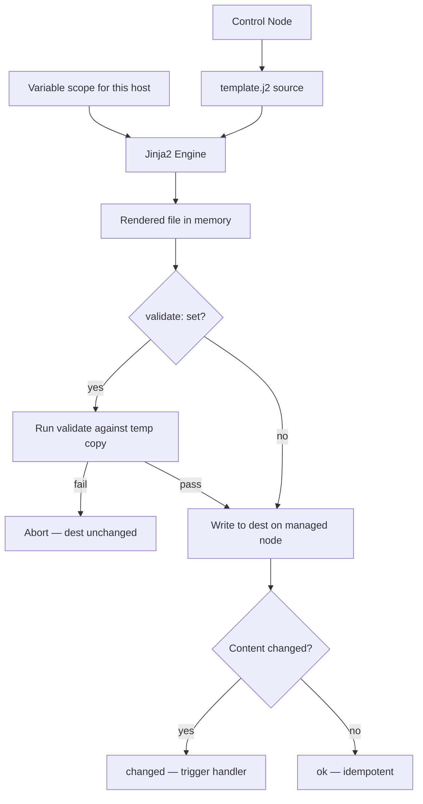
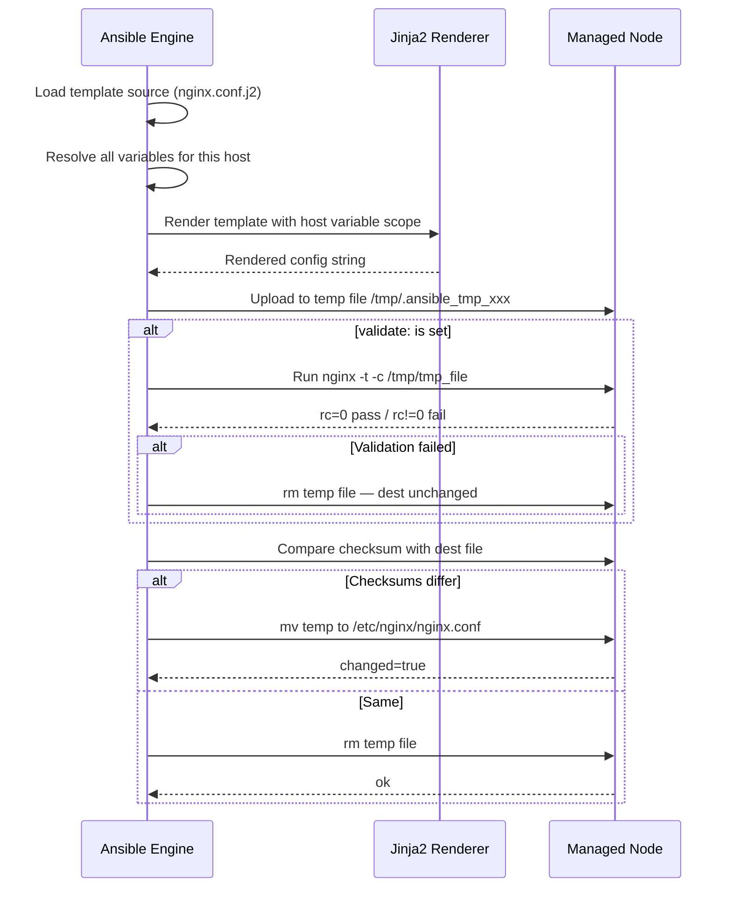

# Topic 10: Templates & Jinja2

> 📍 Phase 2 — Intermediate | Topic 10 of 28 | File: `10-templates-jinja2.md`
> 🔗 Prev: `09-handlers.md` | Next: `11-files-and-modules.md`

---

## 🧠 Concept Overview

A **template** is a text file with placeholders that Ansible fills in at runtime using variable values. You write one template file, and Ansible renders a different version of it for every host — substituting hostnames, ports, memory sizes, environment names, and anything else that differs between machines.

Ansible uses **Jinja2** as its templating engine. Jinja2 gives you variables, filters, conditionals, loops, and macros inside plain text files. Templates are how you manage dynamic configuration files — nginx vhosts, PostgreSQL tuning, systemd units, `/etc/hosts`, application env files — anything that changes per-host or per-environment but follows a common structure.

---

## 📖 In-Depth Explanation

### Subtopic 10.1 — Jinja2 Filters, Tests, and Lookups

#### Jinja2 syntax basics

```jinja2
{# Comment — not rendered #}
{{ variable }}                        Output a variable
{{ variable | filter }}               Apply a filter
...      Control block
... Loop block
```

#### Essential filters

**String:**
```jinja2
{{ app_name | upper }}               MYAPP
{{ app_name | lower }}               myapp
{{ path | basename }}                file.conf
{{ path | dirname }}                 /etc/myapp
{{ description | trim }}             strip whitespace
{{ text | replace('old','new') }}    string replace
```

**Numeric:**
```jinja2
{{ "3.14" | float }}                 cast to float
{{ memory | int }}                   cast to integer
{{ 1024 | abs }}                     absolute value
{{ value | round(2) }}               round to 2 decimals
```

**List:**
```jinja2
{{ packages | length }}              count items
{{ packages | first }}               first item
{{ packages | sort }}                sorted list
{{ packages | unique }}              deduplicated
{{ packages | join(', ') }}          "nginx, certbot, git"
{{ users | map(attribute='name') | list }}           extract field from list of dicts
{{ users | selectattr('admin','equalto',true) | list }} filter dicts by attribute
```

**Dict:**
```jinja2
{{ mydict | dict2items }}            [{key: k, value: v}, ...]
{{ items | items2dict }}             reverse of dict2items
{{ dict1 | combine(dict2) }}         merge two dicts
```

**Default and undefined handling:**
```jinja2
{{ my_var | default('fallback') }}   use fallback if undefined
{{ my_var | default(omit) }}         omit parameter entirely if undefined
{{ my_var if my_var is defined else 'N/A' }}
```

**Encoding and hashing:**
```jinja2
{{ password | password_hash('sha512') }}   hash for /etc/shadow
{{ data | b64encode }}                     base64 encode
{{ encoded | b64decode }}                  base64 decode
{{ data | to_json }}                       serialize to JSON
{{ data | to_yaml }}                       serialize to YAML
```

#### Jinja2 tests

```jinja2
{{ my_var is defined }}
{{ my_var is undefined }}
{{ my_var is none }}
{{ my_var is string }}
{{ my_var is number }}
{{ my_var is iterable }}
{{ my_var is mapping }}              is a dict
{{ 42 is divisibleby(7) }}
{{ 'hello' is match('^h') }}         regex match from start
{{ 'hello' is search('ll') }}        regex search anywhere
```

In playbook `when` clauses:
```yaml
when: custom_port is defined
when: result is failed
when: my_list is iterable and my_list | length > 0
```

#### Lookups — pull data at render time (runs on control node)

```yaml
vars:
  ssh_pub_key:   "{{ lookup('file', '~/.ssh/id_rsa.pub') }}"
  deploy_token:  "{{ lookup('env', 'CI_DEPLOY_TOKEN') }}"
  db_ip:         "{{ lookup('dig', 'db.internal') }}"
  db_password:   "{{ lookup('password', 'credentials/db_pass length=20') }}"
  config_files:  "{{ lookup('fileglob', 'files/configs/*.conf', wantlist=True) }}"
```

> ⚠️ Lookups run on the **control node**, not the managed node. Use them to read local files and env vars — not remote content.

---

### Subtopic 10.2 — `template` Task vs `copy` Task

| Feature | `ansible.builtin.template` | `ansible.builtin.copy` |
|---------|--------------------------|----------------------|
| Jinja2 rendering | Yes — variables substituted | No — file copied verbatim |
| Source | Control node `templates/` dir | Control node `files/` dir or inline `content:` |
| Extension convention | `.j2` | Any |
| Use for | Dynamic config files | Static files, certs, binaries |
| `validate:` support | Yes | Yes |

```yaml
tasks:
  # Template — Jinja2 rendered
  - name: Deploy nginx config
    ansible.builtin.template:
      src: templates/nginx.conf.j2
      dest: /etc/nginx/nginx.conf
      owner: root
      mode: '0644'
      validate: nginx -t -c %s      # validate before writing
    notify: Reload nginx

  # Copy — verbatim, no rendering
  - name: Deploy SSL certificate
    ansible.builtin.copy:
      src: files/ssl/cert.pem
      dest: /etc/ssl/certs/myapp.pem
      mode: '0644'

  # Copy with inline content
  - name: Write simple config
    ansible.builtin.copy:
      content: |
        [app]
        name=myapp
        env=production
      dest: /etc/myapp/simple.conf
```

#### The `validate` parameter

`validate` runs a command against a **temp copy** of the file before writing to the destination. If validation fails, the destination is untouched.

```yaml
- name: Deploy sudoers
  ansible.builtin.template:
    src: sudoers.j2
    dest: /etc/sudoers
    validate: visudo -cf %s    # %s = path to temp file
    mode: '0440'

- name: Deploy sshd_config
  ansible.builtin.template:
    src: sshd_config.j2
    dest: /etc/ssh/sshd_config
    validate: sshd -t -f %s
```

---

### Subtopic 10.3 — Rendering Complex Configs

#### nginx vhost template

```jinja2
{# templates/nginx-vhost.conf.j2 #}
server {
    listen {{ http_port | default(80) }};
    server_name {{ server_name }} {{ server_aliases | default([]) | join(' ') }};
    root {{ document_root }};

    
    listen {{ https_port | default(443) }} ssl;
    ssl_certificate     {{ ssl_cert_path }};
    ssl_certificate_key {{ ssl_key_path }};
    ssl_protocols TLSv1.2 TLSv1.3;
    

    location / {
        
        proxy_pass {{ proxy_pass }};
        proxy_set_header Host $host;
        proxy_set_header X-Real-IP $remote_addr;
        
        try_files $uri $uri/ =404;
        
    }

    
    location {{ location.path }} {
        {{ location.config | indent(8) }}
    }
    
}
```

#### PostgreSQL auto-tuning template

```jinja2
{# templates/postgresql.conf.j2 #}
# Managed by Ansible | Host: {{ inventory_hostname }} | {{ ansible_date_time.iso8601 }}

# Memory — based on {{ ansible_memory_mb.real.total }}MB total RAM
shared_buffers        = {{ (ansible_memory_mb.real.total * 0.25) | int }}MB
effective_cache_size  = {{ (ansible_memory_mb.real.total * 0.75) | int }}MB
work_mem              = {{ [4, (ansible_memory_mb.real.total * 0.01) | int] | max }}MB
maintenance_work_mem  = {{ [64, (ansible_memory_mb.real.total * 0.05) | int] | max }}MB

# CPU — {{ ansible_processor_vcpus }} vCPUs
max_worker_processes              = {{ ansible_processor_vcpus }}
max_parallel_workers              = {{ ansible_processor_vcpus }}
max_parallel_workers_per_gather   = {{ [2, (ansible_processor_vcpus / 2) | int] | max }}

max_connections = {{ pg_max_connections | default(100) }}
log_min_duration_statement = {{ pg_slow_query_ms | default(1000) }}


wal_level        = replica
max_wal_senders  = {{ pg_max_wal_senders | default(3) }}
hot_standby      = on

wal_level        = minimal

```

#### `/etc/hosts` cross-host template

```jinja2
{# templates/hosts.j2 #}
# Managed by Ansible — do not edit manually
127.0.0.1   localhost
127.0.1.1   {{ ansible_hostname }} {{ ansible_fqdn }}

# Web servers

{{ hostvars[host]['ansible_default_ipv4']['address'] }}  {{ hostvars[host]['ansible_hostname'] }}


# Database servers

{{ hostvars[host]['ansible_default_ipv4']['address'] }}  {{ hostvars[host]['ansible_hostname'] }}

```

#### systemd unit template

```jinja2
{# templates/myapp.service.j2 #}
[Unit]
Description={{ app_description | default(app_name + ' service') }}
After=network.target

After=postgresql.service
Requires=postgresql.service


[Service]
Type={{ app_service_type | default('simple') }}
User={{ app_user }}
WorkingDirectory={{ app_dir }}
ExecStart={{ app_exec_start }}
Restart={{ app_restart_policy | default('on-failure') }}
RestartSec={{ app_restart_sec | default(5) }}

Environment="APP_ENV={{ app_environment | default('production') }}"

Environment="{{ key }}={{ value }}"


EnvironmentFile={{ app_env_file }}


[Install]
WantedBy=multi-user.target
```

---

## 🏗️ Architecture & System Design



---

## 🔄 Flow / Lifecycle



---

## 💻 Code Examples

### ✅ Example 1: Full deploy workflow with validate and handler

```yaml
- name: Configure nginx
  hosts: webservers
  become: true
  vars:
    http_port: 80
    server_name: "{{ ansible_fqdn }}"
    document_root: /var/www/html

  tasks:
    - name: Deploy nginx vhost config
      ansible.builtin.template:
        src: templates/nginx-vhost.conf.j2
        dest: /etc/nginx/sites-available/myapp
        owner: root
        mode: '0644'
        validate: nginx -t -c %s
      notify: Reload nginx

    - name: Enable site
      ansible.builtin.file:
        src: /etc/nginx/sites-available/myapp
        dest: /etc/nginx/sites-enabled/myapp
        state: link
      notify: Reload nginx

  handlers:
    - name: Reload nginx
      ansible.builtin.service:
        name: nginx
        state: reloaded
```

### ✅ Example 2: Environment-specific rendering via group_vars

```yaml
# group_vars/production.yml
db_host: prod-db.internal
db_pool_size: 20
debug_mode: false
log_level: WARNING

# group_vars/staging.yml
db_host: staging-db.internal
db_pool_size: 5
debug_mode: true
log_level: DEBUG
```

```jinja2
{# templates/app.conf.j2 #}
[database]
host      = {{ db_host }}
pool_size = {{ db_pool_size }}

[application]
debug     = {{ debug_mode | lower }}
log_level = {{ log_level }}
workers   = {{ ansible_processor_vcpus * 2 }}
bind      = 0.0.0.0:{{ app_port | default(8080) }}
```

### ✅ Example 3: Jinja2 macro for reusable template blocks

```jinja2
{# templates/nginx.conf.j2 #}

upstream {{ name }} {
    
    server {{ server }} weight=1 max_fails=3 fail_timeout=30s;
    
    keepalive 32;
}


{{ upstream_block('app_backend',
    groups['appservers'] | map('extract', hostvars, 'ansible_host') | list) }}

server {
    location /app/ { proxy_pass http://app_backend; }
}
```

### ❌ Anti-pattern — Hardcoded values in templates

```jinja2
{# ❌ Not reusable — environment locked in #}
server {
    listen 80;
    server_name www.example.com;
    proxy_pass http://10.0.1.15:8080;
}

{# ✅ Variable-driven — works for any host/environment #}
server {
    listen {{ http_port | default(80) }};
    server_name {{ server_name }};
    proxy_pass http://{{ hostvars[groups['appservers'][0]]['ansible_host'] }}:{{ app_port }};
}
```

---

## ⚙️ Configuration & Options

### `template` module key parameters

| Parameter | Description |
|-----------|-------------|
| `src` | Path to `.j2` template on control node |
| `dest` | Destination path on managed node |
| `owner` / `group` / `mode` | File ownership and permissions |
| `validate` | Command to validate before writing (`%s` = temp path) |
| `backup` | Create `.bak` before overwriting |
| `trim_blocks` | Remove newline after `` block tags (default: yes) |
| `lstrip_blocks` | Strip leading whitespace before block tags |

---

## 🧩 Patterns & Best Practices

**What experienced engineers do:**
- Always use `validate:` for nginx, sshd, sudoers, postgresql — broken configs on critical daemons cause outages
- Add `# Managed by Ansible — do not edit manually` at the top of every rendered file
- Keep templates in `templates/` with `.j2` extension — universal convention, easy to grep
- Use `| default(value)` for every optional variable — prevents `UndefinedError` at runtime
- For adaptive configs, use `ansible_memory_mb` and `ansible_processor_vcpus` facts to size JVM heap, DB buffers, worker counts

**What beginners typically get wrong:**
- Using `copy` for files with per-host differences — creating N separate files instead of one template
- Skipping `validate:` on sshd_config — locking themselves out with a typo
- Referencing facts in templates without `gather_facts: true` — undefined variable errors
- Not using `| default(omit)` for optional module params — empty string is not the same as absent

**Senior-level nuance:**
- Very large templates (500+ lines) are a code smell — split into a main config + `conf.d/` drop-ins, each a smaller template
- The `template` module renders on the control node and sends via SSH. For secrets-heavy templates, ensure vault-encrypted variables are decrypted at render time — they never hit disk in plaintext on the control node

---

## 🔗 How It Connects

- **Builds on:** `09-handlers.md` — template changes trigger handlers to reload services
- **Leads to:** `11-files-and-modules.md` — `lineinfile`, `blockinfile` complement templates for targeted file edits
- **Related concepts:** Topic 6 (variables feed templates), Topic 7 (facts drive adaptive configs), Topic 13 (Vault for secrets in templates)

---

## 🎯 Interview Questions (Conceptual)

**Q1: What is the difference between `template` and `copy`?**
> **A:** `template` renders Jinja2 expressions in the source file — substituting variables, running loops and conditionals — then writes the result to the managed host. `copy` transfers the file verbatim, with no rendering. Use `template` for dynamic configs that differ per host or environment; use `copy` for static files like certificates or pre-built binaries.

**Q2: What does the `validate` parameter do and why is it critical?**
> **A:** `validate` runs a command against a temporary copy of the rendered file before writing to the destination. If the command exits non-zero, the destination is untouched. It prevents deploying broken configs — a bad nginx.conf or sshd_config could take down services or lock you out of servers. Always use `validate` for system-critical config files.

**Q3: What is a Jinja2 filter and how are they chained?**
> **A:** A filter transforms a value using the pipe operator: `{{ value | filter }}`. They can be chained: `{{ my_list | sort | unique | join(', ') }}`. Ansible includes filters for strings, numbers, lists, dicts, encoding, and hashing — plus Python's built-in Jinja2 filters.

**Q4: What does `| default(omit)` do and when do you use it instead of `| default('')`?**
> **A:** `| default(omit)` causes the parameter to be completely absent from the module call if the variable is undefined — as if you never specified it. `| default('')` sets it to an empty string, which is a valid value and may change behaviour. Use `omit` when a module parameter is truly optional and an empty value would cause unintended effects.

**Q5: Where do Jinja2 lookups run — control node or managed node?**
> **A:** Lookups always run on the **control node**. `lookup('file', '/path')` reads a file from your local machine, not from the managed host. This matters for security and for cross-platform consistency — don't use lookups expecting them to read remote files; use `slurp` or `fetch` for that.

---

## 🧠 Scenario-Based Interview Problems

**Scenario 1: "You manage 50 nginx servers each with a different domain, SSL cert path, and backend pool. How do you manage all configs without 50 separate files?"**
> **Problem:** N-to-1 config management — many hosts, one template.
> **Approach:** Write one `nginx-vhost.conf.j2` using `{{ server_name }}`, `{{ ssl_cert_path }}`, and a `` backend loop. Store per-host values in `host_vars/<hostname>.yml`. The template renders uniquely for each host automatically. Add `validate: nginx -t -c %s` and `notify: Reload nginx`. Changing the config structure means editing one file — all 50 hosts get it on the next run.
> **Trade-offs:** One host with a completely unique structure may not fit the shared template cleanly. Use a separate template task with `when: inventory_hostname == 'special-host'` for exceptions.

**Scenario 2: "A template broke nginx on 10 servers — a Jinja2 error appeared at runtime when a variable was None. How do you prevent this class of bug?"**
> **Problem:** Template rendering errors surface at runtime, not during authoring.
> **Approach:** (1) `validate: nginx -t -c %s` catches config syntax errors before writing. (2) `| default(value)` on every optional variable prevents `UndefinedError`. (3) Add `ansible-lint` to CI — catches many Jinja2 issues statically. (4) Staging environment runs the same playbooks before production — failures surface there first. (5) Use `--check` mode to simulate rendering without writing to disk.

---

## ⚡ Quick Notes — Revision Card

- 📌 `template` = Jinja2 rendered per host | `copy` = verbatim static file
- 📌 Jinja2: `{{ var }}` output | `` control | `{# #}` comment
- 📌 Key filters: `default`, `upper/lower`, `int/float`, `join`, `sort`, `unique`, `dict2items`, `selectattr`, `map`, `password_hash`
- 📌 `| default(omit)` = remove parameter if undefined (not empty string)
- 📌 `validate: nginx -t -c %s` = validate before writing — use on every critical system config
- 📌 Lookups run on **control node** — for local files, env vars, DNS
- 📌 Add `# Managed by Ansible` header to every rendered file
- ⚠️ No `validate:` on sshd_config = risk of locking out of servers
- ⚠️ Missing `| default()` on optional vars = `UndefinedError` at runtime
- 💡 Use `ansible_memory_mb` + `ansible_processor_vcpus` facts for adaptive DB/JVM tuning configs
- 🔑 One template + `host_vars/` per host = N hosts managed by one file

---

## 🔖 References & Further Reading

- 📄 [Ansible Template Module](https://docs.ansible.com/ansible/latest/collections/ansible/builtin/template_module.html)
- 📄 [Jinja2 Filters in Ansible](https://docs.ansible.com/ansible/latest/playbook_guide/playbooks_filters.html)
- 📄 [Jinja2 Tests](https://docs.ansible.com/ansible/latest/playbook_guide/playbooks_tests.html)
- 📄 [Lookups](https://docs.ansible.com/ansible/latest/playbook_guide/playbooks_lookups.html)
- 📝 [Jinja2 Official Template Designer Guide](https://jinja.palletsprojects.com/en/3.1.x/templates/)
- 🎥 [Jeff Geerling — Ansible Templates](https://www.youtube.com/watch?v=OtlDoMPz1Mo)
- ➡️ Related in this course: [`09-handlers.md`] · [`11-files-and-modules.md`]
