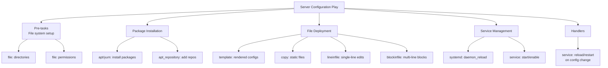
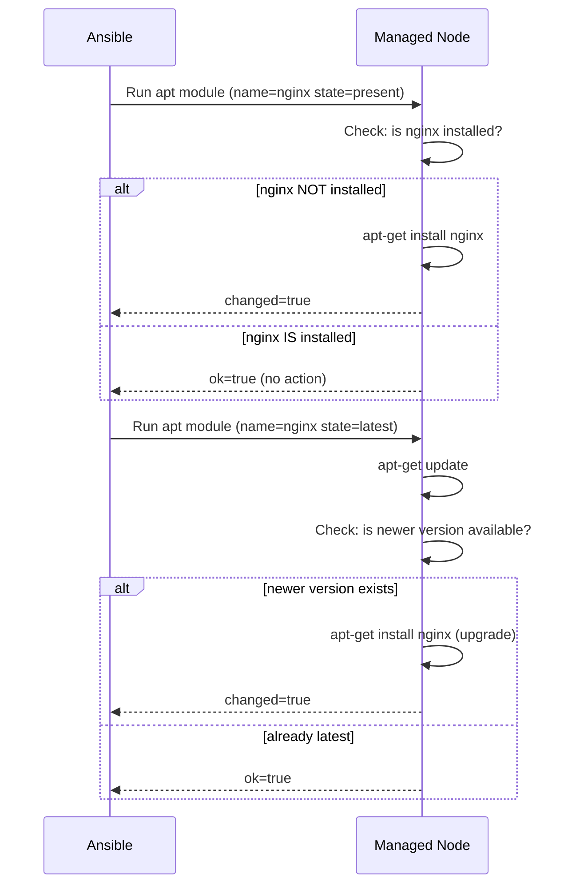

# Topic 11: Files & Modules

> 📍 Phase 2 — Intermediate | Topic 11 of 28 | File: `11-files-and-modules.md`
> 🔗 Prev: `10-templates-jinja2.md` | Next: `12-roles.md`

---

## 🧠 Concept Overview

Ansible's built-in module library covers the vast majority of day-to-day sysadmin work. This topic is a deep reference for the three most-used module categories you'll reach for in nearly every playbook: **file management**, **package management**, and **service management**.

These aren't glamorous topics, but they're the workhorses. If you can write idiomatic, idempotent tasks using `file`, `copy`, `lineinfile`, `apt`, `yum`, `service`, and `systemd` — you can automate most of what happens on a Linux server.

---

## 📖 In-Depth Explanation

### Subtopic 11.1 — File Modules: `file`, `copy`, `fetch`, `template`, `lineinfile`, `blockinfile`

#### `file` — Manage file/directory/symlink state

The `file` module is the Swiss Army knife for filesystem objects. It creates, deletes, sets permissions, and manages symlinks — all idempotently.

```yaml
# Create a directory
- name: Create application directory
  ansible.builtin.file:
    path: /opt/myapp
    state: directory
    owner: deploy
    group: deploy
    mode: '0755'

# Create nested directories (like mkdir -p)
- name: Create nested directories
  ansible.builtin.file:
    path: /opt/myapp/logs/archive
    state: directory
    recurse: true       # creates all parent directories
    mode: '0755'

# Create a file (touch — without content)
- name: Ensure log file exists
  ansible.builtin.file:
    path: /var/log/myapp/app.log
    state: touch
    owner: app
    mode: '0644'
    modification_time: preserve   # don't update mtime if file exists

# Create a symlink
- name: Link current release
  ansible.builtin.file:
    src: /opt/myapp/releases/2.1.0
    dest: /opt/myapp/current
    state: link
    force: true    # replace existing symlink

# Delete a file
- name: Remove old config
  ansible.builtin.file:
    path: /etc/myapp/old.conf
    state: absent

# Delete a directory recursively
- name: Remove old releases
  ansible.builtin.file:
    path: /opt/myapp/releases/1.9.0
    state: absent

# Change permissions without touching content
- name: Fix permissions on sensitive file
  ansible.builtin.file:
    path: /etc/myapp/secrets.yml
    owner: root
    group: root
    mode: '0600'
    state: file    # 'file' = it must exist; fail if it doesn't
```

**`state` values:**

| State | Meaning |
|-------|---------|
| `file` | Ensure the path is a regular file; fail if absent |
| `directory` | Ensure path is a directory; create if absent |
| `link` | Ensure path is a symlink pointing to `src` |
| `hard` | Ensure path is a hard link to `src` |
| `touch` | Create file if absent; update timestamps if present |
| `absent` | Delete the path (file, directory, or symlink) |

---

#### `copy` — Copy files from control node to managed node

```yaml
# Copy a file
- name: Copy SSL certificate
  ansible.builtin.copy:
    src: files/server.crt          # relative to playbook or role files/
    dest: /etc/ssl/certs/server.crt
    owner: root
    group: ssl-cert
    mode: '0644'
    backup: true

# Copy inline content (no source file needed)
- name: Write a simple config
  ansible.builtin.copy:
    content: |
      [defaults]
      log_level = INFO
      timeout = 30
    dest: /etc/myapp/defaults.ini
    owner: app
    mode: '0644'

# Copy a directory recursively
- name: Copy application files
  ansible.builtin.copy:
    src: files/app/                # trailing slash = copy contents only
    dest: /opt/myapp/
    owner: deploy
    group: deploy
    mode: preserve    # preserve source permissions

# Copy on remote host (remote_src)
- name: Backup config before updating
  ansible.builtin.copy:
    src: /etc/nginx/nginx.conf
    dest: /etc/nginx/nginx.conf.bak
    remote_src: true    # both src and dest are on the managed node
```

---

#### `fetch` — Pull files from managed nodes to control node

The reverse of `copy` — fetches files from remote hosts to the control node.

```yaml
# Fetch a log file from all web servers
- name: Collect nginx error logs
  ansible.builtin.fetch:
    src: /var/log/nginx/error.log
    dest: ./fetched/logs/          # saves to ./fetched/logs/<hostname>/var/log/nginx/error.log
    flat: false                    # include full path structure (default)

# Fetch with flat=true (no path nesting)
- name: Fetch SSH host key
  ansible.builtin.fetch:
    src: /etc/ssh/ssh_host_ed25519_key.pub
    dest: "./keys/{{ inventory_hostname }}.pub"
    flat: true    # saves directly to the dest path, no nested dirs
```

---

#### `lineinfile` — Manage individual lines in a file

Ensures a specific line exists (or doesn't exist) in a file. Perfect for modifying config files where you own only one setting.

```yaml
# Ensure a line exists (add if absent)
- name: Enable IP forwarding in sysctl.conf
  ansible.builtin.lineinfile:
    path: /etc/sysctl.conf
    line: "net.ipv4.ip_forward = 1"
    state: present

# Replace a line matching a pattern
- name: Set max_connections in postgres config
  ansible.builtin.lineinfile:
    path: /etc/postgresql/14/main/postgresql.conf
    regexp: '^max_connections\s*='    # regex to find the line
    line: "max_connections = 200"     # replacement
    backup: true

# Remove a line
- name: Remove deprecated option
  ansible.builtin.lineinfile:
    path: /etc/myapp/config
    regexp: '^old_option\s*='
    state: absent

# Insert a line after a matching line
- name: Add custom module after default modules
  ansible.builtin.lineinfile:
    path: /etc/myapp/modules.conf
    insertafter: '^# Custom modules'
    line: "load mymodule"

# Insert a line before a matching line
- name: Add firewall rule before REJECT
  ansible.builtin.lineinfile:
    path: /etc/hosts.allow
    insertbefore: '^ALL: ALL'
    line: "sshd: 10.0.0.0/8"

# Ensure the file ends with a newline
- name: Ensure authorized key
  ansible.builtin.lineinfile:
    path: /home/deploy/.ssh/authorized_keys
    line: "{{ lookup('file', '~/.ssh/id_ed25519.pub') }}"
    create: true    # create the file if it doesn't exist
    owner: deploy
    mode: '0600'
```

> ⚠️ `lineinfile` is for single-line changes. If you're managing multiple lines or structured sections, use `blockinfile` or `template`.

---

#### `blockinfile` — Manage multi-line blocks in a file

Inserts, updates, or removes a block of lines delimited by marker comments.

```yaml
- name: Add nginx upstream block to config
  ansible.builtin.blockinfile:
    path: /etc/nginx/nginx.conf
    marker: "# {mark} ANSIBLE MANAGED BLOCK — upstream"
    block: |
      upstream backend {
          server 10.0.1.10:8080 weight=1;
          server 10.0.1.11:8080 weight=1;
      }
    insertbefore: "^http {"
    backup: true

# Remove a managed block
- name: Remove managed block
  ansible.builtin.blockinfile:
    path: /etc/nginx/nginx.conf
    marker: "# {mark} ANSIBLE MANAGED BLOCK — upstream"
    state: absent
```

The markers default to:
```
# BEGIN ANSIBLE MANAGED BLOCK
...content...
# END ANSIBLE MANAGED BLOCK
```

You can customise the marker string — `{mark}` is replaced with `BEGIN` or `END`.

> 💡 Use unique marker strings per `blockinfile` call if you manage multiple blocks in the same file — otherwise blocks overwrite each other.

---

### Subtopic 11.2 — Package Management: `apt`, `yum`, `dnf`, `package`

#### `apt` — Debian/Ubuntu package management

```yaml
# Install a single package
- name: Install nginx
  ansible.builtin.apt:
    name: nginx
    state: present
    update_cache: true          # run apt-get update first
    cache_valid_time: 3600      # skip update if cache is <1h old

# Install multiple packages (single apt call — faster than loop)
- name: Install web stack packages
  ansible.builtin.apt:
    name:
      - nginx
      - certbot
      - python3-certbot-nginx
      - ufw
    state: present
    update_cache: true

# Install specific version
- name: Install specific nginx version
  ansible.builtin.apt:
    name: nginx=1.24.0-1~jammy
    state: present

# Ensure package is latest version
- name: Keep nginx up to date
  ansible.builtin.apt:
    name: nginx
    state: latest               # upgrades if newer version available

# Remove a package
- name: Remove apache2
  ansible.builtin.apt:
    name: apache2
    state: absent
    purge: true                 # also remove config files (like apt purge)
    autoremove: true            # remove unused dependencies

# Upgrade all packages
- name: Full system upgrade
  ansible.builtin.apt:
    upgrade: dist               # dist-upgrade (handles dependency changes)
    update_cache: true

# Install a .deb file
- name: Install local .deb package
  ansible.builtin.apt:
    deb: /tmp/myapp_2.1.0_amd64.deb

# Add an apt key
- name: Add Docker apt key
  ansible.builtin.apt_key:
    url: https://download.docker.com/linux/ubuntu/gpg
    state: present

# Add an apt repository
- name: Add Docker repository
  ansible.builtin.apt_repository:
    repo: "deb [arch=amd64] https://download.docker.com/linux/ubuntu {{ ansible_distribution_release }} stable"
    state: present
```

---

#### `yum` / `dnf` — RedHat/CentOS/Fedora package management

```yaml
# Install packages (yum — RHEL 7 and earlier)
- name: Install nginx (RHEL/CentOS 7)
  ansible.builtin.yum:
    name:
      - nginx
      - python3
    state: present
    update_cache: true

# dnf — RHEL 8+, Fedora
- name: Install packages (RHEL 8+)
  ansible.builtin.dnf:
    name:
      - nginx
      - python3
      - firewalld
    state: present

# Enable EPEL repository first
- name: Enable EPEL
  ansible.builtin.dnf:
    name: epel-release
    state: present

# Remove a package
- name: Remove httpd
  ansible.builtin.yum:
    name: httpd
    state: absent

# Install from a URL
- name: Install package from URL
  ansible.builtin.yum:
    name: https://example.com/myapp-2.1.0.rpm
    state: present
```

---

#### `package` — OS-agnostic package management

`package` wraps the correct package manager for the OS automatically:

```yaml
# Works on both Debian and RedHat families
- name: Install curl
  ansible.builtin.package:
    name: curl
    state: present

# The caveat: package names differ between distros
# nginx = nginx on both Debian and RedHat ✅
# httpd (RedHat) vs apache2 (Debian) — package module can't resolve this
```

> ⚠️ `package` doesn't solve package name differences between distros. Use it for packages with identical names across OS families; use OS-specific modules with `when` for packages with different names.

---

### Subtopic 11.3 — Service Management: `service`, `systemd`

#### `service` — Generic service management (any init system)

```yaml
# Start a service
- name: Start nginx
  ansible.builtin.service:
    name: nginx
    state: started

# Stop a service
- name: Stop apache2
  ansible.builtin.service:
    name: apache2
    state: stopped

# Restart a service
- name: Restart nginx
  ansible.builtin.service:
    name: nginx
    state: restarted

# Reload config (graceful — no downtime)
- name: Reload nginx
  ansible.builtin.service:
    name: nginx
    state: reloaded

# Enable service to start on boot
- name: Enable and start nginx
  ansible.builtin.service:
    name: nginx
    state: started
    enabled: true       # equivalent to: systemctl enable nginx

# Disable a service
- name: Disable and stop apache2
  ansible.builtin.service:
    name: apache2
    state: stopped
    enabled: false
```

---

#### `systemd` — Full systemd control (more features than `service`)

Use `systemd` instead of `service` when you need systemd-specific features:

```yaml
# Daemon-reload (required after installing/modifying unit files)
- name: Reload systemd daemon
  ansible.builtin.systemd:
    daemon_reload: true

# Enable and start with daemon-reload in one task
- name: Install and start custom service
  ansible.builtin.systemd:
    name: myapp
    state: started
    enabled: true
    daemon_reload: true    # reload unit files first

# Start a systemd user service (not system-level)
- name: Start user service
  ansible.builtin.systemd:
    name: myapp
    state: started
    scope: user            # user scope (no sudo needed)

# Mask a service (prevent any start)
- name: Mask postfix (not needed)
  ansible.builtin.systemd:
    name: postfix
    masked: true

# Reset failed state
- name: Reset failed myapp service
  ansible.builtin.systemd:
    name: myapp
    state: started
    force: true

# Get service facts
- name: Gather service facts
  ansible.builtin.service_facts:

- name: Check if nginx is running
  ansible.builtin.debug:
    msg: "nginx is {{ ansible_facts.services['nginx.service'].state }}"
  when: "'nginx.service' in ansible_facts.services"
```

---

#### The right handler pattern for systemd unit changes

```yaml
tasks:
  - name: Install systemd unit file
    ansible.builtin.template:
      src: myapp.service.j2
      dest: /etc/systemd/system/myapp.service
    notify: systemd unit changed

handlers:
  - name: reload systemd and restart service
    ansible.builtin.systemd:
      name: myapp
      state: restarted
      daemon_reload: true
    listen: systemd unit changed
```

> 💡 Always use `daemon_reload: true` after deploying a `.service` file — systemd won't see the new unit definition until the daemon is reloaded.

---

## 🏗️ Architecture & System Design

Module categories and their place in a typical server configuration play:



---

## 🔄 Flow / Lifecycle

Idempotency in the `apt` module:



---

## 💻 Code Examples

### ✅ Example 1: Full server bootstrap — dirs, packages, services

```yaml
- name: Bootstrap application server
  hosts: appservers
  become: true

  vars:
    app_user: deploy
    app_dir: /opt/myapp
    packages:
      - nginx
      - python3
      - python3-pip
      - git
      - ufw
      - fail2ban

  tasks:
    - name: Create application directories
      ansible.builtin.file:
        path: "{{ item }}"
        state: directory
        owner: "{{ app_user }}"
        group: "{{ app_user }}"
        mode: '0755'
      loop:
        - "{{ app_dir }}"
        - "{{ app_dir }}/releases"
        - "{{ app_dir }}/shared"
        - "{{ app_dir }}/shared/config"
        - "{{ app_dir }}/shared/logs"

    - name: Install required packages
      ansible.builtin.apt:
        name: "{{ packages }}"
        state: present
        update_cache: true
        cache_valid_time: 3600

    - name: Deploy nginx configuration
      ansible.builtin.template:
        src: templates/nginx.conf.j2
        dest: /etc/nginx/nginx.conf
        validate: nginx -t -c %s
        backup: true
      notify: Reload nginx

    - name: Enable and start nginx
      ansible.builtin.service:
        name: nginx
        state: started
        enabled: true

  handlers:
    - name: Reload nginx
      ansible.builtin.service:
        name: nginx
        state: reloaded
```

### ✅ Example 2: Managing a custom systemd service lifecycle

```yaml
tasks:
  - name: Create service user
    ansible.builtin.user:
      name: myapp
      system: true
      shell: /sbin/nologin
      home: /opt/myapp
      create_home: false

  - name: Create service directories
    ansible.builtin.file:
      path: "{{ item }}"
      state: directory
      owner: myapp
      group: myapp
      mode: '0750'
    loop:
      - /opt/myapp
      - /var/log/myapp
      - /etc/myapp

  - name: Deploy application binary
    ansible.builtin.copy:
      src: files/myapp
      dest: /usr/local/bin/myapp
      owner: root
      group: root
      mode: '0755'
    notify: Restart myapp

  - name: Deploy systemd unit
    ansible.builtin.template:
      src: templates/myapp.service.j2
      dest: /etc/systemd/system/myapp.service
      owner: root
      mode: '0644'
    notify: Reload systemd and restart myapp

  - name: Ensure myapp is started and enabled
    ansible.builtin.systemd:
      name: myapp
      state: started
      enabled: true
      daemon_reload: true

handlers:
  - name: Reload systemd and restart myapp
    ansible.builtin.systemd:
      name: myapp
      daemon_reload: true
      state: restarted

  - name: Restart myapp
    ansible.builtin.service:
      name: myapp
      state: restarted
```

### ✅ Example 3: Idempotent sysctl and limits configuration

```yaml
# Using lineinfile for single-line sysctl settings
- name: Set kernel parameters
  ansible.builtin.lineinfile:
    path: /etc/sysctl.d/99-myapp.conf
    regexp: "^{{ item.key }}"
    line: "{{ item.key }} = {{ item.value }}"
    create: true
  loop:
    - { key: "net.core.somaxconn", value: "65535" }
    - { key: "vm.swappiness", value: "10" }
    - { key: "fs.file-max", value: "2097152" }
  notify: Apply sysctl settings

# Using blockinfile for /etc/security/limits.conf
- name: Set file descriptor limits for deploy user
  ansible.builtin.blockinfile:
    path: /etc/security/limits.conf
    marker: "# {mark} ANSIBLE MANAGED — deploy user limits"
    block: |
      deploy soft nofile 65536
      deploy hard nofile 65536
      deploy soft nproc  65536
      deploy hard nproc  65536

handlers:
  - name: Apply sysctl settings
    ansible.builtin.command: sysctl --system
    changed_when: true
```

### ❌ Anti-pattern — Using `command` for idempotent file operations

```yaml
# ❌ Not idempotent — creates duplicate entries on every run
- name: Add line to config
  ansible.builtin.command: echo "option=value" >> /etc/myapp/config

# ✅ Idempotent — only adds the line if it doesn't exist
- name: Ensure option is set
  ansible.builtin.lineinfile:
    path: /etc/myapp/config
    line: "option=value"
    regexp: "^option="

# ❌ Not idempotent — apt-get runs every time even if package is installed
- name: Install nginx
  ansible.builtin.command: apt-get install -y nginx

# ✅ Idempotent — checks if already installed first
- name: Install nginx
  ansible.builtin.apt:
    name: nginx
    state: present
```

---

## ⚙️ Configuration & Options

### `file` module state reference

| `state` | Creates if absent | Fails if wrong type | Deletes |
|---------|------------------|--------------------|----|
| `file` | ❌ | ✅ | ❌ |
| `directory` | ✅ | ✅ | ❌ |
| `link` | ✅ | ✅ | ❌ |
| `touch` | ✅ | ❌ | ❌ |
| `absent` | N/A | ❌ | ✅ |

### `apt` state reference

| `state` | Meaning |
|---------|---------|
| `present` | Install if not installed |
| `latest` | Install or upgrade to latest |
| `absent` | Remove if installed |
| `build-dep` | Install build dependencies |
| `fixed` | Fix broken dependencies |

### `service` / `systemd` state reference

| `state` | Meaning |
|---------|---------|
| `started` | Start if stopped; no-op if running |
| `stopped` | Stop if running; no-op if stopped |
| `restarted` | Always stop+start |
| `reloaded` | Send reload signal (SIGHUP); graceful |

---

## 🧩 Patterns & Best Practices

**What experienced engineers do:**
- Use `ansible.builtin.package_facts` to gather installed packages before conditionally installing/removing — avoids redundant package manager calls
- Use `cache_valid_time` with `apt` to avoid running `apt-get update` on every task — set to 3600 (1 hour) for most deployments
- Always pair systemd unit file deployment with `daemon_reload: true` — forgetting this is one of the most common "why isn't my service starting?" bugs
- Use `blockinfile` with unique marker strings per block — prevents two roles stomping on each other's managed blocks
- Use `service_facts` to inspect service state before conditionally acting on services

**What beginners typically get wrong:**
- Using `command: echo "..." >> file` instead of `lineinfile` — not idempotent, creates duplicates on every run
- Using `apt: state=latest` everywhere — causes uncontrolled package upgrades; use `state=present` unless you specifically want latest
- Forgetting `become: true` for file operations on system paths — leads to "permission denied" errors
- Using `service` instead of `systemd` after deploying unit files — `service` doesn't have `daemon_reload`
- Not using `create: true` with `lineinfile`/`blockinfile` when the file might not exist yet

**Senior-level nuance:**
- For large-scale package management, consider using `apt` with `deb_packages` and a local mirror/proxy (like Nexus or Artifactory) rather than hitting upstream repos from every server — dramatically faster and works in air-gapped environments.
- `service_facts` (gathered via `ansible.builtin.service_facts`) populates `ansible_facts.services` with the state of every service on the host. This enables fact-driven service management without running conditional `command` checks — cleaner and faster.

---

## 🔗 How It Connects

- **Builds on:** `10-templates-jinja2.md` — templates produce files that the `file` module then manages (permissions, symlinks)
- **Leads to:** `12-roles.md` — roles encapsulate exactly these three module categories into reusable, portable units
- **Related concepts:** Topic 9 (handlers triggered by file/package changes), Topic 13 (Vault for package repo credentials), Topic 20 (async for long-running package installs)

---

## 🎯 Interview Questions (Conceptual)

**Q1: What is the difference between `lineinfile` and `blockinfile`?**
> **A:** `lineinfile` manages a single line — it finds a line matching a regex and replaces it, or adds the line if not found. `blockinfile` manages a multi-line block delimited by begin/end marker comments. Use `lineinfile` for single-setting changes; use `blockinfile` for structured sections you own entirely. Both are idempotent.

**Q2: When should you use `systemd` instead of `service`?**
> **A:** Use `systemd` when you need systemd-specific features unavailable in the generic `service` module: `daemon_reload` after deploying unit files, `scope: user` for user-level services, `masked` to prevent a service from starting, or when you need `daemon_reexec`. For basic start/stop/enable operations, `service` works on both systemd and older init systems and is more portable.

**Q3: What does `cache_valid_time` do in the `apt` module?**
> **A:** It skips running `apt-get update` if the package cache was last updated within the specified number of seconds. Without it, every `apt` task with `update_cache: true` runs a full cache update, which is slow. Setting `cache_valid_time: 3600` means the cache is only refreshed if it's more than an hour old — dramatically speeding up repeated playbook runs.

**Q4: Why is `state: latest` in `apt` potentially dangerous in production?**
> **A:** `state: latest` upgrades the package to the newest available version every time the playbook runs. In production, this means uncontrolled upgrades — a new nginx version with a breaking config change could be installed during a routine deploy. Use `state: present` (install once, never upgrade) in production and manage upgrades explicitly with a dedicated upgrade playbook that includes proper testing and change-window controls.

**Q5: What happens if you deploy a new systemd unit file but forget `daemon_reload: true`?**
> **A:** systemd won't know the unit file changed. If you then try to start or restart the service, systemd uses the old cached unit definition. The symptom is that changes to your `.service` file appear to have no effect. Always run `systemctl daemon-reload` (or `systemd: daemon_reload: true`) immediately after deploying or modifying a unit file.

---

## 🧠 Scenario-Based Interview Problems

**Scenario 1: "You need to add a custom SSH public key to 300 servers' authorized_keys files without overwriting existing keys. How do you do this idempotently?"**
> **Problem:** Idempotently appending to a file that may already have other content.
> **Approach:** Use `ansible.posix.authorized_key` — the purpose-built module for this exact use case. It idempotently manages individual keys in `authorized_keys` without touching others: `ansible.posix.authorized_key: user=deploy state=present key="{{ lookup('file', '~/.ssh/deploy.pub') }}"`. If `authorized_key` isn't available, use `lineinfile` with the key as the `line` and `regexp` matching the key fingerprint — it adds the key if absent and does nothing if it's already there.
> **Trade-offs:** Avoid `blockinfile` for SSH keys — it would add `BEGIN/END` marker comments to `authorized_keys`, which could confuse SSH tools. Always use `authorized_key` or `lineinfile` for this pattern.

**Scenario 2: "A playbook that installs packages runs in 45 seconds on first run but still takes 40 seconds on subsequent runs even though everything is already installed. Why?"**
> **Problem:** `update_cache: true` on every apt task runs `apt-get update` even when nothing changed.
> **Approach:** Add `cache_valid_time: 3600` to every `apt` task with `update_cache: true`. The cache update (the slow part — network call to apt mirrors) is skipped if it ran within the last hour. For a fully optimised flow, run a single `apt: update_cache: true cache_valid_time: 3600` task at the top of the play and remove `update_cache` from all subsequent apt tasks. This runs the cache update at most once per play.
> **Trade-offs:** A stale cache means you might install an older package version. In environments that need strict version pinning, don't use `cache_valid_time` — accept the slower run time for the reliability guarantee.

---

## ⚡ Quick Notes — Revision Card

- 📌 `file: state=directory` = mkdir | `state=link` = symlink | `state=absent` = rm -rf | `state=touch` = touch
- 📌 `copy: remote_src=true` = copy on the remote host (not from control node)
- 📌 `fetch` = pull from remote to control node | `copy` = push from control to remote
- 📌 `lineinfile` = one line | `blockinfile` = multi-line section with begin/end markers
- 📌 `apt: state=present` = install once | `state=latest` = always upgrade | `state=absent` = remove
- 📌 `apt: cache_valid_time=3600` = skip update if cache <1hr old — big performance win
- 📌 `systemd: daemon_reload=true` = ALWAYS after deploying/modifying unit files
- 📌 `service: state=reloaded` = graceful (SIGHUP) | `state=restarted` = stop+start
- ⚠️ Never use `command: echo >> file` — use `lineinfile` (idempotent)
- ⚠️ Never `apt: state=latest` in production without a change-window plan
- ⚠️ Forgetting `daemon_reload` after unit file changes = "why isn't my service starting?"
- 💡 `service_facts` = populate `ansible_facts.services` for fact-driven service checks
- 🔑 `blockinfile: marker=` must be unique per block per file — or blocks overwrite each other

---

## 🔖 References & Further Reading

- 📄 [file module](https://docs.ansible.com/ansible/latest/collections/ansible/builtin/file_module.html)
- 📄 [copy module](https://docs.ansible.com/ansible/latest/collections/ansible/builtin/copy_module.html)
- 📄 [lineinfile module](https://docs.ansible.com/ansible/latest/collections/ansible/builtin/lineinfile_module.html)
- 📄 [blockinfile module](https://docs.ansible.com/ansible/latest/collections/ansible/builtin/blockinfile_module.html)
- 📄 [apt module](https://docs.ansible.com/ansible/latest/collections/ansible/builtin/apt_module.html)
- 📄 [systemd module](https://docs.ansible.com/ansible/latest/collections/ansible/builtin/systemd_module.html)
- 🎥 [Jeff Geerling — Common Ansible Modules](https://www.youtube.com/watch?v=HU-dkXBCPdU)
- ➡️ Related in this course: [`10-templates-jinja2.md`] · [`12-roles.md`]

---
