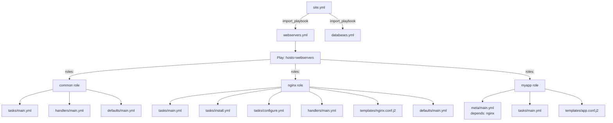
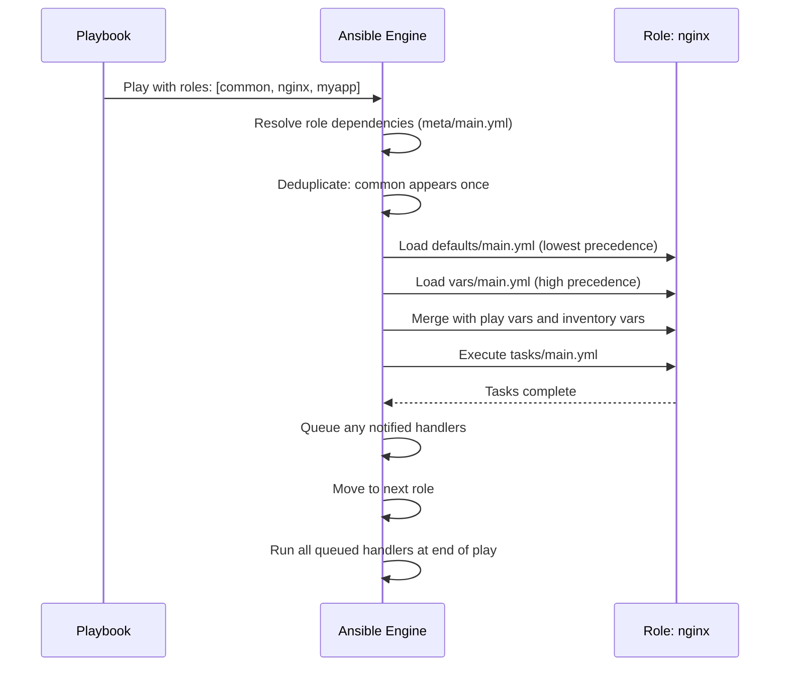

# Topic 12: Roles

> 📍 Phase 2 — Intermediate | Topic 12 of 28 | File: `12-roles.md`
> 🔗 Prev: `11-files-and-modules.md` | Next: `13-ansible-vault.md`

---

## 🧠 Concept Overview

As your Ansible codebase grows, playbooks become long and hard to reuse. You find yourself copy-pasting the same nginx setup tasks into three different playbooks. **Roles** are Ansible's answer: a structured, self-contained unit of automation that bundles tasks, handlers, variables, templates, files, and metadata together under a standardised directory convention.

A role is to Ansible what a function is to programming — it encapsulates logic once, names it, and lets you call it anywhere. Once you write a `nginx` role, every playbook that needs nginx simply says `roles: [nginx]`. Roles are also the unit of sharing — Ansible Galaxy is built around publishing and consuming roles.

---

## 📖 In-Depth Explanation

### Subtopic 12.1 — Role Directory Structure

A role is a directory with a specific layout. Ansible discovers and loads each subdirectory automatically:

```
roles/
└── nginx/
    ├── tasks/
    │   └── main.yml        ← entry point; all tasks run from here
    ├── handlers/
    │   └── main.yml        ← handlers for this role
    ├── templates/
    │   └── nginx.conf.j2   ← Jinja2 templates (auto-discovered)
    ├── files/
    │   └── ssl/            ← static files for copy module (auto-discovered)
    ├── vars/
    │   └── main.yml        ← high-precedence internal variables
    ├── defaults/
    │   └── main.yml        ← low-precedence default variables (user-facing)
    ├── meta/
    │   └── main.yml        ← role metadata, dependencies, Galaxy info
    └── README.md           ← documentation
```

Only `tasks/main.yml` is required. Every other directory is optional — Ansible loads only what exists.

---

#### What goes where

| Directory | Purpose | Precedence |
|-----------|---------|-----------|
| `tasks/` | The role's automation logic | N/A |
| `handlers/` | Handlers triggered by tasks in this role | N/A |
| `templates/` | Jinja2 templates (`.j2` files) | N/A |
| `files/` | Static files copied by `copy` module | N/A |
| `defaults/main.yml` | User-facing default variables — designed to be overridden | Lowest |
| `vars/main.yml` | Internal role constants — not for user override | High |
| `meta/main.yml` | Galaxy info, dependencies, platform support | N/A |

---

#### `tasks/main.yml` — The entry point

```yaml
# roles/nginx/tasks/main.yml
---
- name: Install nginx
  ansible.builtin.apt:
    name: nginx
    state: present
    update_cache: true
    cache_valid_time: 3600
  become: true

- name: Ensure nginx config directory exists
  ansible.builtin.file:
    path: /etc/nginx/sites-available
    state: directory
    mode: '0755'
  become: true

- name: Deploy nginx main config
  ansible.builtin.template:
    src: nginx.conf.j2    # resolved from roles/nginx/templates/ automatically
    dest: /etc/nginx/nginx.conf
    validate: nginx -t -c %s
    backup: true
  become: true
  notify: Reload nginx

- name: Ensure nginx is started and enabled
  ansible.builtin.service:
    name: nginx
    state: started
    enabled: true
  become: true
```

> 💡 In roles, the `src` of `template` and `copy` modules are resolved relative to `roles/<rolename>/templates/` and `roles/<rolename>/files/` automatically — you don't need to specify the full path.

---

#### `defaults/main.yml` — User-facing configuration

```yaml
# roles/nginx/defaults/main.yml
---
# These are overridable. Users set these in group_vars/host_vars to customise.
nginx_user: www-data
nginx_worker_processes: auto
nginx_worker_connections: 1024
nginx_keepalive_timeout: 65
nginx_server_tokens: "off"
nginx_http_port: 80
nginx_https_port: 443
nginx_log_dir: /var/log/nginx
nginx_vhosts: []           # list of vhost configs (empty by default)
nginx_extra_modules: []    # additional modules to install
```

---

#### `vars/main.yml` — Internal constants

```yaml
# roles/nginx/vars/main.yml
---
# These are NOT user-facing. Internal implementation details.
# High precedence — beats group_vars/host_vars.
_nginx_conf_path: /etc/nginx/nginx.conf
_nginx_sites_available: /etc/nginx/sites-available
_nginx_sites_enabled: /etc/nginx/sites-enabled
_nginx_pid_file: /run/nginx.pid
```

---

#### `handlers/main.yml`

```yaml
# roles/nginx/handlers/main.yml
---
- name: Reload nginx
  ansible.builtin.service:
    name: nginx
    state: reloaded

- name: Restart nginx
  ansible.builtin.service:
    name: nginx
    state: restarted

- name: Test nginx config
  ansible.builtin.command: nginx -t
  changed_when: false
  listen: nginx config changed
```

---

#### `meta/main.yml` — Role metadata and Galaxy info

```yaml
# roles/nginx/meta/main.yml
---
galaxy_info:
  role_name: nginx
  author: yourname
  description: Install and configure nginx web server
  license: MIT
  min_ansible_version: "2.14"
  platforms:
    - name: Ubuntu
      versions: [20.04, 22.04, 24.04]
    - name: EL
      versions: [8, 9]
  galaxy_tags: [web, nginx, reverse_proxy]

dependencies:
  - role: common          # runs 'common' role before this role
  - role: firewall        # runs 'firewall' role before this role
    vars:
      firewall_allowed_ports: [80, 443]
```

---

### Subtopic 12.2 — Creating Roles with `ansible-galaxy init`

`ansible-galaxy init` scaffolds the complete role directory structure instantly:

```bash
# Create a new role scaffold
ansible-galaxy init nginx

# Creates:
# nginx/
# ├── defaults/main.yml
# ├── files/
# ├── handlers/main.yml
# ├── meta/main.yml
# ├── README.md
# ├── tasks/main.yml
# ├── templates/
# ├── tests/
# │   ├── inventory
# │   └── test.yml
# └── vars/main.yml

# Create in a specific roles directory
ansible-galaxy init --init-path roles/ nginx

# Create with a collection namespace prefix
ansible-galaxy init myorg.nginx
```

---

#### Splitting tasks across multiple files

For large roles, split tasks into logical files and use `import_tasks` or `include_tasks`:

```yaml
# roles/nginx/tasks/main.yml
---
- name: Install nginx packages
  ansible.builtin.import_tasks: install.yml

- name: Configure nginx
  ansible.builtin.import_tasks: configure.yml

- name: Configure vhosts
  ansible.builtin.import_tasks: vhosts.yml

- name: Configure SSL
  ansible.builtin.import_tasks: ssl.yml
  when: nginx_ssl_enabled | default(false)
```

```yaml
# roles/nginx/tasks/install.yml
---
- name: Install nginx
  ansible.builtin.apt:
    name: "{{ ['nginx'] + nginx_extra_modules }}"
    state: present
    update_cache: true
```

---

#### Using roles in playbooks

```yaml
# Method 1: Classic `roles:` key (runs before tasks)
- name: Configure web servers
  hosts: webservers
  roles:
    - common             # role name only (uses defaults)
    - role: nginx        # explicit dict syntax
      vars:              # override defaults for this play only
        nginx_http_port: 8080
        nginx_worker_processes: 4
    - role: myapp
      tags: [app]        # tag the entire role

# Method 2: Include in tasks (dynamic)
- name: Configure web servers
  hosts: webservers
  tasks:
    - name: Apply common role
      ansible.builtin.include_role:
        name: common

    - name: Apply nginx only on Debian
      ansible.builtin.include_role:
        name: nginx
      when: ansible_os_family == "Debian"

# Method 3: Import in tasks (static)
- name: Configure web servers
  hosts: webservers
  tasks:
    - name: Import nginx role
      ansible.builtin.import_role:
        name: nginx
```

---

### Subtopic 12.3 — Role Dependencies in `meta/main.yml`

Role dependencies ensure prerequisite roles run before the current role — automatically, without the playbook needing to know about them.

```yaml
# roles/myapp/meta/main.yml
dependencies:
  - role: common           # always runs first
  - role: nginx            # nginx must be set up before myapp
    vars:
      nginx_http_port: 80  # pass specific vars to nginx role
  - role: postgresql
    when: myapp_use_db | default(true)   # conditional dependency
```

When a playbook includes `myapp`:
```yaml
roles:
  - myapp
# Ansible automatically runs: common → nginx → postgresql → myapp
```

> ⚠️ Dependencies run only once per play per host — if `nginx` is listed as a dependency of both `myapp` and `api`, it runs only once (not twice). This is idempotency at the role level.

---

### Subtopic 12.4 — `include_role` vs `import_role`

This mirrors the `include_tasks` vs `import_tasks` distinction:

| | `import_role` | `include_role` |
|--|--------------|----------------|
| When processed | Parse time (static) | Runtime (dynamic) |
| `when` on role | Applies to ALL tasks in role | Only gates the include itself |
| Tags | Tags flow into role tasks | Tags only apply to the include task |
| `--list-tasks` | Shows role tasks | Does NOT show role tasks |
| Loops | ❌ Cannot use `loop` | ✅ Can use `loop` |
| Variables | Role vars available to parent | Role vars scoped to include |
| Use case | Predictable, standard role includes | Conditional or looped role inclusion |

```yaml
# import_role: 'when' applies to EVERY task inside the role
- name: Apply nginx role (only on Debian)
  ansible.builtin.import_role:
    name: nginx
  when: ansible_os_family == "Debian"
  # Every task in nginx gets the 'when' condition applied

# include_role: 'when' only controls whether the include itself executes
- name: Apply nginx role (only on Debian)
  ansible.builtin.include_role:
    name: nginx
  when: ansible_os_family == "Debian"
  # Only the include step is gated; once included, tasks run unconditionally

# include_role with loop (import_role cannot do this)
- name: Apply config role for each environment
  ansible.builtin.include_role:
    name: "{{ item }}_config"
  loop: "{{ environments }}"
```

---

## 🏗️ Architecture & System Design

How roles fit into a real project:



---

## 🔄 Flow / Lifecycle



---

## 💻 Code Examples

### ✅ Example 1: A complete production nginx role

```
roles/nginx/
├── defaults/main.yml
├── handlers/main.yml
├── tasks/
│   ├── main.yml
│   ├── install.yml
│   ├── configure.yml
│   └── vhosts.yml
└── templates/
    ├── nginx.conf.j2
    └── vhost.conf.j2
```

```yaml
# roles/nginx/defaults/main.yml
nginx_user: www-data
nginx_worker_processes: auto
nginx_worker_connections: 1024
nginx_http_port: 80
nginx_vhosts: []
nginx_ssl_enabled: false
```

```yaml
# roles/nginx/tasks/main.yml
- ansible.builtin.import_tasks: install.yml
- ansible.builtin.import_tasks: configure.yml
- ansible.builtin.import_tasks: vhosts.yml
```

```yaml
# roles/nginx/tasks/install.yml
- name: Install nginx
  ansible.builtin.apt:
    name: nginx
    state: present
    update_cache: true
    cache_valid_time: 3600
  become: true
```

```yaml
# roles/nginx/tasks/configure.yml
- name: Deploy nginx.conf
  ansible.builtin.template:
    src: nginx.conf.j2
    dest: /etc/nginx/nginx.conf
    validate: nginx -t -c %s
    backup: true
  become: true
  notify: Reload nginx

- name: Ensure nginx is started
  ansible.builtin.service:
    name: nginx
    state: started
    enabled: true
  become: true
```

```yaml
# Playbook using the role
- name: Configure web servers
  hosts: webservers
  roles:
    - role: nginx
      vars:
        nginx_worker_processes: 4
        nginx_http_port: 8080
        nginx_vhosts:
          - { domain: example.com, root: /var/www/example }
```

### ✅ Example 2: Roles path and multi-source role discovery

```ini
# ansible.cfg
[defaults]
roles_path = ./roles:~/.ansible/roles:/etc/ansible/roles
```

Ansible searches in order: project `./roles/` first, then user home, then system. This lets you override a Galaxy role locally without modifying it.

### ✅ Example 3: Calling a role multiple times with different vars

```yaml
# include_role allows the same role to run multiple times with different params
- name: Configure multiple vhosts via nginx role
  hosts: webservers
  tasks:
    - name: Configure main vhost
      ansible.builtin.include_role:
        name: nginx_vhost
      vars:
        vhost_domain: example.com
        vhost_port: 80
        vhost_root: /var/www/example

    - name: Configure API vhost
      ansible.builtin.include_role:
        name: nginx_vhost
      vars:
        vhost_domain: api.example.com
        vhost_port: 8080
        vhost_root: /var/www/api
```

### ❌ Anti-pattern — Massive monolithic playbook instead of roles

```yaml
# ❌ 400-line playbook with all tasks inline — hard to reuse, test, or share
- name: Configure everything
  hosts: all
  tasks:
    # 50 nginx tasks...
    # 50 postgresql tasks...
    # 50 myapp tasks...
    # 50 monitoring tasks...

# ✅ Clean playbook using roles — each role is independently testable and reusable
- name: Configure web servers
  hosts: webservers
  roles:
    - common
    - nginx
    - myapp
    - monitoring
```

---

## ⚙️ Configuration & Options

### `roles_path` in `ansible.cfg`

```ini
[defaults]
roles_path = ./roles:~/.ansible/roles:/etc/ansible/roles
# Colon-separated list of directories to search for roles
```

### Role variable override precedence (within a role)

```
CLI -e extra vars       ← highest
task vars / set_fact
role vars/main.yml      ← beats group_vars
play vars:
host_vars/
group_vars/
role defaults/main.yml  ← lowest — designed to be overridden
```

### `ansible-galaxy` role commands

```bash
# Create a new role scaffold
ansible-galaxy init myrole

# Install a role from Galaxy
ansible-galaxy role install geerlingguy.nginx

# Install from a requirements file
ansible-galaxy role install -r requirements.yml

# List installed roles
ansible-galaxy role list

# Remove a role
ansible-galaxy role remove geerlingguy.nginx

# Search Galaxy
ansible-galaxy role search nginx --author geerlingguy
```

---

## 🧩 Patterns & Best Practices

**What experienced engineers do:**
- Every role has a `README.md` that documents: purpose, variables (with defaults), example playbook, and platform support
- Put all user-facing variables in `defaults/main.yml` with sensible defaults — users should be able to use the role without reading the source code
- Prefix internal vars in `vars/main.yml` with `_` (e.g. `_nginx_conf_path`) to signal they're not for users
- Test roles with Molecule (Topic 18) — every role should have a passing test suite before it's shared
- Use `ansible-lint` on all roles before committing — catches common mistakes automatically

**What beginners typically get wrong:**
- Putting user-facing config in `vars/main.yml` instead of `defaults/main.yml` — users can't easily override it
- Having no `README.md` — other engineers can't use the role without reading all the source
- Writing one giant `tasks/main.yml` with 200 tasks — split into logical files using `import_tasks`
- Not namespacing role variables — a `user` variable in two different roles collides
- Using `include_role` when `import_role` is appropriate — loses `--list-tasks` visibility and tag inheritance

**Senior-level nuance:**
- Namespace all your role's variables with the role name: `nginx_port`, `nginx_user`, `nginx_ssl_enabled` — not just `port`, `user`, `ssl`. This prevents cross-role variable collisions in plays that include many roles.
- For organisation-wide roles, consider building an Ansible Collection (Topic 26) instead of a standalone role — collections add versioning, namespacing, and private distribution via Automation Hub.

---

## 🔗 How It Connects

- **Builds on:** `11-files-and-modules.md` — roles organise exactly the modules covered in that topic into reusable units
- **Leads to:** `13-ansible-vault.md` — roles often need secrets (DB passwords, API keys); Vault integrates directly with `defaults/` and `vars/` files
- **Related concepts:** Topic 16 (import vs include — same concept applies to roles), Topic 18 (Molecule — the standard testing framework for roles), Topic 19 (Galaxy — publishing and consuming roles), Topic 26 (Collections — the evolution of roles)

---

## 🎯 Interview Questions (Conceptual)

**Q1: What is the difference between `defaults/main.yml` and `vars/main.yml` in a role?**
> **A:** `defaults/main.yml` has the lowest variable precedence — it's designed to be overridden by users via group_vars, host_vars, or play vars. It contains user-facing configuration with sensible defaults. `vars/main.yml` has high precedence — it beats group_vars and host_vars. It's for internal role implementation constants that should not be changed by users. Always put user-facing config in defaults.

**Q2: What is the execution order when a playbook uses `pre_tasks`, `roles`, and `tasks`?**
> **A:** `pre_tasks` run first, then `roles` (including their dependencies in dependency order), then `tasks`, then `post_tasks`. Handlers from all sections share a pool and run at the end of the play after `post_tasks`. This order is fixed regardless of how they appear in the playbook YAML.

**Q3: What is the difference between `import_role` and `include_role`?**
> **A:** `import_role` is static — processed at parse time. Tags and `when` conditions flow into all tasks inside the role, and tasks are visible to `--list-tasks`. `include_role` is dynamic — processed at runtime. It supports `loop` and conditional inclusion, but tags don't flow into role tasks and tasks aren't visible to `--list-tasks`. Use `import_role` for standard role inclusion and `include_role` when you need loops or truly conditional role execution.

**Q4: How do role dependencies work and what prevents a dependency from running twice?**
> **A:** Dependencies are declared in `meta/main.yml` under `dependencies:`. When Ansible processes a role, it first runs all declared dependencies in order. If multiple roles declare the same dependency, Ansible runs it only once per host per play — it deduplicates by role name and vars combination. This ensures `common` isn't applied five times just because five roles depend on it.

**Q5: How do you pass variables to a role to override its defaults?**
> **A:** Three ways, in increasing precedence: (1) Set them in `group_vars/` or `host_vars/` — they override `defaults/` automatically. (2) Pass them inline in the playbook with `role: nginx, vars: nginx_port: 8080` — these are play-level vars. (3) Pass them via `ansible-playbook -e nginx_port=8080` — extra vars always win.

---

## 🧠 Scenario-Based Interview Problems

**Scenario 1: "Your organisation has 30 engineers writing Ansible. Everyone has slightly different nginx setup tasks in their playbooks. How do you unify this?"**
> **Problem:** Duplicated, inconsistent automation across teams.
> **Approach:** Extract the canonical nginx setup into a shared `nginx` role in a central Git repo. Define clear `defaults/main.yml` variables for everything users need to customise. Write a `README.md` documenting all variables. Add Molecule tests (Topic 18) to the role. Publish it to your organisation's Private Automation Hub (or a shared Git repo as a submodule). Teams import it via `requirements.yml`. All 30 engineers now use the same tested, reviewed role — divergence eliminated.
> **Trade-offs:** Shared roles need an owner and a review process. Without governance, the shared role becomes a dumping ground of every team's edge cases. Establish a PR review process and version the role with semantic versioning — breaking changes get a major version bump with migration notes.

**Scenario 2: "You need to apply the same 'app_deploy' role to 5 different applications, each with different ports, directories, and config files, in the same play. How do you structure this?"**
> **Problem:** Single role, multiple instances with different configurations.
> **Approach:** Use `include_role` in a loop — `import_role` can't loop. Define a list variable `applications` with per-app config dicts. Loop over it: `loop: "{{ applications }}" include_role: name: app_deploy`. Inside the role, reference `{{ item.port }}`, `{{ item.dir }}`, etc. Set `loop_control: loop_var: app` to avoid collision with the role's internal loops.
> **Trade-offs:** Dynamic `include_role` with loops loses `--list-tasks` visibility and tag inheritance. For predictable production deploys where you want full `--check` support, consider generating separate plays per application instead — more verbose but fully static and auditable.

---

## ⚡ Quick Notes — Revision Card

- 📌 Role structure: `tasks/`, `handlers/`, `templates/`, `files/`, `defaults/`, `vars/`, `meta/`
- 📌 `defaults/main.yml` = lowest precedence, user-facing | `vars/main.yml` = high precedence, internal
- 📌 `ansible-galaxy init rolename` = scaffold complete role structure instantly
- 📌 `import_role` = static (parse time), tags flow in, no loops | `include_role` = dynamic (runtime), supports loops
- 📌 `meta/main.yml: dependencies:` = auto-run prerequisite roles (deduplicated per play)
- 📌 In roles, `src:` for `template`/`copy` resolves relative to `roles/<name>/templates/` and `files/` automatically
- 📌 `roles_path` in `ansible.cfg` = colon-separated search paths for role discovery
- ⚠️ Never put user-facing config in `vars/main.yml` — high precedence breaks override expectations
- ⚠️ Always namespace role variables: `nginx_port`, not `port` — prevents cross-role collisions
- ⚠️ `import_role` cannot loop — use `include_role` for looped role execution
- 💡 Split large `tasks/main.yml` into logical files using `import_tasks`
- 💡 Every role needs a `README.md` — undocumented roles get misused or duplicated
- 🔑 Test every role with Molecule before sharing — untested roles erode team trust

---

## 🔖 References & Further Reading

- 📄 [Ansible Roles — Official Docs](https://docs.ansible.com/ansible/latest/playbook_guide/playbooks_reuse_roles.html)
- 📄 [import_role vs include_role](https://docs.ansible.com/ansible/latest/collections/ansible/builtin/import_role_module.html)
- 📄 [ansible-galaxy CLI reference](https://docs.ansible.com/ansible/latest/cli/ansible-galaxy.html)
- 📝 [Role Best Practices — Ansible Docs](https://docs.ansible.com/ansible/latest/tips_tricks/ansible_tips_tricks.html)
- 🎥 [Jeff Geerling — Ansible Roles](https://www.youtube.com/watch?v=KuiAiQzEzHo)
- 📚 *Ansible for DevOps* — Jeff Geerling (Chapter 6-7)
- ➡️ Related in this course: [`11-files-and-modules.md`] · [`13-ansible-vault.md`]

---
