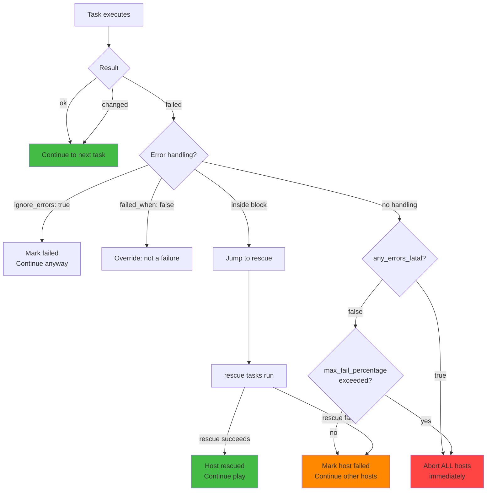
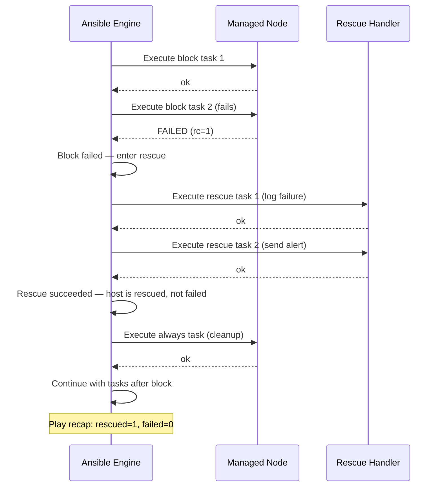

# Topic 14: Error Handling

> 📍 Phase 3 — Advanced | Topic 14 of 28 | File: `14-error-handling.md`
> 🔗 Prev: `13-ansible-vault.md` | Next: `15-tags-and-limits.md`

---

## 🧠 Concept Overview

Real infrastructure is messy. Services are flaky. Packages fail to install. APIs time out. A task that works on 49 hosts fails on the 50th. Without error handling, Ansible's default behaviour — stop everything on the first failure — leaves your infrastructure in a half-deployed state.

Ansible provides a layered error handling system: `ignore_errors` for swallowing expected failures, `failed_when` and `changed_when` for redefining what "failure" and "change" mean, and the `block`/`rescue`/`always` trio — Ansible's equivalent of try/catch/finally. Together, these tools let you write playbooks that are resilient, self-healing, and safe to run against production.

---

## 📖 In-Depth Explanation

### Subtopic 14.1 — `ignore_errors`, `failed_when`, `changed_when`

#### `ignore_errors` — Continue despite failure

`ignore_errors: true` tells Ansible to continue executing subsequent tasks even if this task fails. The task is still marked `failed` in the recap, but the play doesn't stop.

```yaml
tasks:
  - name: Stop application (may not be running — that's OK)
    ansible.builtin.service:
      name: myapp
      state: stopped
    ignore_errors: true    # Don't fail if service doesn't exist yet

  - name: Deploy new version (runs regardless of above result)
    ansible.builtin.copy:
      src: files/myapp
      dest: /usr/local/bin/myapp
      mode: '0755'
```

> ⚠️ `ignore_errors` is a blunt tool. It hides real failures alongside expected ones. Use it sparingly and only when you explicitly know a failure is expected and harmless. Prefer `failed_when` for precise control.

---

#### `failed_when` — Custom failure conditions

`failed_when` overrides Ansible's default failure detection. A task normally fails if the module returns a non-zero exit code or sets `failed: true`. With `failed_when`, you define exactly when to treat a result as failure.

```yaml
tasks:
  # Command succeeds but we want to fail based on output content
  - name: Check disk usage
    ansible.builtin.command: df -h /
    register: disk_usage
    failed_when: "'100%' in disk_usage.stdout"

  # Grep returns exit code 1 when no match found — that's OK for us
  - name: Check if process is running
    ansible.builtin.command: pgrep nginx
    register: nginx_pid
    failed_when: false    # Never fail this task (same as ignore_errors)

  # Multiple conditions with AND
  - name: Run migration script
    ansible.builtin.command: /opt/myapp/migrate.sh
    register: migration
    failed_when:
      - migration.rc != 0
      - "'already applied' not in migration.stdout"

  # Complex condition: fail only if rc != 0 AND stderr is not empty
  - name: Compile application
    ansible.builtin.command: make build
    register: build_result
    failed_when:
      - build_result.rc != 0
      - build_result.stderr | length > 0
```

---

#### `changed_when` — Custom change detection

By default, `command` and `shell` modules always report `changed` (they can't know if they changed anything). `changed_when` lets you define the actual change condition:

```yaml
tasks:
  # Read-only command — never changed
  - name: Get application version
    ansible.builtin.command: /opt/myapp/bin/myapp --version
    register: app_version
    changed_when: false    # This task never modifies state

  # Changed only if the command's output says something was updated
  - name: Apply database migrations
    ansible.builtin.command: /opt/myapp/manage.py migrate
    register: migration_result
    changed_when: "'No migrations to apply' not in migration_result.stdout"

  # Changed only if the return code indicates work was done
  - name: Sync files to S3
    ansible.builtin.command: aws s3 sync /var/www s3://my-bucket
    register: s3_sync
    changed_when: s3_sync.stdout | length > 0    # non-empty output = something synced

  # Idempotent sysctl apply
  - name: Apply sysctl settings
    ansible.builtin.command: sysctl --system
    changed_when: true    # Always report changed (we know it applied settings)
```

> 💡 `changed_when: false` is the correct way to make read-only `command`/`shell` tasks report `ok` instead of `changed`. This keeps your play recap accurate and prevents false handler triggers.

---

#### Combining `register`, `failed_when`, `changed_when`

```yaml
- name: Run idempotent script
  ansible.builtin.shell: |
    if /opt/myapp/check.sh; then
      echo "already_done"
      exit 0
    else
      /opt/myapp/setup.sh
      echo "setup_complete"
      exit 0
    fi
  register: script_result
  failed_when: script_result.rc != 0
  changed_when: "'setup_complete' in script_result.stdout"
  # Reports ok if already done, changed if setup ran, fails only on non-zero exit
```

---

### Subtopic 14.2 — `block`, `rescue`, `always` — Try/Catch for Ansible

`block`/`rescue`/`always` is Ansible's structured error handling — equivalent to `try`/`catch`/`finally` in programming languages.

#### Basic structure

```yaml
tasks:
  - block:
      # Tasks in block run normally
      - name: Install application
        ansible.builtin.apt:
          name: myapp
          state: present

      - name: Start application
        ansible.builtin.service:
          name: myapp
          state: started

    rescue:
      # Tasks in rescue run ONLY IF a task in block fails
      - name: Log the failure
        ansible.builtin.debug:
          msg: "Application installation failed on {{ inventory_hostname }}"

      - name: Send alert
        ansible.builtin.uri:
          url: https://hooks.slack.com/services/xxx
          method: POST
          body_format: json
          body:
            text: "ALERT: myapp failed to install on {{ inventory_hostname }}"

    always:
      # Tasks in always run REGARDLESS of success or failure
      - name: Clean up temp files
        ansible.builtin.file:
          path: /tmp/myapp-install/
          state: absent

      - name: Record deploy attempt in log
        ansible.builtin.lineinfile:
          path: /var/log/ansible-deploys.log
          line: "{{ ansible_date_time.iso8601 }} deploy attempt on {{ inventory_hostname }}"
          create: true
```

---

#### How block/rescue/always interacts with failure

```
block runs → task fails
  ↓
rescue runs → if rescue succeeds:
  • host is no longer considered "failed"
  • play continues with remaining tasks after the block
  • play recap shows: rescued=1 (not failed=1)
  ↓
always runs regardless
```

> 💡 If `rescue` succeeds, the host is "rescued" — it doesn't count as a failed host. This is different from `ignore_errors`, which still marks the task as failed. A rescued host can continue with subsequent plays.

---

#### Nested blocks

Blocks can be nested for granular error handling:

```yaml
tasks:
  - block:
      - name: Prepare environment
        ansible.builtin.include_tasks: prepare.yml

      - block:
          - name: Deploy application
            ansible.builtin.include_tasks: deploy.yml

          - name: Run smoke tests
            ansible.builtin.include_tasks: smoke_test.yml

        rescue:
          - name: Rollback deployment
            ansible.builtin.include_tasks: rollback.yml

    rescue:
      - name: Fatal failure — full environment cleanup
        ansible.builtin.include_tasks: full_cleanup.yml

    always:
      - name: Send notification regardless
        ansible.builtin.include_tasks: notify.yml
```

---

#### Block-level `when`, `become`, `tags`

Block-level keywords apply to all tasks in the block — reducing repetition:

```yaml
tasks:
  - block:
      - name: Install nginx
        ansible.builtin.apt:
          name: nginx
          state: present

      - name: Configure nginx
        ansible.builtin.template:
          src: nginx.conf.j2
          dest: /etc/nginx/nginx.conf

      - name: Start nginx
        ansible.builtin.service:
          name: nginx
          state: started

    become: true        # applies to ALL tasks in block
    when: ansible_os_family == "Debian"    # applies to ALL tasks in block
    tags: [nginx]       # applies to ALL tasks in block

    rescue:
      - name: Handle nginx failure
        ansible.builtin.debug:
          msg: "nginx setup failed"
```

---

### Subtopic 14.3 — `any_errors_fatal` and `max_fail_percentage`

These play-level settings control what happens when hosts fail in a multi-host play.

#### Default behaviour — hosts fail independently

By default, if web1 fails a task, Ansible continues running on web2, web3, etc. Only web1 is marked failed.

```
web1: Task 3 FAILS → web1 skips remaining tasks
web2: Task 3 OK → web2 continues to Task 4, 5, 6...
web3: Task 3 OK → web3 continues to Task 4, 5, 6...
```

---

#### `any_errors_fatal: true` — Stop all hosts on first failure

```yaml
- name: Deploy application
  hosts: webservers
  any_errors_fatal: true    # if ANY host fails, abort ALL hosts immediately

  tasks:
    - name: Deploy new binary
      ansible.builtin.copy:
        src: files/myapp
        dest: /usr/local/bin/myapp
      # If this fails on web1, web2 and web3 immediately stop too
```

Use when: a partial deployment is worse than no deployment (database migrations, leader-election services, clustered applications).

---

#### `max_fail_percentage` — Percentage-based abort

```yaml
- name: Deploy to large fleet
  hosts: webservers    # 100 hosts
  max_fail_percentage: 10    # abort if more than 10% of hosts fail

  tasks:
    - name: Deploy application
      ansible.builtin.copy:
        src: files/myapp
        dest: /usr/local/bin/myapp
    # If 11+ hosts fail, entire play aborts
    # If ≤10 hosts fail, play continues
```

Use with `serial` for rolling deploys with a failure threshold:
```yaml
serial: "25%"               # process 25 hosts at a time
max_fail_percentage: 5      # abort if >5% of the batch fails
```

---

#### `run_once` — Execute on exactly one host

```yaml
tasks:
  - name: Run database migration (only once, not per host)
    ansible.builtin.command: /opt/myapp/manage.py migrate
    run_once: true    # runs on the first host in the group only
    delegate_to: "{{ groups['appservers'][0] }}"
```

---

#### `delegate_to` — Run a task on a different host

```yaml
tasks:
  - name: Remove host from load balancer before deploying
    ansible.builtin.uri:
      url: "http://lb.internal/api/servers/{{ inventory_hostname }}/disable"
      method: POST
    delegate_to: localhost    # run this on the control node, not the managed host

  - name: Deploy application
    ansible.builtin.copy:
      src: files/myapp
      dest: /usr/local/bin/myapp

  - name: Re-add host to load balancer after deploy
    ansible.builtin.uri:
      url: "http://lb.internal/api/servers/{{ inventory_hostname }}/enable"
      method: POST
    delegate_to: localhost
```

---

## 🏗️ Architecture & System Design

Error propagation and handling flow:



---

## 🔄 Flow / Lifecycle



---

## 💻 Code Examples

### ✅ Example 1: Deployment with rollback on failure

```yaml
- name: Deploy application with automatic rollback
  hosts: appservers
  become: true
  serial: 1

  vars:
    deploy_version: "2.1.0"
    deploy_dir: "/opt/myapp/releases/{{ deploy_version }}"
    current_link: /opt/myapp/current

  tasks:
    - name: Record current version before deploy
      ansible.builtin.command: readlink {{ current_link }}
      register: previous_version
      changed_when: false
      ignore_errors: true

    - block:
        - name: Create release directory
          ansible.builtin.file:
            path: "{{ deploy_dir }}"
            state: directory
            mode: '0755'

        - name: Deploy application files
          ansible.builtin.copy:
            src: "files/releases/{{ deploy_version }}/"
            dest: "{{ deploy_dir }}/"
            mode: preserve

        - name: Run database migrations
          ansible.builtin.command: "{{ deploy_dir }}/manage.py migrate"
          run_once: true
          register: migrate_result
          changed_when: "'No migrations to apply' not in migrate_result.stdout"

        - name: Switch current symlink to new release
          ansible.builtin.file:
            src: "{{ deploy_dir }}"
            dest: "{{ current_link }}"
            state: link
            force: true

        - name: Restart application
          ansible.builtin.service:
            name: myapp
            state: restarted

        - name: Smoke test — wait for healthy response
          ansible.builtin.uri:
            url: http://localhost:8080/health
            status_code: 200
          retries: 10
          delay: 3
          register: health
          until: health.status == 200

      rescue:
        - name: Rollback symlink to previous release
          ansible.builtin.file:
            src: "{{ previous_version.stdout }}"
            dest: "{{ current_link }}"
            state: link
            force: true
          when: previous_version.stdout is defined

        - name: Restart application on previous version
          ansible.builtin.service:
            name: myapp
            state: restarted

        - name: Alert on rollback
          ansible.builtin.debug:
            msg: "ROLLBACK: Deployment of {{ deploy_version }} failed on {{ inventory_hostname }}"

        - name: Fail the play after rollback
          ansible.builtin.fail:
            msg: "Deploy failed and rolled back on {{ inventory_hostname }}"

      always:
        - name: Log deploy attempt
          ansible.builtin.lineinfile:
            path: /var/log/deploys.log
            line: "{{ ansible_date_time.iso8601 }} {{ deploy_version }} on {{ inventory_hostname }}"
            create: true
```

### ✅ Example 2: `changed_when` + `failed_when` for complex scripts

```yaml
tasks:
  - name: Check SSL certificate expiry
    ansible.builtin.command: >
      openssl x509 -enddate -noout -in /etc/ssl/certs/myapp.crt
    register: cert_check
    changed_when: false    # Read-only check

  - name: Parse days until expiry
    ansible.builtin.set_fact:
      cert_expiry_date: "{{ cert_check.stdout | regex_replace('notAfter=', '') }}"

  - name: Renew certificate if expiring within 30 days
    ansible.builtin.command: certbot renew --cert-name myapp
    register: certbot_result
    changed_when: "'Certificate not yet due for renewal' not in certbot_result.stdout"
    failed_when: certbot_result.rc != 0

  - name: Validate new certificate after renewal
    ansible.builtin.command: nginx -t
    changed_when: false
    failed_when: "'syntax is ok' not in cert_validate.stderr"
    register: cert_validate
```

### ✅ Example 3: `max_fail_percentage` rolling deploy

```yaml
- name: Rolling deploy with failure threshold
  hosts: webservers    # 50 hosts
  become: true
  serial: 5            # process 5 at a time
  max_fail_percentage: 20    # abort if >20% of current batch fails (>1 of 5)
  any_errors_fatal: false

  tasks:
    - name: Pull latest docker image
      community.docker.docker_image:
        name: myapp:latest
        source: pull
      register: image_pull
      failed_when: image_pull.failed

    - name: Restart container with new image
      community.docker.docker_container:
        name: myapp
        image: myapp:latest
        state: started
        restart: true

    - name: Health check
      ansible.builtin.uri:
        url: http://localhost:8080/health
        status_code: 200
      retries: 5
      delay: 5
      until: result.status == 200
      register: result
```

### ❌ Anti-pattern — Overusing `ignore_errors`

```yaml
# ❌ Ignoring all errors — hides real problems
tasks:
  - name: Do important thing
    ansible.builtin.command: /opt/setup.sh
    ignore_errors: true    # What if this actually fails critically?

  - name: Do next important thing (may silently depend on above)
    ansible.builtin.command: /opt/configure.sh
    ignore_errors: true

# ✅ Be precise — only rescue specific expected conditions
tasks:
  - block:
      - name: Do important thing
        ansible.builtin.command: /opt/setup.sh

      - name: Do next important thing
        ansible.builtin.command: /opt/configure.sh

    rescue:
      - name: Handle setup failure specifically
        ansible.builtin.debug:
          msg: "Setup failed: {{ ansible_failed_result }}"
      - ansible.builtin.fail:
          msg: "Critical setup failed — aborting"
```

---

## ⚙️ Configuration & Options

### Error handling keywords reference

| Keyword | Scope | Description |
|---------|-------|-------------|
| `ignore_errors` | task | Continue play even if task fails |
| `failed_when` | task | Custom failure condition expression |
| `changed_when` | task | Custom changed condition expression |
| `block` | task group | Group tasks for error handling |
| `rescue` | block | Tasks to run if block fails |
| `always` | block | Tasks to run regardless of block outcome |
| `any_errors_fatal` | play | Abort all hosts on first failure |
| `max_fail_percentage` | play | Abort if failure rate exceeds threshold |
| `run_once` | task | Execute on exactly one host |
| `delegate_to` | task | Execute on a different host |

### Special variables in `rescue` blocks

```yaml
rescue:
  - name: Show what failed
    ansible.builtin.debug:
      var: ansible_failed_result    # the full result dict of the failed task

  - name: Show which task failed
    ansible.builtin.debug:
      var: ansible_failed_task      # the task name and args that failed
```

---

## 🧩 Patterns & Best Practices

**What experienced engineers do:**
- Use `block/rescue/always` for deployment tasks — always have a rollback path
- Always add `changed_when: false` to read-only `command`/`shell` tasks — keeps play recap accurate and prevents spurious handler triggers
- Use `any_errors_fatal: true` for cluster operations (leader elections, quorum changes) where partial state is dangerous
- In `rescue`, re-raise the failure with `ansible.builtin.fail` after cleanup — don't silently swallow critical failures
- Use `delegate_to: localhost` for LB drain/restore operations around rolling deploys

**What beginners typically get wrong:**
- Using `ignore_errors: true` everywhere as a lazy alternative to proper error handling — hides real bugs
- Forgetting `changed_when: false` on verification tasks — every `nginx -t` then triggers a handler reload
- Not using `run_once` for database migrations — runs the migration on every app server simultaneously
- Expecting `rescue` to run when `ignore_errors: true` is set — `ignore_errors` prevents the failure from being raised, so `rescue` never triggers

**Senior-level nuance:**
- `ansible_failed_result` in the `rescue` block contains the full JSON output of the failed task. Use it to make rescue logic conditional — different rescue actions for different failure modes (network timeout vs permission denied vs file not found).
- For very large fleets, combine `serial`, `max_fail_percentage`, and `any_errors_fatal` deliberately: start with `serial: 1` for the first deploy, then `serial: "10%"` with `max_fail_percentage: 5` once you're confident. This gives you canary + automatic abort in one play configuration.

---

## 🔗 How It Connects

- **Builds on:** `13-ansible-vault.md` — vault decryption failures need graceful handling via `rescue`
- **Leads to:** `15-tags-and-limits.md` — after mastering resilience, we look at targeted execution
- **Related concepts:** Topic 5 (`any_errors_fatal` and `serial` — introduced in playbook basics), Topic 20 (`async`/`poll` — error handling for long-running tasks), Topic 21 (AWX — rescued vs failed display in job output)

---

## 🎯 Interview Questions (Conceptual)

**Q1: What is the difference between `ignore_errors` and `failed_when: false`?**
> **A:** Both cause the play to continue past a failing task, but `ignore_errors: true` still marks the task as `failed` in the recap and doesn't affect `block/rescue` flow. `failed_when: false` tells Ansible the task can never fail — it's always treated as `ok`. Use `failed_when: false` when the task is genuinely non-failing by definition; use `ignore_errors` only when a specific task might fail and you want to continue but still want it flagged.

**Q2: What happens to a host's status after a successful `rescue` block?**
> **A:** The host is "rescued" — its status changes from failed to rescued, and the play continues with subsequent tasks. In the play recap it shows `rescued=1` not `failed=1`. This is a key distinction from `ignore_errors` — a rescued host can participate in subsequent plays in the same playbook, whereas a truly-failed host is excluded.

**Q3: When would you use `any_errors_fatal: true` vs `max_fail_percentage`?**
> **A:** Use `any_errors_fatal: true` for zero-tolerance scenarios where any failure must halt everything — cluster operations, quorum-sensitive systems, database schema migrations that can't be partially applied. Use `max_fail_percentage` for fleet operations where some failure rate is acceptable — rolling deploys where you're OK with 5% of hosts failing but want to abort if it's more widespread.

**Q4: What does `changed_when: false` do and why is it important?**
> **A:** It tells Ansible the task never changes state, so it always reports `ok` instead of `changed`. This matters for two reasons: accuracy (play recap correctly reflects what was modified) and handler triggering (handlers only run on `changed`, so a read-only verification task with `changed_when: false` won't accidentally trigger a service reload).

**Q5: What is `delegate_to` and give a real use case?**
> **A:** `delegate_to` runs a specific task on a different host than the one being iterated. The most common use case is LB management during rolling deploys — while Ansible is operating on `web1`, it delegates a call to the load balancer API (`delegate_to: localhost`) to drain `web1`'s traffic before deploying to it, then re-adds it after.

---

## 🧠 Scenario-Based Interview Problems

**Scenario 1: "You're deploying to 200 web servers. After the deploy, 15 hosts fail the health check. What do you want Ansible to do?"**
> **Problem:** Partial fleet failure — tolerable or abort?
> **Approach:** Use `max_fail_percentage: 10` — 15/200 = 7.5%, which is under 10%, so the deploy continues. If the failure rate climbs above 10%, Ansible aborts the remaining hosts, limiting blast radius. Pair with `serial: "25%"` so you process 50 at a time — a problem in batch 1 aborts batches 2-4 before they're touched. Add a `rescue` block that rolls back the 15 failed hosts to the previous symlink automatically.
> **Trade-offs:** Choosing the right `max_fail_percentage` requires knowing your SLA. A 7.5% failure rate might be completely unacceptable for a payment processor but fine for an internal tool. Set it lower and tune upward over time as you gain confidence in your deploy process.

**Scenario 2: "A command module task runs a shell script that always returns exit code 0 but prints 'ERROR:' to stdout when it fails internally. How do you make Ansible detect the real failure?"**
> **Problem:** Exit code doesn't reliably indicate failure — must parse stdout.
> **Approach:** Use `register` + `failed_when`: `register: script_result` and `failed_when: "'ERROR:' in script_result.stdout"`. This tells Ansible to examine the output rather than trusting the exit code. Also add `changed_when: "'CHANGED' in script_result.stdout"` if the script signals changes via output. For the longer term, fix the script to use proper exit codes — exit code 0 meaning success is a Unix convention for good reason.
> **Trade-offs:** Parsing stdout for failure signals is fragile — it breaks if the script's output format changes. Document the coupling and add a test case for it in your Molecule tests.

---

## ⚡ Quick Notes — Revision Card

- 📌 `ignore_errors: true` = continue past failure, task still marked failed
- 📌 `failed_when: expr` = custom failure condition | `failed_when: false` = never fails
- 📌 `changed_when: false` = always reports ok (for read-only command tasks)
- 📌 `block` / `rescue` / `always` = try / catch / finally for Ansible
- 📌 Successful `rescue` → host status = `rescued` (not `failed`) → play continues
- 📌 `any_errors_fatal: true` = abort ALL hosts on first failure
- 📌 `max_fail_percentage: N` = abort if more than N% of hosts fail
- 📌 `ansible_failed_result` in rescue = full dict of the failed task's output
- 📌 `run_once: true` = execute on exactly one host in the group
- 📌 `delegate_to: localhost` = run task on control node (e.g. LB API calls)
- ⚠️ `ignore_errors` doesn't trigger `rescue` — they are independent mechanisms
- ⚠️ Always `changed_when: false` on read-only command/shell tasks — prevents false handler triggers
- 💡 In `rescue`, re-raise with `ansible.builtin.fail` after cleanup — don't silently swallow critical failures
- 🔑 `block/rescue/always` + rollback tasks = the gold standard deploy pattern for production

---

## 🔖 References & Further Reading

- 📄 [Error Handling — Official Docs](https://docs.ansible.com/ansible/latest/playbook_guide/playbooks_error_handling.html)
- 📄 [Blocks — Official Docs](https://docs.ansible.com/ansible/latest/playbook_guide/playbooks_blocks.html)
- 📄 [any_errors_fatal and max_fail_percentage](https://docs.ansible.com/ansible/latest/playbook_guide/playbooks_strategies.html)
- 🎥 [Jeff Geerling — Ansible Error Handling](https://www.youtube.com/watch?v=Jv4LFcNWHFE)
- 📚 *Ansible for DevOps* — Jeff Geerling (Chapter 8)
- ➡️ Related in this course: [`13-ansible-vault.md`] · [`15-tags-and-limits.md`]

---
