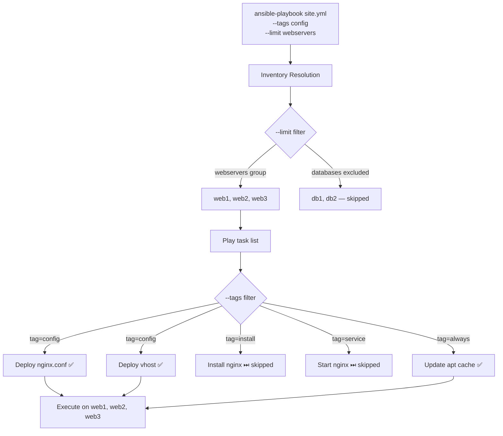
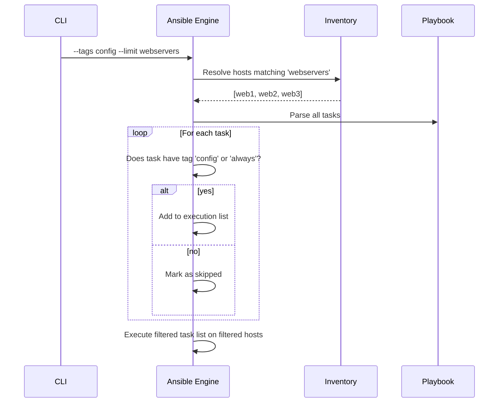

# Topic 15: Tags & Limits

> 📍 Phase 3 — Advanced | Topic 15 of 28 | File: `15-tags-and-limits.md`
> 🔗 Prev: `14-error-handling.md` | Next: `16-includes-and-imports.md`

---

## 🧠 Concept Overview

As playbooks grow, you need precision — the ability to run a specific subset of tasks without executing the entire play. **Tags** are labels attached to tasks, plays, or roles that let you selectively run or skip groups of tasks by name. **Limits** restrict which hosts from the inventory are targeted.

Together, tags and limits turn a full-stack playbook into a surgical tool. Instead of a 15-minute full deploy, you run only the config update tasks on only the web servers. Instead of re-running everything after a change, you run `--tags config --limit web1` to test on one host first.

These aren't just convenience features — they're essential for safe production operations.

---

## 📖 In-Depth Explanation

### Subtopic 15.1 — Assigning Tags

Tags can be assigned at the task, block, play, role, or include level.

#### Task-level tags

```yaml
tasks:
  - name: Install nginx
    ansible.builtin.apt:
      name: nginx
      state: present
    tags:
      - install
      - nginx

  - name: Deploy nginx config
    ansible.builtin.template:
      src: nginx.conf.j2
      dest: /etc/nginx/nginx.conf
    tags:
      - config
      - nginx

  - name: Start nginx
    ansible.builtin.service:
      name: nginx
      state: started
      enabled: true
    tags:
      - service
      - nginx

  - name: Deploy application
    ansible.builtin.copy:
      src: files/myapp
      dest: /usr/local/bin/myapp
    tags:
      - deploy
      - app
```

Tags can be a list (multiple tags per task) or a single string:
```yaml
tags: nginx              # single tag
tags: [nginx, install]   # multiple tags (list syntax)
tags:                    # multiple tags (block syntax)
  - nginx
  - install
```

---

#### Block-level tags

Tags on a `block` apply to all tasks inside the block:

```yaml
tasks:
  - block:
      - name: Install nginx
        ansible.builtin.apt:
          name: nginx
          state: present

      - name: Configure nginx
        ansible.builtin.template:
          src: nginx.conf.j2
          dest: /etc/nginx/nginx.conf

      - name: Start nginx
        ansible.builtin.service:
          name: nginx
          state: started

    tags: [nginx]    # all three tasks get the 'nginx' tag
```

---

#### Play-level tags

```yaml
- name: Configure web servers
  hosts: webservers
  tags: [webservers, production]    # applies to ALL tasks in this play

  tasks:
    - name: Install packages
      ansible.builtin.apt:
        name: nginx
        state: present
      tags: [install]    # this task gets: webservers, production, install
```

---

#### Role-level tags

```yaml
- name: Full stack deploy
  hosts: all
  roles:
    - role: common
      tags: [common, base]

    - role: nginx
      tags: [nginx, web]

    - role: myapp
      tags: [app, deploy]
```

> ⚠️ With `import_role`, tags flow into every task inside the role. With `include_role`, tags only apply to the include step itself — tasks inside the role don't inherit them. This is the key operational difference (covered in Topic 16).

---

#### Special built-in tags

Ansible has two special tags that are always available:

| Tag | Behaviour |
|-----|-----------|
| `always` | Task runs even when using `--tags` to select other tags |
| `never` | Task only runs when explicitly called with `--tags never` |

```yaml
tasks:
  - name: Gather facts (always run this even with --tags)
    ansible.builtin.setup:
    tags: [always]    # runs with ANY --tags filter

  - name: Debug task (only run when explicitly requested)
    ansible.builtin.debug:
      msg: "Debug mode enabled"
    tags: [never, debug]    # only runs with --tags debug

  - name: Dangerous operation (must be explicitly tagged)
    ansible.builtin.command: /opt/reset-everything.sh
    tags: [never, reset]    # only runs with --tags reset
```

---

### Subtopic 15.2 — `--tags`, `--skip-tags`, `--limit`, `--start-at-task`

#### `--tags` — Run only tasks with specified tags

```bash
# Run only tasks tagged 'nginx'
ansible-playbook site.yml --tags nginx

# Run tasks tagged 'config' OR 'install' (union)
ansible-playbook site.yml --tags "config,install"

# Run tasks tagged BOTH 'nginx' AND 'config' (no native AND — use task design)
ansible-playbook site.yml --tags nginx    # then ensure only config tasks have nginx

# Run the special 'never' tag tasks
ansible-playbook site.yml --tags debug
ansible-playbook site.yml --tags reset   # dangerous — requires explicit intent

# Preview which tasks would run (without executing)
ansible-playbook site.yml --tags nginx --list-tasks
```

---

#### `--skip-tags` — Skip tasks with specified tags

```bash
# Run everything EXCEPT 'install' tasks
ansible-playbook site.yml --skip-tags install

# Skip multiple tags
ansible-playbook site.yml --skip-tags "install,service"

# Skip install on a re-deploy (packages already present)
ansible-playbook site.yml --skip-tags install --tags config,deploy
```

---

#### `--limit` — Restrict which hosts are targeted

```bash
# Run only on web1
ansible-playbook site.yml --limit web1.example.com

# Run only on webservers group
ansible-playbook site.yml --limit webservers

# Run on multiple groups (union)
ansible-playbook site.yml --limit "webservers:databases"

# Run on intersection
ansible-playbook site.yml --limit "webservers:&staging"

# Exclude a host
ansible-playbook site.yml --limit "webservers:!web3"

# Use a file as a limit (one host per line)
ansible-playbook site.yml --limit @failed_hosts.txt
# The @ prefix reads the file as a host pattern list

# Combine tags and limits for surgical precision
ansible-playbook site.yml --tags config --limit web1
```

---

#### `--start-at-task` — Resume from a specific task

```bash
# Start execution from a named task (skip all tasks before it)
ansible-playbook site.yml --start-at-task "Deploy nginx config"

# Combine with --limit for targeted resume
ansible-playbook site.yml \
  --start-at-task "Run smoke tests" \
  --limit web1

# Note: fact gathering (setup) is skipped if start-at-task skips it
# Use with care — variables may not be populated if you skip early tasks
```

> ⚠️ `--start-at-task` uses the task name string — it's fragile if task names change. For resumable playbooks, prefer `tags` + `--tags` over `--start-at-task`.

---

#### `--list-tasks` and `--list-hosts` — Preview before running

```bash
# List all tasks that would run (no execution)
ansible-playbook site.yml --list-tasks

# List all tasks that would run with a specific tag filter
ansible-playbook site.yml --tags nginx --list-tasks

# List which hosts would be targeted
ansible-playbook site.yml --list-hosts
ansible-playbook site.yml --limit webservers --list-hosts

# List all tags defined in the playbook
ansible-playbook site.yml --list-tags
```

---

### Subtopic 15.3 — Tag Strategy for Large Playbooks

A consistent tag strategy across your whole codebase makes `--tags` useful in practice. Without a strategy, every team names tags differently and they become useless.

#### A recommended tag taxonomy

```
Category     Examples
─────────────────────────────────
By function: install, config, service, deploy, verify, cleanup
By component: nginx, postgresql, myapp, monitoring, firewall
By urgency:  always, hotfix, rollback
By risk:     never, destructive, reset
By env:      staging, production (use sparingly — prefer inventory groups)
```

#### Example well-tagged playbook

```yaml
- name: Configure web server
  hosts: webservers
  become: true

  tasks:
    - name: Update apt cache
      ansible.builtin.apt:
        update_cache: true
        cache_valid_time: 3600
      tags: [always]              # always run (even with --tags)

    - name: Install nginx
      ansible.builtin.apt:
        name: nginx
        state: present
      tags: [install, nginx]

    - name: Deploy nginx.conf
      ansible.builtin.template:
        src: nginx.conf.j2
        dest: /etc/nginx/nginx.conf
        validate: nginx -t -c %s
      notify: Reload nginx
      tags: [config, nginx]

    - name: Deploy vhost config
      ansible.builtin.template:
        src: vhost.conf.j2
        dest: "/etc/nginx/sites-available/{{ server_name }}"
      notify: Reload nginx
      tags: [config, nginx, vhost]

    - name: Enable vhost
      ansible.builtin.file:
        src: "/etc/nginx/sites-available/{{ server_name }}"
        dest: "/etc/nginx/sites-enabled/{{ server_name }}"
        state: link
      tags: [config, nginx, vhost]

    - name: Ensure nginx is started
      ansible.builtin.service:
        name: nginx
        state: started
        enabled: true
      tags: [service, nginx]

    - name: Deploy application binary
      ansible.builtin.copy:
        src: files/myapp
        dest: /usr/local/bin/myapp
        mode: '0755'
      tags: [deploy, app]

    - name: Restart application
      ansible.builtin.service:
        name: myapp
        state: restarted
      tags: [deploy, service, app]

    - name: Run smoke tests
      ansible.builtin.uri:
        url: http://localhost/health
        status_code: 200
      tags: [verify, smoke]
```

Now you can run targeted operations:
```bash
# Update only nginx config (no package install, no deploy)
ansible-playbook site.yml --tags config --limit webservers

# Deploy only the application binary (skip nginx entirely)
ansible-playbook site.yml --tags app

# Run everything except verification
ansible-playbook site.yml --skip-tags verify

# Full deploy on one host first
ansible-playbook site.yml --limit web1

# Verify all hosts without re-deploying
ansible-playbook site.yml --tags verify
```

---

#### Tags in role-based projects

When using roles, apply functional tags at the role-include level, not inside every task:

```yaml
# site.yml
- name: Configure web servers
  hosts: webservers
  roles:
    - role: common
      tags: [common]

    - role: nginx
      tags: [nginx, web]

    - role: myapp
      tags: [app, deploy]

    - role: monitoring
      tags: [monitoring, always]
```

```bash
# Now you can target entire roles by tag:
ansible-playbook site.yml --tags nginx    # runs only the nginx role
ansible-playbook site.yml --tags deploy   # runs only myapp role
ansible-playbook site.yml --skip-tags monitoring  # skip monitoring setup
```

---

## 🏗️ Architecture & System Design

How tags and limits filter execution:



---

## 🔄 Flow / Lifecycle



---

## 💻 Code Examples

### ✅ Example 1: Emergency config push workflow

```bash
# Scenario: nginx config needs urgent update across 50 web servers

# Step 1: Preview what would change
ansible-playbook site.yml --tags config --limit webservers --check --diff

# Step 2: Apply to one host first
ansible-playbook site.yml --tags config --limit web1

# Step 3: Verify it worked
ansible-playbook site.yml --tags verify --limit web1

# Step 4: Roll out to all
ansible-playbook site.yml --tags config --limit webservers
```

### ✅ Example 2: Using `--limit` with the retry file

```bash
# First run — some hosts fail
ansible-playbook site.yml
# Creates: site.retry (list of failed hosts)

# Retry only the failed hosts
ansible-playbook site.yml --limit @site.retry

# Or combine: retry failed hosts but only config tasks
ansible-playbook site.yml --limit @site.retry --tags config
```

### ✅ Example 3: The `never` tag for dangerous operations

```yaml
tasks:
  - name: Wipe all application data (DESTRUCTIVE)
    ansible.builtin.file:
      path: /opt/myapp/data/
      state: absent
    tags: [never, wipe_data]    # requires explicit --tags wipe_data

  - name: Reset database to factory defaults (DESTRUCTIVE)
    ansible.builtin.command: /opt/myapp/reset-db.sh
    tags: [never, factory_reset]

  - name: Normal deploy task
    ansible.builtin.copy:
      src: files/myapp
      dest: /usr/local/bin/myapp
    tags: [deploy]
```

```bash
# Normal run — destructive tasks never execute
ansible-playbook site.yml --tags deploy

# Intentional data wipe (requires explicit opt-in)
ansible-playbook site.yml --tags wipe_data

# You can't accidentally run it with --tags deploy
```

### ✅ Example 4: Listing everything before running

```bash
# Full preview workflow before any production change:

# 1. Which hosts?
ansible-playbook site.yml --limit webservers --list-hosts

# 2. Which tasks?
ansible-playbook site.yml --tags config --list-tasks

# 3. Dry run with diff
ansible-playbook site.yml --tags config --limit webservers --check --diff

# 4. For real
ansible-playbook site.yml --tags config --limit webservers
```

### ❌ Anti-pattern — No tag strategy (all or nothing)

```yaml
# ❌ No tags — must run the entire 20-minute playbook for any change
tasks:
  - name: Install packages
    ansible.builtin.apt:
      name: nginx
      state: present

  - name: Deploy config
    ansible.builtin.template:
      src: nginx.conf.j2
      dest: /etc/nginx/nginx.conf

  - name: Deploy application
    ansible.builtin.copy:
      src: files/myapp
      dest: /usr/local/bin/myapp

# ✅ Tags added — surgical execution now possible
tasks:
  - name: Install packages
    ansible.builtin.apt:
      name: nginx
      state: present
    tags: [install, nginx]

  - name: Deploy config
    ansible.builtin.template:
      src: nginx.conf.j2
      dest: /etc/nginx/nginx.conf
    tags: [config, nginx]

  - name: Deploy application
    ansible.builtin.copy:
      src: files/myapp
      dest: /usr/local/bin/myapp
    tags: [deploy, app]
```

---

## ⚙️ Configuration & Options

### CLI flag reference

| Flag | Short | Example | Description |
|------|-------|---------|-------------|
| `--tags` | `-t` | `--tags nginx,config` | Run tasks with these tags |
| `--skip-tags` | | `--skip-tags install` | Skip tasks with these tags |
| `--limit` | `-l` | `--limit webservers` | Restrict to these hosts/groups |
| `--list-tasks` | | | Preview tasks (no execution) |
| `--list-hosts` | | | Preview targeted hosts |
| `--list-tags` | | | List all tags in playbook |
| `--start-at-task` | | `--start-at-task "Deploy config"` | Skip tasks before this one |

### `--limit` pattern syntax (mirrors inventory patterns)

```bash
--limit web1                    # single host
--limit webservers              # group
--limit "webservers:databases"  # union (both groups)
--limit "webservers:&staging"   # intersection
--limit "webservers:!web3"      # exclude a host
--limit @failed.retry           # hosts from a file
```

---

## 🧩 Patterns & Best Practices

**What experienced engineers do:**
- Establish a team-wide tag taxonomy before writing your first playbook — retrofitting tags onto existing plays is painful
- Always tag `setup`/fact-gathering tasks with `always` so they run regardless of other tag filters — playbooks break silently when facts aren't gathered
- Use the `never` tag as a safety guard for any task that deletes data, resets state, or is otherwise destructive
- Add `--list-tasks` and `--list-hosts` to your deploy runbook — make it standard practice before every prod run
- Tag roles at the include level in `site.yml` rather than inside every task — cleaner separation of concerns

**What beginners typically get wrong:**
- Forgetting to tag fact-gathering tasks with `always` — then `--tags config` runs without facts and fails on every `ansible_os_family` reference
- Using `--tags` and being surprised that `always`-tagged tasks still run — that's by design
- Over-tagging: every task has 5 tags, none of them meaningful — creates confusion, not clarity
- Under-tagging: no tags at all — forces full playbook runs for every change
- Not documenting the tag taxonomy — new team members invent new tag names instead of using existing ones

**Senior-level nuance:**
- Tags are the interface between your playbook and your operators. Design them for the operations people actually perform: `--tags hotfix`, `--tags rollback`, `--tags verify`, `--tags ssl-renew`. The tag name should describe the operation, not the implementation.
- In large teams, enforce tag standards via `ansible-lint` custom rules — a linting rule that fails if a task has no tags prevents the "untaged playbook" anti-pattern from spreading.

---

## 🔗 How It Connects

- **Builds on:** `14-error-handling.md` — after a partial failure, `--limit @site.retry --tags deploy` re-runs only the failed tasks on only the failed hosts
- **Leads to:** `16-includes-and-imports.md` — import vs include affects whether tags flow into included tasks
- **Related concepts:** Topic 5 (playbook basics — `--check` and `--diff` combine with tags for safe preview), Topic 21 (AWX — job templates can enforce tag and limit constraints)

---

## 🎯 Interview Questions (Conceptual)

**Q1: What is the difference between `--tags` and `--skip-tags`?**
> **A:** `--tags` runs only tasks that match the specified tags (plus any `always`-tagged tasks). `--skip-tags` runs everything except tasks matching the specified tags. They can be combined: `--tags nginx --skip-tags install` runs nginx-tagged tasks that are not install-tagged — i.e., nginx config and service tasks only.

**Q2: What does the `always` special tag do?**
> **A:** Tasks tagged `always` run regardless of any `--tags` filter. Even if you run `--tags config`, tasks tagged `always` still execute. Use it for tasks that must always run when any part of a play runs — fact gathering, pre-flight checks, notification tasks.

**Q3: What does the `never` special tag do and when would you use it?**
> **A:** Tasks tagged `never` are skipped in all normal runs — they only execute when explicitly called with `--tags never` or `--tags <their_other_tag>`. Use it for dangerous or destructive tasks (data wipes, factory resets) that should never run accidentally. Requiring explicit `--tags` opt-in acts as a safety guard.

**Q4: How does `--limit` interact with inventory groups?**
> **A:** `--limit` applies the same pattern syntax as inventory group patterns: a group name limits to that group, `group1:group2` is a union, `group1:&group2` is an intersection, `group1:!host1` excludes a specific host. You can also pass `@filename` to read the target list from a file, which is how `.retry` files are used.

**Q5: What is `--start-at-task` and what are its limitations?**
> **A:** `--start-at-task` skips all tasks before the named task and starts execution from that point. Its main limitation is that skipped tasks may have set variables or facts that later tasks depend on — starting mid-play can cause undefined variable errors. For this reason, tags with `--tags` are generally safer and more predictable for selective execution.

---

## 🧠 Scenario-Based Interview Problems

**Scenario 1: "Your site.yml runs in 25 minutes. You just changed a single nginx config template and need to push it to 30 web servers in under 5 minutes. How do you do it?"**
> **Problem:** Full playbook runtime is too slow for rapid config changes.
> **Approach:** With a tag strategy in place: `ansible-playbook site.yml --tags config --limit webservers --check --diff` first (30 seconds preview), then `ansible-playbook site.yml --tags config --limit webservers` (2-3 minutes actual run). The `--tags config` filter skips all install, service, deploy, and verify tasks — only the template tasks run. Without tags in the codebase, you're forced to run the full 25-minute play. This is exactly why retroactively adding tags is painful — do it from day one.
> **Trade-offs:** Tags only help if they're already in the codebase. If this is a new team, the 25-minute pain is the motivation to add tags now.

**Scenario 2: "You need a task that completely wipes a test environment's database — but you're terrified of accidentally running it against production. How do you protect against this?"**
> **Problem:** Destructive task that must never run accidentally.
> **Approach:** Use the `never` tag: `tags: [never, wipe_testdb]`. The task is completely invisible in normal runs — it doesn't appear in `--list-tasks` without `--tags wipe_testdb`. To run it: `ansible-playbook site.yml --tags wipe_testdb --limit staging`. The `--limit staging` is a second safety layer. In AWX/Tower, create a separate job template for this operation with `--tags wipe_testdb` baked in and restrict access to it via RBAC — only specific people can run it, and every run is logged.
> **Trade-offs:** Two-factor protection (never tag + limit) is good for humans. For CI automation, add an `assert` task at the top that checks `inventory_hostname not in groups['production']` and fails if the host is production — a third layer that survives even if someone removes the `--limit`.

---

## ⚡ Quick Notes — Revision Card

- 📌 Tags = labels on tasks/blocks/plays/roles for selective execution
- 📌 `--tags nginx` = run only nginx-tagged tasks (+ `always` tasks)
- 📌 `--skip-tags install` = run everything except install-tagged tasks
- 📌 `--limit webservers` = target only webservers group
- 📌 `tags: always` = always runs regardless of `--tags` filter
- 📌 `tags: never` = only runs with explicit `--tags never` or explicit other tag
- 📌 `--list-tasks` = preview tasks | `--list-hosts` = preview targets | `--list-tags` = list all tags
- 📌 `--limit @site.retry` = retry only hosts from a retry file
- 📌 `--start-at-task "Task name"` = skip all tasks before this one (fragile — use tags instead)
- ⚠️ Always tag fact-gathering with `always` — missing facts cause cryptic errors with `--tags`
- ⚠️ `--start-at-task` skips variable setup — can cause undefined variable errors
- ⚠️ `include_role` tags don't flow into role tasks — `import_role` does
- 💡 Tag taxonomy: `install`, `config`, `service`, `deploy`, `verify` + component: `nginx`, `app`
- 🔑 `never` tag = safety guard for destructive tasks — requires explicit opt-in every time

---

## 🔖 References & Further Reading

- 📄 [Ansible Tags — Official Docs](https://docs.ansible.com/ansible/latest/playbook_guide/playbooks_tags.html)
- 📄 [Patterns for targeting hosts](https://docs.ansible.com/ansible/latest/inventory_guide/intro_patterns.html)
- 📄 [ansible-playbook CLI flags](https://docs.ansible.com/ansible/latest/cli/ansible-playbook.html)
- 📝 [Tag Strategy Best Practices](https://docs.ansible.com/ansible/latest/tips_tricks/ansible_tips_tricks.html)
- 🎥 [Jeff Geerling — Ansible Tags](https://www.youtube.com/watch?v=HU-dkXBCPdU)
- ➡️ Related in this course: [`14-error-handling.md`] · [`16-includes-and-imports.md`]

---
