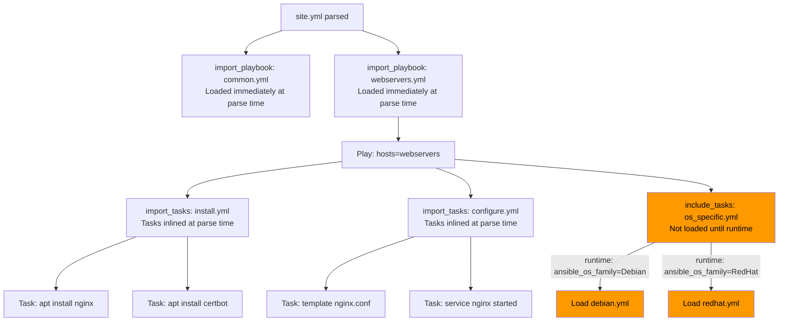
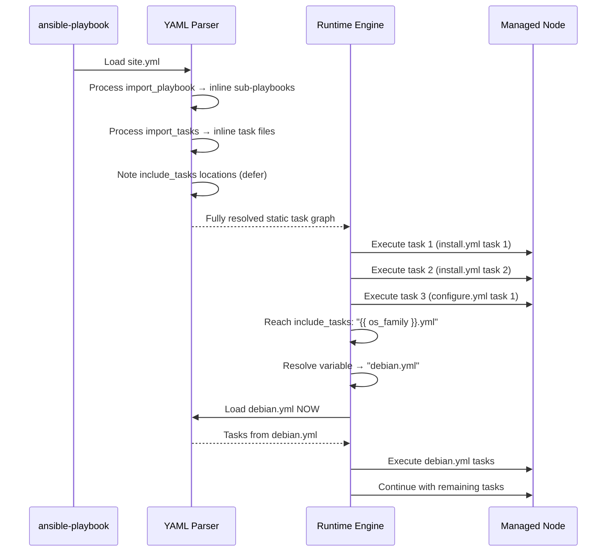

# Topic 16: Includes & Imports

> 📍 Phase 3 — Advanced | Topic 16 of 28 | File: `16-includes-and-imports.md`
> 🔗 Prev: `15-tags-and-limits.md` | Next: `17-custom-modules-and-plugins.md`

---

## 🧠 Concept Overview

As playbooks grow, you'll want to split logic across multiple files — not just for organisation, but for reuse, conditional execution, and loop-driven dynamic behaviour. Ansible provides two mechanisms for this: **import** (static, resolved at parse time) and **include** (dynamic, resolved at runtime).

The distinction sounds academic until it bites you in production: a tag doesn't propagate into an included task file, a loop that should work doesn't, or `--list-tasks` shows an empty list. Understanding exactly when each mechanism fires — and what the consequences are — is the difference between predictable, debuggable automation and mysterious behaviour.

---

## 📖 In-Depth Explanation

### Subtopic 16.1 — `import_tasks` vs `include_tasks` — Static vs Dynamic

#### The core distinction

| | `import_tasks` | `include_tasks` |
|--|---------------|----------------|
| Processed | **Parse time** (before any task runs) | **Runtime** (when that point in the play is reached) |
| `when` on the statement | Applies to **every task** inside the file | Only gates **whether the include itself fires** |
| Tags | Tags **flow into** all tasks inside | Tags apply only **to the include statement** |
| Loops (`loop:`) | ❌ **Not supported** | ✅ Supported |
| `--list-tasks` | ✅ Shows tasks inside | ❌ Does NOT show tasks inside |
| `--check` mode | ✅ Full support | ✅ Support (but dynamic vars may not be available) |
| Variables from `register` | Can reference earlier results | Can reference results (evaluated at runtime) |
| Handlers | Statically available | Dynamically available only when included |

---

#### `import_tasks` — Static inclusion

`import_tasks` inserts the tasks from the target file directly into the play at parse time, as if you copy-pasted them in. The file is always loaded — conditionals and loops on the import statement apply to each individual task inside.

```yaml
# tasks/main.yml
- name: Import installation tasks
  ansible.builtin.import_tasks: install.yml

- name: Import configuration tasks
  ansible.builtin.import_tasks: configure.yml

- name: Import SSL tasks (when condition applies to every task inside)
  ansible.builtin.import_tasks: ssl.yml
  when: nginx_ssl_enabled | default(false)
  # Every task in ssl.yml gets this when condition applied
```

```yaml
# tasks/install.yml
- name: Update apt cache
  ansible.builtin.apt:
    update_cache: true
    cache_valid_time: 3600

- name: Install nginx
  ansible.builtin.apt:
    name: nginx
    state: present
```

**When to use `import_tasks`:**
- Default choice for splitting large task files into logical sections
- When you need tags to propagate into the included tasks
- When you need `--list-tasks` to show all tasks for documentation
- When the included file is always loaded (not conditional on runtime facts)

---

#### `include_tasks` — Dynamic inclusion

`include_tasks` is processed at runtime — Ansible doesn't know what's inside the file until the play reaches that point. This enables powerful dynamic patterns impossible with imports.

```yaml
# Include different task files based on runtime facts
- name: Include OS-specific tasks
  ansible.builtin.include_tasks: "{{ ansible_os_family | lower }}.yml"
  # Resolves to debian.yml, redhat.yml, etc. at runtime

# Include tasks in a loop
- name: Deploy each application component
  ansible.builtin.include_tasks: deploy_component.yml
  loop: "{{ app_components }}"
  loop_control:
    loop_var: component

# Include tasks only when a registered result indicates need
- name: Check if migration needed
  ansible.builtin.stat:
    path: /opt/myapp/.migrated
  register: migration_flag

- name: Run migration tasks (only if flag file absent)
  ansible.builtin.include_tasks: migrate.yml
  when: not migration_flag.stat.exists
  # Only the include is gated — tasks inside run unconditionally once included
```

**When to use `include_tasks`:**
- The filename is determined by a variable (dynamic filename)
- You need to loop over the inclusion itself
- The included tasks depend on runtime variables that don't exist at parse time
- Conditional inclusion based on registered task results

---

#### The `when` behaviour difference — critical to understand

```yaml
# WITH import_tasks:
- name: Import SSL tasks
  ansible.builtin.import_tasks: ssl.yml
  when: nginx_ssl_enabled

# This is equivalent to:
- name: Generate SSL cert
  ansible.builtin.command: certbot certonly
  when: nginx_ssl_enabled    # ← condition applied to EVERY task

- name: Configure SSL in nginx
  ansible.builtin.template:
    src: ssl.conf.j2
    dest: /etc/nginx/ssl.conf
  when: nginx_ssl_enabled    # ← condition applied to EVERY task
```

```yaml
# WITH include_tasks:
- name: Include SSL tasks
  ansible.builtin.include_tasks: ssl.yml
  when: nginx_ssl_enabled

# This is equivalent to:
if nginx_ssl_enabled:
    # Load and execute ssl.yml
    # Once inside, tasks run unconditionally
    - name: Generate SSL cert
      ansible.builtin.command: certbot certonly
      # NO when condition here

    - name: Configure SSL in nginx
      ansible.builtin.template:
        src: ssl.conf.j2
        dest: /etc/nginx/ssl.conf
      # NO when condition here
```

In practice, for most use cases the behaviour is identical. The difference matters when tasks inside the file have their own `when` conditions — with `import_tasks` they AND with the outer `when`; with `include_tasks` they don't.

---

### Subtopic 16.2 — `import_playbook` for Playbook Composition

`import_playbook` lets you build a master playbook that assembles multiple sub-playbooks — one per server role, team, or lifecycle phase.

```yaml
# site.yml — master playbook
---
- name: Import common baseline play
  ansible.builtin.import_playbook: playbooks/common.yml

- name: Import web server play
  ansible.builtin.import_playbook: playbooks/webservers.yml

- name: Import database play
  ansible.builtin.import_playbook: playbooks/databases.yml

- name: Import monitoring play
  ansible.builtin.import_playbook: playbooks/monitoring.yml
```

```yaml
# playbooks/webservers.yml
---
- name: Configure web servers
  hosts: webservers
  become: true
  roles:
    - common
    - nginx
    - myapp
```

```bash
# Run the full stack
ansible-playbook site.yml

# Run only the web server play
ansible-playbook playbooks/webservers.yml

# Run with tags — tags flow through import_playbook
ansible-playbook site.yml --tags nginx

# List all tasks across all imported playbooks
ansible-playbook site.yml --list-tasks
```

> 💡 `import_playbook` is **always static** — there is no `include_playbook`. This is intentional: playbook composition should be predictable and fully visible to `--list-tasks`.

---

#### Conditional playbook imports

```yaml
# site.yml
- ansible.builtin.import_playbook: playbooks/common.yml

- ansible.builtin.import_playbook: playbooks/webservers.yml
  when: "'webservers' in groups"    # only run if group exists in inventory

- ansible.builtin.import_playbook: playbooks/databases.yml
  when: "'databases' in groups"
```

---

### Subtopic 16.3 — Passing Variables into Included Files

Both `import_tasks` and `include_tasks` support passing variables that are scoped to the included file.

#### Passing vars to `include_tasks`

```yaml
# Pass variables to the included task file
- name: Deploy application component
  ansible.builtin.include_tasks: deploy_component.yml
  vars:
    component_name: api
    component_port: 8080
    component_dir: /opt/myapp/api
```

```yaml
# deploy_component.yml — uses the passed vars
- name: Create {{ component_name }} directory
  ansible.builtin.file:
    path: "{{ component_dir }}"
    state: directory

- name: Deploy {{ component_name }} binary
  ansible.builtin.copy:
    src: "files/{{ component_name }}"
    dest: "{{ component_dir }}/{{ component_name }}"
    mode: '0755'

- name: Configure {{ component_name }} port
  ansible.builtin.lineinfile:
    path: "{{ component_dir }}/config"
    regexp: '^port='
    line: "port={{ component_port }}"
```

---

#### Looping includes with variable passing

```yaml
vars:
  app_components:
    - { name: api,     port: 8080, dir: /opt/myapp/api }
    - { name: worker,  port: 8081, dir: /opt/myapp/worker }
    - { name: metrics, port: 9090, dir: /opt/myapp/metrics }

tasks:
  - name: Deploy each component
    ansible.builtin.include_tasks: deploy_component.yml
    loop: "{{ app_components }}"
    loop_control:
      loop_var: component    # rename to avoid collision with tasks inside
    vars:
      component_name: "{{ component.name }}"
      component_port: "{{ component.port }}"
      component_dir: "{{ component.dir }}"
```

---

#### `vars_files` vs `include_vars`

For including variable files (not task files):

```yaml
# At play level — static, always loaded
- name: Configure servers
  hosts: all
  vars_files:
    - vars/common.yml
    - "vars/{{ ansible_os_family }}.yml"

# As a task — dynamic, can be conditional or looped
  tasks:
    - name: Load environment-specific variables
      ansible.builtin.include_vars:
        file: "vars/{{ deploy_env }}.yml"

    - name: Load all vars files matching a pattern
      ansible.builtin.include_vars:
        dir: vars/
        extensions: [yml, yaml]
        depth: 1
```

---

## 🏗️ Architecture & System Design

How static vs dynamic loading affects the play graph:



---

## 🔄 Flow / Lifecycle



---

## 💻 Code Examples

### ✅ Example 1: Well-structured role using import_tasks

```
roles/nginx/tasks/
├── main.yml          ← entry point, imports others
├── install.yml       ← package installation
├── configure.yml     ← config file deployment
├── vhosts.yml        ← virtual host management
├── ssl.yml           ← SSL/TLS configuration
└── firewall.yml      ← firewall rules
```

```yaml
# roles/nginx/tasks/main.yml
---
- ansible.builtin.import_tasks: install.yml
  tags: [install]

- ansible.builtin.import_tasks: configure.yml
  tags: [config]

- ansible.builtin.import_tasks: vhosts.yml
  tags: [config, vhosts]

- ansible.builtin.import_tasks: ssl.yml
  when: nginx_ssl_enabled | default(false)
  tags: [ssl, config]

- ansible.builtin.import_tasks: firewall.yml
  tags: [firewall]
```

### ✅ Example 2: Dynamic OS-specific task loading with include_tasks

```yaml
# tasks/main.yml
- name: Gather facts if not already done
  ansible.builtin.setup:
    gather_subset: min
  when: ansible_os_family is not defined

- name: Include OS-specific package tasks
  ansible.builtin.include_tasks: "packages_{{ ansible_os_family | lower }}.yml"
  # Dynamically loads: packages_debian.yml, packages_redhat.yml, packages_suse.yml
```

```yaml
# tasks/packages_debian.yml
- name: Install packages (Debian)
  ansible.builtin.apt:
    name: [nginx, certbot, python3-pip]
    state: present
    update_cache: true
```

```yaml
# tasks/packages_redhat.yml
- name: Install packages (RedHat)
  ansible.builtin.dnf:
    name: [nginx, certbot, python3-pip]
    state: present
```

### ✅ Example 3: include_tasks in a loop for multi-component deploy

```yaml
vars:
  services:
    - name: api
      port: 8080
      replicas: 3
    - name: worker
      port: 8081
      replicas: 2
    - name: scheduler
      port: 8082
      replicas: 1

tasks:
  - name: Deploy each service
    ansible.builtin.include_tasks: tasks/deploy_service.yml
    loop: "{{ services }}"
    loop_control:
      loop_var: svc
      label: "{{ svc.name }}"
```

```yaml
# tasks/deploy_service.yml
- name: Create {{ svc.name }} config
  ansible.builtin.template:
    src: service.conf.j2
    dest: "/etc/myapp/{{ svc.name }}.conf"
  vars:
    service_port: "{{ svc.port }}"
    service_name: "{{ svc.name }}"

- name: Ensure {{ svc.name }} is running
  ansible.builtin.service:
    name: "myapp-{{ svc.name }}"
    state: started
    enabled: true
```

### ✅ Example 4: Master site.yml with conditional playbook imports

```yaml
# site.yml
---
- ansible.builtin.import_playbook: playbooks/preflight.yml

- ansible.builtin.import_playbook: playbooks/common.yml

- ansible.builtin.import_playbook: playbooks/webservers.yml

- ansible.builtin.import_playbook: playbooks/databases.yml

- ansible.builtin.import_playbook: playbooks/monitoring.yml
```

```yaml
# playbooks/preflight.yml
---
- name: Pre-flight checks
  hosts: all
  gather_facts: false
  tasks:
    - name: Verify SSH connectivity
      ansible.builtin.ping:
      tags: [always]

    - name: Check minimum disk space
      ansible.builtin.command: df -BG / --output=avail
      register: disk_avail
      changed_when: false
      failed_when: disk_avail.stdout | int < 2
      tags: [always]
```

### ❌ Anti-pattern — Using include_tasks when import_tasks is appropriate

```yaml
# ❌ Using include_tasks for a static, always-loaded file
# - Tags won't propagate into tasks inside
# - --list-tasks won't show the tasks inside
# - No benefit from dynamic loading
- name: Include installation tasks
  ansible.builtin.include_tasks: install.yml
  tags: [install]    # these tags DON'T flow into tasks inside install.yml

# ✅ Use import_tasks — static file, tags propagate, list-tasks works
- name: Import installation tasks
  ansible.builtin.import_tasks: install.yml
  tags: [install]    # every task inside install.yml inherits this tag
```

---

## ⚙️ Configuration & Options

### Full comparison table

| Feature | `import_tasks` | `include_tasks` | `import_playbook` |
|---------|---------------|----------------|------------------|
| Timing | Parse time | Runtime | Parse time |
| Dynamic filenames | ❌ | ✅ | ❌ |
| `loop:` support | ❌ | ✅ | ❌ |
| Tag inheritance | ✅ Full | ❌ Include only | ✅ Full |
| `when:` scope | All tasks inside | Include gate only | All plays inside |
| `--list-tasks` | ✅ Shows inside | ❌ Hides inside | ✅ Shows inside |
| `--check` | ✅ Full | ✅ Partial | ✅ Full |
| Handler scope | Play-wide | Play-wide | Play-wide |
| Use case | Static splits | Dynamic loading | Playbook assembly |

### `include_vars` options

```yaml
- ansible.builtin.include_vars:
    file: vars/production.yml           # specific file
    # OR
    dir: vars/                          # all files in directory
    extensions: [yml, yaml, json]       # file types to include
    depth: 1                            # directory depth (1 = flat only)
    ignore_unknown_extensions: true     # skip non-matching files
    name: loaded_vars                   # store as nested dict under this key
```

---

## 🧩 Patterns & Best Practices

**What experienced engineers do:**
- Default to `import_tasks` for splitting large task files — tag inheritance and `--list-tasks` support make it the safer choice
- Reserve `include_tasks` for genuinely dynamic scenarios: variable filenames, looped inclusions, or runtime-conditional loading
- Use `import_playbook` in `site.yml` as the single entry point — running `site.yml` always produces a predictable, fully auditable task list
- When using `include_tasks` in a loop, always set `loop_var` to avoid collision with tasks that also loop internally
- Split roles by concern in `tasks/`: `install.yml`, `configure.yml`, `service.yml` — import all from `main.yml`

**What beginners typically get wrong:**
- Using `include_tasks` everywhere because it "feels safer" — then being surprised that `--tags nginx` doesn't affect tasks inside the included file
- Using `import_tasks` with a dynamic filename (`{{ variable }}.yml`) — this fails at parse time because the variable doesn't exist yet
- Putting a `loop:` on an `import_tasks` — this silently fails or errors; use `include_tasks` for loops
- Expecting handlers defined inside an `include_tasks` file to be available before the include is reached at runtime

**Senior-level nuance:**
- `import_tasks` and `include_tasks` can be mixed within the same role. A common pattern: `import_tasks` all the static splits in `main.yml`, but use `include_tasks` for the one dynamic OS-specific file. Keep the dynamic inclusions at the leaf level — never nest dynamic includes several levels deep, as debugging becomes extremely painful.
- For very large organisations, the `import_playbook` + separate playbook-per-team pattern enables safe parallel development — each team owns their playbook file and the `site.yml` just imports them. Changes to one team's playbook don't affect others.

---

## 🔗 How It Connects

- **Builds on:** `15-tags-and-limits.md` — tags on `import_tasks` propagate; tags on `include_tasks` don't — this distinction is critical when using `--tags` in production
- **Leads to:** `17-custom-modules-and-plugins.md` — once you master task composition, extending Ansible itself with custom modules is the next frontier
- **Related concepts:** Topic 12 (`import_role` vs `include_role` — same static/dynamic distinction), Topic 5 (`import_playbook` introduced in playbook basics), Topic 20 (async tasks — only work with `include_tasks`, not `import_tasks`)

---

## 🎯 Interview Questions (Conceptual)

**Q1: What is the fundamental difference between `import_tasks` and `include_tasks`?**
> **A:** `import_tasks` is static — Ansible loads and inlines the task file at parse time, before any task executes. `include_tasks` is dynamic — the file is loaded at runtime when that point in the play is reached. The practical consequences: tags propagate into imported tasks but not included tasks; `loop:` works on includes but not imports; `--list-tasks` shows tasks inside imports but not includes; dynamic filenames work with includes but not imports.

**Q2: You have `- include_tasks: setup.yml` with `tags: [setup]`. Will `--tags setup` run the tasks inside `setup.yml`?**
> **A:** No. With `include_tasks`, tags on the include statement only gate whether the include itself fires — they do not propagate into the tasks inside. If you run `--tags setup`, the `include_tasks` statement runs (because it's tagged), but the tasks inside `setup.yml` will still only run if they themselves have the `setup` tag or no tag filter is active. Use `import_tasks` if you need tags to flow into the included tasks.

**Q3: Why can't you use `loop:` with `import_tasks`?**
> **A:** `import_tasks` is processed at parse time, before any tasks execute. Loops are evaluated at runtime against actual values. Since the loop variable doesn't exist at parse time, Ansible has no way to know how many times to inline the file or what value `item` should have. `include_tasks` is processed at runtime, so it can evaluate `loop` normally.

**Q4: What is `import_playbook` and how does it differ from `include_tasks`?**
> **A:** `import_playbook` includes entire playbooks (plays) rather than task files. It's always static — there is no `include_playbook`. It's used to compose a master `site.yml` from individual role-specific playbooks, enabling both a single-entry-point full run and independent per-role runs. Tags and `--list-tasks` work through it fully.

**Q5: When would you use `include_vars` instead of `vars_files:`?**
> **A:** `vars_files:` is a play-level static declaration — those files are always loaded. `include_vars` is a task — it's dynamic, can be conditional, can use variable filenames, and can be looped. Use `include_vars` when you need to load different variable files based on runtime facts (like `ansible_os_family`) or based on a registered result.

---

## 🧠 Scenario-Based Interview Problems

**Scenario 1: "You run `ansible-playbook site.yml --tags config --list-tasks` and it shows an empty task list, even though you know the config tasks exist. Why?"**
> **Problem:** Tags not showing tasks — likely a `include_tasks` issue.
> **Approach:** The task files are being loaded with `include_tasks`, not `import_tasks`. `include_tasks` files are not processed at parse time, so `--list-tasks` can't see inside them. Switch to `import_tasks` for the relevant task files. If any of those files use dynamic filenames (which is why `include_tasks` was used), restructure: use `import_tasks` for static files and `include_tasks` only for the one dynamic file that genuinely needs runtime resolution.
> **Trade-offs:** Converting from `include_tasks` to `import_tasks` for tag support means losing the ability to use `loop:` on those includes. If loop-driven task inclusion is required AND tag inheritance is required, the cleanest solution is to put the tags directly inside the included task files on the tasks themselves.

**Scenario 2: "You need to deploy 5 microservices using the same set of deployment tasks, but each service has different ports, directories, and config. How do you structure this without duplicating task files?"**
> **Problem:** Reusing a task file across multiple loop iterations with different variables.
> **Approach:** Define a `services` list variable with per-service config dicts. Use `include_tasks: tasks/deploy_service.yml` with `loop: "{{ services }}"` and `loop_var: svc`. Inside `deploy_service.yml`, reference `{{ svc.name }}`, `{{ svc.port }}`, `{{ svc.dir }}`. This runs the same task file once per service, parameterised by the loop variable. Add `loop_control: label: "{{ svc.name }}"` for clean output.
> **Trade-offs:** `include_tasks` in a loop loses tag inheritance and `--list-tasks` visibility. Document this in your team's runbook — operators need to know that `--tags deploy` won't selectively run only certain services. For that level of control, add tags inside `deploy_service.yml` directly.

---

## ⚡ Quick Notes — Revision Card

- 📌 `import_tasks` = **parse time** (static) | `include_tasks` = **runtime** (dynamic)
- 📌 `import_tasks`: tags flow in ✅ | loops ❌ | dynamic filenames ❌ | `--list-tasks` ✅
- 📌 `include_tasks`: tags flow in ❌ | loops ✅ | dynamic filenames ✅ | `--list-tasks` ❌
- 📌 `when:` on `import_tasks` → applied to **every task inside** | on `include_tasks` → gates **the include only**
- 📌 `import_playbook` = compose master playbook from sub-playbooks (always static)
- 📌 `include_vars` = dynamic variable file loading (can use variable filenames, conditions, loops)
- 📌 `vars_files:` = static variable file loading at play level
- ⚠️ `loop:` on `import_tasks` = ERROR — use `include_tasks` for looped inclusion
- ⚠️ Dynamic filename (`{{ var }}.yml`) on `import_tasks` = ERROR — use `include_tasks`
- ⚠️ Tags on `include_tasks` do NOT flow into tasks inside the included file
- 💡 Default to `import_tasks`; switch to `include_tasks` only when dynamic behaviour is required
- 🔑 `import_playbook` in `site.yml` = the gold-standard project entry point — one file to run them all

---

## 🔖 References & Further Reading

- 📄 [import_tasks vs include_tasks — Official Docs](https://docs.ansible.com/ansible/latest/playbook_guide/playbooks_reuse.html)
- 📄 [import_playbook](https://docs.ansible.com/ansible/latest/collections/ansible/builtin/import_playbook_module.html)
- 📄 [include_vars module](https://docs.ansible.com/ansible/latest/collections/ansible/builtin/include_vars_module.html)
- 📝 [Re-using Ansible artifacts](https://docs.ansible.com/ansible/latest/playbook_guide/playbooks_reuse.html)
- 🎥 [Jeff Geerling — Includes vs Imports](https://www.youtube.com/watch?v=KuiAiQzEzHo)
- ➡️ Related in this course: [`15-tags-and-limits.md`] · [`17-custom-modules-and-plugins.md`]

---
