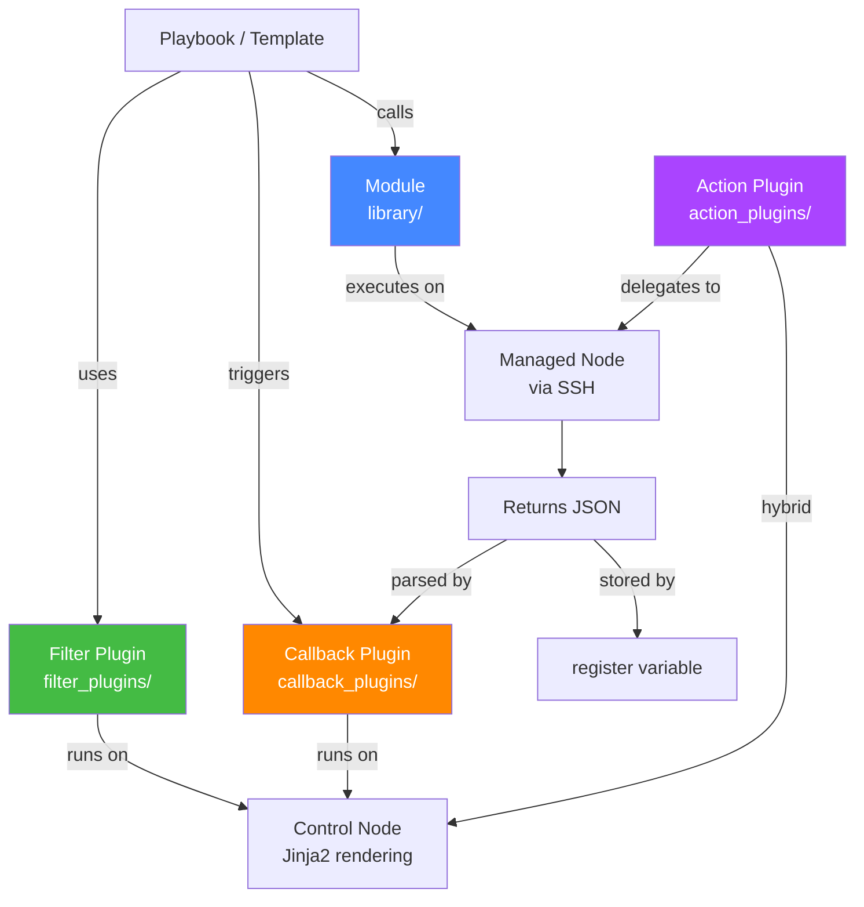
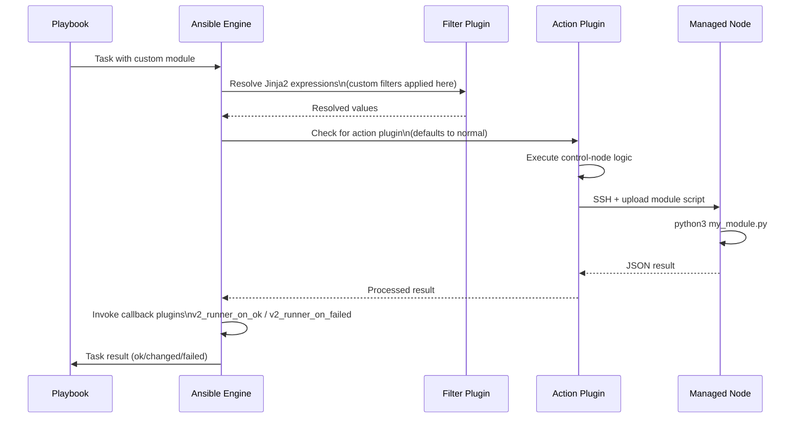

# Topic 17: Custom Modules & Plugins

> 📍 Phase 3 — Advanced | Topic 17 of 28 | File: `17-custom-modules-and-plugins.md`
> 🔗 Prev: `16-includes-and-imports.md` | Next: `18-testing-with-molecule.md`

---

## 🧠 Concept Overview

Ansible ships with thousands of modules — but sometimes none of them do exactly what you need. Maybe you're integrating with a proprietary internal API, wrapping a complex CLI tool, or need a filter that doesn't exist in the standard library. **Custom modules and plugins** let you extend Ansible at every layer of the stack.

This topic covers the three most common extension points: writing a Python module (what gets executed on managed nodes), writing filter plugins (Jinja2 transformations in templates and tasks), and writing callback plugins (hook into Ansible's event stream for logging, notifications, or custom output). After this topic, no Ansible task is impossible.

---

## 📖 In-Depth Explanation

### Subtopic 17.1 — Writing a Custom Module in Python

A custom module is a Python script that Ansible uploads to managed nodes, executes, and reads the JSON result from. It follows the same contract as any built-in module.

#### Where to put custom modules

```
project/
├── library/              ← Ansible auto-discovers modules here
│   └── my_module.py
├── filter_plugins/       ← custom Jinja2 filters
│   └── my_filters.py
├── callback_plugins/     ← custom output/notification hooks
│   └── my_callback.py
├── lookup_plugins/       ← custom lookups
│   └── my_lookup.py
└── site.yml
```

Or in a role:
```
roles/myrole/
└── library/
    └── my_module.py     ← available to tasks in this role
```

---

#### The `AnsibleModule` class — the foundation

Every well-written custom module uses `AnsibleModule` from `ansible.module_utils.basic`. It handles argument parsing, type coercion, error handling, and JSON output formatting automatically.

```python
#!/usr/bin/python
# -*- coding: utf-8 -*-

# library/my_app_config.py
# Manages configuration for MyApp via its REST API

from __future__ import absolute_import, division, print_function
__metaclass__ = type

DOCUMENTATION = r'''
---
module: my_app_config
short_description: Manage MyApp configuration settings
description:
  - Creates, updates, or deletes configuration settings in MyApp via its REST API.
options:
  api_url:
    description: URL of the MyApp API endpoint
    required: true
    type: str
  setting_name:
    description: Name of the configuration setting
    required: true
    type: str
  setting_value:
    description: Value to set (omit to delete)
    required: false
    type: str
  state:
    description: Desired state of the setting
    choices: [present, absent]
    default: present
    type: str
  api_token:
    description: API authentication token
    required: true
    type: str
    no_log: true    # mark sensitive — won't appear in logs
author:
  - Your Name (@yourhandle)
'''

EXAMPLES = r'''
- name: Set MyApp log level
  my_app_config:
    api_url: http://myapp.internal/api
    api_token: "{{ vault_myapp_token }}"
    setting_name: log_level
    setting_value: INFO
    state: present

- name: Remove deprecated setting
  my_app_config:
    api_url: http://myapp.internal/api
    api_token: "{{ vault_myapp_token }}"
    setting_name: old_feature_flag
    state: absent
'''

RETURN = r'''
setting:
  description: The resulting configuration setting
  returned: when state=present
  type: dict
  sample: {"name": "log_level", "value": "INFO"}
'''

import json
try:
    from urllib.request import urlopen, Request
    from urllib.error import HTTPError, URLError
except ImportError:
    from urllib2 import urlopen, Request, HTTPError, URLError

from ansible.module_utils.basic import AnsibleModule


def get_setting(api_url, token, name):
    """Fetch current setting value from the API."""
    req = Request(
        f"{api_url}/settings/{name}",
        headers={"Authorization": f"Bearer {token}"}
    )
    try:
        response = urlopen(req)
        return json.loads(response.read())
    except HTTPError as e:
        if e.code == 404:
            return None
        raise


def set_setting(api_url, token, name, value):
    """Create or update a setting via the API."""
    data = json.dumps({"value": value}).encode()
    req = Request(
        f"{api_url}/settings/{name}",
        data=data,
        method="PUT",
        headers={
            "Authorization": f"Bearer {token}",
            "Content-Type": "application/json"
        }
    )
    response = urlopen(req)
    return json.loads(response.read())


def delete_setting(api_url, token, name):
    """Delete a setting via the API."""
    req = Request(
        f"{api_url}/settings/{name}",
        method="DELETE",
        headers={"Authorization": f"Bearer {token}"}
    )
    try:
        urlopen(req)
        return True
    except HTTPError as e:
        if e.code == 404:
            return False   # already gone — idempotent
        raise


def main():
    # Define module arguments
    module_args = dict(
        api_url=dict(type='str', required=True),
        setting_name=dict(type='str', required=True),
        setting_value=dict(type='str', required=False, default=None),
        state=dict(type='str', default='present', choices=['present', 'absent']),
        api_token=dict(type='str', required=True, no_log=True),  # sensitive!
    )

    # Initialise the module — handles arg parsing, check mode, etc.
    module = AnsibleModule(
        argument_spec=module_args,
        supports_check_mode=True,   # declare that we handle --check mode
    )

    # Extract arguments
    api_url = module.params['api_url']
    name = module.params['setting_name']
    value = module.params['setting_value']
    state = module.params['state']
    token = module.params['api_token']

    result = dict(changed=False, setting=None)

    try:
        current = get_setting(api_url, token, name)

        if state == 'present':
            if current is None or current.get('value') != value:
                result['changed'] = True
                if not module.check_mode:   # respect --check mode
                    result['setting'] = set_setting(api_url, token, name, value)
                else:
                    result['setting'] = {"name": name, "value": value}
            else:
                result['setting'] = current   # already correct — no change

        elif state == 'absent':
            if current is not None:
                result['changed'] = True
                if not module.check_mode:
                    delete_setting(api_url, token, name)

    except URLError as e:
        module.fail_json(msg=f"API connection error: {e}", **result)
    except Exception as e:
        module.fail_json(msg=f"Unexpected error: {e}", **result)

    # Return success — Ansible reads this JSON
    module.exit_json(**result)


if __name__ == '__main__':
    main()
```

Using the custom module in a playbook:

```yaml
tasks:
  - name: Configure MyApp log level
    my_app_config:
      api_url: http://myapp.internal/api
      api_token: "{{ vault_myapp_token }}"
      setting_name: log_level
      setting_value: WARNING
      state: present
    register: config_result

  - name: Show result
    ansible.builtin.debug:
      var: config_result.setting
```

---

#### Key `AnsibleModule` methods

| Method | Description |
|--------|-------------|
| `module.params` | Dict of parsed argument values |
| `module.check_mode` | True if `--check` was passed — skip actual changes |
| `module.exit_json(**result)` | Successful exit — result must include `changed` |
| `module.fail_json(msg=..., **result)` | Failed exit — sets `failed=True` |
| `module.run_command(cmd)` | Run a shell command, returns (rc, stdout, stderr) |
| `module.get_bin_path('nginx')` | Find binary path safely |
| `module.warn(msg)` | Emit a warning (appears in task output) |
| `module.debug(msg)` | Emit debug message (shown with -vvv) |
| `module.tmpdir` | Temp directory on remote host |

---

### Subtopic 17.2 — Action Plugins, Callback Plugins, Filter Plugins

#### Filter Plugins — custom Jinja2 transformations

Filter plugins add new `| filter_name` functions to Jinja2 — usable in templates, tasks, and `when` conditions.

```python
# filter_plugins/my_filters.py

def to_nginx_upstream(servers, port=80, weight=1):
    """Convert a list of server IPs to nginx upstream block lines."""
    lines = []
    for server in servers:
        lines.append(f"    server {server}:{port} weight={weight};")
    return "\n".join(lines)


def version_compare_safe(version1, version2):
    """Compare two semantic version strings safely."""
    from packaging import version
    try:
        return version.parse(str(version1)) >= version.parse(str(version2))
    except Exception:
        return False


def mask_secret(value, visible_chars=4):
    """Mask a secret value showing only the last N characters."""
    value = str(value)
    if len(value) <= visible_chars:
        return '*' * len(value)
    return '*' * (len(value) - visible_chars) + value[-visible_chars:]


class FilterModule(object):
    """Custom Ansible filters."""

    def filters(self):
        return {
            'to_nginx_upstream': to_nginx_upstream,
            'version_compare_safe': version_compare_safe,
            'mask_secret': mask_secret,
        }
```

Using custom filters in a template and playbook:

```jinja2
{# templates/nginx.conf.j2 #}
upstream backend {
{{ groups['appservers'] | map('extract', hostvars, 'ansible_host') | list | to_nginx_upstream(port=8080, weight=2) }}
}
```

```yaml
tasks:
  - name: Show masked API token in logs
    ansible.builtin.debug:
      msg: "Token ending: {{ api_token | mask_secret(6) }}"
    # Shows: "Token ending: ****ab1234" — safe to log
```

---

#### Callback Plugins — hook into Ansible's event stream

Callback plugins react to Ansible events: play start, task result, play recap, etc. Common uses: custom output formatting, Slack notifications on failure, metrics shipping to Datadog, audit logging.

```python
# callback_plugins/slack_notify.py

from __future__ import absolute_import, division, print_function
__metaclass__ = type

DOCUMENTATION = '''
    name: slack_notify
    type: notification
    short_description: Send Ansible run results to Slack
    description:
      - Sends a summary message to Slack when a playbook completes or fails
    options:
      webhook_url:
        required: true
        env:
          - name: SLACK_WEBHOOK_URL
'''

import json
import os
try:
    from urllib.request import urlopen, Request
except ImportError:
    from urllib2 import urlopen, Request

from ansible.plugins.callback import CallbackBase


class CallbackModule(CallbackBase):
    CALLBACK_VERSION = 2.0
    CALLBACK_TYPE = 'notification'
    CALLBACK_NAME = 'slack_notify'
    CALLBACK_NEEDS_ENABLED = True   # must be enabled in ansible.cfg

    def __init__(self):
        super(CallbackModule, self).__init__()
        self.webhook_url = os.environ.get('SLACK_WEBHOOK_URL')
        self.failures = []
        self.play_name = None

    def v2_playbook_on_play_start(self, play):
        self.play_name = play.get_name()

    def v2_runner_on_failed(self, result, ignore_errors=False):
        if not ignore_errors:
            self.failures.append({
                'host': result._host.name,
                'task': result.task_name,
                'msg': result._result.get('msg', 'Unknown error')
            })

    def v2_playbook_on_stats(self, stats):
        """Called at the end of the playbook run."""
        if not self.webhook_url:
            return

        hosts = sorted(stats.processed.keys())
        summary = []
        overall_status = "✅ SUCCESS"

        for host in hosts:
            s = stats.summarize(host)
            summary.append(
                f"*{host}*: ok={s['ok']} changed={s['changed']} "
                f"failed={s['failures']} unreachable={s['unreachable']}"
            )
            if s['failures'] > 0 or s['unreachable'] > 0:
                overall_status = "❌ FAILED"

        message = {
            "text": f"{overall_status} — Playbook: *{self.play_name}*",
            "attachments": [{
                "color": "good" if overall_status.startswith("✅") else "danger",
                "text": "\n".join(summary)
            }]
        }

        if self.failures:
            failure_text = "\n".join([
                f"• {f['host']}: {f['task']} — {f['msg']}"
                for f in self.failures[:5]  # show first 5 failures
            ])
            message["attachments"].append({
                "color": "danger",
                "title": "Failures",
                "text": failure_text
            })

        data = json.dumps(message).encode()
        req = Request(self.webhook_url, data=data,
                      headers={'Content-Type': 'application/json'})
        try:
            urlopen(req)
        except Exception as e:
            self._display.warning(f"Slack notification failed: {e}")
```

Enable in `ansible.cfg`:

```ini
[defaults]
callbacks_enabled = slack_notify

[callback_slack_notify]
webhook_url = https://hooks.slack.com/services/xxx/yyy/zzz
# Or set SLACK_WEBHOOK_URL environment variable
```

---

#### Action Plugins — run on the control node

Action plugins execute on the control node (not the managed node) and typically combine control-node logic with module execution. Built-in examples: `template` (renders on control node, sends to managed node), `copy` (reads from control node, sends to managed node).

```python
# action_plugins/my_action.py
from ansible.plugins.action import ActionBase

class ActionModule(ActionBase):
    def run(self, tmp=None, task_vars=None):
        result = super(ActionModule, self).run(tmp, task_vars)

        # Access task arguments
        src = self._task.args.get('src')
        dest = self._task.args.get('dest')

        # Run logic on control node (self._connection is to managed node)
        # Read local file
        with open(src) as f:
            content = f.read()

        # Execute a module on the managed node
        module_result = self._execute_module(
            module_name='ansible.builtin.copy',
            module_args={'content': content, 'dest': dest},
            task_vars=task_vars
        )

        result.update(module_result)
        return result
```

---

### Subtopic 17.3 — Module Development Best Practices and `AnsibleModule` Class

#### Idempotency — the most important design principle

Every module must check current state before making changes:

```python
def main():
    module = AnsibleModule(argument_spec={...})
    
    # 1. GET current state
    current_state = get_current_state(module.params)
    
    # 2. COMPARE to desired state
    desired_state = module.params['state']
    
    # 3. ACT only if they differ
    if current_state != desired_state:
        if module.check_mode:
            module.exit_json(changed=True)   # report what WOULD happen
        make_change(module.params)
        module.exit_json(changed=True)
    else:
        module.exit_json(changed=False)      # already correct, no action
```

#### `supports_check_mode` — always implement it

```python
module = AnsibleModule(
    argument_spec=module_args,
    supports_check_mode=True,   # tell Ansible this module handles --check
)

# In your logic:
if module.check_mode:
    # Report what WOULD happen, but don't actually do it
    module.exit_json(changed=True, msg="Would have made change X")
```

> ⚠️ If you don't implement `supports_check_mode=True`, Ansible skips your module entirely in `--check` mode. If you set it but don't honour `module.check_mode`, you'll make real changes during dry runs — a dangerous bug.

#### Documentation strings are required for published modules

```python
DOCUMENTATION = r'''
---
module: my_module
short_description: One-line description
description:
  - Detailed multi-line description
options:
  param_name:
    description: What this parameter does
    required: true/false
    type: str/int/bool/list/dict
    default: (if not required)
    choices: [a, b, c]  (if enum)
'''

EXAMPLES = r'''
- name: Example usage
  my_module:
    param_name: value
'''

RETURN = r'''
result_key:
  description: What the module returns
  returned: always/when changed/on success
  type: str/dict/list
  sample: example_value
'''
```

#### `module_utils` — shared code across modules

Put shared helper code in `module_utils/`:

```python
# module_utils/my_api.py
class MyAppAPI:
    def __init__(self, url, token):
        self.url = url
        self.token = token
    
    def get(self, path):
        ...
    
    def post(self, path, data):
        ...
```

```python
# library/my_module.py
from ansible.module_utils.my_api import MyAppAPI
```

---

## 🏗️ Architecture & System Design

Where custom extensions plug into the Ansible architecture:



---

## 🔄 Flow / Lifecycle



---

## 💻 Code Examples

### ✅ Example 1: Simple module that wraps a CLI tool

```python
#!/usr/bin/python
# library/certbot_cert.py
"""Manage SSL certificates via certbot."""

from ansible.module_utils.basic import AnsibleModule

def main():
    module = AnsibleModule(
        argument_spec=dict(
            domain=dict(type='str', required=True),
            email=dict(type='str', required=True),
            state=dict(type='str', default='present', choices=['present', 'absent']),
            webroot_path=dict(type='str', default='/var/www/html'),
        ),
        supports_check_mode=True,
    )

    domain = module.params['domain']
    email = module.params['email']
    state = module.params['state']
    webroot = module.params['webroot_path']

    # Check current state
    cert_path = f"/etc/letsencrypt/live/{domain}/fullchain.pem"
    import os
    cert_exists = os.path.exists(cert_path)

    if state == 'present' and not cert_exists:
        if module.check_mode:
            module.exit_json(changed=True, msg=f"Would obtain cert for {domain}")
        rc, stdout, stderr = module.run_command(
            f"certbot certonly --webroot -w {webroot} -d {domain} "
            f"--email {email} --agree-tos --non-interactive"
        )
        if rc != 0:
            module.fail_json(msg=f"certbot failed: {stderr}", rc=rc)
        module.exit_json(changed=True, msg=f"Certificate obtained for {domain}")

    elif state == 'absent' and cert_exists:
        if module.check_mode:
            module.exit_json(changed=True, msg=f"Would revoke cert for {domain}")
        rc, stdout, stderr = module.run_command(
            f"certbot delete --cert-name {domain} --non-interactive"
        )
        if rc != 0:
            module.fail_json(msg=f"certbot delete failed: {stderr}")
        module.exit_json(changed=True, msg=f"Certificate revoked for {domain}")

    else:
        module.exit_json(changed=False, msg=f"Certificate already in desired state")

if __name__ == '__main__':
    main()
```

### ✅ Example 2: Filter plugin for infrastructure calculations

```python
# filter_plugins/infra_filters.py

def calc_jvm_heap(total_ram_mb, fraction=0.5, max_gb=8):
    """Calculate JVM heap size as fraction of RAM, capped at max_gb."""
    heap_mb = int(total_ram_mb * fraction)
    cap_mb = max_gb * 1024
    return min(heap_mb, cap_mb)


def to_cidr(network, prefix):
    """Combine network and prefix into CIDR notation."""
    return f"{network}/{prefix}"


def extract_port(url):
    """Extract port from a URL string."""
    import re
    match = re.search(r':(\d+)', url)
    return int(match.group(1)) if match else 80


class FilterModule(object):
    def filters(self):
        return {
            'calc_jvm_heap': calc_jvm_heap,
            'to_cidr': to_cidr,
            'extract_port': extract_port,
        }
```

```yaml
# Using custom filters in a playbook
tasks:
  - name: Calculate and set JVM heap size
    ansible.builtin.lineinfile:
      path: /etc/myapp/jvm.options
      regexp: '^-Xmx'
      line: "-Xmx{{ ansible_memory_mb.real.total | calc_jvm_heap(fraction=0.6, max_gb=16) }}m"
```

### ❌ Anti-pattern — Module that isn't idempotent

```python
# ❌ Always makes a change — idempotency violated
def main():
    module = AnsibleModule(argument_spec={...})
    # Always creates the resource without checking if it exists
    create_resource(module.params)
    module.exit_json(changed=True)   # always changed!

# ✅ Idempotent — checks state first
def main():
    module = AnsibleModule(argument_spec={...})
    current = get_resource(module.params['name'])
    if current is None:
        if not module.check_mode:
            create_resource(module.params)
        module.exit_json(changed=True)
    else:
        module.exit_json(changed=False)
```

---

## ⚙️ Configuration & Options

### Plugin discovery paths (`ansible.cfg`)

```ini
[defaults]
library            = ./library:~/.ansible/plugins/modules
filter_plugins     = ./filter_plugins:~/.ansible/plugins/filter
callback_plugins   = ./callback_plugins:~/.ansible/plugins/callback
action_plugins     = ./action_plugins:~/.ansible/plugins/action
lookup_plugins     = ./lookup_plugins:~/.ansible/plugins/lookup
callbacks_enabled  = slack_notify, profile_tasks, timer
```

### Module return value contract

```python
# Successful return
module.exit_json(
    changed=True/False,       # required — was state changed?
    msg="Human message",      # optional — description
    result={},                # optional — structured data
    diff={                    # optional — for --diff support
        'before': old_value,
        'after': new_value,
    }
)

# Failure return
module.fail_json(
    msg="Error description",  # required — what went wrong
    rc=1,                     # optional — return code
    stdout="...",             # optional — command output
    stderr="...",             # optional — error output
)
```

---

## 🧩 Patterns & Best Practices

**What experienced engineers do:**
- Always implement `supports_check_mode=True` and honour `module.check_mode` — modules that don't support check mode break `--check` runs
- Mark sensitive parameters with `no_log=True` in `argument_spec` — prevents tokens and passwords appearing in verbose output
- Use `module.run_command()` instead of `subprocess` directly — it handles path normalisation, error capture, and works cross-platform
- Write DOCUMENTATION, EXAMPLES, and RETURN strings — required for `ansible-doc` support and Galaxy publishing
- Unit-test modules with `AnsibleModule` mock — the `ansible.module_utils.basic` module provides testing helpers

**What beginners typically get wrong:**
- Writing modules that aren't idempotent — always running the operation regardless of current state
- Not implementing `check_mode` support — modules that make real changes during `--check` runs are dangerous bugs
- Using Python 2 syntax in module code — all modern Ansible targets Python 3; use `from __future__ import` guards if you need 2/3 compatibility
- Putting all logic in `main()` — makes testing impossible; extract into small testable functions
- Not handling the `no_log` parameter for sensitive args — token values appear in `ansible-playbook -vvv` output

**Senior-level nuance:**
- For modules that wrap REST APIs, implement a `diff` mode: return `{'before': current_state, 'after': desired_state}` in the result when `module._diff` is True. This enables `--diff` output for your custom module exactly like built-in modules provide.
- Collection-packaged modules (`collections/ansible_collections/myorg/mytools/plugins/modules/`) are the modern way to distribute custom modules — they support versioning, namespacing, and private distribution via Automation Hub. Standalone `library/` is fine for project-local modules.

---

## 🔗 How It Connects

- **Builds on:** `16-includes-and-imports.md` — custom modules are discoverable from `library/` directories in your project, roles, or collections
- **Leads to:** `18-testing-with-molecule.md` — custom modules need testing; Molecule tests roles that use them
- **Related concepts:** Topic 19 (Galaxy/Collections — publishing custom modules as a collection), Topic 26 (Collections development — the full packaging story for enterprise distribution)

---

## 🎯 Interview Questions (Conceptual)

**Q1: What is the `AnsibleModule` class and why should every custom module use it?**
> **A:** `AnsibleModule` from `ansible.module_utils.basic` is the standard foundation for Ansible modules. It handles argument parsing with type coercion and validation, check mode support, structured JSON output (`exit_json`/`fail_json`), sensitive parameter masking (`no_log`), temporary directory management, and cross-platform compatibility. Writing a module without it means re-implementing all of this yourself and losing compatibility with Ansible's standard module conventions.

**Q2: What is the difference between a module and an action plugin?**
> **A:** A module executes on the managed node — Ansible uploads a Python script via SSH and runs it there. An action plugin executes on the control node and can combine local processing with module execution on managed nodes. The `template` module is actually implemented as an action plugin: it renders the Jinja2 template on the control node, then uses the `copy` module to transfer the rendered content to the managed node.

**Q3: How do you implement idempotency in a custom module?**
> **A:** Always follow the check-compare-act pattern: (1) GET the current state from the system. (2) COMPARE it to the desired state from module parameters. (3) Only ACT if they differ. Report `changed=True` when a change was made, `changed=False` when already in the desired state. Never unconditionally perform an action — always check first.

**Q4: What does `supports_check_mode=True` do and what happens if you omit it?**
> **A:** It declares that your module properly handles `--check` mode (dry run). If omitted, Ansible skips your module entirely during check runs, reporting it as skipped. If set but you don't honour `module.check_mode`, your module makes real changes during a dry run — a serious bug. When `module.check_mode` is True, report what would change but skip the actual operation.

**Q5: How do you distribute a custom module across multiple projects or share it with another team?**
> **A:** Three options in increasing formality: (1) Copy the `library/` directory into each project (simple but hard to keep in sync). (2) Create a shared Git repo with the module and reference it via `roles_path` or `collections_path`. (3) Package it as an Ansible Collection with `ansible-galaxy collection build` and distribute via Ansible Galaxy or a private Automation Hub — this gives you versioning, namespacing, and dependency management.

---

## 🧠 Scenario-Based Interview Problems

**Scenario 1: "Your team uses an internal CMDB API to register servers. No Ansible module exists for it. You need every server registration task in your playbooks to be idempotent. How do you build this?"**
> **Problem:** No built-in module for a proprietary API; need idempotent registration.
> **Approach:** Write a custom module (`library/cmdb_register.py`) that: (1) Calls `GET /api/servers/{hostname}` to check if the server is registered. (2) If not registered, calls `POST /api/servers` with the server details and reports `changed=True`. (3) If registered but attributes differ, calls `PUT /api/servers/{hostname}` and reports `changed=True`. (4) If registered and attributes match, reports `changed=False`. Implement `supports_check_mode=True`. Mark the API token with `no_log=True`. Write unit tests using `unittest` and mock the HTTP calls.
> **Trade-offs:** The module tightly couples your playbooks to the CMDB API contract. Version the module alongside your CMDB API version — a breaking API change requires a module update. Package in a collection for clean versioning.

**Scenario 2: "Your security team wants a record of every Ansible playbook run — who ran it, what changed, and on which hosts — shipped to your SIEM. How do you implement this without modifying every playbook?"**
> **Problem:** Cross-cutting audit logging without touching playbook code.
> **Approach:** Write a callback plugin (`callback_plugins/siem_audit.py`). Implement `v2_playbook_on_play_start` (capture play name, operator), `v2_runner_on_ok` and `v2_runner_on_failed` (capture task results per host), and `v2_playbook_on_stats` (ship the full summary to the SIEM endpoint). Enable it globally in `ansible.cfg` with `callbacks_enabled = siem_audit`. The SIEM receives structured JSON for every run with zero changes to existing playbooks.
> **Trade-offs:** Callback plugins run on the control node — ensure the SIEM endpoint is accessible from all CI runners and developer machines. For AWX/Tower environments, configure the callback in the AWX system-level callback settings rather than `ansible.cfg`.

---

## ⚡ Quick Notes — Revision Card

- 📌 Module = Python on **managed node** | Action plugin = Python on **control node** | Filter plugin = Jinja2 on control node
- 📌 `AnsibleModule`: handles arg parsing, type coercion, check mode, JSON output
- 📌 `module.exit_json(changed=True/False)` = success | `module.fail_json(msg=...)` = failure
- 📌 `module.check_mode` = True during `--check` — skip actual changes, report what would happen
- 📌 `no_log=True` in `argument_spec` = sensitive param — masked in all output
- 📌 Discovery paths: `library/`, `filter_plugins/`, `callback_plugins/`, `action_plugins/`
- 📌 `callbacks_enabled = plugin_name` in `ansible.cfg` enables a callback plugin
- 📌 DOCUMENTATION + EXAMPLES + RETURN strings = required for `ansible-doc` support
- ⚠️ Never make real changes when `module.check_mode` is True
- ⚠️ Always check current state before acting — idempotency is non-negotiable
- ⚠️ Use `module.run_command()` not raw `subprocess` — safer and cross-platform
- 💡 `module._diff` = True during `--diff` — return before/after dict for clean diff output
- 🔑 Package custom modules as a Collection for versioning + team distribution via Automation Hub

---

## 🔖 References & Further Reading

- 📄 [Developing Modules — Official Docs](https://docs.ansible.com/ansible/latest/dev_guide/developing_modules_general.html)
- 📄 [AnsibleModule API Reference](https://docs.ansible.com/ansible/latest/dev_guide/developing_program_flow_modules.html)
- 📄 [Developing Plugins](https://docs.ansible.com/ansible/latest/dev_guide/developing_plugins.html)
- 📄 [Filter Plugin Development](https://docs.ansible.com/ansible/latest/dev_guide/developing_plugins.html#filter-plugins)
- 📝 [Module Development Checklist](https://docs.ansible.com/ansible/latest/dev_guide/developing_modules_checklist.html)
- 🎥 [Writing Custom Ansible Modules — YouTube](https://www.youtube.com/watch?v=nyXDR4RG4A8)
- ➡️ Related in this course: [`16-includes-and-imports.md`] · [`18-testing-with-molecule.md`]

---
