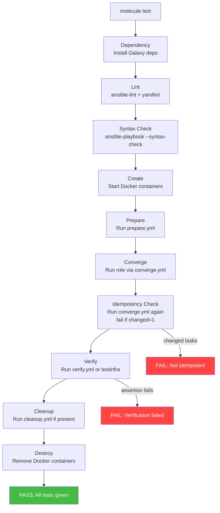
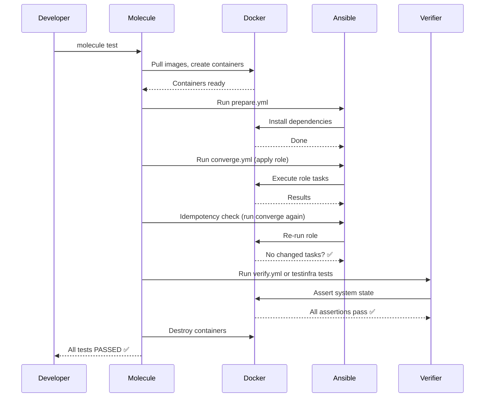

# Topic 18: Testing with Molecule

> 📍 Phase 3 — Advanced | Topic 18 of 28 | File: `18-testing-with-molecule.md`
> 🔗 Prev: `17-custom-modules-and-plugins.md` | Next: `19-ansible-galaxy.md`

---

## 🧠 Concept Overview

Untested Ansible roles are technical debt. A role that "works on my machine" may silently fail on Ubuntu 22.04, behave differently after an OS update, or break a handler that no one noticed wasn't running. **Molecule** is the standard testing framework for Ansible roles — it creates isolated environments, runs your role against them, and verifies the result with assertions.

Molecule turns role development from ad-hoc experimentation into a disciplined, repeatable engineering practice. Every role should have a Molecule test suite that runs in CI. This topic covers everything from basic setup to CI/CD pipeline integration.

---

## 📖 In-Depth Explanation

### Subtopic 18.1 — Molecule Architecture: Scenario, Driver, Verifier

#### Core concepts

```
Molecule
├── Scenario        ← a named test configuration (default is called "default")
│   ├── Driver      ← how instances are created (Docker, Vagrant, EC2, etc.)
│   ├── Platforms   ← what OS/versions to test on
│   ├── Provisioner ← how Ansible runs the role (always Ansible)
│   └── Verifier    ← how test results are checked (Ansible, Testinfra, Goss)
└── molecule.yml    ← the scenario configuration file
```

#### Installing Molecule

```bash
# Install Molecule with the Docker driver (most common)
pip install molecule molecule-docker

# Or with Podman
pip install molecule molecule-podman

# Or for testing against real VMs
pip install molecule molecule-vagrant

# Verify installation
molecule --version
```

---

#### Molecule directory structure

```
roles/nginx/
├── defaults/main.yml
├── handlers/main.yml
├── tasks/main.yml
├── templates/
└── molecule/
    ├── default/              ← the "default" scenario
    │   ├── molecule.yml      ← scenario configuration
    │   ├── converge.yml      ← playbook that applies the role
    │   ├── verify.yml        ← assertions (if using Ansible verifier)
    │   └── prepare.yml       ← optional pre-role setup
    └── alternative/          ← a second scenario (e.g. different OS)
        └── molecule.yml
```

---

#### `molecule.yml` — scenario configuration

```yaml
# molecule/default/molecule.yml
---
dependency:
  name: galaxy                      # install role dependencies from Galaxy
  options:
    ignore-certs: false
    ignore-errors: false
    requirements-file: requirements.yml

driver:
  name: docker                      # use Docker to create test instances

platforms:
  - name: ubuntu-22-04
    image: geerlingguy/docker-ubuntu2204-ansible:latest
    pre_build_image: true           # use pre-built image with Ansible/Python
    privileged: false
    volumes:
      - /sys/fs/cgroup:/sys/fs/cgroup:rw
    cgroupns_mode: host

  - name: ubuntu-20-04
    image: geerlingguy/docker-ubuntu2004-ansible:latest
    pre_build_image: true

  - name: rocky-9
    image: geerlingguy/docker-rockylinux9-ansible:latest
    pre_build_image: true

provisioner:
  name: ansible                     # always ansible
  playbooks:
    converge: converge.yml          # the playbook to run
    verify: verify.yml              # the verifier playbook
    prepare: prepare.yml            # optional prep before converge
  inventory:
    host_vars:
      ubuntu-22-04:
        ansible_user: root
  env:
    ANSIBLE_FORCE_COLOR: "1"        # coloured output in CI

verifier:
  name: ansible                     # use Ansible tasks as assertions
  # name: testinfra                 # or use Testinfra (Python)
  # name: goss                      # or use Goss (YAML assertions)

lint: |                             # run linting as part of molecule
  set -e
  ansible-lint
  yamllint .
```

---

#### `converge.yml` — apply the role

```yaml
# molecule/default/converge.yml
---
- name: Converge
  hosts: all
  become: true

  vars:
    # Override role defaults for testing
    nginx_http_port: 80
    nginx_ssl_enabled: false
    nginx_vhosts:
      - domain: test.local
        root: /var/www/test

  roles:
    - role: nginx    # the role being tested
```

---

#### `prepare.yml` — optional pre-role setup

```yaml
# molecule/default/prepare.yml
---
- name: Prepare
  hosts: all
  become: true

  tasks:
    - name: Update apt cache
      ansible.builtin.apt:
        update_cache: true
      when: ansible_os_family == "Debian"

    - name: Install test dependencies
      ansible.builtin.package:
        name: curl
        state: present
```

---

### Subtopic 18.2 — Writing Tests with Testinfra or Ansible-native Verifiers

#### Option A: Ansible verifier (default, no extra dependencies)

The Ansible verifier runs a playbook of assertions after the role converges:

```yaml
# molecule/default/verify.yml
---
- name: Verify
  hosts: all
  become: true
  gather_facts: false

  tasks:
    - name: Check that nginx package is installed
      ansible.builtin.package:
        name: nginx
        state: present
      check_mode: true      # don't change anything
      register: pkg_check
      failed_when: pkg_check.changed   # fail if 'present' would change = not installed

    - name: Check nginx service is running
      ansible.builtin.service:
        name: nginx
        state: started
      check_mode: true
      register: svc_check
      failed_when: svc_check.changed

    - name: Verify nginx config file is present
      ansible.builtin.stat:
        path: /etc/nginx/nginx.conf
      register: nginx_conf
      failed_when: not nginx_conf.stat.exists

    - name: Verify nginx is listening on port 80
      ansible.builtin.wait_for:
        port: 80
        timeout: 10

    - name: Verify nginx returns HTTP 200
      ansible.builtin.uri:
        url: http://localhost:80
        status_code: 200
      register: response
      failed_when: response.status != 200

    - name: Verify nginx config has correct worker processes
      ansible.builtin.shell: grep "worker_processes" /etc/nginx/nginx.conf
      register: worker_check
      changed_when: false
      failed_when: "'auto' not in worker_check.stdout"

    - name: Check nginx user exists
      ansible.builtin.getent:
        database: passwd
        key: www-data
      register: user_check
      failed_when: user_check is failed
```

---

#### Option B: Testinfra verifier (Python-based, more powerful)

Testinfra uses pytest and provides a rich API for system assertions:

```bash
# Install testinfra
pip install testinfra
```

```python
# molecule/default/tests/test_nginx.py
import testinfra.utils.ansible_runner

testinfra_hosts = testinfra.utils.ansible_runner.AnsibleRunner(
    '.molecule/default/inventory'
).get_hosts('all')


def test_nginx_is_installed(host):
    """Verify nginx package is installed."""
    pkg = host.package("nginx")
    assert pkg.is_installed
    # Optionally check version:
    # assert pkg.version.startswith("1.24")


def test_nginx_service_is_running(host):
    """Verify nginx service is running and enabled."""
    svc = host.service("nginx")
    assert svc.is_running
    assert svc.is_enabled


def test_nginx_config_exists(host):
    """Verify the nginx config file exists with correct permissions."""
    conf = host.file("/etc/nginx/nginx.conf")
    assert conf.exists
    assert conf.is_file
    assert conf.user == "root"
    assert conf.group == "root"
    assert conf.mode == 0o644


def test_nginx_listening_on_port_80(host):
    """Verify nginx is listening on port 80."""
    sock = host.socket("tcp://0.0.0.0:80")
    assert sock.is_listening


def test_nginx_process(host):
    """Verify nginx process is running."""
    nginx = host.process.filter(user="www-data", comm="nginx")
    assert len(nginx) > 0


def test_nginx_config_syntax(host):
    """Verify nginx config passes syntax check."""
    cmd = host.run("nginx -t")
    assert cmd.rc == 0
    assert "syntax is ok" in cmd.stderr


def test_vhost_config_deployed(host):
    """Verify the vhost config was deployed."""
    vhost = host.file("/etc/nginx/sites-available/test.local")
    assert vhost.exists
    assert "test.local" in vhost.content_string


def test_http_response(host):
    """Verify nginx returns HTTP 200 on port 80."""
    cmd = host.run("curl -s -o /dev/null -w '%{http_code}' http://localhost/")
    assert cmd.stdout == "200"
```

Enable Testinfra in `molecule.yml`:

```yaml
verifier:
  name: testinfra
  options:
    v: true           # verbose pytest output
    p: no:cacheprovider
```

---

### Subtopic 18.3 — CI/CD Integration for Molecule Pipelines

#### Running Molecule

```bash
# Full test lifecycle (create → prepare → converge → verify → destroy)
molecule test

# Step by step (for debugging)
molecule create      # create Docker containers
molecule prepare     # run prepare.yml
molecule converge    # apply the role
molecule verify      # run assertions
molecule destroy     # tear down containers

# Run convergence again without recreating
molecule converge

# Login to a test instance for debugging
molecule login --host ubuntu-22-04

# Run on a specific scenario
molecule test --scenario-name alternative

# Skip destroy after failure (for debugging)
molecule test --destroy never
```

---

#### GitHub Actions CI pipeline

```yaml
# .github/workflows/molecule.yml
name: Molecule Tests

on:
  push:
    branches: [main, develop]
  pull_request:
    branches: [main]

jobs:
  molecule:
    runs-on: ubuntu-latest
    strategy:
      matrix:
        scenario:
          - default
          - rocky9         # test multiple scenarios
      fail-fast: false     # continue other scenarios if one fails

    steps:
      - name: Checkout
        uses: actions/checkout@v4

      - name: Set up Python
        uses: actions/setup-python@v5
        with:
          python-version: '3.11'

      - name: Install dependencies
        run: |
          pip install molecule molecule-docker ansible ansible-lint yamllint testinfra

      - name: Run Molecule tests
        run: molecule test --scenario-name ${{ matrix.scenario }}
        env:
          PY_COLORS: '1'
          ANSIBLE_FORCE_COLOR: '1'

      - name: Upload test results on failure
        if: failure()
        uses: actions/upload-artifact@v4
        with:
          name: molecule-logs-${{ matrix.scenario }}
          path: ~/.cache/molecule/
```

---

#### GitLab CI pipeline

```yaml
# .gitlab-ci.yml
stages:
  - lint
  - test

variables:
  PY_COLORS: "1"
  ANSIBLE_FORCE_COLOR: "1"

lint:
  stage: lint
  image: python:3.11
  before_script:
    - pip install ansible-lint yamllint
  script:
    - ansible-lint roles/nginx/
    - yamllint roles/nginx/

molecule-default:
  stage: test
  image: python:3.11
  services:
    - docker:dind
  variables:
    DOCKER_HOST: tcp://docker:2376
    DOCKER_TLS_CERTDIR: "/certs"
  before_script:
    - pip install molecule molecule-docker ansible testinfra
  script:
    - cd roles/nginx && molecule test
  artifacts:
    when: on_failure
    paths:
      - roles/nginx/.molecule/

molecule-rhel:
  stage: test
  extends: molecule-default
  script:
    - cd roles/nginx && molecule test --scenario-name rocky9
```

---

#### Multi-platform testing matrix

```yaml
# molecule/default/molecule.yml — test on 4 platforms simultaneously
platforms:
  - name: ubuntu-2404
    image: geerlingguy/docker-ubuntu2404-ansible:latest
    pre_build_image: true

  - name: ubuntu-2204
    image: geerlingguy/docker-ubuntu2204-ansible:latest
    pre_build_image: true

  - name: debian-12
    image: geerlingguy/docker-debian12-ansible:latest
    pre_build_image: true

  - name: rocky-9
    image: geerlingguy/docker-rockylinux9-ansible:latest
    pre_build_image: true
```

```bash
# All four platforms run in parallel during molecule test
# molecule verify output:
# ubuntu-2404: PASSED
# ubuntu-2204: PASSED
# debian-12:   PASSED
# rocky-9:     PASSED
```

---

## 🏗️ Architecture & System Design

Molecule test lifecycle architecture:



---

## 🔄 Flow / Lifecycle



---

## 💻 Code Examples

### ✅ Example 1: Complete Molecule setup for an nginx role

```bash
# Scaffold molecule in an existing role
cd roles/nginx
molecule init scenario --driver-name docker

# Or create from scratch with a specific driver
molecule init role myrole --driver-name docker
```

```yaml
# molecule/default/molecule.yml
---
dependency:
  name: galaxy
driver:
  name: docker
platforms:
  - name: ubuntu-2204
    image: geerlingguy/docker-ubuntu2204-ansible:latest
    pre_build_image: true
    privileged: true    # needed for systemd testing
provisioner:
  name: ansible
  inventory:
    host_vars:
      ubuntu-2204:
        nginx_http_port: 8080    # override defaults for testing
verifier:
  name: ansible
lint: |
  set -e
  ansible-lint
```

### ✅ Example 2: Testing idempotency explicitly

Molecule runs the converge playbook twice by default — the second run must have zero `changed` tasks. But you can also write an explicit idempotency test:

```yaml
# In verify.yml
- name: Verify idempotency by re-applying role in check mode
  hosts: all
  become: true

  tasks:
    - name: Re-run role tasks in check mode
      ansible.builtin.import_role:
        name: nginx
      check_mode: true
      register: idempotency_check

    - name: Assert no changes on second run
      ansible.builtin.assert:
        that: not idempotency_check.changed
        fail_msg: "Role is NOT idempotent — tasks changed on second run"
        success_msg: "Role is idempotent ✅"
```

### ✅ Example 3: Testing with `ansible.builtin.assert`

```yaml
# molecule/default/verify.yml
- name: Verify nginx role
  hosts: all
  become: true
  gather_facts: true

  tasks:
    - name: Collect nginx service facts
      ansible.builtin.service_facts:

    - name: Assert nginx is installed and running
      ansible.builtin.assert:
        that:
          - "'nginx' in ansible_facts.packages"
          - "ansible_facts.services['nginx.service'].state == 'running'"
          - "ansible_facts.services['nginx.service'].status == 'enabled'"
        fail_msg: "nginx is not properly installed/running"

    - name: Get nginx config content
      ansible.builtin.slurp:
        src: /etc/nginx/nginx.conf
      register: nginx_conf_b64

    - name: Assert config has expected values
      ansible.builtin.assert:
        that:
          - "'worker_processes' in nginx_conf_b64.content | b64decode"
          - "'worker_connections' in nginx_conf_b64.content | b64decode"
        fail_msg: "nginx.conf missing expected configuration"

    - name: Assert nginx responds on expected port
      ansible.builtin.uri:
        url: "http://localhost:{{ nginx_http_port | default(80) }}"
        status_code: [200, 301, 302]
      register: http_check

    - name: Assert HTTP response
      ansible.builtin.assert:
        that: http_check.status in [200, 301, 302]
        fail_msg: "nginx not responding on port {{ nginx_http_port | default(80) }}"
```

### ✅ Example 4: Multiple scenarios for different configurations

```
molecule/
├── default/           ← basic nginx install
│   └── molecule.yml
├── with-ssl/          ← nginx with SSL enabled
│   ├── molecule.yml
│   └── converge.yml
└── rhel/              ← RedHat family platforms only
    └── molecule.yml
```

```yaml
# molecule/with-ssl/converge.yml
- name: Converge with SSL
  hosts: all
  become: true
  vars:
    nginx_ssl_enabled: true
    nginx_ssl_cert: /etc/ssl/certs/test.crt
    nginx_ssl_key: /etc/ssl/private/test.key
    # Use self-signed cert for testing
  roles:
    - role: ssl_cert_generate    # helper role
    - role: nginx
```

```bash
# Run all scenarios
molecule test --all

# Run specific scenario
molecule test --scenario-name with-ssl
```

### ❌ Anti-pattern — Testing without idempotency check

```yaml
# ❌ verify.yml that only checks the end state — misses idempotency bugs
- name: Verify
  hosts: all
  tasks:
    - name: Check nginx is running
      ansible.builtin.service:
        name: nginx
        state: started
      check_mode: true

# ✅ Molecule automatically runs converge twice — second run must show no changes
# This catches tasks that use command/shell without changed_when,
# or tasks that re-create resources they should only create once
```

---

## ⚙️ Configuration & Options

### Molecule lifecycle commands

| Command | What it does |
|---------|-------------|
| `molecule create` | Create instances (pull images, start containers) |
| `molecule prepare` | Run `prepare.yml` |
| `molecule converge` | Run `converge.yml` (apply role) |
| `molecule idempotence` | Run converge again, fail if changed |
| `molecule verify` | Run verifier (verify.yml or testinfra) |
| `molecule destroy` | Tear down instances |
| `molecule test` | Full lifecycle: create→prepare→converge→idempotence→verify→destroy |
| `molecule test --destroy never` | Full lifecycle but leave instances running on failure |
| `molecule login` | SSH into a test instance |
| `molecule list` | Show running instances |
| `molecule reset` | Reset Molecule state |

### Popular Docker images for testing

| Image | OS | Notes |
|-------|----|-------|
| `geerlingguy/docker-ubuntu2404-ansible` | Ubuntu 24.04 | systemd-capable |
| `geerlingguy/docker-ubuntu2204-ansible` | Ubuntu 22.04 | systemd-capable |
| `geerlingguy/docker-debian12-ansible` | Debian 12 | systemd-capable |
| `geerlingguy/docker-rockylinux9-ansible` | Rocky Linux 9 | systemd-capable |
| `geerlingguy/docker-amazonlinux2023-ansible` | Amazon Linux 2023 | |

> Jeff Geerling's pre-built images are the community standard for Molecule testing — they include Python, Ansible, and systemd capability pre-configured.

---

## 🧩 Patterns & Best Practices

**What experienced engineers do:**
- Run `molecule test` before every `git push` — make it a local pre-push hook
- Test on multiple platforms in the matrix (`ubuntu-22.04`, `ubuntu-24.04`, `rocky-9`) — roles that only work on one distro are incomplete
- Write verify.yml tests that check the *outcome*, not just whether tasks ran — test that nginx responds on the correct port, not just that the task completed
- Use `molecule test --destroy never` when debugging — lets you `molecule login` to inspect the state after failure
- Include linting (`ansible-lint`, `yamllint`) in the `lint:` section of `molecule.yml` — single command for full quality check

**What beginners typically get wrong:**
- Not testing idempotency — a role that installs correctly but fails on second run will break AWX re-runs and `--check` workflows
- Writing verify tasks that duplicate the converge tasks — the verifier should check system state (nginx is running), not re-run Ansible tasks (service module again)
- Not cleaning up — leaving containers running after failed tests fills disk and causes port conflicts
- Testing only the happy path — add a second scenario that tests with a non-default configuration (different port, SSL enabled, etc.)
- Skipping multi-platform testing — OS differences (service names, package names, config paths) are the most common source of real-world role failures

**Senior-level nuance:**
- For roles that manage system services, you need Docker images with systemd support (the geerlingguy images provide this). Without systemd, service management tasks will fail — use `--privileged` and the appropriate cgroup mounts.
- In large monorepos with many roles, running `molecule test` on every role per PR is slow. Use a change-detection step in CI that only runs Molecule for roles whose files changed in the PR — `git diff --name-only origin/main | grep ^roles/ | cut -d/ -f1-2 | sort -u`.

---

## 🔗 How It Connects

- **Builds on:** `17-custom-modules-and-plugins.md` — custom modules need Molecule tests just like roles do; the same framework applies
- **Leads to:** `19-ansible-galaxy.md` — roles published to Galaxy should have passing Molecule tests; Galaxy CI runs them automatically
- **Related concepts:** Topic 12 (Roles — Molecule tests roles by definition), Topic 25 (CI/CD — Molecule is the core of an Ansible CI pipeline), Topic 27 (Security hardening — Molecule can run Inspec/Goss compliance checks as the verifier)

---

## 🎯 Interview Questions (Conceptual)

**Q1: What is Molecule and what problem does it solve?**
> **A:** Molecule is a testing framework for Ansible roles. It solves the problem of testing automation code in isolation — without Molecule, the only way to test a role is to run it against a real server and manually inspect the result. Molecule creates ephemeral test environments (Docker containers, VMs), applies the role, checks idempotency automatically, and runs assertions — all in a repeatable, CI-friendly way.

**Q2: What is the idempotency check in Molecule and why does it matter?**
> **A:** After the initial converge, Molecule runs the role a second time and fails if any task reports `changed`. This catches roles that aren't truly idempotent — most commonly `command`/`shell` tasks without `changed_when`, tasks that re-create resources on every run, or handlers that fire unnecessarily. Idempotency failures in testing predict failures in production where AWX re-runs or `--check` runs would behave incorrectly.

**Q3: What is the difference between the Ansible verifier and Testinfra?**
> **A:** The Ansible verifier uses Ansible tasks and `assert` module for assertions — no extra dependencies, natural for Ansible engineers. Testinfra uses pytest and provides a rich Python API for system state inspection (`host.package()`, `host.service()`, `host.socket()`, `host.file()`) — more powerful and expressive, especially for complex state verification. Testinfra tests also integrate into existing pytest suites. Choose Ansible verifier for simplicity; Testinfra for complex assertions or when your team already uses pytest.

**Q4: How does Molecule handle testing across multiple operating systems?**
> **A:** The `platforms:` section of `molecule.yml` lists multiple Docker images — one per OS. Molecule creates and runs tests on all of them in parallel. Each platform gets its own container, runs the full converge and verify cycle, and reports results independently. A role passes only when all platforms pass.

**Q5: What does `molecule login` do and when would you use it?**
> **A:** `molecule login` opens an interactive shell inside a running test container. You use it during debugging — after a `molecule converge` or a failed `molecule test --destroy never`, you log in to manually inspect the system state, run commands, check log files, or re-run tasks manually. It's the Molecule equivalent of SSH-ing into a test server.

---

## 🧠 Scenario-Based Interview Problems

**Scenario 1: "Your nginx role passes on Ubuntu 22.04 but CI fails on Rocky Linux 9. You don't have a Rocky Linux machine to debug on. How do you investigate?"**
> **Problem:** Platform-specific failure in CI with no local access to that OS.
> **Approach:** Run `molecule test --scenario-name rocky9 --destroy never` locally. When it fails, run `molecule login --host rocky-9` to get a shell inside the container. Manually re-run the failing task or inspect the system state. Common Rocky Linux differences: package name is `httpd` not `nginx` for Apache, service names differ, `dnf` not `apt`, SELinux contexts. Add `--skip-tags` to narrow down which tasks fail. Fix the role to handle both families, add an `ansible_os_family` conditional, verify both pass, then push.
> **Trade-offs:** `--destroy never` leaves containers running — always clean up with `molecule destroy` when done. Document OS-specific caveats in the role's README.

**Scenario 2: "Your team has 15 roles and CI takes 45 minutes because every role's Molecule tests run on every PR. How do you optimise this?"**
> **Problem:** Full test suite too slow for rapid iteration.
> **Approach:** Implement change detection in CI: use `git diff --name-only origin/main | grep '^roles/' | awk -F/ '{print $2}' | sort -u` to get the list of changed roles, then run Molecule only for those roles. In GitHub Actions, use a `matrix` strategy dynamically populated from the changed roles list. Run all role tests nightly (scheduled workflow) for full regression coverage. Additionally, split the `molecule test` pipeline: run `lint + syntax-check` (fast) on every PR and `full molecule test` only on merge to main — shorter feedback loops for developers.
> **Trade-offs:** Change-based testing can miss cross-role failures (role A changes but breaks role B that depends on it). Compensate with nightly full-suite runs and explicit role dependency testing.

---

## ⚡ Quick Notes — Revision Card

- 📌 Molecule = testing framework for Ansible roles → create → converge → idempotency → verify → destroy
- 📌 **Scenario** = named test config | **Driver** = how instances created | **Verifier** = how assertions run
- 📌 `molecule test` = full lifecycle | `molecule converge` = apply role only | `molecule verify` = assertions only
- 📌 Idempotency check = run converge TWICE, fail if any task `changed` on 2nd run
- 📌 `converge.yml` = applies the role | `verify.yml` = asserts end state | `prepare.yml` = pre-role setup
- 📌 `molecule login` = interactive shell in test container (for debugging)
- 📌 `molecule test --destroy never` = leave containers running after failure (for debugging)
- 📌 Ansible verifier = no extra deps | Testinfra = rich Python API, uses pytest
- ⚠️ Test on multiple platforms — `ubuntu-2204`, `rocky-9`, `debian-12` at minimum
- ⚠️ Verify outcomes (nginx responds HTTP 200), not just that tasks ran (service module ran)
- ⚠️ Systemd roles need Docker images with systemd support + `privileged: true`
- 💡 `geerlingguy/docker-ubuntu2204-ansible` = de-facto standard Molecule Docker image
- 🔑 Run Molecule in CI on every PR — untested roles are technical debt, not automation

---

## 🔖 References & Further Reading

- 📄 [Molecule Official Docs](https://ansible.readthedocs.io/projects/molecule/)
- 📄 [molecule-docker driver](https://github.com/ansible-community/molecule-docker)
- 📄 [Testinfra documentation](https://testinfra.readthedocs.io/)
- 📝 [Jeff Geerling — Testing Ansible Roles with Molecule](https://www.jeffgeerling.com/blog/2018/testing-your-ansible-roles-molecule)
- 🎥 [Molecule Testing Workflow (YouTube)](https://www.youtube.com/watch?v=DAnMyBZ8-Qs)
- 📚 *Ansible for DevOps* — Jeff Geerling (Chapter 11)
- ➡️ Related in this course: [`17-custom-modules-and-plugins.md`] · [`19-ansible-galaxy.md`]

---
