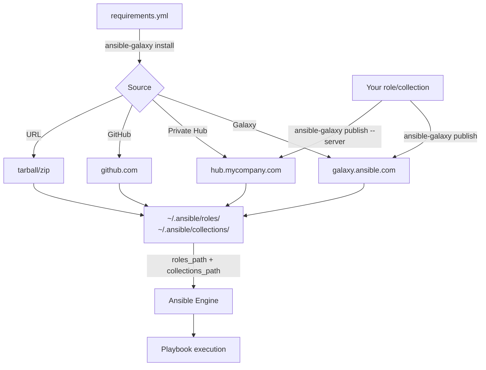
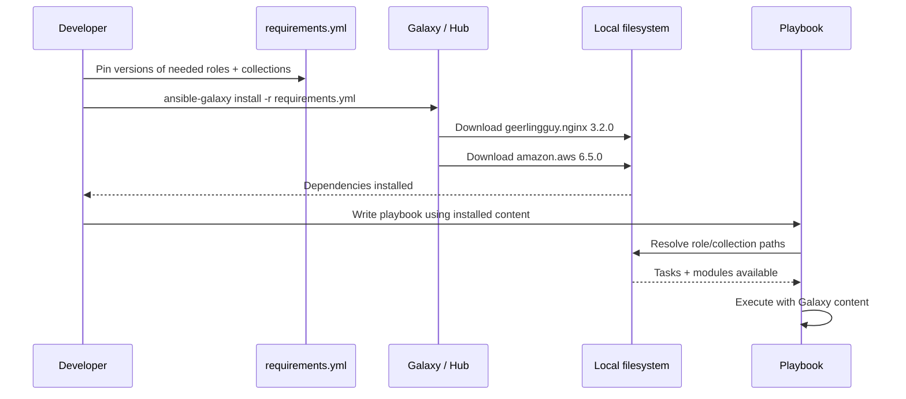

# Topic 19: Ansible Galaxy

> 📍 Phase 3 — Advanced | Topic 19 of 28 | File: `19-ansible-galaxy.md`
> 🔗 Prev: `18-testing-with-molecule.md` | Next: `20-performance-and-scaling.md`

---

## 🧠 Concept Overview

Ansible Galaxy is the community hub for sharing and consuming Ansible roles and collections. Instead of writing an nginx role from scratch, you can install a battle-tested, community-maintained one in seconds. Instead of building AWS EC2 modules yourself, you install the `amazon.aws` collection and get hundreds of modules immediately.

Galaxy is also the distribution mechanism for your own work. A role or collection you write once can be shared with your whole organisation via Galaxy or a private Automation Hub — eliminating duplicate automation across teams.

This topic covers both sides: consuming Galaxy content efficiently with `requirements.yml`, and publishing your own roles and collections with proper versioning and metadata.

---

## 📖 In-Depth Explanation

### Subtopic 19.1 — Installing Roles and Collections from Galaxy

#### Installing roles

```bash
# Install a role from Galaxy
ansible-galaxy role install geerlingguy.nginx

# Install a specific version
ansible-galaxy role install geerlingguy.nginx,3.2.0

# Install from a GitHub repo directly
ansible-galaxy role install git+https://github.com/geerlingguy/ansible-role-nginx.git

# Install from a tarball URL
ansible-galaxy role install https://example.com/myrole.tar.gz

# Install to a specific path
ansible-galaxy role install --roles-path ./roles geerlingguy.nginx

# List installed roles
ansible-galaxy role list

# Remove a role
ansible-galaxy role remove geerlingguy.nginx

# Get info about a role
ansible-galaxy role info geerlingguy.nginx

# Search Galaxy for roles
ansible-galaxy role search nginx --author geerlingguy
```

Roles install to `~/.ansible/roles/` by default, or to the first path in `roles_path` from `ansible.cfg`.

---

#### Installing collections

Collections are the modern packaging unit — they bundle modules, plugins, roles, and playbooks under a namespace.

```bash
# Install a collection
ansible-galaxy collection install amazon.aws

# Install a specific version
ansible-galaxy collection install amazon.aws:6.5.0

# Install with version constraint
ansible-galaxy collection install 'amazon.aws:>=5.0.0,<7.0.0'

# Install to a specific path
ansible-galaxy collection install amazon.aws --collections-path ./collections

# List installed collections
ansible-galaxy collection list

# Verify collection integrity
ansible-galaxy collection verify amazon.aws
```

Collections install to `~/.ansible/collections/` by default, or to the first path in `collections_path` from `ansible.cfg`.

---

#### Using installed content

```yaml
# Using a Galaxy role
- name: Configure web server
  hosts: webservers
  roles:
    - geerlingguy.nginx    # namespace.rolename format

# Using a Galaxy collection module (FQCN)
- name: Create EC2 instance
  hosts: localhost
  tasks:
    - name: Launch instance
      amazon.aws.ec2_instance:    # namespace.collection.module
        name: my-instance
        instance_type: t3.micro
        image_id: ami-0c55b159cbfafe1f0
        region: eu-west-1
```

---

### Subtopic 19.2 — `requirements.yml` for Reproducible Dependencies

A `requirements.yml` file pins all your external dependencies — roles and collections — so every team member and CI runner installs the exact same versions.

#### Full `requirements.yml` structure

```yaml
# requirements.yml
---
# ── Collections ─────────────────────────────────────────────────────────────
collections:
  # From Galaxy (namespace.collection)
  - name: amazon.aws
    version: "6.5.0"          # exact pin (recommended for production)

  - name: community.general
    version: ">=7.0.0"        # minimum version constraint

  - name: community.postgresql
    version: ">=3.0.0,<4.0.0" # range constraint

  - name: ansible.posix
    version: "1.5.4"

  # From a private Automation Hub
  - name: myorg.internal_tools
    version: "2.1.0"
    source: https://hub.mycompany.com/api/galaxy/

  # From a Git repo (for development)
  - name: myorg.experimental
    type: git
    source: https://github.com/myorg/ansible-collection-experimental.git
    version: main             # or a tag/commit SHA

# ── Roles ────────────────────────────────────────────────────────────────────
roles:
  # From Galaxy
  - name: geerlingguy.nginx
    version: "3.2.0"

  - name: geerlingguy.docker
    version: "6.1.0"

  # From GitHub directly
  - name: my_custom_role
    src: https://github.com/myorg/ansible-role-custom.git
    scm: git
    version: v1.2.0

  # From a tarball
  - name: legacy_role
    src: https://example.com/legacy-role-1.0.tar.gz
```

#### Installing from requirements.yml

```bash
# Install all dependencies
ansible-galaxy install -r requirements.yml

# Install only collections
ansible-galaxy collection install -r requirements.yml

# Install only roles
ansible-galaxy role install -r requirements.yml

# Force reinstall (upgrade to pinned versions)
ansible-galaxy install -r requirements.yml --force

# Install to project-local paths (for isolated environments)
ansible-galaxy collection install -r requirements.yml \
  --collections-path ./collections
ansible-galaxy role install -r requirements.yml \
  --roles-path ./roles
```

#### Recommended `ansible.cfg` for project-local installs

```ini
[defaults]
roles_path      = ./roles:~/.ansible/roles
collections_path = ./collections:~/.ansible/collections
```

This way, project-local installs (from `requirements.yml`) take precedence over globally installed versions.

---

#### Locking versions for CI reproducibility

```bash
# After verifying everything works, lock to exact versions
# For collections, list what's installed:
ansible-galaxy collection list --format json | python3 -c "
import json, sys
data = json.load(sys.stdin)
for ns_col, info in data.items():
    print(f'  - name: {ns_col}')
    print(f'    version: \"{info[\"version\"]}\"')
"
```

> 💡 Treat `requirements.yml` like a `package-lock.json` — commit it to Git and update it deliberately. Unpinned dependencies that auto-upgrade in CI are a common source of "it worked yesterday" failures.

---

### Subtopic 19.3 — Publishing Your Own Role/Collection to Galaxy

#### Publishing a role to Galaxy

**Step 1: Prepare `meta/main.yml`**

```yaml
# roles/nginx/meta/main.yml
galaxy_info:
  role_name: nginx            # will be: yourusername.nginx on Galaxy
  author: yourusername
  description: Install and configure nginx web server
  license: MIT
  min_ansible_version: "2.14"

  platforms:
    - name: Ubuntu
      versions: [20.04, 22.04, 24.04]
    - name: EL              # Enterprise Linux (RHEL, Rocky, AlmaLinux)
      versions: [8, 9]
    - name: Debian
      versions: [bullseye, bookworm]

  galaxy_tags:
    - web
    - nginx
    - reverse_proxy
    - ssl

dependencies: []
```

**Step 2: Ensure the role has a good README.md**

```markdown
# yourusername.nginx

Installs and configures nginx web server on Debian and RedHat family systems.

## Requirements
- Ansible 2.14+

## Role Variables
| Variable | Default | Description |
|----------|---------|-------------|
| `nginx_http_port` | `80` | HTTP listen port |
| `nginx_ssl_enabled` | `false` | Enable HTTPS |
| `nginx_vhosts` | `[]` | List of virtual hosts |

## Example Playbook
\`\`\`yaml
- hosts: webservers
  roles:
    - role: yourusername.nginx
      vars:
        nginx_http_port: 80
        nginx_vhosts:
          - domain: example.com
            root: /var/www/example
\`\`\`

## License
MIT
```

**Step 3: Import to Galaxy**

```bash
# Galaxy imports directly from GitHub
# 1. Push your role to GitHub as: github.com/yourusername/ansible-role-nginx
# 2. Go to https://galaxy.ansible.com → Login with GitHub → My Roles → Add Role
# 3. Or use the CLI:

ansible-galaxy role import yourusername ansible-role-nginx

# Trigger re-import after an update (GitHub push)
ansible-galaxy role import yourusername ansible-role-nginx
```

Galaxy's naming convention: the GitHub repo `ansible-role-nginx` becomes the Galaxy role `yourusername.nginx` (the `ansible-role-` prefix is stripped).

---

#### Publishing a collection to Galaxy

```bash
# Step 1: Build the collection
ansible-galaxy collection build myorg/mytools/
# Creates: myorg-mytools-1.0.0.tar.gz

# Step 2: Publish to Galaxy
ansible-galaxy collection publish myorg-mytools-1.0.0.tar.gz \
  --api-key YOUR_GALAXY_API_KEY

# Or publish to a private Automation Hub
ansible-galaxy collection publish myorg-mytools-1.0.0.tar.gz \
  --server https://hub.mycompany.com/api/galaxy/
```

**`galaxy.yml` for a collection:**

```yaml
# collections/ansible_collections/myorg/mytools/galaxy.yml
namespace: myorg
name: mytools
version: 1.2.0
readme: README.md
description: Internal automation tools for MyOrg

authors:
  - Your Name <you@example.com>

license:
  - MIT

tags:
  - cloud
  - internal
  - aws

dependencies:
  amazon.aws: ">=6.0.0"
  community.general: ">=7.0.0"

repository: https://github.com/myorg/ansible-collection-mytools
documentation: https://docs.myorg.com/ansible
issues: https://github.com/myorg/ansible-collection-mytools/issues
```

---

#### Semantic versioning for Galaxy content

Galaxy enforces semantic versioning (`MAJOR.MINOR.PATCH`):

| Version bump | When to use |
|-------------|-------------|
| `PATCH` (1.0.1) | Bug fixes, no behaviour change |
| `MINOR` (1.1.0) | New features, backwards compatible |
| `MAJOR` (2.0.0) | Breaking changes — variable renames, removed features |

```bash
# Collection versioning workflow
# 1. Update version in galaxy.yml
sed -i 's/version: 1.1.0/version: 1.2.0/' galaxy.yml

# 2. Update CHANGELOG.md
# 3. Commit and tag
git tag v1.2.0
git push origin v1.2.0

# 4. Build and publish
ansible-galaxy collection build
ansible-galaxy collection publish myorg-mytools-1.2.0.tar.gz
```

---

## 🏗️ Architecture & System Design

How Galaxy content flows into a project:



---

## 🔄 Flow / Lifecycle



---

## 💻 Code Examples

### ✅ Example 1: Production-ready requirements.yml + install workflow

```yaml
# requirements.yml
---
collections:
  - name: amazon.aws
    version: "6.5.0"
  - name: community.general
    version: "8.1.0"
  - name: community.postgresql
    version: "3.2.0"
  - name: ansible.posix
    version: "1.5.4"
  - name: community.docker
    version: "3.4.11"

roles:
  - name: geerlingguy.nginx
    version: "3.2.0"
  - name: geerlingguy.certbot
    version: "5.1.0"
  - name: geerlingguy.docker
    version: "6.1.0"
```

```bash
# Makefile target for dependency management
deps:
	ansible-galaxy collection install -r requirements.yml --force
	ansible-galaxy role install -r requirements.yml --force

# CI step (GitHub Actions)
- name: Install Ansible dependencies
  run: |
    ansible-galaxy collection install -r requirements.yml
    ansible-galaxy role install -r requirements.yml
```

### ✅ Example 2: Using a Galaxy role in a real playbook

```yaml
# site.yml — using geerlingguy.nginx from Galaxy
- name: Configure web servers
  hosts: webservers
  become: true

  vars:
    nginx_vhosts:
      - listen: "80"
        server_name: "example.com"
        root: "/var/www/example"
        index: "index.html"
        extra_parameters: |
          location / {
              try_files $uri $uri/ =404;
          }
    nginx_remove_default_vhost: true

  roles:
    - geerlingguy.nginx
```

### ✅ Example 3: Private collection with project-local install

```ini
# ansible.cfg — project-local collection path takes precedence
[defaults]
collections_path = ./collections:~/.ansible/collections
roles_path       = ./roles:~/.ansible/roles
```

```bash
# Install to project-local path (checked into git or .gitignore'd)
ansible-galaxy collection install -r requirements.yml \
  --collections-path ./collections

# Add to .gitignore if you don't want to commit vendored collections
echo "collections/" >> .gitignore

# Or commit them for fully offline/air-gapped environments
git add collections/
```

### ✅ Example 4: Galaxy CI integration — testing before publish

```yaml
# .github/workflows/release.yml
name: Galaxy Release

on:
  push:
    tags: ['v*']

jobs:
  molecule-test:
    runs-on: ubuntu-latest
    steps:
      - uses: actions/checkout@v4
      - name: Install test deps
        run: pip install molecule molecule-docker ansible
      - name: Run Molecule tests
        run: molecule test

  publish-to-galaxy:
    needs: molecule-test    # only publish if tests pass
    runs-on: ubuntu-latest
    steps:
      - uses: actions/checkout@v4
      - name: Install Ansible
        run: pip install ansible

      - name: Build collection
        run: ansible-galaxy collection build

      - name: Publish to Galaxy
        run: |
          ansible-galaxy collection publish \
            $(ls *.tar.gz | head -1) \
            --api-key ${{ secrets.GALAXY_API_KEY }}
```

### ❌ Anti-pattern — Unpinned requirements.yml

```yaml
# ❌ No version pins — will install whatever is latest today
collections:
  - name: amazon.aws          # could be 5.x or 7.x depending on when installed
  - name: community.general   # breaking changes between major versions

# ✅ Always pin to an exact version or a tested range
collections:
  - name: amazon.aws
    version: "6.5.0"          # exact pin for reproducibility
  - name: community.general
    version: ">=8.0.0,<9.0.0" # range that avoids next major version
```

---

## ⚙️ Configuration & Options

### `ansible.cfg` for Galaxy

```ini
[defaults]
roles_path       = ./roles:~/.ansible/roles:/etc/ansible/roles
collections_path = ./collections:~/.ansible/collections

[galaxy]
server_list = automation_hub, release_galaxy

[galaxy_server.automation_hub]
url          = https://cloud.redhat.com/api/automation-hub/
auth_url     = https://sso.redhat.com/auth/realms/redhat-external/protocol/openid-connect/token
token        = your_offline_token_here

[galaxy_server.release_galaxy]
url          = https://galaxy.ansible.com/
```

### `ansible-galaxy` command reference

| Command | Description |
|---------|-------------|
| `role install <name>` | Install a role from Galaxy |
| `role install -r requirements.yml` | Install all roles from requirements |
| `role list` | List installed roles |
| `role remove <name>` | Remove an installed role |
| `role info <name>` | Show role metadata |
| `role import <github_user> <repo>` | Import role from GitHub to Galaxy |
| `collection install <ns.col>` | Install a collection |
| `collection install -r requirements.yml` | Install from requirements |
| `collection list` | List installed collections |
| `collection build` | Build a collection tarball |
| `collection publish <tarball>` | Publish to Galaxy or Hub |
| `collection verify <ns.col>` | Verify collection integrity |

---

## 🧩 Patterns & Best Practices

**What experienced engineers do:**
- Always pin versions in `requirements.yml` — treat it like a lockfile and update deliberately
- Commit `requirements.yml` to the repo, commit `collections/` only for air-gapped environments
- Add `ansible-galaxy install -r requirements.yml` as the first step of every CI pipeline — ensures fresh, reproducible installs
- Prefer collections over standalone roles for new projects — they're namespaced, versioned, and the future of Galaxy content distribution
- Before adopting a Galaxy role, check: star count, recent commits, open issues, Molecule test suite, platform support list

**What beginners typically get wrong:**
- Not using `requirements.yml` at all — installing roles manually with `ansible-galaxy install` with no version record
- Using `latest` or no version constraint — breaks CI when a new major version introduces breaking changes
- Installing collections globally (`~/.ansible/collections`) in CI — state bleeds between jobs, causes non-reproducible builds
- Publishing roles to Galaxy without a README or `meta/main.yml` — other users can't understand or use them
- Trusting Galaxy roles without reviewing them — any public user can publish; always audit roles before running them with `become: true`

**Senior-level nuance:**
- For enterprise environments, use Red Hat's **Private Automation Hub** (or the community **Galaxy NG**) instead of public Galaxy. This gives you: vetted, approved content only; internal collection hosting; no external internet dependency during deploys; RBAC over who can publish/install. It's a critical security control — public Galaxy has no content vetting.
- The `ansible-galaxy collection verify` command checksums all files against the Galaxy manifest. Run it in CI after install to detect tampering or corrupted downloads.

---

## 🔗 How It Connects

- **Builds on:** `18-testing-with-molecule.md` — Galaxy roles should ship with passing Molecule tests; good Galaxy citizens run CI before publishing
- **Leads to:** `20-performance-and-scaling.md` — entering Phase 4, where we operate Ansible at production scale
- **Related concepts:** Topic 12 (Roles — what gets published to Galaxy), Topic 26 (Collections development — the full packaging story for enterprise distribution)

---

## 🎯 Interview Questions (Conceptual)

**Q1: What is the difference between a Galaxy role and a Galaxy collection?**
> **A:** A role is a single unit of automation for one concern — installing nginx, setting up PostgreSQL. A collection is a namespace-scoped bundle that can contain multiple roles, modules, plugins, playbooks, and documentation under a single versioned package. Collections are the modern standard: they support semantic versioning, dependency declarations, and are the primary distribution mechanism for vendor content like `amazon.aws` and `community.general`.

**Q2: Why should you always pin versions in `requirements.yml`?**
> **A:** Unpinned dependencies install the latest available version at install time. When a collection releases a new major version with breaking changes, your CI pipeline that worked yesterday suddenly fails today — with no change to your playbooks. Pinning creates reproducibility: the same `requirements.yml` installs the same content on every developer machine, CI runner, and production control node. Update versions deliberately and test the upgrade.

**Q3: What is `ansible-galaxy collection verify` and when would you use it?**
> **A:** It downloads the manifest for an installed collection from Galaxy and checksums every file against it, detecting file corruption or tampering. Use it in security-sensitive environments to confirm that installed collections haven't been modified after download, or as part of a supply-chain security check in CI.

**Q4: What are the naming conventions for Galaxy roles and collections?**
> **A:** Roles follow `namespace.rolename` — the namespace is your Galaxy username, and the role name is the GitHub repo name with the `ansible-role-` prefix stripped (e.g. repo `ansible-role-nginx` → role `yourusername.nginx`). Collections follow `namespace.collection` (e.g. `amazon.aws`, `community.general`). FQCNs for modules inside collections are `namespace.collection.module_name`.

**Q5: What is Private Automation Hub and why would an enterprise use it instead of public Galaxy?**
> **A:** Private Automation Hub (Red Hat) or Galaxy NG (community) is a self-hosted Galaxy server that gives organisations control over which content is approved for internal use. Benefits: no dependency on internet connectivity during deploys; content vetting before internal publication; RBAC over who can publish or consume content; immutable collection versions (public Galaxy allows overwriting); audit logging of all downloads. Critical for regulated industries or air-gapped environments.

---

## 🧠 Scenario-Based Interview Problems

**Scenario 1: "Your CI pipeline installs Ansible Galaxy dependencies on every run, taking 3-4 minutes each time. The pipeline runs 50 times a day. How do you speed this up?"**
> **Problem:** Repeated slow dependency installs with no caching.
> **Approach:** Add dependency caching to CI. In GitHub Actions, cache `~/.ansible/collections` and `~/.ansible/roles` keyed on a hash of `requirements.yml`. If the file hasn't changed, the cache restores in seconds. Also consider vendoring: install collections to a `./collections/` directory in the repo — checked in, so no network calls during CI. For large teams with many repos, run a private Automation Hub that mirrors the required Galaxy content — installs come from your LAN rather than the internet.
> **Trade-offs:** Vendored collections bloat the repo (collections can be hundreds of MB). Cache-based approaches require cache invalidation logic and can have stale-cache bugs. Automation Hub is the cleanest enterprise solution but has operational overhead.

**Scenario 2: "A junior engineer installs a Galaxy role they found that has 50 stars and runs it with `become: true` against production. The role modifies iptables in unexpected ways. How do you prevent this going forward?"**
> **Problem:** Unvetted public content running with root privileges in production.
> **Approach:** Implement a content governance policy: (1) All Galaxy content must go through a review process before being added to `requirements.yml`. (2) Use Private Automation Hub — only approved, organisation-vetted collections and roles are available. Engineers can't install unapproved content. (3) Require PR review for all `requirements.yml` changes with a checklist: license reviewed, Molecule tests present, no suspicious shell commands, platform support matches your fleet. (4) For high-risk roles, run Molecule tests in an isolated environment before approving.
> **Trade-offs:** Review processes slow down adoption of community content. Balance speed with security: trusted authors (Red Hat, `community.*` namespaces) may need lighter review than unknown individuals.

---

## ⚡ Quick Notes — Revision Card

- 📌 Galaxy = community hub for roles + collections | Hub = private, self-hosted Galaxy
- 📌 Role naming: `namespace.rolename` | Collection naming: `namespace.collection` | Module FQCN: `namespace.collection.module`
- 📌 `ansible-galaxy role install name,version` | `ansible-galaxy collection install name:version`
- 📌 `requirements.yml` = lockfile for Galaxy dependencies — always pin versions
- 📌 `ansible-galaxy install -r requirements.yml` = install all dependencies from file
- 📌 Collections: `galaxy.yml` with namespace/name/version | Roles: `meta/main.yml` with galaxy_info
- 📌 `ansible-galaxy collection build` → tarball | `collection publish tarball` → Galaxy/Hub
- 📌 Semantic versioning: PATCH = bugfix | MINOR = new feature | MAJOR = breaking change
- ⚠️ Never leave versions unpinned in `requirements.yml` — major version upgrades break silently
- ⚠️ Always audit Galaxy roles before running with `become: true` — public Galaxy has no vetting
- ⚠️ `ansible-galaxy collection verify` = detect tampering after install
- 💡 Cache `~/.ansible/collections` in CI keyed on `requirements.yml` hash — 3-4 min → seconds
- 🔑 Private Automation Hub = the enterprise answer to public Galaxy — vetted content, no internet dependency, RBAC

---

## 🔖 References & Further Reading

- 📄 [Ansible Galaxy — Official Site](https://galaxy.ansible.com/)
- 📄 [ansible-galaxy CLI Reference](https://docs.ansible.com/ansible/latest/cli/ansible-galaxy.html)
- 📄 [Using Collections](https://docs.ansible.com/ansible/latest/collections_guide/index.html)
- 📄 [Collection Structure](https://docs.ansible.com/ansible/latest/dev_guide/developing_collections_structure.html)
- 📝 [Galaxy User Guide](https://docs.ansible.com/ansible/latest/galaxy/user_guide.html)
- 🎥 [Jeff Geerling — Ansible Galaxy and Collections](https://www.youtube.com/watch?v=H-nOBUg4zmA)
- 📚 *Ansible for DevOps* — Jeff Geerling (Chapter 12)
- ➡️ Related in this course: [`18-testing-with-molecule.md`] · [`20-performance-and-scaling.md`]

---
