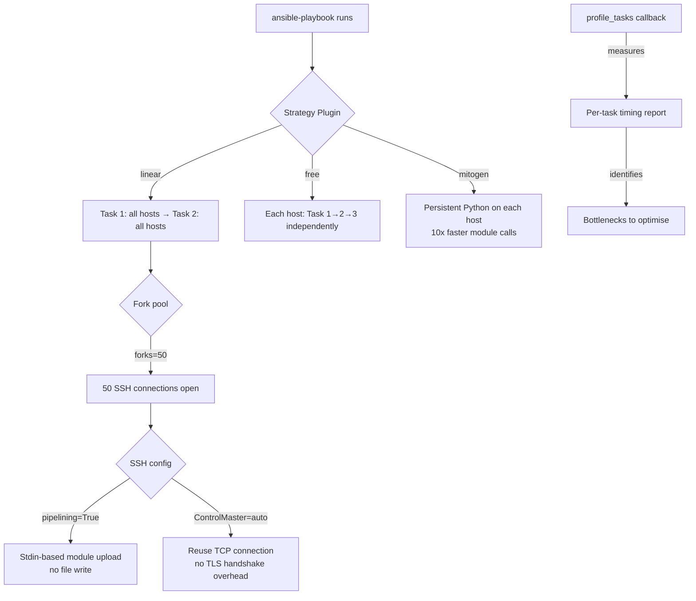
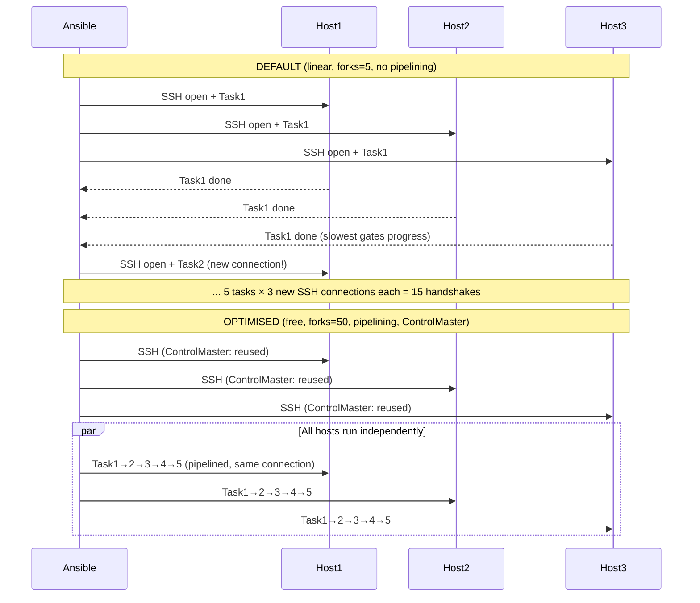

# Topic 20: Performance & Scaling

> 📍 Phase 4 — Senior / Production | Topic 20 of 28 | File: `20-performance-and-scaling.md`
> 🔗 Prev: `19-ansible-galaxy.md` | Next: `21-awx-and-aap.md`

---

## 🧠 Concept Overview

The default Ansible configuration is tuned for correctness and safety, not speed. With 5 parallel forks, no SSH connection reuse, and fact gathering on every host every run, a 500-host playbook can take 30+ minutes when it should take 3.

This topic is about closing that gap. Every setting here is a real lever that experienced engineers pull in production — from the obvious (`forks`) to the non-obvious (`mitogen`, `ControlPersist`, `gather_subset`). Apply them systematically and you'll see 5-10x speedups without changing a single task.

---

## 📖 In-Depth Explanation

### Subtopic 20.1 — `forks`, `serial`, `throttle`, `async`/`poll`

#### `forks` — Parallelism control

`forks` sets the maximum number of hosts Ansible connects to simultaneously. The default is 5 — far too low for any real fleet.

```ini
# ansible.cfg
[defaults]
forks = 50    # process 50 hosts in parallel
```

```bash
# Override per-run
ansible-playbook site.yml -f 100

# Rule of thumb:
# < 50 hosts:   forks = host count (run all in parallel)
# 50-500 hosts: forks = 50-100
# 500+ hosts:   forks = 100-200, monitor control node CPU/RAM
```

**CPU and memory considerations:**
Each fork is a Python process on the control node. At `forks=100`:
- ~100 SSH connections open simultaneously
- ~100 Python subprocesses consuming memory
- Network bandwidth to managed nodes multiplied

Monitor the control node with `top`/`htop` during large runs and tune `forks` accordingly.

---

#### `serial` — Rolling batch control (play level)

`serial` controls how many hosts are processed per batch within a play. Unlike `forks` (which is a global parallelism limit), `serial` is for rolling updates where you want to process groups sequentially.

```yaml
- name: Rolling deploy — 10% at a time
  hosts: webservers    # 200 hosts
  serial: "10%"        # process 20 hosts per batch
  # Batch 1: hosts 1-20 fully complete → Batch 2: 21-40 → etc.

- name: Canary deploy pattern
  hosts: webservers
  serial:
    - 1          # 1 host first (canary)
    - 5          # then 5 more
    - "20%"      # then 20% at a time
    - "100%"     # then all remaining

- name: Fixed batch size
  hosts: databases
  serial: 2      # process exactly 2 at a time (safe for primary/replica pairs)
```

---

#### `throttle` — Task-level rate limiting

`throttle` limits how many hosts can run a specific task simultaneously — useful for rate-limited APIs or resource-constrained systems.

```yaml
tasks:
  - name: Hit rate-limited API (max 5 concurrent)
    ansible.builtin.uri:
      url: https://api.example.com/register
      method: POST
    throttle: 5    # even if forks=100, max 5 hosts run this task at once

  - name: Write to shared database (max 2 concurrent)
    community.postgresql.postgresql_query:
      query: "INSERT INTO deploys VALUES (%s, %s)"
      positional_args: ["{{ inventory_hostname }}", "{{ ansible_date_time.iso8601 }}"]
    throttle: 2
```

---

#### `async`/`poll` — Non-blocking long-running tasks

By default, Ansible waits for each task to complete before moving on. For long operations (apt upgrade, large file download, database migration), this blocks the forks that could be working on other hosts.

`async` runs the task in the background and `poll` controls how often Ansible checks for completion.

```yaml
tasks:
  # Fire and forget — launch task, don't wait
  - name: Start long-running backup (fire and forget)
    ansible.builtin.command: /opt/scripts/backup.sh
    async: 3600       # task may run up to 1 hour
    poll: 0           # don't check — move on immediately
    register: backup_job

  # Launch async, check later
  - name: Start package upgrade (async)
    ansible.builtin.apt:
      upgrade: dist
      update_cache: true
    async: 600        # up to 10 minutes
    poll: 0           # don't wait here
    register: upgrade_job

  # Do other tasks while upgrade runs...
  - name: Update config files while packages are upgrading
    ansible.builtin.template:
      src: app.conf.j2
      dest: /etc/myapp/app.conf

  # Now wait for the async job to complete
  - name: Wait for package upgrade to finish
    ansible.builtin.async_status:
      jid: "{{ upgrade_job.ansible_job_id }}"
    register: upgrade_result
    until: upgrade_result.finished
    retries: 60       # check up to 60 times
    delay: 10         # every 10 seconds

  - name: Confirm upgrade succeeded
    ansible.builtin.assert:
      that: upgrade_result.rc == 0
      fail_msg: "Package upgrade failed: {{ upgrade_result.stderr }}"
```

**When to use async:**
- Package upgrades (can take 5-10 minutes)
- Large file downloads or syncs
- Database migrations
- Any task that regularly times out due to SSH timeout settings

---

### Subtopic 20.2 — SSH Pipelining, ControlMaster, and Persistent Connections

Each Ansible task normally opens a new SSH connection, uploads a Python script, executes it, and closes. For 10 tasks on 100 hosts, that's 1,000 SSH handshakes.

#### SSH Pipelining

Pipelining reuses the SSH connection to send the module script over stdin rather than SCP-ing a file. Eliminates the file write/execute/delete cycle.

```ini
# ansible.cfg
[ssh_connection]
pipelining = True
```

**Prerequisite:** `Defaults !requiretty` must be in `/etc/sudoers` on managed nodes. If `requiretty` is set, sudo requires a terminal — pipelining provides no terminal, so sudo fails.

```bash
# Add to /etc/sudoers via Ansible (bootstrap task)
- name: Disable requiretty for ansible sudo
  ansible.builtin.lineinfile:
    path: /etc/sudoers
    regexp: '^Defaults\s+requiretty'
    line: 'Defaults !requiretty'
    validate: visudo -cf %s
```

**Performance impact:** Pipelining reduces per-task overhead by ~40-60% on tasks that don't need file transfer (most module executions).

---

#### SSH ControlMaster — Connection multiplexing

ControlMaster keeps the SSH connection alive and multiplexes multiple Ansible operations over a single TCP connection.

```ini
# ansible.cfg
[ssh_connection]
ssh_args = -o ControlMaster=auto -o ControlPersist=60s -o ControlPath=/tmp/ansible-ssh-%h-%p-%r
```

- `ControlMaster=auto` — use existing connection if available, create new if not
- `ControlPersist=60s` — keep the master connection open for 60 seconds after the last session
- `ControlPath` — socket file path (the `%h`, `%p`, `%r` placeholders prevent conflicts)

**Performance impact:** Eliminates SSL/TLS handshake overhead for subsequent connections to the same host. Most impactful when running many tasks against the same host.

---

#### `ANSIBLE_SSH_RETRIES` — Resilience for large fleets

With hundreds of hosts, some SSH connections will fail transiently. Automatic retries prevent playbook failures from network blips:

```ini
# ansible.cfg
[connection]
retries = 3
```

Or per-run:
```bash
ANSIBLE_SSH_RETRIES=3 ansible-playbook site.yml
```

---

### Subtopic 20.3 — Strategies: `linear`, `free`, `host_pinned`, `mitogen`

Ansible's **strategy plugin** controls how tasks are distributed across hosts.

#### `linear` — Default strategy

Tasks run in order. Every host must complete Task N before any host starts Task N+1. Slowest hosts block progress.

```
Task 1: web1 ✅ web2 ✅ web3 ⏳ (slow host)
Task 2: web1 ⏳ web2 ⏳ web3 ⏳ (waiting for web3 to finish task 1)
```

---

#### `free` — Hosts run independently

Each host runs through all tasks as fast as possible, without waiting for others. Faster hosts finish the playbook while slower ones are still on early tasks.

```yaml
- name: Deploy (hosts run independently)
  hosts: webservers
  strategy: free    # faster hosts don't wait for slower ones

  tasks:
    - name: Install packages
      ansible.builtin.apt:
        name: myapp
        state: present
    - name: Start service
      ansible.builtin.service:
        name: myapp
        state: started
```

```
Task 1: web1 ✅ → Task 2: web1 ✅ → Task 3: web1 ✅ (web1 finished)
Task 1: web2 ✅ → Task 2: web2 ✅ ...
Task 1: web3 ⏳ (still on task 1)
```

**Use when:** Tasks are independent across hosts (no ordering dependency), maximising throughput matters more than uniformity.

**Don't use when:** Later tasks depend on all hosts completing earlier tasks (e.g., a task that checks cluster quorum).

---

#### `host_pinned` — One fork per host, no interleaving

Each fork is dedicated to one host for the entire play. Useful for tasks that maintain state between steps (long interactive sessions).

```yaml
- name: Long interactive session
  hosts: databases
  strategy: host_pinned
```

---

#### `mitogen` — 10x faster execution (community strategy)

Mitogen is a third-party strategy plugin that replaces Ansible's SSH + Python execution with a persistent Python interpreter. Instead of uploading scripts via SSH, Mitogen keeps a Python process running on each managed node and sends module calls as function invocations over an encrypted channel.

```bash
# Install
pip install mitogen
```

```ini
# ansible.cfg
[defaults]
strategy_plugins = /path/to/mitogen/ansible_mitogen/plugins/strategy
strategy = mitogen_linear    # or mitogen_free
```

**Performance comparison on a 100-host play:**

| Strategy | 10 tasks / 100 hosts | Notes |
|----------|---------------------|-------|
| `linear` (default) | ~8 minutes | Baseline |
| `linear` + pipelining | ~5 minutes | 40% faster |
| `linear` + pipelining + ControlMaster | ~3 minutes | 60% faster |
| `mitogen_linear` | ~45 seconds | 10x faster |

> ⚠️ Mitogen is community-maintained and occasionally lags behind new Ansible releases. Test thoroughly before production adoption. Some modules (especially those using `become` in complex ways) may not work correctly with Mitogen.

---

### Subtopic 20.4 — Profiling with `callback_whitelist = profile_tasks`

Before optimising, measure. The `profile_tasks` callback reports how long each task takes:

```ini
# ansible.cfg
[defaults]
callbacks_enabled = profile_tasks, timer
```

```
# Output at end of playbook run:
Thursday 11 April 2026  14:23:01 +0000 (0:00:00.045)  ****
===============================================================================
Gathering Facts --------------------------------------------------------- 45.23s
Install packages -------------------------------------------------------- 23.11s
Deploy nginx config ------------------------------------------------------ 2.45s
Start nginx service ------------------------------------------------------ 1.23s
Run smoke tests ---------------------------------------------------------- 0.89s
-------------------------------------------------------------------------------
Total: 72.91s
```

With this output you can immediately see that fact gathering (45s) and package install (23s) account for 93% of the runtime — those are the levers to pull.

#### `profile_roles` callback — per-role timing

```ini
[defaults]
callbacks_enabled = profile_tasks, profile_roles, timer
```

---

#### Optimisation decision tree

```
Total runtime > acceptable?
  ├─ Is fact gathering > 20% of total? → Enable fact caching (gathering=smart)
  ├─ Is package install slow? → Use cache_valid_time, or async for upgrades
  ├─ Are there many short tasks? → Enable pipelining + ControlMaster
  ├─ Is the entire run slow even with fast tasks? → Increase forks
  ├─ Are some hosts slow and blocking others? → Switch to 'free' strategy
  └─ Still too slow after all above? → Evaluate mitogen
```

---

## 🏗️ Architecture & System Design

How the performance levers interact:



---

## 🔄 Flow / Lifecycle

Comparison of default vs optimised execution for 5 tasks on 3 hosts:



---

## 💻 Code Examples

### ✅ Example 1: Production-optimised `ansible.cfg`

```ini
# ansible.cfg — production performance settings
[defaults]
# ── Parallelism ──────────────────────────────────────────
forks               = 50

# ── Fact gathering ───────────────────────────────────────
gathering           = smart              # only gather if not cached
fact_caching        = jsonfile
fact_caching_connection = /tmp/ansible_fact_cache
fact_caching_timeout = 86400            # cache for 24 hours

# ── Output ───────────────────────────────────────────────
callbacks_enabled   = profile_tasks, timer
stdout_callback     = yaml
# strategy          = mitogen_linear    # uncomment after testing

[ssh_connection]
pipelining          = True
ssh_args            = -o ControlMaster=auto -o ControlPersist=60s \
                      -o ControlPath=/tmp/ansible-ssh-%h-%p-%r \
                      -o ServerAliveInterval=30 \
                      -o ServerAliveCountMax=3
retries             = 3
```

### ✅ Example 2: Async package upgrade across large fleet

```yaml
- name: Upgrade all packages (async for speed)
  hosts: all
  become: true
  strategy: free    # hosts don't wait for each other

  tasks:
    - name: Launch async apt upgrade
      ansible.builtin.apt:
        upgrade: dist
        update_cache: true
      async: 600    # 10 minute timeout
      poll: 0       # don't wait here
      register: apt_job

    - name: Check upgrade status (every 15s, up to 40 retries = 10 min)
      ansible.builtin.async_status:
        jid: "{{ apt_job.ansible_job_id }}"
      register: apt_result
      until: apt_result.finished
      retries: 40
      delay: 15

    - name: Fail if upgrade failed
      ansible.builtin.fail:
        msg: "Package upgrade failed: {{ apt_result.stderr | default('unknown error') }}"
      when: apt_result.rc is defined and apt_result.rc != 0
```

### ✅ Example 3: Profiling to find bottlenecks

```bash
# Run with profiling enabled
ANSIBLE_CALLBACKS_ENABLED=profile_tasks,timer \
  ansible-playbook site.yml 2>&1 | tee run_profile.txt

# Find the 5 slowest tasks
grep -A 5 "==========" run_profile.txt

# Compare before/after optimisation
time ansible-playbook site.yml --limit web1    # baseline
# Apply optimisations in ansible.cfg
time ansible-playbook site.yml --limit web1    # measure improvement
```

### ✅ Example 4: `throttle` for rate-limited endpoints

```yaml
- name: Register all hosts with monitoring system
  hosts: all
  tasks:
    - name: Register with Datadog (rate limit: 10 rps)
      ansible.builtin.uri:
        url: "https://api.datadoghq.com/api/v1/hosts"
        method: POST
        headers:
          DD-API-KEY: "{{ vault_datadog_api_key }}"
        body_format: json
        body:
          host_name: "{{ inventory_hostname }}"
          tags: "{{ host_tags | join(',') }}"
      throttle: 10    # max 10 hosts hit this endpoint simultaneously
      no_log: true
```

### ❌ Anti-pattern — Running `ansible-playbook` without any performance settings

```bash
# ❌ Default settings on 200 hosts — will be very slow
ansible-playbook site.yml

# Potential issues:
# - forks=5: only 5 hosts at a time
# - No pipelining: separate SSH connection per task
# - No fact caching: full setup module on every run
# - linear strategy: slowest host gates all others

# ✅ Optimised run
ansible-playbook site.yml    # with optimised ansible.cfg in place
# ansible.cfg has: forks=50, pipelining=True, ControlMaster, gathering=smart
```

---

## ⚙️ Configuration & Options

### Performance settings quick reference

| Setting | Location | Default | Recommended |
|---------|----------|---------|-------------|
| `forks` | `ansible.cfg [defaults]` | 5 | 50-100 |
| `pipelining` | `ansible.cfg [ssh_connection]` | False | True |
| `ControlMaster` | `ssh_args` | not set | `auto` |
| `ControlPersist` | `ssh_args` | not set | `60s` |
| `gathering` | `ansible.cfg [defaults]` | `implicit` | `smart` |
| `fact_caching` | `ansible.cfg [defaults]` | not set | `jsonfile` |
| `fact_caching_timeout` | `ansible.cfg [defaults]` | not set | `86400` |
| `strategy` | play or `ansible.cfg` | `linear` | `free` (when safe) |

### `async_status` module parameters

| Parameter | Description |
|-----------|-------------|
| `jid` | Job ID from the `register` of the async task |
| `mode` | `status` (default) or `cleanup` (remove job files) |

---

## 🧩 Patterns & Best Practices

**What experienced engineers do:**
- Run `profile_tasks` on every significant playbook at least once — never guess where the time goes
- Apply the quick wins first: `forks=50`, `pipelining=True`, `gathering=smart` — these alone are usually 3-5x faster
- Use `async`/`poll` for any task that regularly takes more than 30 seconds — package upgrades, database migrations, large file operations
- Combine `serial` with `max_fail_percentage` for rolling deploys — controlled blast radius AND performance
- Reserve `mitogen` for playbooks where you've exhausted all other optimisations — it's powerful but adds operational complexity

**What beginners typically get wrong:**
- Setting `forks` very high (500+) without monitoring the control node — exhausts RAM and file descriptors, making things slower
- Using `strategy: free` on playbooks where hosts have task dependencies — handlers may fire before all hosts complete the notifying tasks
- Not implementing `async` for package installs on slow systems — SSH timeout kills the connection mid-install, leaving packages in broken state
- Forgetting `Defaults !requiretty` in sudoers when enabling pipelining — sudo operations silently fail

**Senior-level nuance:**
- For very large fleets (1000+ hosts), consider distributing control node load across multiple control nodes with different inventory segments. No single Ansible control node is designed to handle 2,000 simultaneous SSH connections efficiently.
- The biggest single performance win in most production environments is almost never forks or pipelining — it's **fact caching**. A play that gathers facts on 500 hosts at ~2s each = 1000s with `forks=5`. With `gathering=smart` and a warm cache, that's 0 seconds. Enable it first.

---

## 🔗 How It Connects

- **Builds on:** `19-ansible-galaxy.md` — Galaxy collections introduce more tasks/modules; performance tuning ensures large playbooks using many collections remain fast
- **Leads to:** `21-awx-and-aap.md` — AWX/AAP have their own performance knobs that build on these concepts (execution environments, isolated nodes, hop hosts)
- **Related concepts:** Topic 5 (`serial` introduced in playbook basics), Topic 7 (fact caching — the biggest single performance win), Topic 14 (`async`/`poll` interacts with error handling)

---

## 🎯 Interview Questions (Conceptual)

**Q1: What is the difference between `forks` and `serial`?**
> **A:** `forks` is a global parallelism setting — the maximum number of host connections open simultaneously across the entire Ansible run. `serial` is a play-level rolling batch setting — it controls how many hosts complete a full set of tasks before the next batch starts. You'd use high `forks` (50-100) for maximum throughput and `serial: "10%"` for rolling deploys where you want controlled rollout with the ability to abort if early batches fail.

**Q2: What is SSH pipelining and what prerequisite does it require?**
> **A:** Pipelining reuses the SSH connection to send module code via stdin rather than uploading a file with SCP, executing it, then deleting it. This eliminates 2-3 SSH round trips per task. The prerequisite is `Defaults !requiretty` in `/etc/sudoers` on managed nodes — without it, `sudo` operations fail because pipelining provides no pseudo-terminal.

**Q3: When would you use `async`/`poll` and what are the two common patterns?**
> **A:** Use async for tasks that take longer than the SSH timeout or that block other work unnecessarily — package upgrades, large downloads, database migrations. Pattern 1 (fire-and-forget): `poll: 0` launches the task in the background, never checks it — useful for cleanup tasks. Pattern 2 (launch-then-check): `poll: 0` to launch, then `async_status` with `until: result.finished` to wait for completion while other tasks can run in parallel.

**Q4: What does the `free` strategy do differently from `linear`?**
> **A:** With `linear` (the default), all hosts must complete task N before any host starts task N+1 — the slowest host gates progress. With `free`, each host runs through all tasks independently at its own pace. Faster hosts complete the play while slower ones are still on early tasks. `free` maximises throughput when tasks are independent; `linear` is safer when tasks have ordering dependencies across hosts.

**Q5: How do you identify where your playbook is spending most of its time?**
> **A:** Enable the `profile_tasks` callback in `ansible.cfg`: `callbacks_enabled = profile_tasks, timer`. At the end of the run, Ansible prints each task sorted by duration. This immediately shows where optimisation effort will have the most impact — typically fact gathering, package installation, and file transfers account for the bulk of runtime in most playbooks.

---

## 🧠 Scenario-Based Interview Problems

**Scenario 1: "Your playbook runs in 45 minutes against 300 hosts. After enabling profile_tasks, you see: Gathering Facts = 28 minutes, Install packages = 12 minutes, everything else = 5 minutes. What do you do?"**
> **Problem:** Fact gathering (62%) and package install (27%) dominate runtime.
> **Approach:** For fact gathering: enable smart caching (`gathering = smart`, `fact_caching = jsonfile`, `fact_caching_timeout = 86400`). First run still takes 28 minutes, but subsequent runs take 0 minutes for facts (cache hit). For package install: add `cache_valid_time: 3600` to all `apt` tasks — skip `apt-get update` if it ran recently. For tasks that must run fresh, use `async`/`poll` to launch all host package upgrades in parallel and wait for completion. Result: 45 minutes → ~8 minutes on first run (facts + parallel packages), ~3 minutes on subsequent runs (cached facts + parallel packages).
> **Trade-offs:** Fact caching with a 24-hour TTL means infrastructure changes (new IP, added disk) may not reflect until cache expires. Set TTL based on your change frequency.

**Scenario 2: "You enable pipelining in ansible.cfg but now all `become: true` tasks fail with 'sudo: no tty present and no askpass program specified'. What happened and how do you fix it?"**
> **Problem:** Pipelining breaks `sudo` when `requiretty` is set in sudoers.
> **Approach:** Pipelining sends module code over stdin rather than a file, which means there's no pseudo-terminal. Many Linux distros have `Defaults requiretty` in sudoers, which prevents sudo from running without a tty. Fix: add `Defaults !requiretty` to `/etc/sudoers` via a bootstrap playbook (run without pipelining for this one task). Use `visudo -cf %s` as the validate command for safety. After the fix, re-enable pipelining. Alternatively, add `Defaults !requiretty` to a drop-in file: `/etc/sudoers.d/ansible`.
> **Trade-offs:** Disabling `requiretty` is a deliberate sudoers security relaxation. Some security hardening guides flag it. The Ansible-specific scoping (`Defaults:ansible_user !requiretty`) limits the risk to only the Ansible service account.

---

## ⚡ Quick Notes — Revision Card

- 📌 `forks = 50` → parallel host connections | default is 5 (too slow for real fleets)
- 📌 `serial: "10%"` → rolling batches | `serial: [1,5,"25%"]` → canary deploy pattern
- 📌 `throttle: N` → task-level rate limit (API calls, shared resources)
- 📌 `async: 600 poll: 0` → fire-and-forget | `async_status` → check job status later
- 📌 `pipelining = True` → no file upload per task, stdin-based (40-60% faster)
- 📌 `ControlMaster=auto ControlPersist=60s` → reuse SSH TCP connection
- 📌 Strategy: `linear` (default, safe) | `free` (fast, independent) | `mitogen` (10x faster)
- 📌 `callbacks_enabled = profile_tasks` → per-task timing, shows where time goes
- 📌 `gathering = smart` + fact cache = biggest single win for repeated runs
- ⚠️ Pipelining needs `Defaults !requiretty` in sudoers — check before enabling
- ⚠️ `strategy: free` unsafe when tasks have cross-host ordering dependencies
- ⚠️ Very high `forks` (500+) exhausts control node RAM/file descriptors — monitor resources
- 💡 Always profile before optimising — `profile_tasks` shows the actual bottleneck
- 🔑 Quick-win order: fact caching → pipelining → ControlMaster → forks → free strategy → mitogen

---

## 🔖 References & Further Reading

- 📄 [Ansible Performance Tuning](https://docs.ansible.com/ansible/latest/tips_tricks/ansible_tips_tricks.html#optimizing-ansible)
- 📄 [async and poll](https://docs.ansible.com/ansible/latest/playbook_guide/playbooks_async.html)
- 📄 [Strategies](https://docs.ansible.com/ansible/latest/plugins/strategy.html)
- 📝 [Mitogen for Ansible](https://mitogen.networkgenomics.com/ansible_detailed.html)
- 📝 [SSH Pipelining Deep Dive](https://docs.ansible.com/ansible/latest/reference_appendices/config.html#ansible-pipelining)
- 🎥 [Ansible Performance Tips — AnsibleFest](https://www.youtube.com/watch?v=SLKhMPjkS8E)
- ➡️ Related in this course: [`19-ansible-galaxy.md`] · [`21-awx-and-aap.md`]

---
