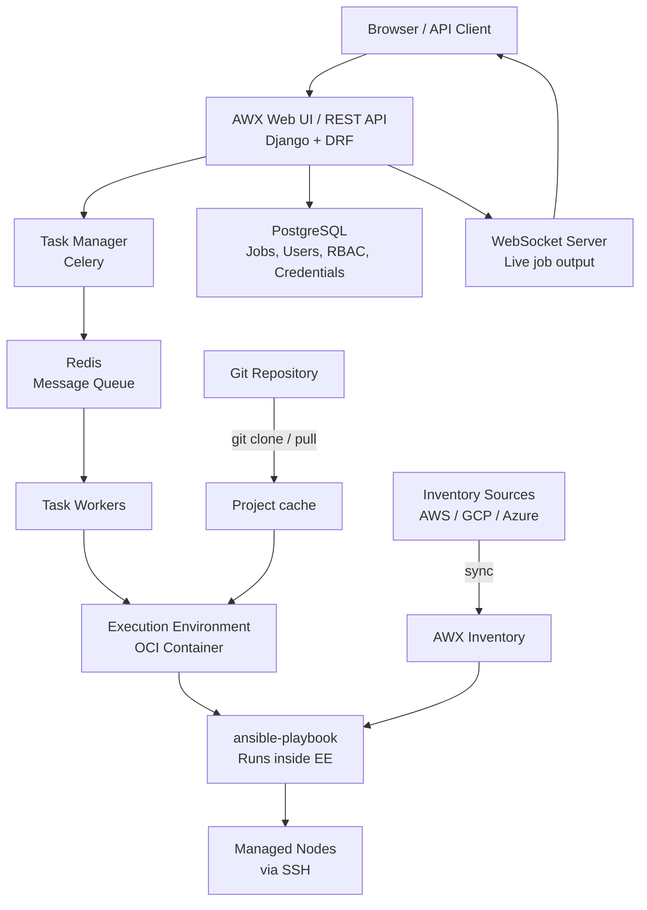
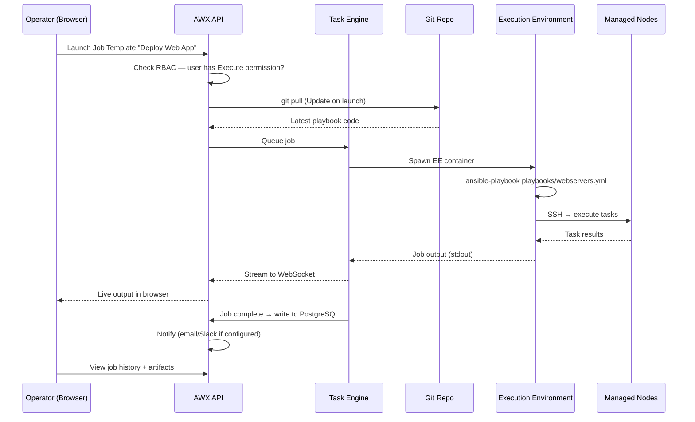

# Topic 21: AWX & Ansible Automation Platform (AAP)

> 📍 Phase 4 — Senior / Production | Topic 21 of 28 | File: `21-awx-and-aap.md`
> 🔗 Prev: `20-performance-and-scaling.md` | Next: `22-dynamic-inventory-advanced.md`

---

## 🧠 Concept Overview

Running Ansible from the CLI is fine for one engineer on one laptop. It breaks down the moment you have a team: Who ran that playbook at 2am? Who approved that production deploy? How do I give the DBA the ability to run database tasks without giving them SSH keys to every server?

**AWX** (open source) and **Ansible Automation Platform / AAP** (Red Hat enterprise) solve these problems. They wrap Ansible in a web UI, REST API, and scheduler — turning CLI-based automation into a governed, audited, multi-user platform. Every playbook run is logged. Access is controlled by RBAC. Schedules replace cron jobs. Approvals gate critical operations.

AWX is the upstream community project; AAP is the enterprise product with support, certified content, and additional features. Understanding AWX is the foundation for understanding AAP.

---

## 📖 In-Depth Explanation

### Subtopic 21.1 — AWX Architecture: Web UI, Task Engine, Scheduler, RBAC

#### Core components

```
AWX / AAP
├── Web UI (Django + React)       ← browser interface for users
├── REST API                      ← programmatic access (same as UI)
├── Task Engine (Celery)          ← executes Ansible playbook runs
├── Scheduler                     ← cron-like job scheduling
├── WebSocket server              ← live job output streaming
├── Redis                         ← message queue between components
└── PostgreSQL                    ← persistent storage for all state
```

All AWX components run in containers (Kubernetes or podman-compose). The task engine spawns **Execution Environments (EEs)** — OCI containers that bundle Ansible + collections + Python dependencies — to run playbook jobs in isolation.

---

#### Execution Environments (EEs)

EEs replace the traditional control node Python virtualenv. Each job runs inside a container:

```
Execution Environment (OCI container)
├── Ansible Core
├── Python runtime
├── Galaxy collections (amazon.aws, community.general, etc.)
├── Python packages (boto3, psycopg2, etc.)
└── Custom content
```

```bash
# Build a custom EE with ansible-builder
pip install ansible-builder

# execution-environment.yml
version: 3
dependencies:
  galaxy:
    collections:
      - name: amazon.aws
        version: "6.5.0"
      - name: community.general
        version: "8.1.0"
  python:
    - boto3>=1.26.0
    - psycopg2-binary
  system:
    - libpq-dev [platform:rpm]

# Build the EE image
ansible-builder build \
  --tag myorg/my-ee:1.0.0 \
  --container-runtime docker
```

---

#### RBAC model

AWX uses a role-based access control system with organisations, teams, and users:

```
Organisation
├── Users (individual accounts)
├── Teams (groups of users)
│   ├── Network Team
│   ├── DBA Team
│   └── Web Team
├── Credentials (SSH keys, vault passwords, cloud tokens)
├── Inventories
├── Projects (Git repos)
└── Job Templates (playbook + inventory + credentials + settings)
```

**Roles available per resource:**

| Role | Description |
|------|-------------|
| `Admin` | Full control — create, edit, delete, execute |
| `Use` | Can reference in job templates, cannot edit |
| `Execute` | Can launch job templates, cannot edit |
| `Read` | Read-only access |
| `Update` | Can edit but not delete |
| `Auditor` | Read-only across entire organisation |

```
DBA Team
  → Credential "db-ssh-key": Use
  → Inventory "databases": Use
  → Job Template "DB Maintenance": Execute
  # DBAs can run the maintenance playbook but cannot edit it
  # or see the SSH key contents
```

---

### Subtopic 21.2 — Job Templates, Credentials, Inventories in AWX

#### Projects — Git repo integration

A **Project** connects AWX to a Git repository containing playbooks:

```
Project settings:
  Name:         My Ansible Project
  Source:       Git
  URL:          https://github.com/myorg/ansible-playbooks.git
  Branch:       main
  Credential:   GitHub SSH Key (for private repos)
  Update on launch: true  ← always pull latest before running
```

AWX clones the repo into a local cache and uses it for job execution. On every job launch (with "Update on launch"), AWX does a `git pull` to ensure you're running the latest version.

---

#### Credentials — Secure secret storage

Credentials store secrets that jobs need to connect and authenticate. AWX encrypts them at rest and injects them into jobs as environment variables or files — operators never see the plaintext values.

**Built-in credential types:**

| Type | Injects | Use case |
|------|---------|---------|
| Machine | SSH private key + username | Connecting to managed nodes |
| Source Control | SSH key or username/password | Pulling Git repos |
| Vault | Ansible Vault password | Decrypting vault-encrypted vars |
| Amazon Web Services | AWS access/secret key | AWS inventory + modules |
| Google Compute Engine | GCP service account JSON | GCP inventory + modules |
| Azure Resource Manager | Azure client credentials | Azure inventory + modules |
| HashiCorp Vault | Approle credentials | Dynamic secret retrieval |

**Custom credential types** let you define your own secrets schema:

```yaml
# Custom credential type: Datadog API
Input configuration:
  fields:
    - id: api_key
      label: API Key
      type: string
      secret: true
    - id: app_key
      label: Application Key
      type: string
      secret: true

Injector configuration:
  env:
    DD_API_KEY: "{{ api_key }}"
    DD_APP_KEY: "{{ app_key }}"
```

---

#### Inventories in AWX

AWX inventories can be:
- **Static**: defined manually in the UI
- **Dynamic**: synced from an inventory source (AWS, Azure, GCP, VMware)
- **Smart**: filtered view of existing inventory based on host facts/variables

```
Inventory: Production AWS
├── Inventory Source: AWS EC2
│   ├── Region: eu-west-1, eu-central-1
│   ├── Filter: tag:Environment=production
│   └── Update: every 1 hour (scheduled)
└── Groups (auto-generated from EC2 tags):
    ├── tag_Role_webserver
    ├── tag_Role_database
    └── region_eu_west_1
```

---

#### Job Templates — the atomic unit of AWX automation

A **Job Template** ties together: playbook + inventory + credentials + variables + settings:

```
Job Template: Deploy Web Application
├── Project:     My Ansible Project
├── Playbook:    playbooks/webservers.yml
├── Inventory:   Production AWS
├── Credentials:
│   ├── Machine: prod-ssh-key
│   └── Vault:   production-vault-password
├── Extra Vars:  {"app_version": "2.1.0"}  (can be prompted at launch)
├── Tags:        deploy,config
├── Limit:       webservers
├── Fork count:  50
├── Verbosity:   0 (Normal)
├── Timeout:     600 seconds
└── Launch options:
    ├── Prompt on launch: app_version ← user fills this at launch time
    └── Ask credential on launch: false
```

---

### Subtopic 21.3 — Workflows and Approval Gates

**Workflows** chain multiple Job Templates together into a directed graph with conditional branching:

```
Workflow: Full Stack Deploy
│
├─[success]─► Deploy Databases
│               │
│         ─[success]─► Deploy Web Servers
│                           │
│                     ─[success]─► Run Integration Tests
│                                       │
│                               ─[success]─► Notify Slack (success)
│                               ─[failure]─► Rollback Web Servers
│                                               │
│                                         ─[always]─► Notify Slack (failure)
└─[failure]─► Notify Slack (deploy failed)
```

This gives you: conditional execution, parallel branches, and automatic failure handling — all without writing Python or complex playbook logic.

---

#### Approval nodes — human-in-the-loop gates

Workflow nodes can require human approval before proceeding:

```
Workflow: Production Deployment
│
├─► Stage Deploy (automated)
│         │
│   ─[success]─► APPROVAL NODE: "Approve production deploy"
│                     │
│               ─[approved]─► Production Deploy
│               ─[denied]──► Notify team (rejected)
```

```yaml
# Approval node configuration:
  Name:            "Approve production deploy"
  Approval timeout: 4 hours  # auto-deny if no response
  Description:     "Review staging results before promoting to production"
```

Approvers get an email + UI notification. They review the staging job output and click Approve or Deny. Only then does the workflow proceed.

---

#### Workflow launch from API

```bash
# Launch a workflow via AWX REST API
curl -X POST \
  https://awx.example.com/api/v2/workflow_job_templates/42/launch/ \
  -H "Authorization: Bearer $AWX_TOKEN" \
  -H "Content-Type: application/json" \
  -d '{"extra_vars": {"app_version": "2.1.0", "deploy_env": "production"}}'

# Check job status
curl https://awx.example.com/api/v2/workflow_jobs/1234/ \
  -H "Authorization: Bearer $AWX_TOKEN"
```

---

### Subtopic 21.4 — AAP vs AWX — Enterprise Features and Licensing

| Feature | AWX (Open Source) | AAP (Red Hat Enterprise) |
|---------|-----------------|------------------------|
| License | Apache 2.0 (free) | Commercial subscription |
| Support | Community (GitHub) | Red Hat 24/7 support |
| Updates | Rolling releases | Stable, tested releases |
| Private Automation Hub | ❌ (community: Galaxy NG) | ✅ Included |
| Execution Environments | ✅ | ✅ + certified EEs |
| Multi-site / hop nodes | Limited | ✅ Automation Mesh |
| Analytics & insights | ❌ | ✅ Automation Analytics |
| Content signing | ❌ | ✅ |
| SLA | None | Enterprise SLA |
| Installation | Operator / Docker Compose | Installer / Operator |

**Automation Mesh** (AAP-only) extends execution to remote sites without VPN tunnels:

```
Control Plane (central AWX)
    │
    ├─► Hop Node (DMZ)
    │       └─► Execution Node (datacenter A) → managed hosts
    └─► Execution Node (datacenter B) → managed hosts
```

Managed hosts in isolated networks only need outbound connectivity to the nearest hop node — no inbound firewall rules needed.

---

## 🏗️ Architecture & System Design

AWX full architecture:



---

## 🔄 Flow / Lifecycle



---

## 💻 Code Examples

### ✅ Example 1: Deploying AWX with Docker Compose (quickstart)

```bash
# Clone AWX Operator or use docker-compose quickstart
git clone https://github.com/ansible/awx.git
cd awx/tools/docker-compose
make docker-compose

# OR use the AWX Operator on Kubernetes
kubectl apply -f https://raw.githubusercontent.com/ansible/awx-operator/main/deploy/awx-operator.yaml

# Create AWX instance
cat <<EOF | kubectl apply -f -
apiVersion: awx.ansible.com/v1beta1
kind: AWX
metadata:
  name: awx
  namespace: awx
spec:
  service_type: nodeport
  postgres_storage_class: standard
EOF
```

---

### ✅ Example 2: AWX CLI (`awx`) for automation

```bash
# Install AWX CLI
pip install awxkit

# Configure
export TOWER_HOST=https://awx.example.com
export TOWER_USERNAME=admin
export TOWER_PASSWORD=secret

# List job templates
awx job_templates list

# Launch a job template
awx job_templates launch 42 \
  --extra_vars '{"app_version": "2.1.0"}' \
  --monitor    # wait for completion and stream output

# Create a credential
awx credentials create \
  --name "Production SSH Key" \
  --credential_type 1 \
  --organization 1 \
  --inputs '{"username": "ubuntu", "ssh_key_data": "'"$(cat ~/.ssh/prod.pem)"'"}'

# Create a job template
awx job_templates create \
  --name "Deploy Web App" \
  --project 5 \
  --playbook "playbooks/webservers.yml" \
  --inventory 3 \
  --credential 8 \
  --forks 50
```

---

### ✅ Example 3: Triggering AWX from CI/CD (GitOps pattern)

```yaml
# .github/workflows/deploy.yml
name: Deploy via AWX

on:
  push:
    branches: [main]

jobs:
  deploy:
    runs-on: ubuntu-latest
    steps:
      - name: Trigger AWX Job Template
        env:
          AWX_TOKEN: ${{ secrets.AWX_API_TOKEN }}
        run: |
          # Launch job and capture job ID
          JOB_ID=$(curl -s -X POST \
            https://awx.example.com/api/v2/job_templates/42/launch/ \
            -H "Authorization: Bearer $AWX_TOKEN" \
            -H "Content-Type: application/json" \
            -d "{\"extra_vars\": {\"app_version\": \"${{ github.sha }}\"}}" \
            | python3 -c "import sys,json; print(json.load(sys.stdin)['id'])")

          echo "Launched AWX job ID: $JOB_ID"

          # Poll until complete
          while true; do
            STATUS=$(curl -s \
              https://awx.example.com/api/v2/jobs/$JOB_ID/ \
              -H "Authorization: Bearer $AWX_TOKEN" \
              | python3 -c "import sys,json; print(json.load(sys.stdin)['status'])")

            echo "Job status: $STATUS"

            if [ "$STATUS" = "successful" ]; then
              echo "Deployment succeeded!"
              exit 0
            elif [ "$STATUS" = "failed" ] || [ "$STATUS" = "error" ]; then
              echo "Deployment FAILED"
              exit 1
            fi
            sleep 15
          done
```

---

### ✅ Example 4: Job Template with survey (prompted variables)

AWX surveys prompt users for variable values at launch time — a form-based alternative to `vars_prompt`:

```json
// Survey spec (configured in UI or API)
{
  "name": "Deployment Survey",
  "description": "Variables for this deployment",
  "spec": [
    {
      "question_name": "Application Version",
      "question_description": "Enter the version tag to deploy",
      "variable": "app_version",
      "type": "text",
      "required": true,
      "default": "latest"
    },
    {
      "question_name": "Target Environment",
      "variable": "deploy_env",
      "type": "multiplechoice",
      "choices": "staging\nproduction",
      "required": true,
      "default": "staging"
    },
    {
      "question_name": "Notify on completion?",
      "variable": "send_notification",
      "type": "boolean",
      "default": true
    }
  ]
}
```

---

### ❌ Anti-pattern — Bypassing AWX to run playbooks directly in production

```bash
# ❌ Running ansible-playbook directly against production
ssh control-node
ansible-playbook -i production site.yml -e "app_version=2.1.0"

# Problems:
# - No audit trail — who ran this? when? with what vars?
# - No RBAC — anyone with SSH to the control node can run anything
# - No approval gate — no review before production changes
# - SSH keys stored on developer laptops — credential sprawl

# ✅ All production runs via AWX
# - Every run logged with username, time, vars, full output
# - RBAC restricts who can run what against which inventory
# - Approval workflows for production deployments
# - Credentials stored in AWX — developers never see production SSH keys
```

---

## ⚙️ Configuration & Options

### AWX key API endpoints

| Endpoint | Method | Description |
|----------|--------|-------------|
| `/api/v2/job_templates/` | GET | List job templates |
| `/api/v2/job_templates/{id}/launch/` | POST | Launch a job |
| `/api/v2/jobs/{id}/` | GET | Get job status |
| `/api/v2/jobs/{id}/stdout/` | GET | Get job output |
| `/api/v2/workflow_job_templates/{id}/launch/` | POST | Launch a workflow |
| `/api/v2/inventories/` | GET | List inventories |
| `/api/v2/credentials/` | GET/POST | List/create credentials |
| `/api/v2/projects/{id}/update/` | POST | Trigger project git pull |
| `/api/v2/schedules/` | GET/POST | List/create schedules |

### AWX notification types

| Type | Use case |
|------|---------|
| Email | Job success/failure alerts |
| Slack | Real-time team notifications |
| PagerDuty | On-call escalation on failure |
| Webhook | Generic HTTP notification |
| IRC | Legacy chat integrations |
| Microsoft Teams | Enterprise chat |

---

## 🧩 Patterns & Best Practices

**What experienced engineers do:**
- Enforce all production Ansible runs through AWX — never allow direct `ansible-playbook` against production hosts; use RBAC to restrict SSH key access
- Use **Approval Nodes** in workflows for any change to production — creates a review gate with a full audit trail of who approved what and when
- Store all credentials in AWX — developers interact with job templates but never see production SSH keys, vault passwords, or API tokens
- Use **Surveys** for user-facing variables (version to deploy, environment to target) — cleaner than asking people to pass extra-vars at CLI
- Schedule inventory syncs at regular intervals (every 30-60 minutes for cloud inventories) — keeps host lists fresh without manual triggers
- Use **Notifications** on job failure — immediate Slack/PagerDuty alert when a production job fails

**What beginners typically get wrong:**
- Giving users `Admin` role instead of `Execute` — users who only need to run playbooks shouldn't be able to edit credentials or inventory
- Not enabling "Update on launch" for projects — playbooks run against stale cached Git content
- Using global variables for sensitive data instead of credentials — `VAULT_PASSWORD=secret` in extra vars appears in job output
- Not setting a job timeout — a hung task blocks the executor indefinitely
- Ignoring AWX logs and notifications — no visibility when jobs fail silently

**Senior-level nuance:**
- AWX job templates support **ask on launch** for inventory, credentials, and extra vars. For maximum flexibility in CI/CD pipelines, template the stable parts (playbook, organisation, permissions) and prompt for the dynamic parts (version, environment). This creates reusable templates that serve both human and API callers.
- The AWX REST API is fully featured — anything you can do in the UI you can do via API. This enables Infrastructure as Code for AWX itself: define all job templates, workflows, and credentials in code and apply them via the AWX API or the `awx` CLI. Combine with GitOps so your AWX configuration is version-controlled.

---

## 🔗 How It Connects

- **Builds on:** `20-performance-and-scaling.md` — AWX's fork settings, EE sizing, and execution node count directly apply the scaling concepts from that topic
- **Leads to:** `22-dynamic-inventory-advanced.md` — AWX inventory sources are the production implementation of dynamic inventory
- **Related concepts:** Topic 13 (Vault — AWX stores vault passwords as credentials), Topic 15 (Tags/Limits — set in Job Template settings), Topic 25 (CI/CD — AWX is the production CD layer)

---

## 🎯 Interview Questions (Conceptual)

**Q1: What is the difference between AWX and Ansible Automation Platform?**
> **A:** AWX is the open-source upstream project — free, community-supported, rolling releases. AAP is Red Hat's enterprise product built on AWX — it adds commercial support, stable release cycles, Private Automation Hub, Automation Mesh for multi-site execution, Automation Analytics, and content signing. AWX is appropriate for labs and teams comfortable with community support; AAP is for organisations that need SLAs and enterprise integrations.

**Q2: What is an Execution Environment and why was it introduced?**
> **A:** An Execution Environment is an OCI container image that bundles Ansible, collections, and Python dependencies together. It replaces the traditional approach of maintaining Python virtualenvs on control nodes. EEs ensure that every job runs in an identical, reproducible environment regardless of what's installed on the AWX host. They eliminate "works on my laptop" failures caused by different collection versions and make it trivial to run different jobs with different dependency sets.

**Q3: How does AWX RBAC prevent credential sprawl?**
> **A:** Credentials are stored encrypted in AWX's database. Users are granted `Use` permission on credentials — they can reference them in job templates but never see the plaintext values. The credential is injected into the job as an environment variable or file inside the execution environment. Production SSH keys and vault passwords never need to leave AWX or touch developer machines.

**Q4: What is a Workflow in AWX and how does it differ from a Job Template?**
> **A:** A Job Template runs a single playbook. A Workflow chains multiple Job Templates into a directed acyclic graph with conditional branching based on success, failure, or always. Workflows can include approval nodes (human gates), run Job Templates in parallel, and handle complex multi-stage deployments (deploy DB → deploy app → run tests → rollback on failure) without encoding that logic into the playbooks themselves.

**Q5: What does "Update on launch" do for a Project in AWX?**
> **A:** It triggers a `git pull` against the configured repository before every job run. Without it, AWX runs whatever version of the playbooks was cached during the last manual project update — which may be hours or days old. With it, you always run the latest code from the configured branch, making Git the source of truth for your automation.

---

## 🧠 Scenario-Based Interview Problems

**Scenario 1: "Your organisation wants to allow the DBA team to run database maintenance playbooks, but they should not be able to see production SSH keys or run web server playbooks. How do you configure AWX for this?"**
> **Problem:** Role-based access where users need execution rights but not credential visibility or cross-team access.
> **Approach:** (1) Create a `DBA Team` in AWX under the Production Organisation. (2) Grant the team `Use` on the `db-ssh-key` Machine credential — they can use it but not view it. (3) Grant `Use` on the `databases` Inventory. (4) Create Job Templates for each DB maintenance task (backup, vacuum, failover). (5) Grant `Execute` on those Job Templates to the DBA Team. (6) Do NOT grant any access to web server inventories, credentials, or job templates. DBAs log in, see only DB job templates in their UI, and can launch them without ever touching SSH keys or seeing what they can't access.
> **Trade-offs:** As the number of resources grows, managing individual permissions becomes unwieldy. Use Teams instead of individual users for permissions, and use Organisations to create hard namespace boundaries between product teams.

**Scenario 2: "Your team wants all production deployments to go through a mandatory code review in AWX before execution. How do you implement this?"**
> **Problem:** Human approval gate before production Ansible execution.
> **Approach:** Build a Workflow with an Approval Node. The workflow: (1) Runs a staging deploy Job Template automatically. (2) Posts staging results to Slack. (3) Hits an Approval Node — "Review staging results and approve production deploy". Set a 4-hour timeout with auto-deny. Approvers (senior engineers or change managers) get a notification, review the staging job output in AWX, and click Approve. (4) On approval, the production deploy Job Template runs. (5) On denial or timeout, a notification goes to the requester. Every approval is logged in AWX with the approver's username and timestamp — a complete audit trail.
> **Trade-offs:** Approval gates add human latency to deploys. For organisations that need rapid incident response, have a separate "emergency" job template with lower approval bar (or no approval) that requires a post-incident review. Balance governance with operational speed.

---

## ⚡ Quick Notes — Revision Card

- 📌 AWX = open source | AAP = Red Hat enterprise (support, Hub, Automation Mesh, Analytics)
- 📌 EE (Execution Environment) = OCI container bundling Ansible + collections + Python deps — replaces virtualenvs
- 📌 Job Template = playbook + inventory + credentials + settings — atomic unit of AWX automation
- 📌 Workflow = DAG of Job Templates with conditional branching (success/failure/always)
- 📌 Approval Node = human gate in a Workflow — logs who approved what and when
- 📌 Survey = form that prompts for variable values at launch (user-friendly vars_prompt)
- 📌 RBAC roles: Admin > Update > Execute > Use > Read (per resource, not global)
- 📌 Credentials stored encrypted — users get `Use` access, never see plaintext values
- 📌 "Update on launch" = git pull before every job — ensures latest playbook code runs
- 📌 AWX REST API — everything in UI is also doable via API (scriptable, CI/CD integrable)
- ⚠️ Never allow direct `ansible-playbook` against production — all runs via AWX for audit trail
- ⚠️ Don't grant `Admin` when `Execute` is sufficient — least privilege applies to AWX too
- 💡 Automation Mesh (AAP) = execution nodes at remote sites, no inbound firewall needed
- 🔑 AWX = the audit trail, RBAC, and approval gate layer that makes Ansible enterprise-grade

---

## 🔖 References & Further Reading

- 📄 [AWX Project — GitHub](https://github.com/ansible/awx)
- 📄 [AWX Documentation](https://ansible.readthedocs.io/projects/awx/)
- 📄 [AWX REST API Reference](https://awx.example.com/api/v2/) (browse your own instance)
- 📄 [Ansible Automation Platform Docs](https://access.redhat.com/documentation/en-us/red_hat_ansible_automation_platform)
- 📄 [ansible-builder — Building EEs](https://ansible.readthedocs.io/projects/builder/)
- 📝 [AWX RBAC Guide](https://ansible.readthedocs.io/projects/awx/en/latest/userguide/organizations.html)
- 🎥 [AWX Getting Started — YouTube](https://www.youtube.com/watch?v=AEzwIeq6QoI)
- ➡️ Related in this course: [`20-performance-and-scaling.md`] · [`22-dynamic-inventory-advanced.md`]

---
