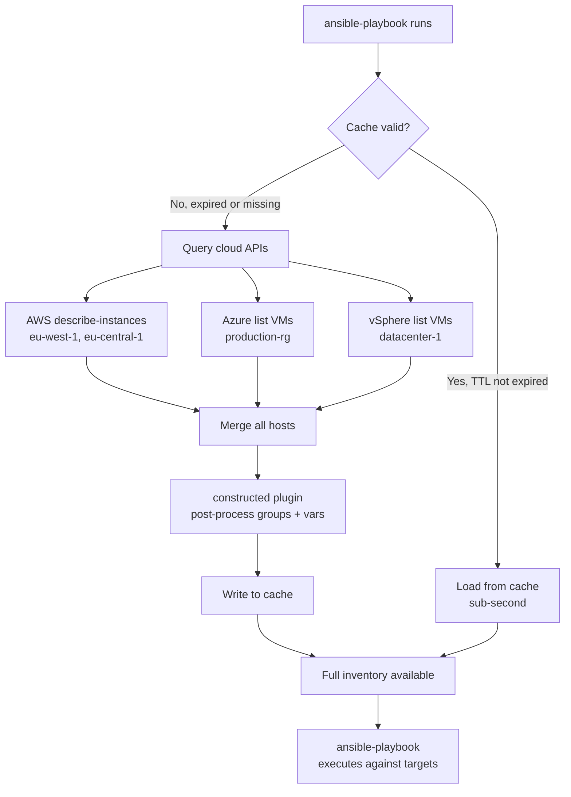
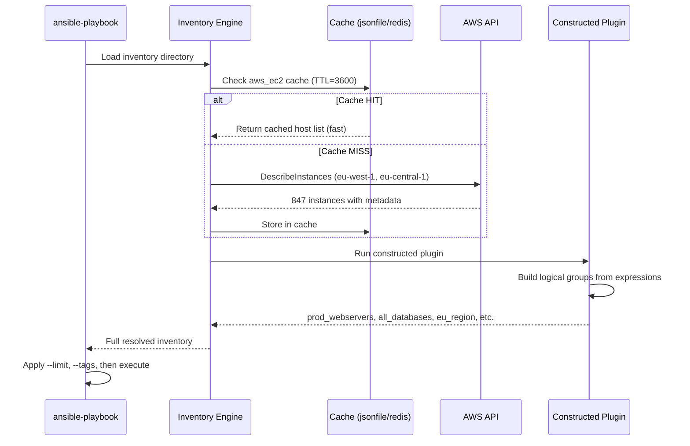

# Topic 22: Dynamic Inventory Advanced

> 📍 Phase 4 — Senior / Production | Topic 22 of 28 | File: `22-dynamic-inventory-advanced.md`
> 🔗 Prev: `21-awx-and-aap.md` | Next: `23-network-automation.md`

---

## 🧠 Concept Overview

Topic 3 introduced dynamic inventory — the idea that Ansible can query a cloud provider instead of reading a static file. This topic goes deeper: production-scale dynamic inventory with multi-cloud providers, the `constructed` plugin for building smart logical groups from host metadata, and caching strategies that prevent slow API calls from blocking every playbook run.

At scale, dynamic inventory is not just a convenience — it's the only viable approach. A fleet of 500 EC2 instances that auto-scales hourly cannot be managed with a file someone updates manually.

---

## 📖 In-Depth Explanation

### Subtopic 22.1 — Cloud Inventory Plugins: `aws_ec2`, `azure_rm`, `gcp_compute`, `vmware_vm_inventory`

#### How inventory plugins work

Inventory plugins are YAML configuration files (not scripts) that Ansible's inventory engine loads and executes. They query external APIs and return structured host data including variables and group memberships.

```bash
# Verify available plugins
ansible-doc -t inventory -l

# Get docs for a specific plugin
ansible-doc -t inventory amazon.aws.aws_ec2
```

---

#### `amazon.aws.aws_ec2` — AWS EC2

```bash
# Install the collection
ansible-galaxy collection install amazon.aws
pip install boto3 botocore
```

```yaml
# inventory/aws_ec2.yml
# Filename MUST end in aws_ec2.yml or aws_ec2.yaml for auto-detection
plugin: amazon.aws.aws_ec2

# AWS authentication (one of several methods)
# Method 1: explicit credentials (use vault for secrets)
# aws_access_key: "{{ vault_aws_access_key }}"
# aws_secret_key: "{{ vault_aws_secret_key }}"

# Method 2: IAM role / instance profile (recommended for EC2 control nodes)
# No credentials needed — uses the instance's role automatically

# Method 3: AWS profile
# profile: production

regions:
  - eu-west-1
  - eu-central-1
  - us-east-1

# Filter: only return running instances with specific tags
filters:
  instance-state-name: running
  "tag:ManagedBy": ansible
  "tag:Environment": production

# Exclude instances with specific tags
exclude_filters:
  - "tag:DoNotManage": "true"

# What to use as the hostname (preference order)
hostnames:
  - tag:Name              # use the Name tag first
  - private-dns-name      # fall back to private DNS
  - private-ip-address    # then private IP

# Compose host variables from EC2 metadata
compose:
  ansible_host: private_ip_address
  ec2_region: placement.region
  instance_type: instance_type

# Build groups from EC2 tags and attributes
keyed_groups:
  # Group by Role tag: tag_Role_webserver, tag_Role_database, etc.
  - key: tags.Role
    prefix: role
    separator: "_"

  # Group by environment tag
  - key: tags.Environment
    prefix: env
    separator: "_"

  # Group by region
  - key: placement.region
    prefix: region
    separator: "_"

  # Group by instance type
  - key: instance_type
    prefix: type
    separator: "_"

  # Group by AMI ID
  - key: image_id
    prefix: ami

# Add all hosts to a parent group
groups:
  aws_instances: true    # all hosts belong to this group
  production_webservers: "tags.Role == 'webserver' and tags.Environment == 'production'"
```

```bash
# Test the inventory
ansible-inventory -i inventory/aws_ec2.yml --list
ansible-inventory -i inventory/aws_ec2.yml --graph

# Run against specific groups
ansible -i inventory/aws_ec2.yml role_webserver -m ping
ansible -i inventory/aws_ec2.yml env_production -m ping
```

---

#### `azure.azcollection.azure_rm` — Azure VMs

```bash
ansible-galaxy collection install azure.azcollection
pip install ansible[azure]
```

```yaml
# inventory/azure_rm.yml
plugin: azure.azcollection.azure_rm

# Auth via service principal (use vault for secrets)
client_id: "{{ vault_azure_client_id }}"
secret: "{{ vault_azure_secret }}"
tenant: "{{ vault_azure_tenant }}"
subscription_id: "{{ vault_azure_subscription_id }}"

# Or use Azure CLI credentials (for developer machines)
# auth_source: cli

# Filter by resource group
include_vm_resource_groups:
  - production-rg
  - staging-rg

# Build groups from tags
keyed_groups:
  - key: tags.role
    prefix: role
  - key: tags.environment
    prefix: env
  - key: location
    prefix: azure_region

compose:
  ansible_host: private_ipv4_addresses[0]

# Conditional groups
conditional_groups:
  linux_vms: os_profile.system == 'linux'
  windows_vms: os_profile.system == 'windows'
```

---

#### `google.cloud.gcp_compute` — Google Cloud

```bash
ansible-galaxy collection install google.cloud
pip install google-auth requests
```

```yaml
# inventory/gcp_compute.yml
plugin: google.cloud.gcp_compute

projects:
  - my-project-id

zones:
  - europe-west1-b
  - europe-west1-c
  - us-central1-a

# Auth: service account key file
auth_kind: serviceaccount
service_account_file: /etc/gcp/service-account.json
# Or use application default credentials:
# auth_kind: application

filters:
  - status = RUNNING
  - labels.managed_by = ansible

keyed_groups:
  - key: labels.role
    prefix: role
  - key: labels.env
    prefix: env
  - key: zone
    prefix: gcp_zone

compose:
  ansible_host: networkInterfaces[0].networkIP
  gcp_zone: zone
  gcp_machine_type: machineType
```

---

#### `community.vmware.vmware_vm_inventory` — VMware vSphere

```bash
ansible-galaxy collection install community.vmware
pip install PyVmomi
```

```yaml
# inventory/vmware.yml
plugin: community.vmware.vmware_vm_inventory

hostname: vcenter.example.com
username: "{{ vault_vcenter_user }}"
password: "{{ vault_vcenter_password }}"
validate_certs: true
port: 443

# Filter by datacenter/folder
with_nested_properties: true
properties:
  - name
  - config.guestId
  - config.hardware.numCPU
  - config.hardware.memoryMB
  - guest.ipAddress
  - guest.hostName
  - runtime.powerState
  - customValue

# Only include powered-on VMs
filters:
  - runtime.powerState == poweredOn

keyed_groups:
  - key: config.guestId
    prefix: os
  - key: "'linux' if 'linux' in config.guestId else 'windows'"
    prefix: platform

compose:
  ansible_host: guest.ipAddress
  vm_cpus: config.hardware.numCPU
  vm_memory_mb: config.hardware.memoryMB
```

---

### Subtopic 22.2 — Constructed Inventory Plugin for Smart Grouping

The `constructed` plugin doesn't query an external API — it reads an existing inventory (static or dynamic) and creates new groups and variables from expressions. It's the post-processing layer for dynamic inventory.

```yaml
# inventory/constructed.yml
plugin: ansible.builtin.constructed

# Read from existing inventory sources
# (constructed runs after all other sources are loaded)

# Create groups based on expressions
groups:
  # All webservers in production
  prod_webservers: "'webserver' in group_names and 'env_production' in group_names"

  # High-memory hosts (useful for database allocation)
  high_memory: "ansible_memory_mb.real.total | default(0) | int > 16000"

  # Hosts that need urgent patching (OS version check)
  needs_patching: "ansible_distribution_major_version | int < 22 and ansible_distribution == 'Ubuntu'"

  # All AWS hosts that are NOT in the production environment
  aws_non_prod: "'aws_instances' in group_names and 'env_production' not in group_names"

# Compose additional host variables from existing data
compose:
  # Build a human-readable label
  host_label: "inventory_hostname + ' (' + ec2_region | default('unknown') + ')'"

  # Determine connection type based on OS
  ansible_connection: "'winrm' if 'windows' in group_names else 'ssh'"

  # Set become based on group membership
  ansible_become: "'databases' in group_names"

  # Build the monitoring URL
  monitoring_url: "'https://monitor.example.com/hosts/' + inventory_hostname"

# Add hosts to groups based on existing variables
keyed_groups:
  # Group by a custom fact if present
  - key: ansible_local.app.application.environment | default('unknown')
    prefix: app_env
    separator: "_"

  # Group by OS major version
  - key: ansible_distribution + '_' + ansible_distribution_major_version
    prefix: os
    separator: "_"
```

---

#### Using constructed with multiple inventory sources

```
inventory/
├── aws_ec2.yml          ← queries AWS
├── azure_rm.yml         ← queries Azure
├── vmware.yml           ← queries vSphere (on-prem)
└── constructed.yml      ← post-processes all of the above
```

```ini
# ansible.cfg
[defaults]
inventory = ./inventory    # directory: loads all *.yml files
```

Ansible merges all sources and then `constructed` adds cross-cloud groups:

```yaml
# constructed.yml — cross-cloud logical grouping
plugin: ansible.builtin.constructed

groups:
  # All web servers regardless of cloud
  all_webservers: "'role_webserver' in group_names or 'role_web' in group_names"

  # All databases regardless of cloud
  all_databases: "'role_database' in group_names or 'role_db' in group_names"

  # Everything in EU (AWS eu-west-1 + eu-central-1, Azure westeurope)
  eu_region: >
    ec2_region | default('') in ['eu-west-1', 'eu-central-1']
    or location | default('') in ['westeurope', 'northeurope']
```

---

### Subtopic 22.3 — Caching Inventory Results for Speed

Dynamic inventory plugins make API calls on every Ansible run. For 500 EC2 instances across 3 regions, the AWS describe-instances call can take 10-30 seconds. With fact caching disabled and `--check` runs happening frequently, this adds up to hours per day of wasted time.

#### Enabling inventory caching

```ini
# ansible.cfg
[inventory]
cache            = true
cache_plugin     = ansible.builtin.jsonfile
cache_connection = /tmp/ansible_inventory_cache
cache_timeout    = 3600    # cache valid for 1 hour (seconds)

# Alternative backends:
# cache_plugin = ansible.builtin.redis
# cache_connection = redis://localhost:6379/0

# cache_plugin = ansible.builtin.memcached
# cache_connection = localhost:11211
```

Or set per-inventory-plugin in the YAML:

```yaml
# inventory/aws_ec2.yml
plugin: amazon.aws.aws_ec2
# ... other settings ...

cache: true
cache_plugin: ansible.builtin.jsonfile
cache_connection: /tmp/aws_ec2_cache
cache_timeout: 3600
cache_prefix: aws_ec2_prod
```

---

#### Cache management commands

```bash
# Force refresh (ignore cache, re-query API)
ansible-inventory -i inventory/ --list --flush-cache

# List inventory using cache (fast, no API call)
ansible-inventory -i inventory/ --list

# Check cache age
ls -la /tmp/ansible_inventory_cache/

# Clear cache manually
rm -rf /tmp/ansible_inventory_cache/

# Or use ansible-inventory --flush-cache
ansible-inventory -i inventory/ --flush-cache
```

---

#### Cache strategy by environment type

| Environment | Recommended TTL | Rationale |
|------------|-----------------|-----------|
| Production (stable) | 1-4 hours | Infrequent changes; API call savings worth slight staleness |
| Dev/staging (dynamic) | 15-30 minutes | More churn; need fresher data |
| CI/CD pipelines | 0 (no cache) | Must have accurate data; runs are scheduled |
| AWX (large fleets) | Sync on schedule | AWX schedules inventory updates independently |

---

#### Redis cache for shared teams

When multiple engineers or CI runners share inventory, a Redis cache eliminates duplicate API calls:

```bash
# Install Redis
apt install redis-server

# ansible.cfg
[inventory]
cache            = true
cache_plugin     = ansible.builtin.redis
cache_connection = redis://redis.internal:6379/0
cache_timeout    = 1800
```

The first runner to query fills the cache; subsequent runners within the TTL read from Redis instead of the API. For large AWS inventories this can mean the difference between 30-second and sub-second inventory resolution.

---

## 🏗️ Architecture & System Design

Multi-cloud inventory with caching:



---

## 🔄 Flow / Lifecycle



---

## 💻 Code Examples

### ✅ Example 1: Multi-region AWS inventory with smart grouping

```yaml
# inventory/aws_ec2.yml
plugin: amazon.aws.aws_ec2
regions:
  - eu-west-1
  - eu-central-1
  - us-east-1

filters:
  instance-state-name: running
  "tag:ManagedBy": ansible

hostnames:
  - tag:Name
  - private-dns-name

compose:
  ansible_host: private_ip_address
  aws_region: placement.region
  aws_az: placement.availability_zone
  aws_instance_id: instance_id

keyed_groups:
  - key: tags.Role
    prefix: role
  - key: tags.Environment
    prefix: env
  - key: tags.Team
    prefix: team
  - key: placement.region
    prefix: region

groups:
  all_aws: true

cache: true
cache_plugin: ansible.builtin.jsonfile
cache_connection: /tmp/aws_inventory_cache
cache_timeout: 1800
```

```yaml
# inventory/constructed.yml
plugin: ansible.builtin.constructed

groups:
  prod_webservers: "'role_webserver' in group_names and 'env_production' in group_names"
  prod_databases: "'role_database' in group_names and 'env_production' in group_names"
  staging_all: "'env_staging' in group_names"
  eu_hosts: "aws_region | default('') is match('eu-.*')"
  needs_reboot: "ansible_local.pending_reboot.required | default(false) | bool"

compose:
  host_environment: "tags.Environment | default('unknown')"
  host_team: "tags.Team | default('platform')"
  ansible_become: true
  monitoring_group: "tags.Role | default('ungrouped')"
```

### ✅ Example 2: AWX inventory source configuration

In AWX, inventory sources are configured via the UI or API:

```json
// AWX Inventory Source: AWS EC2
{
  "name": "AWS Production",
  "source": "ec2",
  "credential": 42,
  "source_vars": {
    "regions": ["eu-west-1", "eu-central-1"],
    "filters": {
      "instance-state-name": "running",
      "tag:Environment": "production"
    },
    "keyed_groups": [
      {"key": "tags.Role", "prefix": "role"},
      {"key": "tags.Team", "prefix": "team"}
    ],
    "compose": {
      "ansible_host": "private_ip_address"
    },
    "cache": true,
    "cache_timeout": 3600
  },
  "update_on_launch": true,
  "update_cache_timeout": 3600,
  "overwrite": true,
  "overwrite_vars": true
}
```

### ✅ Example 3: Testing inventory output and group membership

```bash
# List all hosts in JSON (useful for scripting)
ansible-inventory -i inventory/ --list | python3 -m json.tool

# Show graph view of groups
ansible-inventory -i inventory/ --graph

# Sample output:
# @all:
#   |--@aws_instances:
#   |  |--@role_webserver:
#   |  |  |--web1.eu-west-1.compute.internal
#   |  |  |--web2.eu-west-1.compute.internal
#   |  |--@role_database:
#   |  |  |--db1.eu-west-1.compute.internal
#   |--@prod_webservers:      ← from constructed plugin
#   |  |--web1.eu-west-1.compute.internal
#   |  |--web2.eu-west-1.compute.internal

# Show all variables resolved for a specific host
ansible-inventory -i inventory/ --host web1.eu-west-1.compute.internal

# Run connectivity test against a constructed group
ansible -i inventory/ prod_webservers -m ping

# Count hosts in a group
ansible -i inventory/ prod_webservers --list-hosts | wc -l
```

### ✅ Example 4: Custom inventory script (legacy — for when no plugin exists)

```python
#!/usr/bin/env python3
# inventory/cmdb_inventory.py — custom inventory script
# Used when no plugin exists for your CMDB

import json
import sys
import requests

CMDB_URL = "https://cmdb.example.com/api/v1"
API_TOKEN = "your-token-here"

def get_hosts():
    response = requests.get(
        f"{CMDB_URL}/servers",
        headers={"Authorization": f"Bearer {API_TOKEN}"},
        params={"status": "active"}
    )
    return response.json()

def build_inventory():
    hosts = get_hosts()
    inventory = {
        "_meta": {"hostvars": {}},
        "all": {"children": []},
    }

    groups = {}

    for host in hosts:
        hostname = host["fqdn"]
        role = host.get("role", "unknown")
        env = host.get("environment", "unknown")

        # Add to role group
        group_name = f"role_{role}"
        if group_name not in groups:
            groups[group_name] = {"hosts": []}
        groups[group_name]["hosts"].append(hostname)

        # Add host vars
        inventory["_meta"]["hostvars"][hostname] = {
            "ansible_host": host["ip_address"],
            "cmdb_id": host["id"],
            "cmdb_role": role,
            "cmdb_environment": env,
            "cmdb_location": host.get("datacenter", "unknown"),
        }

    inventory.update(groups)

    for group in groups:
        inventory["all"]["children"].append(group)

    return inventory

if __name__ == "__main__":
    if len(sys.argv) == 2 and sys.argv[1] == "--list":
        print(json.dumps(build_inventory(), indent=2))
    elif len(sys.argv) == 3 and sys.argv[1] == "--host":
        # Individual host vars (already in _meta, return empty)
        print(json.dumps({}))
    else:
        print("Usage: cmdb_inventory.py --list | --host <hostname>")
        sys.exit(1)
```

```bash
chmod +x inventory/cmdb_inventory.py
ansible-inventory -i inventory/cmdb_inventory.py --list
ansible -i inventory/cmdb_inventory.py role_webserver -m ping
```

### ❌ Anti-pattern — Static inventory for cloud infrastructure

```ini
# ❌ Manually maintained hosts.ini for cloud VMs
[webservers]
10.0.1.10  # web1 — created 2026-01-15
10.0.1.11  # web2 — created 2026-01-15
10.0.1.12  # web3 — added for Black Friday
# 10.0.1.13  # web4 — terminated, commented out
# NOTE: web5 was added last week, someone needs to add it here

# Problems:
# - Drifts out of sync constantly
# - Terminated instances still targeted
# - New instances missed until someone remembers to edit
# - No metadata (tags, regions, instance type) available

# ✅ Dynamic inventory — always accurate, rich metadata
# inventory/aws_ec2.yml queries AWS in real time
# Terminated instances never appear
# New instances appear automatically
# All EC2 metadata available as host variables
```

---

## ⚙️ Configuration & Options

### Inventory plugin YAML filename conventions

| Plugin | Required filename suffix |
|--------|------------------------|
| `amazon.aws.aws_ec2` | `*aws_ec2.yml` or `*aws_ec2.yaml` |
| `azure.azcollection.azure_rm` | `*azure_rm.yml` |
| `google.cloud.gcp_compute` | `*gcp_compute.yml` |
| `community.vmware.vmware_vm_inventory` | `*vmware.yml` |
| `ansible.builtin.constructed` | `*constructed.yml` |

Or specify `plugin:` explicitly and use any filename when pointing to it directly.

### `keyed_groups` options

```yaml
keyed_groups:
  - key: tags.Role          # the attribute/expression to group on
    prefix: role            # prepend to group name
    separator: "_"          # separator between prefix and value
    default_value: unknown  # value if key is missing/null
    trailing_separator: false  # don't add trailing _ if value is empty
```

### Cache plugins comparison

| Plugin | Best for | Notes |
|--------|---------|-------|
| `jsonfile` | Single engineer, dev | Simple files; not shared |
| `redis` | Teams, CI | Shared cache; fast; requires Redis |
| `memcached` | High-throughput | Very fast; volatile (lost on restart) |
| `mongodb` | Queryable history | Rich querying; operational overhead |

---

## 🧩 Patterns & Best Practices

**What experienced engineers do:**
- Always use tag-based grouping in cloud inventory — `keyed_groups` on `tags.Role` and `tags.Environment` makes playbook targeting self-documenting and maintainable
- Run `ansible-inventory --graph` after any inventory config change to verify the group structure before running playbooks
- Use Redis caching for team environments — eliminates duplicate API calls and protects against AWS rate limits when many engineers run simultaneously
- Enforce tagging standards at the infrastructure provisioning layer (Terraform/CloudFormation) — if instances don't have `Role` and `Environment` tags, the inventory plugin can't group them correctly
- Use `compose:` to create host variables that playbooks need, not just the raw cloud metadata

**What beginners typically get wrong:**
- Putting cloud credentials in inventory plugin YAML files and committing them to Git — use vault variables or environment variables / IAM roles instead
- Not setting `filters` in cloud inventory — returning ALL instances (including stopped, terminated, test) from the account creates noise and risks
- Forgetting that constructed groups are only available after facts are gathered — a `constructed.yml` group based on `ansible_local.app.role` only works if facts were collected
- Using old-style inventory scripts (`--list`/`--host`) when a plugin exists — scripts are harder to maintain and slower

**Senior-level nuance:**
- For very large inventories (1000+ hosts), the `constructed` plugin's expression evaluation adds overhead. Pre-compute groups in the source inventory plugin using `groups:` with boto3 filter expressions rather than post-processing everything with `constructed`.
- Combine `constructed` with `ansible.builtin.auto` as the parent plugin — this makes it easy to add new inventory sources without modifying the constructed configuration. The `auto` plugin loads all `.yml` files in the directory automatically.

---

## 🔗 How It Connects

- **Builds on:** `21-awx-and-aap.md` — AWX inventory sources are the production implementation of these plugins; the YAML configs shown here map directly to AWX source vars
- **Leads to:** `23-network-automation.md` — network devices have their own inventory patterns using `network_cli` connection types
- **Related concepts:** Topic 3 (Inventory basics — foundational concepts built upon here), Topic 7 (Facts — `constructed` can reference facts for dynamic grouping), Topic 20 (Performance — inventory caching is a major speed lever)

---

## 🎯 Interview Questions (Conceptual)

**Q1: What is the difference between an inventory script and an inventory plugin?**
> **A:** An inventory script is an executable (any language) that Ansible calls with `--list` and `--host` arguments and reads JSON from stdout. It's the legacy approach — it works but has no caching, no configuration validation, and no `ansible-doc` support. An inventory plugin is a Python class that implements Ansible's plugin API — it has declarative YAML configuration, built-in caching support, `ansible-doc` documentation, and integrates with Ansible's variable precedence system. Use plugins for all new inventory sources; scripts only for systems where no plugin exists.

**Q2: What is the `constructed` inventory plugin and what problem does it solve?**
> **A:** `constructed` is a post-processing plugin that reads an existing inventory and creates new groups and variables from Jinja2 expressions. It solves the problem of building logical groups that don't map directly to cloud provider attributes. For example, grouping `prod_webservers` (hosts that are both in the `role_webserver` group AND the `env_production` group) requires cross-group logic that the `aws_ec2` plugin alone can't express. `constructed` adds this layer.

**Q3: How does inventory caching work and what are the trade-offs of a long TTL?**
> **A:** Caching stores the inventory query results to disk or Redis with a timestamp. Subsequent calls within the TTL return the cached data without hitting the cloud API. A long TTL (24 hours) means fast inventory resolution but risks staleness — new instances launched after the last cache refresh won't appear until the TTL expires. Choose TTL based on your fleet's change rate: stable production fleets can use 2-4 hours; rapidly-scaling environments need 15-30 minutes or scheduled refreshes.

**Q4: What does `keyed_groups` do in an inventory plugin?**
> **A:** `keyed_groups` automatically creates group names from host attributes. For example, `keyed_groups: [{key: tags.Role, prefix: role}]` creates groups like `role_webserver`, `role_database`, `role_cache` — one per unique `Role` tag value in the inventory. Every host with that tag value is automatically added to the corresponding group. This eliminates manual group maintenance and makes groups self-updating as infrastructure changes.

**Q5: How do you authenticate an inventory plugin to AWS securely without hardcoding credentials?**
> **A:** Three production-safe methods: (1) **IAM instance role** — if the Ansible control node runs on EC2, attach an IAM role with describe permissions; no credentials needed at all. (2) **AWS profile** — configure a named profile in `~/.aws/credentials` and reference it with `profile: production` in the inventory YAML. (3) **Environment variables** — set `AWS_ACCESS_KEY_ID` and `AWS_SECRET_ACCESS_KEY` in the shell or CI secret store; boto3 reads them automatically. Never hardcode credentials in the inventory YAML.

---

## 🧠 Scenario-Based Interview Problems

**Scenario 1: "Your fleet auto-scales between 10 and 200 EC2 instances depending on traffic. Your Ansible playbooks need to always target the current live set of instances. How do you ensure this?"**
> **Problem:** Static inventory can't track auto-scaling; dynamic inventory is the only viable approach.
> **Approach:** Configure `aws_ec2.yml` with `filters: {instance-state-name: running, tag:ManagedBy: ansible}`. Set `update_on_launch: true` in AWX so inventory is refreshed before every job run. Set a short cache TTL (15-30 minutes) for human-run playbooks. In AWX, schedule an inventory sync every 15 minutes so the web UI always shows current state. Use `keyed_groups` on the ASG name tag to get a group per Auto Scaling Group — playbooks targeting the ASG group automatically hit whichever instances are currently running in it.
> **Trade-offs:** Short cache TTL means more AWS API calls — monitor for DescribeInstances rate limiting if you have many engineers running simultaneously. Use Redis caching so each call is shared across all engineers in the TTL window.

**Scenario 2: "You have instances spread across AWS, Azure, and on-premises VMware. You need a single Ansible command that targets all web servers regardless of where they live. How do you build this?"**
> **Problem:** Multi-cloud unified grouping — cloud providers use different tagging conventions and metadata structures.
> **Approach:** Configure separate inventory plugins for each source: `aws_ec2.yml`, `azure_rm.yml`, `vmware.yml`. In `aws_ec2.yml`, use `keyed_groups: [{key: tags.role, prefix: role}]`. In `azure_rm.yml`, use `keyed_groups: [{key: tags.role, prefix: role}]`. In `vmware.yml`, use a custom attribute for role. Then `constructed.yml` builds a unified group: `all_webservers: "'role_webserver' in group_names or 'role_web' in group_names"`. Run against all webservers: `ansible -i inventory/ all_webservers -m ping`. The group membership is consistent even though the underlying metadata came from three different APIs.
> **Trade-offs:** Requires standardised tagging conventions across cloud providers — enforce this via your infrastructure provisioning tools (Terraform modules that always apply the correct tags). Inconsistent tag naming is the primary source of grouped inventory failures in multi-cloud environments.

---

## ⚡ Quick Notes — Revision Card

- 📌 Inventory plugin = YAML config file that queries a cloud API — replaces old executable scripts
- 📌 Plugin filenames must match their suffix: `*aws_ec2.yml`, `*azure_rm.yml`, `*gcp_compute.yml`
- 📌 `keyed_groups` = auto-create groups from host attributes/tags (role, env, region)
- 📌 `compose:` = create/override host variables from expressions or existing attributes
- 📌 `groups:` = create groups from Jinja2 boolean expressions per host
- 📌 `constructed` plugin = post-processes existing inventory to add cross-source logical groups
- 📌 Inventory caching: `cache=true`, `cache_plugin=jsonfile/redis`, `cache_timeout=seconds`
- 📌 `ansible-inventory --list` = JSON output | `--graph` = tree view | `--host <name>` = host vars
- 📌 `ansible-inventory --flush-cache` = force API re-query, ignore cache
- ⚠️ Never hardcode cloud credentials in inventory YAML — use IAM roles, env vars, or vault
- ⚠️ Set `filters` in cloud inventory — without them you query ALL instances (including terminated)
- ⚠️ `constructed` groups based on facts only work if facts are gathered first in the run
- 💡 Redis cache = shared across team members — one API call serves all engineers in the TTL window
- 🔑 Enforce tagging standards at provisioning layer (Terraform) — without consistent tags, `keyed_groups` produces inconsistent group names

---

## 🔖 References & Further Reading

- 📄 [amazon.aws.aws_ec2 inventory plugin](https://docs.ansible.com/ansible/latest/collections/amazon/aws/aws_ec2_inventory.html)
- 📄 [ansible.builtin.constructed plugin](https://docs.ansible.com/ansible/latest/collections/ansible/builtin/constructed_inventory.html)
- 📄 [Inventory Plugins Reference](https://docs.ansible.com/ansible/latest/plugins/inventory.html)
- 📄 [Inventory Caching](https://docs.ansible.com/ansible/latest/plugins/cache.html)
- 📝 [Dynamic Inventory Guide](https://docs.ansible.com/ansible/latest/inventory_guide/intro_dynamic_inventory.html)
- 🎥 [Ansible Dynamic Inventory Deep Dive](https://www.youtube.com/watch?v=HU-dkXBCPdU)
- ➡️ Related in this course: [`21-awx-and-aap.md`] · [`23-network-automation.md`]

---
