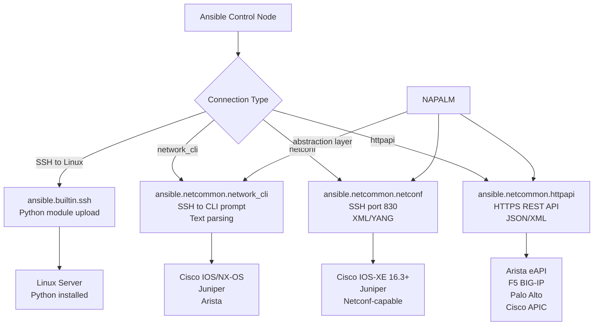
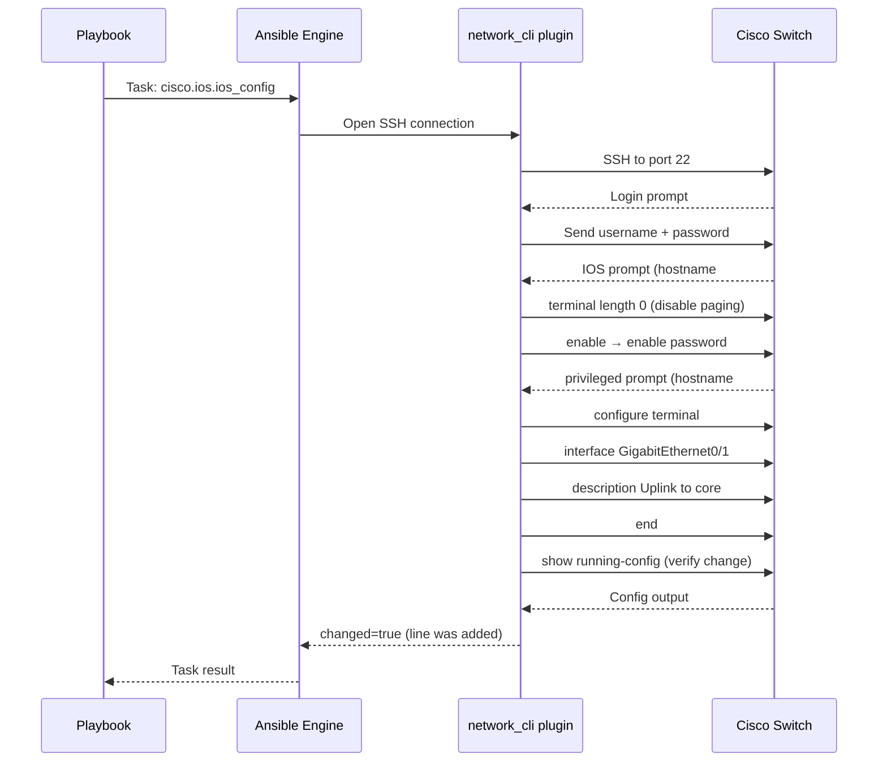

# Topic 23: Network Automation

> 📍 Phase 4 — Senior / Production | Topic 23 of 28 | File: `23-network-automation.md`
> 🔗 Prev: `22-dynamic-inventory-advanced.md` | Next: `24-windows-automation.md`

---

## 🧠 Concept Overview

Network devices — routers, switches, firewalls, load balancers — are the last frontier of manual change management in most organisations. Engineers still SSH into Cisco switches and type commands by hand. Ansible changes this.

Unlike Linux servers, network devices often can't run Python. They expose CLI interfaces (IOS, NXOS, JunOS), NETCONF/YANG APIs, or REST APIs. Ansible handles all of these through specialised **connection types** and **network modules** that translate Ansible tasks into the right protocol for each device family.

This topic covers the three connection types (`network_cli`, `netconf`, `httpapi`), key network modules across vendors, and the NAPALM library for multi-vendor idempotent configuration management.

---

## 📖 In-Depth Explanation

### Subtopic 23.1 — Network Connection Types: `network_cli`, `netconf`, `httpapi`

Network automation uses different connection plugins than the default SSH used for Linux hosts. These are set via `ansible_connection` in inventory or group_vars.

#### `network_cli` — SSH to a CLI prompt

The most common network connection type. Ansible SSHes into the device, sends commands as if typing them at a terminal, and parses the text output.

```yaml
# group_vars/cisco_ios/vars.yml
ansible_connection: ansible.netcommon.network_cli
ansible_network_os: cisco.ios.ios
ansible_user: netadmin
ansible_password: "{{ vault_network_password }}"
ansible_become: true
ansible_become_method: enable
ansible_become_password: "{{ vault_enable_password }}"

# SSH settings for network devices
ansible_ssh_common_args: '-o StrictHostKeyChecking=no'
```

Supported platforms with `network_cli`:

| `ansible_network_os` | Vendor | Collection |
|---------------------|--------|-----------|
| `cisco.ios.ios` | Cisco IOS/IOS-XE | `cisco.ios` |
| `cisco.nxos.nxos` | Cisco NX-OS | `cisco.nxos` |
| `cisco.iosxr.iosxr` | Cisco IOS-XR | `cisco.iosxr` |
| `arista.eos.eos` | Arista EOS | `arista.eos` |
| `juniper.junos.junos` | Juniper JunOS | `juniper.junos` |
| `vyos.vyos.vyos` | VyOS | `vyos.vyos` |
| `community.network.routeros` | MikroTik | `community.network` |

---

#### `netconf` — NETCONF/YANG XML API

NETCONF is a network management protocol that uses XML/YANG data models. More structured than CLI — supports transactions, rollback, and schema validation. Available on Juniper, Cisco IOS-XE 16.3+, and many enterprise devices.

```yaml
# group_vars/juniper/vars.yml
ansible_connection: ansible.netcommon.netconf
ansible_network_os: junipernetworks.junos.junos
ansible_user: netadmin
ansible_password: "{{ vault_junos_password }}"
ansible_port: 830    # NETCONF port (default)
```

```yaml
# Using netconf to get device configuration
- name: Get Juniper interface config via NETCONF
  junipernetworks.junos.junos_get_config:
    section: interfaces
  register: junos_config

- name: Configure Juniper interface via NETCONF
  junipernetworks.junos.junos_interfaces:
    config:
      - name: ge-0/0/0
        description: "Uplink to core"
        enabled: true
        ipv4:
          - address:
              ip: 10.0.0.1
              prefix_length: 30
    state: merged
```

---

#### `httpapi` — REST API over HTTP/HTTPS

Used for devices with REST APIs: Arista EOS (eAPI), Cisco APIC (ACI), F5 BIG-IP, Palo Alto PAN-OS.

```yaml
# group_vars/arista_eos/vars.yml
ansible_connection: ansible.netcommon.httpapi
ansible_network_os: arista.eos.eos
ansible_user: admin
ansible_password: "{{ vault_arista_password }}"
ansible_httpapi_use_ssl: true
ansible_httpapi_validate_certs: false    # for self-signed certs in labs
ansible_httpapi_port: 443
```

---

#### `ansible_connection: local` — Legacy (avoid)

Older network playbooks used `connection: local` with the `provider` argument. This is deprecated — use the native connection plugins above for all new playbooks.

```yaml
# ❌ Legacy — don't use for new playbooks
- hosts: routers
  connection: local
  tasks:
    - ios_command:
        provider: "{{ cli }}"   # deprecated provider pattern

# ✅ Modern — native network_cli
- hosts: routers
  tasks:
    - cisco.ios.ios_command:
        commands: show version
```

---

### Subtopic 23.2 — Key Network Modules: `ios_config`, `nxos_command`, `junos_facts`

#### Ansible network module naming convention

All modern network modules follow the FQCN pattern:
`<vendor_namespace>.<collection>.<platform>_<function>`

- `cisco.ios.ios_config` — Cisco IOS configuration
- `cisco.nxos.nxos_command` — Cisco NX-OS command execution
- `arista.eos.eos_interfaces` — Arista interface management
- `junipernetworks.junos.junos_facts` — Juniper fact gathering

---

#### `*_facts` — Gather network device facts

```yaml
- name: Gather Cisco IOS facts
  hosts: cisco_switches
  gather_facts: false    # disable Linux fact gathering

  tasks:
    - name: Gather IOS device facts
      cisco.ios.ios_facts:
        gather_subset:
          - interfaces
          - hardware
          - config

    - name: Show device information
      ansible.builtin.debug:
        msg: |
          Hostname: {{ ansible_net_hostname }}
          Model:    {{ ansible_net_model }}
          Version:  {{ ansible_net_version }}
          Interfaces: {{ ansible_net_interfaces.keys() | list }}
```

Common `ansible_net_*` facts:

| Fact | Description |
|------|-------------|
| `ansible_net_hostname` | Device hostname |
| `ansible_net_model` | Hardware model |
| `ansible_net_version` | OS version |
| `ansible_net_serialnum` | Serial number |
| `ansible_net_interfaces` | Dict of interface details |
| `ansible_net_all_ipv4_addresses` | All IPv4 addresses |
| `ansible_net_config` | Running config as string |

---

#### `*_command` — Run show commands and parse output

```yaml
- name: Run show commands on Cisco IOS
  cisco.ios.ios_command:
    commands:
      - show version
      - show ip interface brief
      - show spanning-tree
      - "show interface {{ target_interface }}"
  register: show_output

- name: Display interface status
  ansible.builtin.debug:
    msg: "{{ show_output.stdout_lines[1] }}"    # show ip interface brief output

# NX-OS command with wait_for (poll until condition met)
- name: Wait for OSPF adjacency
  cisco.nxos.nxos_command:
    commands: show ip ospf neighbor
    wait_for:
      - result[0] contains FULL
    retries: 10
    interval: 10
```

---

#### `*_config` — Push configuration changes

```yaml
# Cisco IOS configuration
- name: Configure interface descriptions
  cisco.ios.ios_config:
    lines:
      - description Link to core-sw-01
      - ip address 10.0.1.1 255.255.255.252
      - no shutdown
    parents: interface GigabitEthernet0/1
    backup: true      # save backup of running config before change
    save_when: modified    # save to startup-config only if changed

- name: Configure OSPF
  cisco.ios.ios_config:
    lines:
      - router-id 10.255.255.1
      - network 10.0.0.0 0.0.0.255 area 0
      - network 10.0.1.0 0.0.0.255 area 0
      - passive-interface default
      - no passive-interface GigabitEthernet0/1
    parents: router ospf 1
    match: strict    # require exact match before considering changed

# Arista EOS configuration
- name: Configure Arista VLANs
  arista.eos.eos_vlans:
    config:
      - vlan_id: 100
        name: production
        state: active
      - vlan_id: 200
        name: management
        state: active
    state: merged

# Juniper — structured config with state models
- name: Configure Juniper BGP
  junipernetworks.junos.junos_bgp_global:
    config:
      as_number: "65001"
      router_id: "10.255.255.1"
    state: merged
```

---

#### Resource modules — idempotent structured configuration

Modern Ansible network modules follow the **resource module** pattern — they work with structured data (dicts/lists) and support idempotent `state` operations:

| State | Meaning |
|-------|---------|
| `merged` | Add/update — don't remove unlisted items |
| `replaced` | Replace config for listed resources only |
| `overridden` | Replace ALL config with exactly what's specified |
| `deleted` | Remove listed resources |
| `gathered` | Read current device config into Ansible variable |
| `rendered` | Generate config text without applying (check mode) |
| `parsed` | Parse config text into structured data |

```yaml
# Idempotent interface configuration with resource module
- name: Configure interfaces (idempotent)
  cisco.ios.ios_interfaces:
    config:
      - name: GigabitEthernet0/1
        description: Uplink to core
        enabled: true
        speed: auto
        duplex: auto
      - name: GigabitEthernet0/2
        description: Server port
        enabled: true
    state: merged    # only add/update, don't delete others

# Gather current config into a variable (no changes)
- name: Read current interface config
  cisco.ios.ios_interfaces:
    state: gathered
  register: current_interfaces

- name: Show gathered config
  ansible.builtin.debug:
    var: current_interfaces.gathered
```

---

### Subtopic 23.3 — NAPALM and `cli_command` for Multi-Vendor Automation

#### `ansible.netcommon.cli_command` — Vendor-agnostic CLI

When you have mixed-vendor environments, `cli_command` sends commands over whatever connection is configured — no need to use vendor-specific modules:

```yaml
# Works on any device with network_cli connection
- name: Get running config (any vendor)
  ansible.netcommon.cli_command:
    command: show running-config
  register: running_config

- name: Show version (any vendor)
  ansible.netcommon.cli_command:
    command: "{{ show_version_cmd }}"    # defined per-vendor in group_vars
```

```yaml
# group_vars/cisco_ios.yml
show_version_cmd: "show version"
save_config_cmd: "copy running-config startup-config"

# group_vars/juniper.yml
show_version_cmd: "show version"
save_config_cmd: "commit"

# group_vars/arista_eos.yml
show_version_cmd: "show version"
save_config_cmd: "copy running-config startup-config"
```

---

#### `ansible.netcommon.cli_config` — Vendor-agnostic config push

```yaml
# Push rendered config (from template) to any device
- name: Generate device config from template
  ansible.builtin.template:
    src: "templates/{{ ansible_network_os | replace('.', '_') }}.j2"
    dest: "/tmp/{{ inventory_hostname }}_config.txt"
  delegate_to: localhost

- name: Push config to device
  ansible.netcommon.cli_config:
    config: "{{ lookup('file', '/tmp/' + inventory_hostname + '_config.txt') }}"
    rollback_id: 0    # rollback to this checkpoint on failure (if supported)
```

---

#### NAPALM — Network Automation and Programmability Abstraction Layer

NAPALM provides a uniform Python API for network devices — the same code works on Cisco IOS, NX-OS, Juniper, Arista, and more. The `community.network` collection includes NAPALM-based modules.

```bash
pip install napalm
ansible-galaxy collection install community.network
```

```yaml
# inventory — NAPALM connection
# group_vars/all.yml
ansible_connection: local    # NAPALM runs on control node

# host_vars/router1.yml
napalm_driver: ios           # or: junos, eos, nxos
napalm_hostname: "{{ ansible_host }}"
napalm_username: "{{ vault_net_user }}"
napalm_password: "{{ vault_net_pass }}"
napalm_timeout: 60
```

```yaml
# Playbook using NAPALM modules
- name: NAPALM multi-vendor network automation
  hosts: network_devices
  gather_facts: false

  tasks:
    - name: Get device facts via NAPALM
      community.network.napalm_get_facts:
        hostname: "{{ napalm_hostname }}"
        username: "{{ napalm_username }}"
        password: "{{ napalm_password }}"
        dev_os: "{{ napalm_driver }}"
        filter:
          - facts
          - interfaces
          - bgp_neighbors
      register: napalm_facts

    - name: Display NAPALM facts
      ansible.builtin.debug:
        msg: |
          Hostname: {{ napalm_facts.ansible_facts.napalm_hostname }}
          Model:    {{ napalm_facts.ansible_facts.napalm_model }}
          Uptime:   {{ napalm_facts.ansible_facts.napalm_uptime }}s

    - name: Generate config from template
      ansible.builtin.template:
        src: "templates/base_config.j2"
        dest: "/tmp/{{ inventory_hostname }}_new.cfg"
      delegate_to: localhost

    - name: Compare and merge config (dry run first)
      community.network.napalm_install_config:
        hostname: "{{ napalm_hostname }}"
        username: "{{ napalm_username }}"
        password: "{{ napalm_password }}"
        dev_os: "{{ napalm_driver }}"
        config_file: "/tmp/{{ inventory_hostname }}_new.cfg"
        commit_changes: "{{ apply_changes | default(false) }}"    # false = dry run
        replace_config: false    # merge, not replace
        diff_file: "/tmp/{{ inventory_hostname }}_diff.txt"
      register: config_diff

    - name: Show what would change
      ansible.builtin.debug:
        var: config_diff.msg
```

---

## 🏗️ Architecture & System Design

How Ansible connects to network devices vs Linux hosts:



---

## 🔄 Flow / Lifecycle



---

## 💻 Code Examples

### ✅ Example 1: Complete Cisco IOS switch configuration role

```yaml
# group_vars/cisco_switches/vars.yml
ansible_connection: ansible.netcommon.network_cli
ansible_network_os: cisco.ios.ios
ansible_user: netadmin
ansible_password: "{{ vault_ios_password }}"
ansible_become: true
ansible_become_method: enable
ansible_become_password: "{{ vault_ios_enable_password }}"

# Switch-specific defaults
ntp_servers:
  - 10.0.0.10
  - 10.0.0.11
dns_servers:
  - 8.8.8.8
  - 8.8.4.4
syslog_server: 10.0.0.20
```

```yaml
# playbooks/cisco_baseline.yml
- name: Configure Cisco IOS baseline
  hosts: cisco_switches
  gather_facts: false

  tasks:
    - name: Gather device facts
      cisco.ios.ios_facts:
        gather_subset: [hardware, interfaces]

    - name: Set hostname
      cisco.ios.ios_hostname:
        config:
          hostname: "{{ inventory_hostname }}"
        state: merged

    - name: Configure NTP servers
      cisco.ios.ios_ntp_global:
        config:
          servers:
            - server: "{{ item }}"
              prefer: "{{ loop.index == 1 }}"
        state: merged
      loop: "{{ ntp_servers }}"

    - name: Configure syslog
      cisco.ios.ios_logging_global:
        config:
          hosts:
            - host: "{{ syslog_server }}"
              severity: informational
        state: merged

    - name: Disable unused services
      cisco.ios.ios_config:
        lines:
          - no service pad
          - no ip http server
          - no ip http secure-server
          - no cdp run
          - no ip source-route

    - name: Configure management interface
      cisco.ios.ios_l3_interfaces:
        config:
          - name: Vlan1
            ipv4:
              - address:
                  ip: "{{ ansible_host }}"
                  prefix_length: "{{ mgmt_prefix | default(24) }}"
        state: merged

    - name: Save configuration
      cisco.ios.ios_config:
        save_when: always
```

### ✅ Example 2: Multi-vendor VLAN audit

```yaml
- name: Audit VLANs across all switches
  hosts: all_switches
  gather_facts: false

  tasks:
    - name: Gather VLAN facts (Cisco IOS)
      cisco.ios.ios_vlans:
        state: gathered
      register: ios_vlans
      when: ansible_network_os == 'cisco.ios.ios'

    - name: Gather VLAN facts (Arista EOS)
      arista.eos.eos_vlans:
        state: gathered
      register: eos_vlans
      when: ansible_network_os == 'arista.eos.eos'

    - name: Normalise VLAN list
      ansible.builtin.set_fact:
        current_vlans: >-
          {{ (ios_vlans.gathered if ios_vlans is not skipped else
              eos_vlans.gathered if eos_vlans is not skipped else [])
             | map(attribute='vlan_id') | list }}

    - name: Check for required VLANs
      ansible.builtin.assert:
        that:
          - item in current_vlans
        fail_msg: "Required VLAN {{ item }} is MISSING from {{ inventory_hostname }}"
        success_msg: "VLAN {{ item }} present on {{ inventory_hostname }}"
      loop: "{{ required_vlans }}"    # defined in group_vars
```

### ✅ Example 3: Network change with backup and rollback

```yaml
- name: Apply network change with safety net
  hosts: core_switches
  gather_facts: false
  serial: 1    # one device at a time for network changes

  tasks:
    - name: Create config backup
      cisco.ios.ios_config:
        backup: true
        backup_options:
          filename: "{{ inventory_hostname }}_{{ ansible_date_time.date }}.cfg"
          dir_path: ./backups

    - block:
        - name: Apply BGP configuration change
          cisco.ios.ios_bgp_global:
            config:
              as_number: "{{ bgp_as }}"
              neighbors:
                - neighbor_address: "{{ item.ip }}"
                  remote_as: "{{ item.as }}"
                  description: "{{ item.description }}"
            state: merged
          loop: "{{ bgp_neighbors }}"

        - name: Verify BGP sessions come up
          cisco.ios.ios_command:
            commands: show ip bgp summary
            wait_for:
              - result[0] contains Established
            retries: 12
            interval: 10

      rescue:
        - name: Rollback to saved backup
          cisco.ios.ios_config:
            src: "./backups/{{ inventory_hostname }}_{{ ansible_date_time.date }}.cfg"
            match: none    # replace entire config

        - name: Alert on rollback
          ansible.builtin.debug:
            msg: "ROLLBACK executed on {{ inventory_hostname }} — BGP did not establish"

        - ansible.builtin.fail:
            msg: "BGP change failed — rolled back to previous config"
```

### ✅ Example 4: Config compliance check

```yaml
- name: Network compliance audit
  hosts: all_routers
  gather_facts: false

  tasks:
    - name: Get running config
      cisco.ios.ios_command:
        commands: show running-config
      register: running_config
      changed_when: false

    - name: Check required security settings
      ansible.builtin.assert:
        that:
          - "'service password-encryption' in running_config.stdout[0]"
          - "'no ip http server' in running_config.stdout[0]"
          - "'logging' in running_config.stdout[0]"
          - "'ntp server' in running_config.stdout[0]"
          - "'aaa new-model' in running_config.stdout[0]"
        fail_msg: "Compliance check FAILED on {{ inventory_hostname }}"
        success_msg: "{{ inventory_hostname }} passes compliance check"

    - name: Report non-compliant devices
      ansible.builtin.debug:
        msg: "WARNING: {{ inventory_hostname }} failed compliance check"
      when: compliance_check is failed
```

### ❌ Anti-pattern — Using raw SSH commands instead of network modules

```yaml
# ❌ Fragile — text parsing, not idempotent, breaks on different IOS versions
- name: Configure interface
  ansible.builtin.command: >
    ssh netadmin@{{ ansible_host }}
    "conf t; interface Gi0/1; description Uplink; end; wr"
  changed_when: true    # always changed, no idempotency

# ✅ Idempotent resource module — checks current state, changes only if needed
- name: Configure interface
  cisco.ios.ios_interfaces:
    config:
      - name: GigabitEthernet0/1
        description: Uplink to core
        enabled: true
    state: merged
```

---

## ⚙️ Configuration & Options

### Network inventory variables reference

| Variable | Description |
|----------|-------------|
| `ansible_connection` | Connection plugin: `network_cli`, `netconf`, `httpapi` |
| `ansible_network_os` | Platform FQCN: `cisco.ios.ios`, `arista.eos.eos` |
| `ansible_user` | Login username |
| `ansible_password` | Login password (use vault) |
| `ansible_become` | Enable privilege escalation |
| `ansible_become_method` | Usually `enable` for Cisco |
| `ansible_become_password` | Enable secret (use vault) |
| `ansible_port` | SSH port (default 22, NETCONF 830) |
| `ansible_host` | Management IP/hostname |
| `ansible_httpapi_use_ssl` | HTTPS for httpapi connections |

### Resource module state reference

| State | Action |
|-------|--------|
| `merged` | Add/update specified items, keep existing |
| `replaced` | Replace config for listed items only |
| `overridden` | Replace ALL config with specified |
| `deleted` | Remove specified items |
| `gathered` | Read current config into `gathered` key |
| `rendered` | Generate config text without applying |
| `parsed` | Parse text config into structured data |

---

## 🧩 Patterns & Best Practices

**What experienced engineers do:**
- Always use resource modules with `state: merged` by default — they check current config and only push changes that are actually needed, giving you idempotency on network devices
- Back up running config before every change (`ios_config: backup: true`) — one `rescue` block with config restore can save hours of manual recovery
- Use `serial: 1` or `serial: 2` for network changes — unlike server patches, a misconfigured core switch can take down everything
- Use `wait_for` in `*_command` tasks after topology-changing operations — wait for OSPF adjacency, BGP sessions, or STP convergence before declaring success
- Store all credentials with vault — network passwords are high-value targets; `ansible_password` and `ansible_become_password` must never appear in plaintext

**What beginners typically get wrong:**
- Using `gather_facts: true` (the default) for network playbooks — this tries to run the Linux `setup` module on network devices, which fails; always set `gather_facts: false` and use `*_facts` modules explicitly
- Using vendor-specific modules across mixed environments — write per-vendor tasks with `when: ansible_network_os == 'cisco.ios.ios'` or use `cli_command` for commands that are syntactically identical
- Skipping `save_when: modified` after config changes — device reboots (power failure, scheduled maintenance) wipe unsaved configs
- Not using `changed_when: false` on show commands — every `show running-config` falsely reports `changed`, breaking idempotency tracking

**Senior-level nuance:**
- For large-scale network automation (hundreds of devices), Ansible's agentless SSH approach introduces significant latency — each task opens an SSH connection, sends commands, and closes. Use `persistent_connection` settings to keep SSH connections alive between tasks, or consider purpose-built network automation tools (Nornir + Netmiko) for the pure speed cases. Ansible excels at orchestration and change management; Nornir excels at rapid parallel data collection.
- NETCONF (`netconf` connection type) with YANG models is the most reliable and idempotent approach where supported — XML transactions have rollback semantics, schema validation catches errors before commit, and the structured data eliminates text parsing fragility. Prioritise NETCONF over CLI where the platform supports it.

---

## 🔗 How It Connects

- **Builds on:** `22-dynamic-inventory-advanced.md` — network devices need their own inventory groups and connection variables set via group_vars
- **Leads to:** `24-windows-automation.md` — another "non-Linux" target type with its own connection protocol (WinRM instead of SSH)
- **Related concepts:** Topic 3 (Inventory — `ansible_connection` and `ansible_network_os` set in group_vars), Topic 14 (Error handling — network changes always need `block/rescue/always` with rollback), Topic 20 (Performance — `serial: 1` is the safety setting for network changes)

---

## 🎯 Interview Questions (Conceptual)

**Q1: Why do network device playbooks need `gather_facts: false`?**
> **A:** Ansible's default fact gathering runs the `setup` module, which executes a Python script on the managed host. Network devices don't run Python and can't execute arbitrary scripts — they're routers and switches, not general-purpose computers. Using `gather_facts: false` skips this and lets you use platform-specific `*_facts` modules (like `ios_facts`) instead, which gather device information through the device's native CLI or API.

**Q2: What is the difference between `network_cli`, `netconf`, and `httpapi` connection types?**
> **A:** `network_cli` SSHes into the device's CLI interface and sends text commands — it works on virtually any device with an SSH CLI. `netconf` uses the NETCONF protocol (SSH on port 830) with XML/YANG data models — structured, supports transactions and rollback, but requires NETCONF support on the device. `httpapi` uses HTTPS REST APIs — used for devices like Arista (eAPI), F5, and Palo Alto. `netconf` is most reliable where supported; `network_cli` is the widest compatibility option.

**Q3: What is the `state: gathered` in a network resource module and when would you use it?**
> **A:** `gathered` reads the current device configuration and returns it as structured data in the `gathered` key of the result — no changes are made. It's used to capture current state for auditing, comparison, or building an inventory of what's configured. Combined with `state: rendered` (generate config text without applying), it enables change preview workflows: gather current state, compute desired state, render the diff, apply only after review.

**Q4: What is NAPALM and what advantage does it provide over vendor-specific modules?**
> **A:** NAPALM (Network Automation and Programmability Abstraction Layer) is a Python library providing a uniform API across multiple network vendors. The same Python code and Ansible tasks work on Cisco IOS, NX-OS, Arista EOS, and Juniper JunOS. For mixed-vendor environments, NAPALM reduces the number of vendor-specific code paths. It also provides diff-based config deployment with rollback support across all supported platforms.

**Q5: Why is `serial: 1` important for network automation playbooks?**
> **A:** Network devices often have interdependencies — a core switch connects to many distribution switches, which connect to access switches. A misconfigured core switch can take down hundreds of connected devices. Processing one device at a time ensures that a failure is caught immediately and confined to one device before the error propagates to the next. It also gives the verification step (`wait_for` on OSPF/BGP convergence) time to confirm the change is safe before moving on.

---

## 🧠 Scenario-Based Interview Problems

**Scenario 1: "You need to push a VLAN configuration change to 200 access switches simultaneously. Some switches are Cisco IOS, some are Arista EOS. How do you structure this?"**
> **Problem:** Multi-vendor fleet, same logical change, different module syntax.
> **Approach:** Create two groups in inventory: `cisco_access` and `arista_access`. Set `ansible_network_os` and `ansible_connection` appropriately in each group's `group_vars`. Write a single play targeting `all_access_switches` (a parent group containing both) with two vendor-specific tasks, each gated with `when: ansible_network_os == 'cisco.ios.ios'` and `when: ansible_network_os == 'arista.eos.eos'`. Alternatively, use `cli_command` with a per-vendor `vlan_config_cmd` variable for the one command that differs, keeping everything else shared.
> **Trade-offs:** Two vendor-specific tasks per function is verbose but explicit. `cli_command` is terser but loses idempotency (text commands always report `changed`). For a large mixed fleet, accept the verbosity for the reliability gains.

**Scenario 2: "Your team wants to automate BGP neighbour configuration across 50 routers, but the network team is worried about making a mistake that takes down the network. What safeguards do you implement?"**
> **Problem:** High-risk network change needing multiple layers of protection.
> **Approach:** (1) `serial: 1` — process one router at a time. (2) `backup: true` before every change — creates a timestamped config backup. (3) `block/rescue/always` — on failure, restore the backup and alert the team. (4) `wait_for` after applying BGP config — wait for sessions to reach `Established` before moving to the next router. (5) Dry run first: run with `--check` and `state: rendered` to preview changes. (6) AWX approval gate — a senior network engineer approves the workflow before it runs. (7) Limit scope with `--limit` to one device first, verify manually, then run the full fleet.
> **Trade-offs:** All these safeguards are correct but slow — 50 routers with `serial: 1` plus 2-minute BGP convergence waits = 100+ minutes total. Accept this for critical network changes; reserve parallel execution for low-risk operations like banner updates or NTP configuration.

---

## ⚡ Quick Notes — Revision Card

- 📌 Always `gather_facts: false` for network plays — use `*_facts` modules instead
- 📌 `network_cli` = SSH+CLI (widest support) | `netconf` = XML/YANG (structured, transactional) | `httpapi` = REST API
- 📌 `ansible_connection` + `ansible_network_os` set in group_vars per device family
- 📌 `*_command` = run show commands | `*_config` = push config | `*_facts` = gather device info
- 📌 Resource module states: `merged` (safe default) | `overridden` (replace all) | `gathered` (read only)
- 📌 `save_when: modified` in `ios_config` = only save to startup-config when changed
- 📌 `wait_for` in `*_command` = poll until output matches condition (BGP up, OSPF converged)
- 📌 NAPALM = multi-vendor abstraction layer — same tasks work on IOS/NX-OS/EOS/JunOS
- 📌 `cli_command` / `cli_config` = vendor-agnostic, works with any `network_cli` connection
- ⚠️ `gather_facts: true` (default) will fail on network devices — always override to `false`
- ⚠️ Always `serial: 1` for network changes — a bad core switch config can cascade to hundreds of devices
- ⚠️ Always back up running config before changes + have a rollback plan in `rescue:`
- 💡 NETCONF preferred over CLI where supported — structured data, schema validation, rollback semantics
- 🔑 `state: gathered` + `state: rendered` = change preview workflow without applying anything

---

## 🔖 References & Further Reading

- 📄 [Ansible Network Automation Guide](https://docs.ansible.com/ansible/latest/network/index.html)
- 📄 [cisco.ios collection](https://docs.ansible.com/ansible/latest/collections/cisco/ios/index.html)
- 📄 [ansible.netcommon collection](https://docs.ansible.com/ansible/latest/collections/ansible/netcommon/index.html)
- 📄 [Network Resource Modules](https://docs.ansible.com/ansible/latest/network/user_guide/network_resource_modules.html)
- 📝 [NAPALM Documentation](https://napalm.readthedocs.io/)
- 🎥 [Ansible Network Automation — AnsibleFest](https://www.youtube.com/watch?v=M-g7s1X8b1c)
- ➡️ Related in this course: [`22-dynamic-inventory-advanced.md`] · [`24-windows-automation.md`]

---
