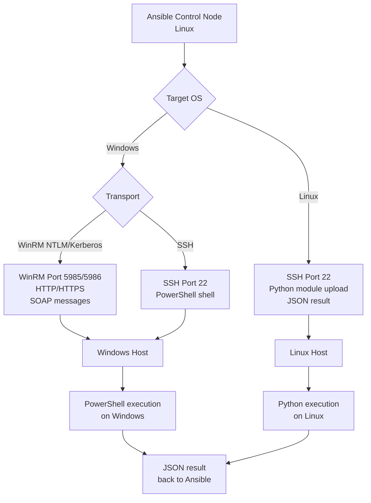
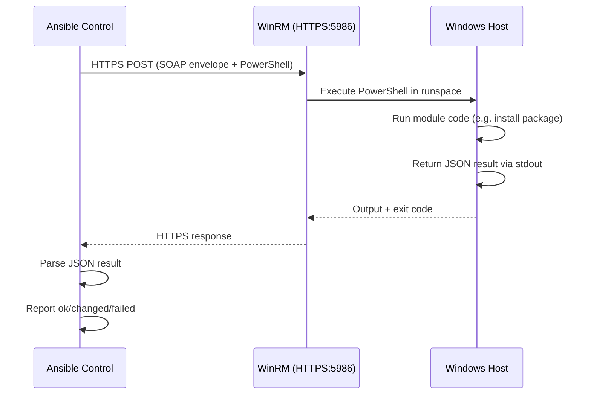

# Topic 24: Windows Automation

> 📍 Phase 4 — Senior / Production | Topic 24 of 28 | File: `24-windows-automation.md`
> 🔗 Prev: `23-network-automation.md` | Next: `25-cicd-integration.md`

---

## 🧠 Concept Overview

Ansible's default assumption is Linux over SSH. Windows is a completely different world — no SSH daemon by default, no Python, a completely different filesystem and registry, PowerShell instead of bash. Yet Ansible manages Windows just as capably as Linux, using **WinRM** (Windows Remote Management) as the transport layer instead of SSH.

Windows automation with Ansible is common in hybrid infrastructure: Windows Server for IIS, SQL Server, Active Directory, and .NET apps — all automated by the same playbooks that manage your Linux stack. This topic covers WinRM setup, Kerberos authentication for Active Directory environments, and the key Windows-specific modules.

---

## 📖 In-Depth Explanation

### Subtopic 24.1 — WinRM Setup and Kerberos Authentication

#### What is WinRM?

WinRM (Windows Remote Management) is Microsoft's implementation of the WS-Management protocol. Ansible connects to it on:
- **HTTP**: port 5985 (unencrypted — dev only)
- **HTTPS**: port 5986 (encrypted — production)

WinRM must be explicitly enabled on Windows hosts — it's not running by default.

---

#### Enabling WinRM on Windows (one-time setup)

```powershell
# Run on the Windows target — enables WinRM with HTTPS self-signed cert
# Download and run Ansible's quickstart script
[Net.ServicePointManager]::SecurityProtocol = [Net.SecurityProtocolType]::Tls12
$url = "https://raw.githubusercontent.com/ansible/ansible/devel/examples/scripts/ConfigureRemotingForAnsible.ps1"
$file = "$env:temp\ConfigureRemotingForAnsible.ps1"
(New-Object -TypeName System.Net.WebClient).DownloadFile($url, $file)
powershell.exe -ExecutionPolicy ByPass -File $file

# Or manually:
winrm quickconfig -q
winrm set winrm/config/winrs '@{MaxMemoryPerShellMB="512"}'
winrm set winrm/config '@{MaxTimeoutms="1800000"}'
winrm set winrm/config/service '@{AllowUnencrypted="false"}'
winrm set winrm/config/service/auth '@{Basic="true"}'
```

For domain environments (Active Directory), use Group Policy to enable WinRM across all hosts automatically — far more scalable than manual setup.

---

#### Inventory and connection variables

```yaml
# group_vars/windows/vars.yml
ansible_connection: winrm
ansible_winrm_transport: ntlm          # or: basic, kerberos, certificate
ansible_winrm_scheme: https
ansible_port: 5986
ansible_winrm_server_cert_validation: ignore   # for self-signed certs

# For NTLM (local accounts or domain without Kerberos configured)
ansible_user: Administrator
ansible_password: "{{ vault_windows_password }}"

# For Kerberos (domain environments — see below)
# ansible_winrm_transport: kerberos
# ansible_user: DOMAIN\serviceaccount
# ansible_password: "{{ vault_domain_password }}"
```

---

#### WinRM transport options

| Transport | Use case | Requirements |
|-----------|---------|-------------|
| `basic` | Dev/lab only | Plaintext — never in production |
| `ntlm` | Domain or local accounts | Works out of the box; less secure than Kerberos |
| `kerberos` | Active Directory (recommended) | Requires `pywinrm[kerberos]` + krb5 libs |
| `certificate` | Service accounts, no AD | Requires client cert on Ansible host |
| `credssp` | Double-hop scenarios | Complex setup; required for some installers |

---

#### Kerberos authentication — the production standard for AD environments

Kerberos is the correct authentication method for domain-joined Windows hosts. It's more secure than NTLM and doesn't require local admin credentials on each host.

```bash
# Install on Ansible control node (Ubuntu)
sudo apt install -y python3-dev libkrb5-dev krb5-user gcc
pip install pywinrm[kerberos]

# Configure /etc/krb5.conf
[libdefaults]
    default_realm = EXAMPLE.COM
    dns_lookup_realm = false
    dns_lookup_kdc = true

[realms]
    EXAMPLE.COM = {
        kdc = dc1.example.com
        admin_server = dc1.example.com
    }

[domain_realm]
    .example.com = EXAMPLE.COM
    example.com = EXAMPLE.COM
```

```yaml
# group_vars/windows_ad/vars.yml
ansible_connection: winrm
ansible_winrm_transport: kerberos
ansible_winrm_scheme: https
ansible_port: 5986
ansible_winrm_server_cert_validation: validate    # validate AD-issued certs
ansible_user: EXAMPLE\ansible-svc
ansible_password: "{{ vault_domain_svc_password }}"
ansible_winrm_kerberos_delegation: false
```

```bash
# Test Kerberos ticket
kinit ansible-svc@EXAMPLE.COM
klist    # verify ticket obtained

# Test WinRM connectivity
ansible windows_hosts -m ansible.windows.win_ping
```

---

#### SSH on Windows (alternative to WinRM — Server 2019+)

Windows Server 2019 and Windows 10/11 ship with OpenSSH. Using SSH with Ansible is simpler to configure than WinRM:

```powershell
# Install OpenSSH Server (Windows Server 2019+)
Add-WindowsCapability -Online -Name OpenSSH.Server~~~~0.0.1.0
Start-Service sshd
Set-Service -Name sshd -StartupType 'Automatic'
```

```yaml
# group_vars/windows_ssh/vars.yml
ansible_connection: ssh
ansible_shell_type: powershell
ansible_user: Administrator
ansible_private_key_file: ~/.ssh/windows_key
```

> 💡 SSH on Windows is simpler to configure for newer Windows versions. Use WinRM for Windows Server 2012/2016 and older environments; consider SSH for new deployments on 2019+.

---

### Subtopic 24.2 — Key Windows Modules: `win_package`, `win_service`, `win_regedit`

All Windows-specific modules use the `ansible.windows` or `community.windows` collection prefix.

```bash
ansible-galaxy collection install ansible.windows community.windows
```

#### `win_ping` — Test connectivity

```yaml
- name: Test Windows connectivity
  ansible.windows.win_ping:
```

#### `win_package` — Install MSI / EXE packages

```yaml
- name: Install 7-Zip
  ansible.windows.win_package:
    path: "https://www.7-zip.org/a/7z2301-x64.msi"
    product_id: '{23170F69-40C1-2702-2301-000001000000}'    # MSI product ID
    state: present

- name: Install application from file share
  ansible.windows.win_package:
    path: "\\\\fileserver\\installers\\MyApp_2.1.0.msi"
    arguments: /quiet /norestart
    state: present

- name: Uninstall application
  ansible.windows.win_package:
    product_id: '{MSI-PRODUCT-GUID-HERE}'
    state: absent
```

#### `win_chocolatey` — Package manager for Windows (recommended)

Chocolatey is the Windows equivalent of apt/yum — far easier to use than `win_package`:

```yaml
- name: Ensure Chocolatey is installed
  chocolatey.chocolatey.win_chocolatey:
    name: chocolatey
    state: present

- name: Install applications via Chocolatey
  chocolatey.chocolatey.win_chocolatey:
    name:
      - notepadplusplus
      - 7zip
      - git
      - googlechrome
      - vcredist140
    state: present

- name: Install specific version
  chocolatey.chocolatey.win_chocolatey:
    name: nodejs
    version: "18.17.0"
    state: present

- name: Upgrade all Chocolatey packages
  chocolatey.chocolatey.win_chocolatey:
    name: all
    state: latest
```

#### `win_service` — Manage Windows services

```yaml
- name: Start IIS service
  ansible.windows.win_service:
    name: W3SVC
    state: started
    start_mode: auto

- name: Stop and disable a service
  ansible.windows.win_service:
    name: Spooler
    state: stopped
    start_mode: disabled

- name: Configure service with custom account
  ansible.windows.win_service:
    name: MyAppService
    state: started
    start_mode: auto
    username: EXAMPLE\myapp-svc
    password: "{{ vault_service_password }}"
    desktop_interact: false
```

#### `win_regedit` — Registry management

```yaml
# Create/update registry key
- name: Set application registry settings
  ansible.windows.win_regedit:
    path: HKLM:\SOFTWARE\MyApp
    name: InstallPath
    data: C:\Program Files\MyApp
    type: String

- name: Set DWORD value
  ansible.windows.win_regedit:
    path: HKLM:\SOFTWARE\MyApp
    name: MaxConnections
    data: 100
    type: DWord

- name: Enable TLS 1.2 (disable older TLS)
  ansible.windows.win_regedit:
    path: "HKLM:\\SYSTEM\\CurrentControlSet\\Control\\SecurityProviders\\SCHANNEL\\Protocols\\TLS 1.0\\Server"
    name: Enabled
    data: 0
    type: DWord

- name: Delete a registry key
  ansible.windows.win_regedit:
    path: HKLM:\SOFTWARE\OldApp
    state: absent
```

#### `win_file` — File and directory management

```yaml
- name: Create directory
  ansible.windows.win_file:
    path: C:\App\logs
    state: directory

- name: Delete file
  ansible.windows.win_file:
    path: C:\Temp\old_config.xml
    state: absent

- name: Create symlink (junction)
  ansible.windows.win_file:
    src: C:\App\shared
    dest: C:\Program Files\MyApp\shared
    state: link
```

#### `win_copy` and `win_template` — Deploy files

```yaml
# Copy file to Windows host
- name: Deploy configuration file
  ansible.windows.win_copy:
    src: files/app.config
    dest: C:\Program Files\MyApp\app.config

# Deploy rendered template
- name: Deploy web.config from template
  ansible.windows.win_template:
    src: templates/web.config.j2
    dest: C:\inetpub\wwwroot\MyApp\web.config
```

#### `win_iis_*` — IIS web server management

```yaml
- name: Ensure IIS is installed
  ansible.windows.win_feature:
    name:
      - Web-Server
      - Web-Asp-Net45
      - Web-Mgmt-Console
    state: present
    restart: false

- name: Create IIS website
  community.windows.win_iis_website:
    name: MyApp
    state: started
    port: 80
    ip: "*"
    hostname: myapp.example.com
    physical_path: C:\inetpub\wwwroot\MyApp
    application_pool: MyAppPool

- name: Create application pool
  community.windows.win_iis_webapppool:
    name: MyAppPool
    state: started
    attributes:
      processModel.userName: EXAMPLE\myapp-svc
      processModel.password: "{{ vault_apppool_password }}"
      processModel.identityType: SpecificUser
      managedRuntimeVersion: v4.0
      startMode: AlwaysRunning
```

---

### Subtopic 24.3 — PowerShell Integration with `win_shell` and `win_script`

#### `win_shell` — Run PowerShell commands

```yaml
# Run PowerShell inline
- name: Get Windows features installed
  ansible.windows.win_shell: |
    Get-WindowsFeature | Where-Object {$_.Installed} |
      Select-Object Name, DisplayName |
      ConvertTo-Json
  register: installed_features
  changed_when: false

- name: Parse feature list
  ansible.builtin.set_fact:
    features: "{{ installed_features.stdout | from_json }}"

# Run PowerShell with variables
- name: Create local user
  ansible.windows.win_shell: |
    $Password = ConvertTo-SecureString "{{ user_password }}" -AsPlainText -Force
    New-LocalUser -Name "{{ username }}" -Password $Password `
      -FullName "{{ user_fullname }}" -Description "{{ user_description }}"
  no_log: true    # password in command — never log
  register: user_create
  failed_when:
    - user_create.rc != 0
    - "'already exists' not in user_create.stderr"
  changed_when: "'already exists' not in user_create.stderr"
```

#### `win_script` — Run a PowerShell script file

```yaml
# Run a local script file on the remote Windows host
- name: Run application installer script
  ansible.windows.win_script:
    script: scripts/install_myapp.ps1
    creates: C:\Program Files\MyApp\myapp.exe    # skip if this file exists

# Pass arguments to the script
- name: Configure application
  ansible.windows.win_script:
    script: scripts/configure_myapp.ps1
    parameters: "-ServerName {{ db_host }} -Port {{ db_port }}"
```

#### Using `win_shell` for idempotent operations

```yaml
# Pattern: check-then-act for idempotency with win_shell
- name: Check if certificate is installed
  ansible.windows.win_shell: |
    Get-ChildItem -Path Cert:\LocalMachine\My |
      Where-Object { $_.Subject -like "*CN={{ cert_cn }}*" }
  register: cert_check
  changed_when: false

- name: Import certificate if not present
  ansible.windows.win_shell: |
    Import-PfxCertificate `
      -FilePath "{{ cert_path }}" `
      -CertStoreLocation Cert:\LocalMachine\My `
      -Password (ConvertTo-SecureString "{{ cert_password }}" -AsPlainText -Force)
  no_log: true
  when: cert_check.stdout | length == 0
  changed_when: true
```

#### `win_command` — Run non-PowerShell executables

```yaml
# Run a .exe without PowerShell shell features
- name: Run application installer
  ansible.windows.win_command: >
    C:\Installers\setup.exe /quiet /norestart
    /INSTALLDIR="C:\Program Files\MyApp"
  args:
    creates: C:\Program Files\MyApp\myapp.exe    # idempotent: skip if exists
```

---

## 🏗️ Architecture & System Design

How Ansible connects to Windows vs Linux:



---

## 🔄 Flow / Lifecycle



---

## 💻 Code Examples

### ✅ Example 1: Windows server baseline configuration

```yaml
- name: Configure Windows Server baseline
  hosts: windows_servers
  gather_facts: true    # win_facts works fine on Windows

  tasks:
    - name: Ensure Windows updates are installed
      ansible.windows.win_updates:
        category_names:
          - SecurityUpdates
          - CriticalUpdates
        reboot: false    # handle reboot separately
        state: installed
      register: update_result

    - name: Reboot if updates require it
      ansible.windows.win_reboot:
        msg: "Rebooting after Windows updates"
        connect_timeout: 300
        reboot_timeout: 600
      when: update_result.reboot_required

    - name: Disable unnecessary services
      ansible.windows.win_service:
        name: "{{ item }}"
        state: stopped
        start_mode: disabled
      loop:
        - Fax
        - XblAuthManager
        - XblGameSave
        - PrintSpooler    # unless this is a print server

    - name: Configure Windows Firewall rules
      community.windows.win_firewall_rule:
        name: "Allow HTTPS"
        localport: 443
        action: allow
        direction: in
        protocol: tcp
        state: present
        enabled: true

    - name: Set timezone
      community.windows.win_timezone:
        timezone: "UTC"

    - name: Configure PowerShell execution policy
      ansible.windows.win_shell: |
        Set-ExecutionPolicy -ExecutionPolicy RemoteSigned -Scope LocalMachine -Force
      changed_when: false
```

### ✅ Example 2: IIS website deployment

```yaml
- name: Deploy .NET web application to IIS
  hosts: iis_servers
  become: false    # WinRM handles auth differently

  vars:
    app_name: MyWebApp
    app_pool: MyWebAppPool
    app_path: C:\inetpub\wwwroot\MyWebApp
    deploy_package: "\\\\fileserver\\releases\\MyWebApp_{{ app_version }}.zip"

  tasks:
    - name: Ensure IIS features are installed
      ansible.windows.win_feature:
        name: [Web-Server, Web-Asp-Net45, Web-Mgmt-Console]
        state: present

    - name: Create application directory
      ansible.windows.win_file:
        path: "{{ app_path }}"
        state: directory

    - name: Stop app pool before deploy
      community.windows.win_iis_webapppool:
        name: "{{ app_pool }}"
        state: stopped

    - name: Extract new application release
      community.windows.win_unzip:
        src: "{{ deploy_package }}"
        dest: "{{ app_path }}"
        delete_archive: false

    - name: Deploy web.config from template
      ansible.windows.win_template:
        src: templates/web.config.j2
        dest: "{{ app_path }}\\web.config"
      vars:
        db_connection: "Server={{ db_host }};Database={{ db_name }};Integrated Security=true"

    - name: Create or update application pool
      community.windows.win_iis_webapppool:
        name: "{{ app_pool }}"
        state: started
        attributes:
          managedRuntimeVersion: v4.0
          startMode: AlwaysRunning

    - name: Create or update IIS website
      community.windows.win_iis_website:
        name: "{{ app_name }}"
        state: started
        port: 443
        ip: "*"
        hostname: "{{ app_hostname }}"
        physical_path: "{{ app_path }}"
        application_pool: "{{ app_pool }}"

    - name: Verify site responds
      ansible.windows.win_uri:
        url: "https://{{ app_hostname }}/health"
        status_code: 200
      register: health_check
      retries: 5
      delay: 10
      until: health_check.status_code == 200
```

### ✅ Example 3: Active Directory user management

```yaml
- name: Manage AD users
  hosts: domain_controllers
  gather_facts: false

  tasks:
    - name: Create AD Organisational Unit
      community.windows.win_domain_ou:
        name: ServiceAccounts
        path: DC=example,DC=com
        state: present

    - name: Create service account
      community.windows.win_domain_user:
        name: myapp-svc
        firstname: MyApp
        surname: Service
        company: MyOrg
        password: "{{ vault_svc_password }}"
        state: present
        path: OU=ServiceAccounts,DC=example,DC=com
        groups:
          - Domain Users
        enabled: true
        password_never_expires: true
        user_cannot_change_password: true
      no_log: true

    - name: Add user to security group
      community.windows.win_domain_group_membership:
        name: IIS_AppPool_Users
        members:
          - myapp-svc
        state: present
```

### ❌ Anti-pattern — Using `win_shell` for everything

```yaml
# ❌ Fragile, not idempotent, hard to read
- name: Install and configure application
  ansible.windows.win_shell: |
    msiexec /i C:\Installers\myapp.msi /quiet
    New-Item -Path HKLM:\SOFTWARE\MyApp -Force
    Set-ItemProperty -Path HKLM:\SOFTWARE\MyApp -Name Version -Value "2.1"
    net start MyAppService

# ✅ Purpose-built modules — idempotent, readable, proper error handling
- name: Install application
  ansible.windows.win_package:
    path: C:\Installers\myapp.msi
    state: present

- name: Set registry key
  ansible.windows.win_regedit:
    path: HKLM:\SOFTWARE\MyApp
    name: Version
    data: "2.1"
    type: String

- name: Start service
  ansible.windows.win_service:
    name: MyAppService
    state: started
    start_mode: auto
```

---

## ⚙️ Configuration & Options

### WinRM connection variables reference

| Variable | Values | Description |
|----------|--------|-------------|
| `ansible_connection` | `winrm` | Use WinRM transport |
| `ansible_winrm_transport` | `basic`, `ntlm`, `kerberos`, `certificate`, `credssp` | Auth method |
| `ansible_winrm_scheme` | `http`, `https` | Protocol |
| `ansible_port` | `5985` (http), `5986` (https) | WinRM port |
| `ansible_winrm_server_cert_validation` | `validate`, `ignore` | TLS cert check |
| `ansible_winrm_kerberos_delegation` | `true`, `false` | Kerberos delegation |
| `ansible_shell_type` | `cmd`, `powershell` | Shell for `win_shell` |
| `ansible_become_method` | `runas` | Windows privilege escalation |

### Python packages for WinRM on control node

```bash
pip install pywinrm          # basic WinRM
pip install pywinrm[kerberos]  # WinRM + Kerberos
pip install pywinrm[credssp]   # WinRM + CredSSP
```

---

## 🧩 Patterns & Best Practices

**What experienced engineers do:**
- Always use Kerberos for domain-joined Windows hosts in production — it's more secure than NTLM and works seamlessly with AD service accounts
- Use Chocolatey (`win_chocolatey`) for software management whenever possible — far cleaner than `win_package` for most applications
- Use purpose-built modules (`win_service`, `win_regedit`, `win_file`) over `win_shell` for standard operations — they're idempotent, readable, and properly report `changed` vs `ok`
- Set `no_log: true` on all tasks that handle passwords — Windows tasks frequently have passwords in arguments or scripts
- Test WinRM connectivity before running playbooks: `ansible windows_hosts -m ansible.windows.win_ping -vvv`

**What beginners typically get wrong:**
- Not installing `pywinrm` on the control node — Ansible silently fails with a confusing error without it
- Using HTTP WinRM (port 5985) in production — credentials travel unencrypted; always use HTTPS (5986)
- Using `win_shell` for everything because it's familiar — loses idempotency; every `win_shell` task always reports `changed`
- Not using `creates:` or `removes:` in `win_command`/`win_shell` — these flags make shell tasks idempotent (skip if file exists/doesn't exist)
- Forgetting `no_log: true` when using `win_shell` with passwords — passwords appear in AWX job output

**Senior-level nuance:**
- For large Windows fleets, WinRM performance is significantly slower than SSH. Each WinRM connection carries more overhead than SSH. Consider using the `winrm_operation_timeout_sec` setting to handle slow hosts, and use `async`/`poll` for long-running Windows tasks (package installs, Windows updates) just as you would on Linux.
- For pure Windows shops with no Linux control node, Ansible can run on WSL2 (Windows Subsystem for Linux 2) — give developers a native Linux environment on their Windows laptops without needing a separate VM.

---

## 🔗 How It Connects

- **Builds on:** `23-network-automation.md` — same pattern: non-Linux targets need specialised connection types and platform-specific modules
- **Leads to:** `25-cicd-integration.md` — Windows deployments need CI/CD pipelines just like Linux; the IIS deployment pattern connects directly to GitOps workflows
- **Related concepts:** Topic 13 (Vault — Windows passwords need the same vault protection as Linux SSH keys), Topic 14 (Error handling — Windows tasks in `block/rescue` for deploy-with-rollback)

---

## 🎯 Interview Questions (Conceptual)

**Q1: What is WinRM and how does Ansible use it?**
> **A:** WinRM (Windows Remote Management) is Microsoft's protocol for remote management based on WS-Management/SOAP over HTTP/HTTPS. Ansible uses it as the transport layer for Windows hosts instead of SSH. Ansible sends PowerShell code wrapped in SOAP envelopes to the WinRM listener (port 5985 for HTTP, 5986 for HTTPS), which executes it and returns the result. WinRM must be explicitly enabled on Windows targets — it's not running by default.

**Q2: What is the difference between `win_shell` and using purpose-built Windows modules?**
> **A:** `win_shell` runs arbitrary PowerShell code — it always reports `changed` because Ansible can't know if it modified state. Purpose-built modules like `win_service`, `win_regedit`, and `win_package` check current state before acting and correctly report `ok` when no change is needed, giving you true idempotency. Use `win_shell` only when no purpose-built module exists for the operation; use `creates:` or `removes:` to add basic idempotency when you must use shell commands.

**Q3: When would you use Kerberos vs NTLM for WinRM authentication?**
> **A:** Kerberos is the correct choice for Active Directory domain-joined hosts in production — it's more secure, supports credential delegation, integrates with AD service accounts, and doesn't expose password hashes. NTLM is simpler to set up (no Kerberos configuration on the control node) and works for local accounts or non-domain environments. Use NTLM only in development or for standalone Windows servers not joined to a domain.

**Q4: What Python package is required on the Ansible control node to manage Windows hosts?**
> **A:** `pywinrm` — installed via `pip install pywinrm`. For Kerberos authentication, `pip install pywinrm[kerberos]` which also installs `requests-kerberos` and requires the `krb5-dev` system library. For CredSSP authentication, `pip install pywinrm[credssp]`. Without `pywinrm`, all Windows tasks fail with a confusing import error.

**Q5: What is the `creates:` parameter in `win_command` and why is it important?**
> **A:** `creates:` specifies a file path on the Windows host. If that file exists, the `win_command` task is skipped entirely and reports `ok`. This adds idempotency to otherwise always-running commands — for example, an installer command that creates `C:\Program Files\MyApp\myapp.exe` only runs if that binary doesn't already exist. Without `creates:`, the command runs every playbook execution regardless of current state.

---

## 🧠 Scenario-Based Interview Problems

**Scenario 1: "You need to automate deployment of a .NET application to 50 IIS servers. The deployment includes stopping the app pool, deploying files, updating web.config with environment-specific values, and restarting. How do you structure this?"**
> **Problem:** Multi-step IIS deployment with config rendering and safe rollout.
> **Approach:** Write a play with `serial: 5` (deploy to 5 at a time for safety). Use a `block/rescue/always` structure: block = stop app pool → deploy files → render web.config template → start app pool → health check. Rescue = restore previous files from a backup copy made at block start, restart app pool, alert on failure. Always = log the deploy attempt. Use `win_template` for web.config (renders Jinja2 with vault-sourced connection strings). Use `win_uri` for health check with `retries`. AWX job template with an approval gate for production.
> **Trade-offs:** `serial: 5` means 50 servers take 10 batches — longer than parallel but safer. Tune based on your health check timeout and acceptable deploy window.

**Scenario 2: "Your organisation has 200 Windows servers across dev, staging, and production. Developers want to be able to deploy to dev from their laptops, but only AWX-approved jobs should touch production. How do you architect this?"**
> **Problem:** Multi-environment access control for Windows automation.
> **Approach:** Dev servers: allow direct `ansible-playbook` from developer machines using NTLM with limited-privilege service accounts. Staging: `ansible-playbook` from a shared CI runner, credentials in CI secret store. Production: all runs via AWX only. In AWX, production credentials (Windows passwords, vault passwords) are stored as AWX credentials — developers cannot see them. Job templates for production have `Execute` permission for a `Deployers` team and `Approval Node` workflows requiring a senior engineer sign-off. Developers never touch production WinRM credentials.
> **Trade-offs:** This tiered model requires maintaining three sets of Ansible credentials. Simplify with a single domain service account that has different AD group memberships granting different access levels per environment — one credential, RBAC enforced by AD.

---

## ⚡ Quick Notes — Revision Card

- 📌 Windows uses **WinRM** not SSH | HTTP port 5985 | HTTPS port 5986 (production always HTTPS)
- 📌 `ansible_connection: winrm` + `ansible_winrm_transport: kerberos/ntlm` in group_vars
- 📌 **Kerberos** = production (AD domain) | **NTLM** = dev/local accounts | **basic** = never in prod
- 📌 `pip install pywinrm` required on control node | `pip install pywinrm[kerberos]` for Kerberos
- 📌 `ansible.windows.win_ping` = connectivity test (equivalent of ping module for Linux)
- 📌 `win_package` = MSI/EXE install | `win_chocolatey` = package manager (prefer this)
- 📌 `win_service` = service management | `win_regedit` = registry | `win_file` = filesystem
- 📌 `win_shell` = PowerShell inline (always `changed`) | use `creates:` for idempotency
- 📌 `win_script` = run a .ps1 file | `win_command` = run .exe without shell
- 📌 `win_template` = Jinja2 rendered files for Windows | `win_copy` = static file copy
- ⚠️ `gather_facts: true` works on Windows — uses `win_setup` automatically, not Linux `setup`
- ⚠️ Always `no_log: true` on tasks with passwords in arguments/scripts
- ⚠️ Never HTTP WinRM in production — credentials travel unencrypted
- 💡 SSH + PowerShell available on Windows Server 2019+ as simpler alternative to WinRM
- 🔑 Kerberos for AD = most secure + supports credential delegation for double-hop scenarios

---

## 🔖 References & Further Reading

- 📄 [Ansible Windows Guide](https://docs.ansible.com/ansible/latest/os_guide/windows.html)
- 📄 [Setting up WinRM](https://docs.ansible.com/ansible/latest/os_guide/windows_setup.html)
- 📄 [ansible.windows collection](https://docs.ansible.com/ansible/latest/collections/ansible/windows/index.html)
- 📄 [community.windows collection](https://docs.ansible.com/ansible/latest/collections/community/windows/index.html)
- 📄 [chocolatey.chocolatey collection](https://docs.ansible.com/ansible/latest/collections/chocolatey/chocolatey/index.html)
- 📝 [WinRM Authentication Options](https://docs.ansible.com/ansible/latest/os_guide/windows_winrm.html)
- 🎥 [Ansible Windows Automation — YouTube](https://www.youtube.com/watch?v=K3ypJvkJWJY)
- ➡️ Related in this course: [`23-network-automation.md`] · [`25-cicd-integration.md`]

---
