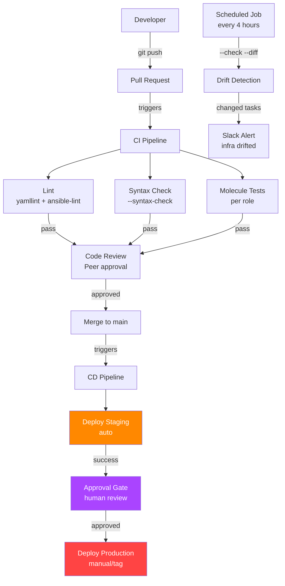
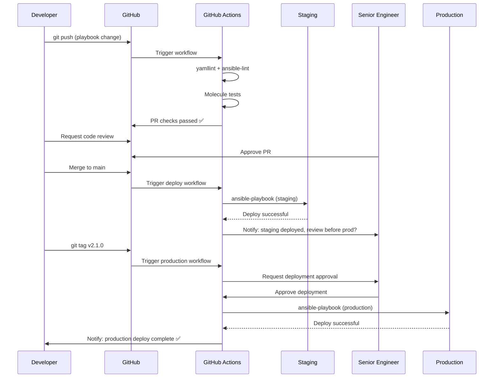

# Topic 25: CI/CD Integration

> 📍 Phase 4 — Senior / Production | Topic 25 of 28 | File: `25-cicd-integration.md`
> 🔗 Prev: `24-windows-automation.md` | Next: `26-collections-development.md`

---

## 🧠 Concept Overview

Running Ansible from a developer's laptop is the starting point. Running it from a CI/CD pipeline is the destination — where automation becomes reliable, auditable, and scalable across a team.

CI/CD integration means: every Git push triggers an automated test run (syntax check, lint, Molecule), every merge to main triggers a staging deploy, every release tag triggers a production deploy. Humans review and approve; machines execute. Secrets never live on developer machines. Every deploy is logged.

This topic covers the three major CI/CD platforms (GitHub Actions, GitLab CI, Jenkins), secrets management in pipelines, and the GitOps pattern where Git is the authoritative source of truth for your infrastructure state.

---

## 📖 In-Depth Explanation

### Subtopic 25.1 — Ansible in GitHub Actions, GitLab CI, Jenkins

#### GitHub Actions — the standard for GitHub repos

GitHub Actions is event-driven: push, PR, tag, schedule, or manual trigger.

```yaml
# .github/workflows/ansible.yml
name: Ansible CI/CD

on:
  push:
    branches: [main, develop]
    paths:
      - 'playbooks/**'
      - 'roles/**'
      - 'inventory/**'
      - '.github/workflows/ansible.yml'
  pull_request:
    branches: [main]
  workflow_dispatch:              # manual trigger from UI
    inputs:
      environment:
        description: 'Target environment'
        required: true
        default: 'staging'
        type: choice
        options: [staging, production]
      tags:
        description: 'Ansible tags to run'
        required: false
        default: ''

jobs:
  # ── Job 1: Lint and syntax check ─────────────────────────────────────────
  lint:
    runs-on: ubuntu-latest
    steps:
      - uses: actions/checkout@v4

      - name: Set up Python
        uses: actions/setup-python@v5
        with:
          python-version: '3.11'

      - name: Cache pip dependencies
        uses: actions/cache@v4
        with:
          path: ~/.cache/pip
          key: pip-${{ hashFiles('requirements.txt') }}

      - name: Install dependencies
        run: pip install ansible ansible-lint yamllint

      - name: Run yamllint
        run: yamllint .

      - name: Run ansible-lint
        run: ansible-lint playbooks/ roles/

      - name: Syntax check all playbooks
        run: |
          ansible-playbook --syntax-check \
            -i inventory/staging \
            playbooks/site.yml

  # ── Job 2: Molecule tests ────────────────────────────────────────────────
  molecule:
    runs-on: ubuntu-latest
    needs: lint
    strategy:
      matrix:
        role: [nginx, postgresql, myapp]
        scenario: [default]
      fail-fast: false

    steps:
      - uses: actions/checkout@v4

      - name: Set up Python
        uses: actions/setup-python@v5
        with:
          python-version: '3.11'

      - name: Cache Galaxy dependencies
        uses: actions/cache@v4
        with:
          path: ~/.ansible/collections
          key: galaxy-${{ hashFiles('requirements.yml') }}

      - name: Install dependencies
        run: |
          pip install molecule molecule-docker ansible
          ansible-galaxy collection install -r requirements.yml

      - name: Run Molecule tests for ${{ matrix.role }}
        run: |
          cd roles/${{ matrix.role }}
          molecule test --scenario-name ${{ matrix.scenario }}

  # ── Job 3: Deploy to staging ─────────────────────────────────────────────
  deploy-staging:
    runs-on: ubuntu-latest
    needs: [lint, molecule]
    if: github.ref == 'refs/heads/main' || github.event_name == 'workflow_dispatch'
    environment:
      name: staging
      url: https://staging.example.com

    steps:
      - uses: actions/checkout@v4

      - name: Set up Python + Ansible
        run: pip install ansible

      - name: Install Galaxy dependencies
        run: ansible-galaxy collection install -r requirements.yml

      - name: Write vault password
        run: |
          echo "${{ secrets.ANSIBLE_VAULT_PASSWORD }}" > ~/.vault_pass
          chmod 600 ~/.vault_pass

      - name: Write SSH key
        run: |
          mkdir -p ~/.ssh
          echo "${{ secrets.STAGING_SSH_KEY }}" > ~/.ssh/staging_key
          chmod 600 ~/.ssh/staging_key
          ssh-keyscan -H staging.example.com >> ~/.ssh/known_hosts

      - name: Deploy to staging
        env:
          ANSIBLE_HOST_KEY_CHECKING: "False"
        run: |
          ansible-playbook \
            -i inventory/staging \
            --vault-password-file ~/.vault_pass \
            --private-key ~/.ssh/staging_key \
            --tags "${{ github.event.inputs.tags || 'all' }}" \
            playbooks/site.yml

      - name: Clean up secrets
        if: always()
        run: |
          rm -f ~/.vault_pass ~/.ssh/staging_key

  # ── Job 4: Deploy to production (tag-triggered, manual approval) ──────────
  deploy-production:
    runs-on: ubuntu-latest
    needs: deploy-staging
    if: startsWith(github.ref, 'refs/tags/v')
    environment:
      name: production
      url: https://example.com
    # GitHub Environments with required reviewers = approval gate

    steps:
      - uses: actions/checkout@v4
      - name: Set up Ansible
        run: pip install ansible
      - name: Install dependencies
        run: ansible-galaxy collection install -r requirements.yml
      - name: Write secrets
        run: |
          echo "${{ secrets.PROD_VAULT_PASSWORD }}" > ~/.vault_pass
          echo "${{ secrets.PROD_SSH_KEY }}" > ~/.ssh/prod_key
          chmod 600 ~/.vault_pass ~/.ssh/prod_key
      - name: Deploy to production
        run: |
          ansible-playbook \
            -i inventory/production \
            --vault-password-file ~/.vault_pass \
            --private-key ~/.ssh/prod_key \
            playbooks/site.yml
      - name: Clean up
        if: always()
        run: rm -f ~/.vault_pass ~/.ssh/prod_key
```

---

#### GitLab CI — tight integration with GitLab repos

```yaml
# .gitlab-ci.yml
stages:
  - lint
  - test
  - deploy-staging
  - deploy-production

variables:
  PY_COLORS: "1"
  ANSIBLE_FORCE_COLOR: "1"
  ANSIBLE_HOST_KEY_CHECKING: "False"

# ── Reusable anchor ───────────────────────────────────────────────────────
.ansible-base: &ansible-base
  image: python:3.11-slim
  before_script:
    - pip install ansible ansible-lint yamllint molecule molecule-docker
    - ansible-galaxy collection install -r requirements.yml

# ── Lint ──────────────────────────────────────────────────────────────────
lint:
  <<: *ansible-base
  stage: lint
  script:
    - yamllint .
    - ansible-lint playbooks/ roles/
    - ansible-playbook --syntax-check -i inventory/staging playbooks/site.yml

# ── Molecule tests ─────────────────────────────────────────────────────────
molecule:nginx:
  <<: *ansible-base
  stage: test
  services:
    - docker:dind
  variables:
    DOCKER_HOST: tcp://docker:2376
  script:
    - cd roles/nginx && molecule test
  artifacts:
    when: on_failure
    paths: [roles/nginx/.molecule/]

molecule:postgresql:
  extends: molecule:nginx
  script:
    - cd roles/postgresql && molecule test

# ── Deploy to staging ─────────────────────────────────────────────────────
deploy-staging:
  <<: *ansible-base
  stage: deploy-staging
  environment:
    name: staging
    url: https://staging.example.com
  only:
    - main
  script:
    - echo "$ANSIBLE_VAULT_PASSWORD" > ~/.vault_pass && chmod 600 ~/.vault_pass
    - echo "$STAGING_SSH_KEY" > ~/.ssh/id_rsa && chmod 600 ~/.ssh/id_rsa
    - >
      ansible-playbook
      -i inventory/staging
      --vault-password-file ~/.vault_pass
      playbooks/site.yml
  after_script:
    - rm -f ~/.vault_pass ~/.ssh/id_rsa

# ── Deploy to production (manual gate) ────────────────────────────────────
deploy-production:
  <<: *ansible-base
  stage: deploy-production
  environment:
    name: production
    url: https://example.com
  when: manual             # requires clicking "▶ Play" in GitLab UI
  only:
    - tags                 # only on Git tags
  allow_failure: false
  script:
    - echo "$PROD_VAULT_PASSWORD" > ~/.vault_pass && chmod 600 ~/.vault_pass
    - echo "$PROD_SSH_KEY" > ~/.ssh/id_rsa && chmod 600 ~/.ssh/id_rsa
    - >
      ansible-playbook
      -i inventory/production
      --vault-password-file ~/.vault_pass
      playbooks/site.yml
  after_script:
    - rm -f ~/.vault_pass ~/.ssh/id_rsa
```

---

#### Jenkins — the enterprise CI server

Jenkins uses Groovy-based `Jenkinsfile` (declarative or scripted):

```groovy
// Jenkinsfile
pipeline {
    agent {
        docker {
            image 'python:3.11-slim'
            args '-v /var/run/docker.sock:/var/run/docker.sock'
        }
    }

    parameters {
        choice(name: 'ENVIRONMENT', choices: ['staging', 'production'], description: 'Target environment')
        string(name: 'TAGS', defaultValue: '', description: 'Ansible tags (empty = all)')
    }

    environment {
        ANSIBLE_FORCE_COLOR = '1'
        ANSIBLE_HOST_KEY_CHECKING = 'False'
    }

    stages {
        stage('Setup') {
            steps {
                sh 'pip install ansible ansible-lint yamllint'
                sh 'ansible-galaxy collection install -r requirements.yml'
            }
        }

        stage('Lint') {
            steps {
                sh 'yamllint .'
                sh 'ansible-lint playbooks/ roles/'
                sh 'ansible-playbook --syntax-check -i inventory/staging playbooks/site.yml'
            }
        }

        stage('Molecule Tests') {
            parallel {
                stage('nginx') {
                    steps {
                        dir('roles/nginx') {
                            sh 'molecule test'
                        }
                    }
                }
                stage('postgresql') {
                    steps {
                        dir('roles/postgresql') {
                            sh 'molecule test'
                        }
                    }
                }
            }
        }

        stage('Deploy Staging') {
            when { branch 'main' }
            steps {
                withCredentials([
                    string(credentialsId: 'VAULT_PASSWORD', variable: 'VAULT_PASS'),
                    sshUserPrivateKey(credentialsId: 'STAGING_SSH_KEY', keyFileVariable: 'SSH_KEY')
                ]) {
                    sh '''
                        echo "$VAULT_PASS" > /tmp/vault_pass
                        chmod 600 /tmp/vault_pass
                        ansible-playbook \
                            -i inventory/staging \
                            --vault-password-file /tmp/vault_pass \
                            --private-key $SSH_KEY \
                            --tags "${TAGS}" \
                            playbooks/site.yml
                    '''
                }
            }
            post {
                always { sh 'rm -f /tmp/vault_pass' }
            }
        }

        stage('Production Approval') {
            when { buildingTag() }
            steps {
                input message: 'Deploy to production?',
                      ok: 'Deploy',
                      submitter: 'senior-engineers'
            }
        }

        stage('Deploy Production') {
            when { buildingTag() }
            steps {
                withCredentials([
                    string(credentialsId: 'PROD_VAULT_PASSWORD', variable: 'VAULT_PASS'),
                    sshUserPrivateKey(credentialsId: 'PROD_SSH_KEY', keyFileVariable: 'SSH_KEY')
                ]) {
                    sh '''
                        echo "$VAULT_PASS" > /tmp/vault_pass
                        ansible-playbook \
                            -i inventory/production \
                            --vault-password-file /tmp/vault_pass \
                            --private-key $SSH_KEY \
                            playbooks/site.yml
                    '''
                }
            }
            post {
                always { sh 'rm -f /tmp/vault_pass' }
            }
        }
    }

    post {
        failure {
            slackSend channel: '#deploys',
                      color: 'danger',
                      message: "FAILED: ${env.JOB_NAME} #${env.BUILD_NUMBER}"
        }
        success {
            slackSend channel: '#deploys',
                      color: 'good',
                      message: "SUCCESS: ${env.JOB_NAME} #${env.BUILD_NUMBER}"
        }
    }
}
```

---

### Subtopic 25.2 — Secrets Management in CI: Vault, HashiCorp Vault, AWS Secrets Manager

#### Pattern 1: CI platform secret variables (simplest)

Every CI platform has a secret store. Store Ansible Vault password and SSH keys there.

```yaml
# GitHub: Settings → Secrets → New repository secret
# Secrets: ANSIBLE_VAULT_PASSWORD, PROD_SSH_KEY, STAGING_SSH_KEY

# In workflow:
- name: Write vault password
  run: |
    echo "${{ secrets.ANSIBLE_VAULT_PASSWORD }}" > ~/.vault_pass
    chmod 600 ~/.vault_pass
```

**Risks:** Secret is available to any job in the repo. Use GitHub Environments with protection rules (required reviewers, deployment branches) to scope production secrets.

---

#### Pattern 2: HashiCorp Vault dynamic secrets

```yaml
# GitHub Actions with HashiCorp Vault
- name: Get SSH key from HashiCorp Vault
  uses: hashicorp/vault-action@v2
  with:
    url: https://vault.example.com
    method: jwt                        # GitHub OIDC — no static tokens needed
    role: github-actions-prod
    secrets: |
      secret/data/ansible/prod ssh_key | PROD_SSH_KEY ;
      secret/data/ansible/prod vault_password | ANSIBLE_VAULT_PASSWORD

- name: Deploy to production
  run: |
    echo "$ANSIBLE_VAULT_PASSWORD" > ~/.vault_pass
    echo "$PROD_SSH_KEY" > ~/.ssh/id_rsa
    chmod 600 ~/.vault_pass ~/.ssh/id_rsa
    ansible-playbook -i inventory/production \
      --vault-password-file ~/.vault_pass playbooks/site.yml
```

**Advantages:** No static secrets in CI — uses OIDC JWT token exchange. Vault access is logged. Secrets can be rotated without updating CI configuration.

---

#### Pattern 3: AWS Secrets Manager with IAM roles

```yaml
# GitHub Actions with AWS OIDC (no static AWS keys needed)
- name: Configure AWS credentials via OIDC
  uses: aws-actions/configure-aws-credentials@v4
  with:
    role-to-assume: arn:aws:iam::123456789012:role/GitHubActionsAnsibleRole
    aws-region: eu-west-1

- name: Get Ansible vault password from Secrets Manager
  run: |
    VAULT_PASS=$(aws secretsmanager get-secret-value \
      --secret-id ansible/vault-password \
      --query SecretString --output text)
    echo "$VAULT_PASS" > ~/.vault_pass
    chmod 600 ~/.vault_pass

- name: Get SSH key from Secrets Manager
  run: |
    aws secretsmanager get-secret-value \
      --secret-id ansible/prod-ssh-key \
      --query SecretString --output text > ~/.ssh/prod_key
    chmod 600 ~/.ssh/prod_key
```

---

### Subtopic 25.3 — GitOps Patterns with Ansible — Git as the Source of Truth

GitOps means: **the desired state of your infrastructure is always defined in Git**. Any drift from Git is considered an error. Changes happen via PR, not by logging into servers or running ad-hoc commands.

#### Core GitOps principles applied to Ansible

```
Developer → PR with infra change
         → CI runs lint + Molecule tests
         → Peer review (another engineer approves)
         → Merge to main
         → CD pipeline runs Ansible automatically
         → Infrastructure reflects Git state
         → No manual changes allowed outside this process
```

---

#### Drift detection — scheduled reconciliation runs

```yaml
# .github/workflows/drift-detection.yml
name: Infrastructure Drift Detection

on:
  schedule:
    - cron: '0 */4 * * *'    # every 4 hours
  workflow_dispatch:

jobs:
  detect-drift:
    runs-on: ubuntu-latest
    steps:
      - uses: actions/checkout@v4
      - name: Install Ansible
        run: pip install ansible
      - name: Write vault password
        run: echo "${{ secrets.ANSIBLE_VAULT_PASSWORD }}" > ~/.vault_pass

      - name: Run check mode (detect drift)
        run: |
          ansible-playbook \
            -i inventory/production \
            --vault-password-file ~/.vault_pass \
            --check --diff \
            playbooks/site.yml 2>&1 | tee drift_report.txt

      - name: Alert if drift detected
        if: contains(steps.detect-drift.outputs.stdout, 'changed')
        uses: slackapi/slack-github-action@v1
        with:
          payload: |
            {
              "text": "⚠️ Infrastructure drift detected! Review drift_report.txt",
              "channel": "#infrastructure-alerts"
            }
        env:
          SLACK_WEBHOOK_URL: ${{ secrets.SLACK_WEBHOOK }}

      - name: Upload drift report
        uses: actions/upload-artifact@v4
        with:
          name: drift-report
          path: drift_report.txt
```

---

#### GitOps repository structure

```
infrastructure-repo/
├── .github/
│   └── workflows/
│       ├── ci.yml              ← lint + molecule on every PR
│       ├── deploy.yml          ← deploy on merge/tag
│       └── drift-detection.yml ← scheduled check mode runs
├── inventory/
│   ├── production/
│   │   ├── aws_ec2.yml
│   │   └── group_vars/
│   └── staging/
├── playbooks/
│   ├── site.yml
│   ├── webservers.yml
│   └── databases.yml
├── roles/
│   ├── nginx/
│   └── myapp/
├── collections/              ← vendored (optional)
├── requirements.yml          ← pinned Galaxy dependencies
├── ansible.cfg
├── .ansible-lint
└── .yamllint
```

---

#### Pre-commit hooks — catch issues before they reach CI

```bash
pip install pre-commit
```

```yaml
# .pre-commit-config.yaml
repos:
  - repo: https://github.com/pre-commit/pre-commit-hooks
    rev: v4.5.0
    hooks:
      - id: trailing-whitespace
      - id: end-of-file-fixer
      - id: check-yaml
      - id: check-merge-conflict

  - repo: https://github.com/ansible/ansible-lint
    rev: v24.2.0
    hooks:
      - id: ansible-lint
        files: \.(yml|yaml)$

  - repo: https://github.com/adrienverge/yamllint
    rev: v1.35.1
    hooks:
      - id: yamllint
        args: [-c, .yamllint]

  - repo: https://github.com/Yelp/detect-secrets
    rev: v1.4.0
    hooks:
      - id: detect-secrets    # prevent accidental secret commits
        args: ['--baseline', '.secrets.baseline']
```

```bash
# Install hooks
pre-commit install

# Test hooks manually
pre-commit run --all-files
```

---

## 🏗️ Architecture & System Design

The full GitOps pipeline for Ansible:



---

## 🔄 Flow / Lifecycle



---

## 💻 Code Examples

### ✅ Example 1: Minimal but complete `.ansible-lint` config

```yaml
# .ansible-lint
profile: production    # stricter than basic

exclude_paths:
  - collections/       # vendored collections
  - .cache/
  - molecule/

warn_list:
  - yaml[truthy]       # warn but don't fail on yes/no booleans

skip_list:
  - role-name          # skip role naming convention check for legacy roles

kinds:
  - playbook: "playbooks/*.yml"
  - tasks: "roles/*/tasks/*.yml"
  - handlers: "roles/*/handlers/*.yml"
```

### ✅ Example 2: Minimal `.yamllint` config

```yaml
# .yamllint
extends: default

rules:
  line-length:
    max: 160        # allow longer lines for Ansible
    level: warning

  truthy:
    allowed-values: ['true', 'false', 'yes', 'no']
    check-keys: false

  comments:
    min-spaces-from-content: 1

ignore: |
  collections/
  .cache/
```

### ✅ Example 3: Makefile for common developer commands

```makefile
# Makefile
.PHONY: lint test deploy-staging deploy-production drift check

INVENTORY_STAGING  = inventory/staging
INVENTORY_PROD     = inventory/production
VAULT_FILE         = ~/.vault_pass
PLAYBOOK           = playbooks/site.yml

lint:
	yamllint .
	ansible-lint playbooks/ roles/

syntax:
	ansible-playbook --syntax-check -i $(INVENTORY_STAGING) $(PLAYBOOK)

test:
	@for role in roles/*/; do \
		echo "Testing $$role..."; \
		cd $$role && molecule test && cd ../..; \
	done

check:
	ansible-playbook -i $(INVENTORY_STAGING) \
		--vault-password-file $(VAULT_FILE) \
		--check --diff $(PLAYBOOK)

deploy-staging:
	ansible-playbook -i $(INVENTORY_STAGING) \
		--vault-password-file $(VAULT_FILE) \
		$(PLAYBOOK)

deploy-production:
	@echo "⚠️  Deploying to PRODUCTION. Press Enter to continue..."
	@read confirm
	ansible-playbook -i $(INVENTORY_PROD) \
		--vault-password-file $(VAULT_FILE) \
		$(PLAYBOOK)

drift:
	ansible-playbook -i $(INVENTORY_PROD) \
		--vault-password-file $(VAULT_FILE) \
		--check --diff $(PLAYBOOK)

deps:
	ansible-galaxy collection install -r requirements.yml --force
	ansible-galaxy role install -r requirements.yml --force
```

### ✅ Example 4: Branch protection + required status checks

```yaml
# GitHub branch protection rules (configured in repo settings):
# Branch: main
# ✅ Require pull request reviews: 1 required reviewer
# ✅ Require status checks to pass:
#     - lint
#     - molecule (nginx, default)
#     - molecule (postgresql, default)
# ✅ Require branches to be up to date
# ✅ Do not allow bypassing the above settings
# ✅ Restrict who can push to matching branches: (nobody — only PRs)
```

### ❌ Anti-pattern — Deploying directly from developer laptops

```bash
# ❌ Manual deploy from developer machine
ssh control-node
ansible-playbook -i production site.yml -e "app_version=2.1.0"

# Problems:
# - No audit trail — who deployed? what version? when?
# - No peer review — unreviewed changes go directly to production
# - Secrets on developer laptops — credential sprawl
# - No automatic rollback — if something breaks, it stays broken
# - "Works on my machine" — different collection versions than CI

# ✅ All deploys via CI/CD pipeline
# git tag v2.1.0 → automated pipeline → approval gate → production deploy
# Full audit trail, no secrets on laptops, consistent tooling
```

---

## ⚙️ Configuration & Options

### GitHub Actions secret scoping

| Scope | Location | Visibility |
|-------|----------|-----------|
| Repository secrets | Settings → Secrets | All branches, all workflows |
| Environment secrets | Settings → Environments | Only jobs targeting that environment |
| Organisation secrets | Org Settings → Secrets | Selected repos |

> 💡 Use **Environment secrets** for production credentials — they're only available to jobs that target the `production` environment, and you can require human approval before that environment is accessed.

### CI matrix strategy options

```yaml
strategy:
  matrix:
    role: [nginx, postgresql, myapp]
    os: [ubuntu-22-04, rocky-9]
  fail-fast: false      # don't cancel other jobs on first failure
  max-parallel: 4       # limit concurrent jobs
```

---

## 🧩 Patterns & Best Practices

**What experienced engineers do:**
- Gate production deploys on three things: passing CI, a separate staging deploy, and human approval — none of these is optional
- Use GitHub Environments with required reviewers for production — adds a UI approval gate that's logged in GitHub
- Vendor Galaxy dependencies in CI (cache or commit) — unpinned Galaxy installs are the #1 cause of "it worked yesterday" CI failures
- Always clean up secrets files in `if: always()` / `after_script` / `post.always` — a failed job that leaves vault passwords on the runner is a security incident
- Use `--check --diff` on a schedule for drift detection — know when someone manually changed a server outside the pipeline

**What beginners typically get wrong:**
- Storing production SSH keys in repo-level CI secrets — use environment-scoped secrets or external secret managers
- Not caching Galaxy dependencies — 3-minute installs on every run multiply into hours per day
- Running molecule in CI without Docker-in-Docker properly configured — molecule silently fails or uses wrong drivers
- Not running `--syntax-check` as a separate fast step before long Molecule tests — catches YAML errors in 5 seconds that would waste 5 minutes of Molecule time
- Forgetting `if: always()` on cleanup steps — failed jobs leave secrets on CI runners

**Senior-level nuance:**
- The real value of GitOps isn't the automation — it's the **auditability**. Every infrastructure change is a PR with a description, a reviewer's approval, and a link to the CI run that deployed it. When something breaks in production, you can `git log --oneline` to find the commit and `git revert` to roll it back. This is impossible if people make changes directly.
- For organisations with strict compliance requirements (SOC2, PCI-DSS, ISO27001), GitOps provides the documented change management process auditors need — every change approved, tested, and logged.

---

## 🔗 How It Connects

- **Builds on:** `18-testing-with-molecule.md` — Molecule is the testing layer inside CI | `13-ansible-vault.md` — vault passwords are the secrets managed in CI pipelines
- **Leads to:** `26-collections-development.md` — the first Phase 5 topic, where we build and publish our own Ansible collections — which themselves get CI/CD pipelines
- **Related concepts:** Topic 21 (AWX — the production CD layer that CI pipelines often trigger), Topic 27 (Security hardening — GitOps + approval gates are a security control)

---

## 🎯 Interview Questions (Conceptual)

**Q1: What is GitOps and how does it apply to Ansible automation?**
> **A:** GitOps is an operational model where Git is the single source of truth for infrastructure state. All changes go through Git (PR → review → merge), and automation keeps the actual infrastructure in sync with Git. Applied to Ansible: desired state is defined in playbooks committed to Git, CI runs tests on every change, CD pipelines deploy merges automatically to staging and production, scheduled `--check` runs detect drift. No manual changes outside this process are allowed.

**Q2: How would you prevent a CI job from leaving secrets on a runner after a failure?**
> **A:** Use cleanup steps that run regardless of success or failure: `if: always()` in GitHub Actions, `after_script:` in GitLab CI, `post { always { } }` in Jenkins. Write vault passwords and SSH keys to temp files at the start of the job, and delete them in the always-run cleanup step. For higher security, use external secret managers (HashiCorp Vault, AWS Secrets Manager) via OIDC — no secret files are ever written to disk because credentials are injected as environment variables with bounded TTLs.

**Q3: What is the correct order of steps in an Ansible CI pipeline?**
> **A:** Fast-fail order: (1) YAML lint — fastest, catches syntax errors. (2) ansible-lint — static analysis, finds module misuse. (3) Syntax check — validates playbook structure. (4) Molecule tests — slower but most thorough. (5) Deploy to staging — requires credentials. (6) Approval gate — human review. (7) Deploy to production. Each step gates the next — an ansible-lint failure never wastes Molecule time, and Molecule failure never triggers a staging deploy.

**Q4: How do you handle different secrets for staging and production in the same CI pipeline?**
> **A:** Use environment-scoped secrets (GitHub Environments, GitLab environments, Jenkins credentials). Production secrets live in the production environment and are only accessible to jobs that target `environment: production` — which itself requires human approval before running. Staging secrets are in the staging environment, accessible to automated deploy jobs. This means a compromised staging deploy job cannot access production credentials.

**Q5: What is drift detection in an infrastructure GitOps context?**
> **A:** Drift detection is running Ansible in `--check --diff` mode on a schedule against production and alerting when it reports `changed` tasks. If `changed` tasks appear, it means someone modified the infrastructure directly (outside Git/CI) — the actual state drifts from the Git-defined desired state. Drift detection catches these changes, prompts investigation, and either re-applies Git-defined state or leads to a PR that updates Git to reflect the intentional change.

---

## 🧠 Scenario-Based Interview Problems

**Scenario 1: "Your CI pipeline deploys to production automatically on every merge to main. A bad PR gets merged and breaks the production site. How do you improve the process?"**
> **Problem:** Auto-deploy to production without sufficient gates.
> **Approach:** (1) Add a staging environment as a mandatory gate — auto-deploy to staging, then require manual promotion to production. (2) Add smoke tests after staging deploy — health check endpoints must pass before production is gated. (3) Add GitHub Environment protection rules — require 1+ reviewer approvals before the production environment is accessible. (4) Move production deploys from push-triggered to tag-triggered — a deliberate `git tag v2.1.0` and push is a conscious release act, not an automatic consequence of merging. (5) Add `--check --diff` to the PR checks — show infrastructure changes in the PR review.
> **Trade-offs:** More gates = slower releases. For a startup, auto-deploy to staging + one human approval for production is usually the right balance. For regulated industries, add change advisory board approval in the ticket system as a gate too.

**Scenario 2: "Your CI pipeline installs Galaxy collections on every run, taking 4 minutes. The pipeline runs 80 times a day. How do you fix this?"**
> **Problem:** 320 minutes/day wasted on repeated Galaxy installs.
> **Approach:** Add caching: in GitHub Actions, `actions/cache` keyed on `hashFiles('requirements.yml')` caches `~/.ansible/collections`. If `requirements.yml` hasn't changed, the cache restores in under 10 seconds. Add caching for pip dependencies too (`hashFiles('requirements.txt')` → `~/.cache/pip`). For even better results, build a custom Docker image that pre-installs all dependencies and push it to your container registry — the image is pulled once and reused across all runners, eliminating Galaxy/pip installs from job time entirely.
> **Trade-offs:** Caching can serve stale dependencies if `requirements.yml` changes but the cache key doesn't update. The `hashFiles` approach prevents this correctly. Custom Docker images require a separate build/push pipeline but give the most consistent and fastest results.

---

## ⚡ Quick Notes — Revision Card

- 📌 CI pipeline order: lint → syntax-check → Molecule → deploy-staging → approval → deploy-production
- 📌 GitHub Environments = scoped secrets + required reviewers for production gate
- 📌 `if: always()` / `after_script` / `post.always` = clean up secrets regardless of job success
- 📌 Cache pip + Galaxy dependencies keyed on requirements file hash — prevents 4-minute installs
- 📌 GitOps = Git is source of truth | All changes via PR | Scheduled `--check` detects drift
- 📌 HashiCorp Vault / AWS Secrets Manager + OIDC = no static secrets in CI (best practice)
- 📌 `detect-secrets` pre-commit hook = blocks accidental secret commits before they reach remote
- 📌 Drift detection = scheduled `--check --diff` → alert on `changed` tasks in production
- ⚠️ Never store production secrets at repo level — use environment-scoped secrets
- ⚠️ Always clean up secret files in `always`-run steps — failed jobs leave secrets on runners
- ⚠️ Unpinned Galaxy installs in CI = "works today, breaks tomorrow" — pin everything
- 💡 Custom Docker image with pre-installed deps = fastest CI — no install time at all
- 🔑 GitOps audit trail: every infra change = PR + reviewer + CI result + deploy log — what compliance auditors need

---

## 🔖 References & Further Reading

- 📄 [GitHub Actions Documentation](https://docs.github.com/en/actions)
- 📄 [GitLab CI/CD Documentation](https://docs.gitlab.com/ee/ci/)
- 📄 [Jenkins Pipeline Documentation](https://www.jenkins.io/doc/book/pipeline/)
- 📄 [ansible-lint Documentation](https://ansible.readthedocs.io/projects/lint/)
- 📄 [HashiCorp Vault GitHub Action](https://github.com/hashicorp/vault-action)
- 📝 [GitOps Principles](https://opengitops.dev/)
- 🎥 [Ansible CI/CD with GitHub Actions](https://www.youtube.com/watch?v=SLKhMPjkS8E)
- ➡️ Related in this course: [`24-windows-automation.md`] · [`26-collections-development.md`]

---
