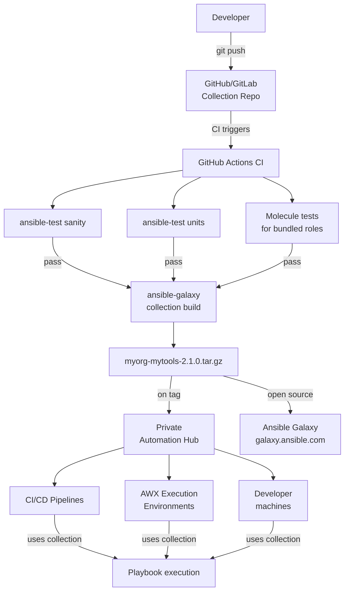
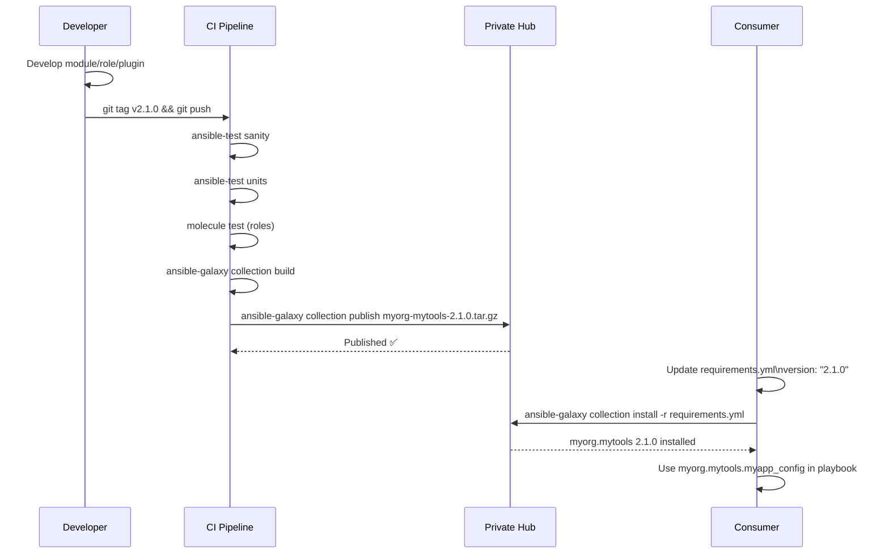

# Topic 26: Collections Development

> 📍 Phase 5 — Architect / Expert | Topic 26 of 28 | File: `26-collections-development.md`
> 🔗 Prev: `25-cicd-integration.md` | Next: `27-security-hardening.md`

---

## 🧠 Concept Overview

You've consumed Galaxy collections. Now you build them. A **collection** is Ansible's modern packaging format — the professional way to bundle and distribute your organisation's automation: custom modules, filter plugins, roles, playbooks, and documentation under a versioned, namespaced package.

Collections solve the distribution problem that standalone roles can't: how do you share a custom module alongside the role that uses it? How do you version them together? How do you distribute them privately to your organisation without using public Galaxy? Collections answer all three questions.

This topic covers building a collection from scratch, publishing it, and hosting it privately via Automation Hub.

---

## 📖 In-Depth Explanation

### Subtopic 26.1 — Collection Structure: `plugins`, `roles`, `playbooks`, `docs`, `tests`

A collection lives under `ansible_collections/<namespace>/<collection>/`:

```
ansible_collections/
└── myorg/
    └── mytools/
        ├── galaxy.yml              ← metadata: namespace, name, version, deps
        ├── README.md
        ├── CHANGELOG.rst
        ├── LICENSE
        │
        ├── plugins/
        │   ├── modules/            ← custom modules
        │   │   ├── myapp_config.py
        │   │   └── cmdb_register.py
        │   ├── filter/             ← Jinja2 filter plugins
        │   │   └── infra_filters.py
        │   ├── inventory/          ← inventory plugins
        │   │   └── cmdb.py
        │   ├── callback/           ← callback plugins
        │   │   └── slack_notify.py
        │   ├── lookup/             ← lookup plugins
        │   │   └── vault_lookup.py
        │   └── module_utils/       ← shared utilities for modules
        │       └── myorg_api.py
        │
        ├── roles/                  ← roles bundled in the collection
        │   ├── nginx/
        │   │   ├── tasks/main.yml
        │   │   ├── defaults/main.yml
        │   │   └── ...
        │   └── postgresql/
        │
        ├── playbooks/              ← reusable playbooks
        │   ├── deploy_web.yml
        │   └── backup_databases.yml
        │
        ├── docs/                   ← collection documentation
        │   └── docsite/
        │       └── rst/
        │
        └── tests/
            ├── unit/               ← unit tests for modules
            │   └── plugins/
            │       └── modules/
            │           └── test_myapp_config.py
            ├── integration/        ← integration tests
            │   └── targets/
            └── sanity/             ← ansible-test sanity checks
```

---

#### How collections are discovered

```ini
# ansible.cfg
[defaults]
collections_path = ./collections:~/.ansible/collections:/usr/share/ansible/collections
```

Ansible searches paths in order. Module FQCNs: `myorg.mytools.myapp_config` resolves to:
`<collections_path>/ansible_collections/myorg/mytools/plugins/modules/myapp_config.py`

---

### Subtopic 26.2 — `galaxy.yml` — Collection Metadata and Versioning

`galaxy.yml` is the collection manifest — equivalent to `package.json` for Node or `setup.py` for Python:

```yaml
# galaxy.yml
namespace: myorg           # your organisation namespace on Galaxy/Hub
name: mytools              # collection name (myorg.mytools)
version: 2.1.0             # semantic version — MUST follow semver

readme: README.md
description: >
  Internal automation tools for MyOrg infrastructure.
  Provides custom modules, filter plugins, and roles for
  our AWS and on-premises environments.

authors:
  - Platform Team <platform@myorg.com>
  - Jane Smith <jane@myorg.com>

license:
  - Apache-2.0           # or MIT, GPL-3.0, etc.

tags:
  - aws
  - infrastructure
  - internal

# Collection dependencies — other collections this one requires
dependencies:
  amazon.aws: ">=6.0.0"
  community.general: ">=8.0.0"
  ansible.posix: ">=1.5.0"

# Links
repository: https://github.com/myorg/ansible-collection-mytools
documentation: https://docs.myorg.com/ansible
issues: https://github.com/myorg/ansible-collection-mytools/issues
homepage: https://myorg.com
```

---

#### Semantic versioning rules for collections

```
MAJOR.MINOR.PATCH  (e.g. 2.1.0)

PATCH (2.1.0 → 2.1.1):
  - Bug fixes
  - Documentation updates
  - No API changes

MINOR (2.1.0 → 2.2.0):
  - New modules, plugins, or roles added
  - New optional parameters
  - Backwards compatible

MAJOR (2.1.0 → 3.0.0):
  - Removed modules or plugins
  - Renamed parameters
  - Changed return values
  - Any breaking change
  → Requires migration guide in CHANGELOG
```

---

### Subtopic 26.3 — Private Automation Hub for Internal Collection Distribution

Public Galaxy works for open-source content. For internal collections, you need a private hub:

**Options:**
1. **Red Hat Private Automation Hub** — included with AAP subscription, full UI and API
2. **Galaxy NG** — open-source upstream of Private Hub, self-hosted
3. **Pulp** — generic artifact repository with Ansible collection support
4. **Artifactory / Nexus** — generic artifact repository, proxy + hosting

---

#### Configuring Ansible to use a private Hub

```ini
# ansible.cfg
[galaxy]
server_list = automation_hub, release_galaxy

[galaxy_server.automation_hub]
url          = https://hub.myorg.com/api/galaxy/
auth_url     = https://sso.myorg.com/auth/realms/myorg/protocol/openid-connect/token
token        = <offline_token_from_hub_ui>

[galaxy_server.release_galaxy]
url          = https://galaxy.ansible.com/
# No token needed for public Galaxy
```

```yaml
# requirements.yml — install from private hub first
collections:
  # Internal collection from private Hub
  - name: myorg.mytools
    version: "2.1.0"
    source: https://hub.myorg.com/api/galaxy/

  # Public collection from Galaxy
  - name: amazon.aws
    version: "6.5.0"
```

---

#### Publishing to private Hub

```bash
# Build the collection tarball
cd ansible_collections/myorg/mytools
ansible-galaxy collection build

# Output: myorg-mytools-2.1.0.tar.gz

# Publish to private Hub
ansible-galaxy collection publish myorg-mytools-2.1.0.tar.gz \
  --server automation_hub

# Or with explicit URL and token
ansible-galaxy collection publish myorg-mytools-2.1.0.tar.gz \
  --server https://hub.myorg.com/api/galaxy/ \
  --api-key $(cat ~/.hub_token)
```

---

### Subtopic 26.4 — Semantic Versioning and Collection Dependencies

#### Building and testing before publishing

```bash
# 1. Run sanity checks (ansible-test requires collection structure)
cd ansible_collections/myorg/mytools
ansible-test sanity --python 3.11

# 2. Run unit tests
ansible-test units --python 3.11

# 3. Run integration tests (requires target systems)
ansible-test integration myapp_config --python 3.11

# 4. Build
ansible-galaxy collection build

# 5. Verify the built tarball
ansible-galaxy collection verify myorg-mytools-2.1.0.tar.gz --offline

# 6. Publish
ansible-galaxy collection publish myorg-mytools-2.1.0.tar.gz
```

---

#### Unit tests for modules

```python
# tests/unit/plugins/modules/test_myapp_config.py
import pytest
from unittest.mock import patch, MagicMock
from ansible_collections.myorg.mytools.plugins.modules import myapp_config


class TestMyAppConfig:

    def test_module_fails_on_api_error(self, capsys):
        """Module should fail gracefully when API is unreachable."""
        with patch(
            'ansible_collections.myorg.mytools.plugins.modules.myapp_config.get_setting'
        ) as mock_get:
            mock_get.side_effect = Exception("Connection refused")

            with pytest.raises(SystemExit) as exc_info:
                myapp_config.main()

        # Module should exit with failure
        assert exc_info.value.code == 1

    def test_no_change_when_already_correct(self, capsys):
        """Module should report ok when setting already matches desired."""
        with patch(
            'ansible_collections.myorg.mytools.plugins.modules.myapp_config.get_setting'
        ) as mock_get, \
        patch(
            'ansible_collections.myorg.mytools.plugins.modules.myapp_config.AnsibleModule'
        ) as MockModule:
            mock_get.return_value = {"name": "log_level", "value": "INFO"}
            mock_module = MockModule.return_value
            mock_module.params = {
                "api_url": "http://api.test",
                "setting_name": "log_level",
                "setting_value": "INFO",
                "state": "present",
                "api_token": "test-token"
            }
            mock_module.check_mode = False

            myapp_config.main()

            # Should exit with changed=False
            mock_module.exit_json.assert_called_once()
            call_kwargs = mock_module.exit_json.call_args[1]
            assert call_kwargs['changed'] is False
```

---

#### CHANGELOG format

Follow the Keep a Changelog convention:

```rst
# CHANGELOG.rst

=========
Changelog
=========

Version 2.2.0
-------------

Release Summary
~~~~~~~~~~~~~~~
Added PostgreSQL role and improved AWS inventory plugin.

New Roles
~~~~~~~~~
- ``postgresql`` - Installs and configures PostgreSQL 15/16

New Modules
~~~~~~~~~~~
- ``myorg.mytools.db_user`` - Manages database users idempotently

Bugfixes
~~~~~~~~
- ``myapp_config`` - Fixed timeout handling for slow API responses

Version 2.1.0
-------------

Breaking Changes
~~~~~~~~~~~~~~~~
- ``cmdb_register`` - Parameter ``host_type`` renamed to ``role``
  (migration: replace ``host_type`` with ``role`` in all task files)

Minor Changes
~~~~~~~~~~~~~
- ``nginx`` role - Added HTTPS redirect support
- ``infra_filters`` - Added ``calc_jvm_heap`` filter
```

---

## 🏗️ Architecture & System Design

Collection distribution architecture:



---

## 🔄 Flow / Lifecycle



---

## 💻 Code Examples

### ✅ Example 1: Scaffold a new collection

```bash
# Create collection directory structure
ansible-galaxy collection init myorg.mytools

# Output:
# - Creating collection myorg/mytools
# Created file myorg/mytools/galaxy.yml
# Created file myorg/mytools/README.md
# Created file myorg/mytools/docs/.gitkeep
# Created file myorg/mytools/plugins/README.md
# Created file myorg/mytools/roles/.gitkeep

# Move into collection and add a module
cd myorg/mytools
mkdir -p plugins/modules plugins/filter tests/unit/plugins/modules

# Add your module
cp ~/my_module.py plugins/modules/myapp_config.py

# Add a role
ansible-galaxy role init --init-path roles/ nginx
```

### ✅ Example 2: Full collection CI pipeline

```yaml
# .github/workflows/collection-ci.yml
name: Collection CI

on:
  push:
    branches: [main]
    tags: ['v*']
  pull_request:
    branches: [main]

jobs:
  sanity:
    runs-on: ubuntu-latest
    steps:
      - uses: actions/checkout@v4
        with:
          path: ansible_collections/myorg/mytools

      - name: Set up Python
        uses: actions/setup-python@v5
        with:
          python-version: '3.11'

      - name: Install Ansible
        run: pip install ansible

      - name: Run sanity tests
        run: |
          cd ansible_collections/myorg/mytools
          ansible-test sanity --python 3.11 --docker

  units:
    runs-on: ubuntu-latest
    steps:
      - uses: actions/checkout@v4
        with:
          path: ansible_collections/myorg/mytools

      - name: Install Ansible
        run: pip install ansible pytest

      - name: Run unit tests
        run: |
          cd ansible_collections/myorg/mytools
          ansible-test units --python 3.11

  molecule:
    runs-on: ubuntu-latest
    strategy:
      matrix:
        role: [nginx, postgresql]
    steps:
      - uses: actions/checkout@v4
        with:
          path: ansible_collections/myorg/mytools

      - name: Install dependencies
        run: pip install molecule molecule-docker ansible

      - name: Run Molecule for ${{ matrix.role }}
        run: |
          cd ansible_collections/myorg/mytools/roles/${{ matrix.role }}
          molecule test

  publish:
    needs: [sanity, units, molecule]
    if: startsWith(github.ref, 'refs/tags/v')
    runs-on: ubuntu-latest
    steps:
      - uses: actions/checkout@v4

      - name: Install Ansible
        run: pip install ansible

      - name: Build collection
        run: ansible-galaxy collection build

      - name: Publish to Private Hub
        run: |
          ansible-galaxy collection publish \
            $(ls myorg-mytools-*.tar.gz | head -1) \
            --server https://hub.myorg.com/api/galaxy/ \
            --api-key ${{ secrets.HUB_API_TOKEN }}
```

### ✅ Example 3: Using the collection in a playbook

```yaml
# After installing: ansible-galaxy collection install myorg.mytools

- name: Configure application servers
  hosts: appservers
  become: true

  vars:
    app_version: "2.1.0"

  roles:
    # Role from the collection
    - role: myorg.mytools.nginx
      vars:
        nginx_http_port: 80

  tasks:
    # Module from the collection
    - name: Configure MyApp settings
      myorg.mytools.myapp_config:
        api_url: http://myapp.internal/api
        api_token: "{{ vault_myapp_token }}"
        setting_name: log_level
        setting_value: WARNING
        state: present

    # Filter from the collection (in a template or task)
    - name: Set JVM heap
      ansible.builtin.lineinfile:
        path: /etc/myapp/jvm.options
        line: "-Xmx{{ ansible_memory_mb.real.total | myorg.mytools.calc_jvm_heap }}m"
```

### ✅ Example 4: `MANIFEST.json` — what gets included in the tarball

```bash
# Build and inspect what's in the tarball
ansible-galaxy collection build
tar -tzf myorg-mytools-2.1.0.tar.gz | head -30

# Output:
# MANIFEST.json         ← auto-generated manifest with checksums
# FILES.json            ← list of all files and their hashes
# galaxy.yml            ← collection metadata
# README.md
# CHANGELOG.rst
# plugins/modules/myapp_config.py
# plugins/filter/infra_filters.py
# roles/nginx/tasks/main.yml
# roles/nginx/defaults/main.yml
# ...
```

### ❌ Anti-pattern — Distributing automation as a Git submodule

```bash
# ❌ Sharing automation via Git submodule
git submodule add https://github.com/myorg/ansible-automation shared/

# Problems:
# - No versioning semantics (which commit? what changed?)
# - No dependency resolution
# - Complex for consumers to use
# - No namespace isolation (name collisions between teams)
# - No ansible-test sanity validation

# ✅ Package as a collection — versioned, namespaced, validated
ansible-galaxy collection install myorg.mytools:2.1.0
# Clear version, proper namespace, sanity-checked, dependency-aware
```

---

## ⚙️ Configuration & Options

### `ansible-test` commands reference

```bash
# Sanity checks (coding standards, documentation, imports)
ansible-test sanity --python 3.11
ansible-test sanity --python 3.11 --docker    # in isolated container

# Unit tests
ansible-test units --python 3.11
ansible-test units plugins/modules/myapp_config.py    # specific module

# Integration tests (requires infrastructure)
ansible-test integration myapp_config
ansible-test integration --docker    # in Docker container

# Coverage report
ansible-test coverage report
```

### Collection build options

```bash
# Build with custom output directory
ansible-galaxy collection build --output-path ./dist

# Build ignoring specific files (via MANIFEST.in patterns)
ansible-galaxy collection build

# .gitignore-style file exclusion in galaxy.yml:
build_ignore:
  - "*.pyc"
  - "__pycache__"
  - "tests/integration"     # don't ship integration tests
  - ".github"
  - "*.egg-info"
```

---

## 🧩 Patterns & Best Practices

**What experienced engineers do:**
- Always run `ansible-test sanity` before publishing — it catches import errors, documentation formatting, and coding standard violations that will break users
- Keep `CHANGELOG.rst` meticulously — users upgrading from 1.x to 2.x need to know exactly what broke and how to migrate
- Pin collection dependencies in `galaxy.yml` with minimum versions but not exact versions — `amazon.aws: ">=6.0.0"` lets consumers use newer versions while ensuring you don't break on old ones
- Use `build_ignore:` in `galaxy.yml` to exclude test fixtures, CI config, and development files from the published tarball — keeps it lean
- Version your collection and your `galaxy.yml` in the same commit as your changelog entry — `git tag v2.1.0` should be exactly what's in the tarball

**What beginners typically get wrong:**
- Publishing without running `ansible-test sanity` — Galaxy/Hub runs sanity checks anyway and rejects malformed submissions; save time by running locally first
- Using unstable import paths inside collection modules — `from ansible_collections.myorg.mytools.plugins.module_utils.api import MyAPI` — this is the correct FQCN import path inside a collection; relative imports don't work
- Not testing role idempotency inside Molecule before publishing — published roles with non-idempotent tasks are a red flag for the community
- Publishing to public Galaxy content that should be private — check before you `publish` whether the content is appropriate for public distribution

**Senior-level nuance:**
- For enterprise-scale collection governance, treat collections like software packages: semantic versioning enforced by CI (version bump required for every PR), a deprecation policy (old major versions supported for N months), and a compatibility matrix (which Ansible core versions and Python versions are tested). The Red Hat certified content collections are good reference implementations.
- `ansible-test sanity` enforces a strict subset of Python coding standards. For complex modules, you'll encounter checks like `no-get-exception` (must handle exceptions explicitly) and documentation formatting requirements. Budget time to understand and satisfy these when building a collection for Galaxy publication.

---

## 🔗 How It Connects

- **Builds on:** `19-ansible-galaxy.md` — consuming collections → now building them | `17-custom-modules-and-plugins.md` — custom modules packaged into collections | `25-cicd-integration.md` — CI pipeline pattern applies directly to collection CI
- **Leads to:** `27-security-hardening.md` — collections can package security compliance roles; the collection development skill applies to building hardening content
- **Related concepts:** Topic 12 (Roles — collections bundle multiple roles), Topic 18 (Molecule — tests for collection-bundled roles), Topic 21 (AWX/AAP — Execution Environments consume collections)

---

## 🎯 Interview Questions (Conceptual)

**Q1: What is the difference between a collection and a role?**
> **A:** A role is a single unit of automation for one concern. A collection is a namespaced, versioned bundle that can contain multiple roles, modules, plugins, playbooks, and documentation. Collections support dependency declarations (other collections they require), `ansible-test` validation, semantic versioning with Galaxy enforcement, and private distribution via Automation Hub. Collections are the modern distribution unit; roles inside collections are just one of the things they can contain.

**Q2: What is `ansible-test sanity` and why is it required for Galaxy publication?**
> **A:** `ansible-test sanity` runs a set of static analysis checks on collection code: Python import validation, documentation string format checking (DOCUMENTATION/EXAMPLES/RETURN), coding standard compliance (PEP 8 extensions), and module argument validation. Galaxy automatically runs sanity checks on upload and rejects collections that fail. Running locally first avoids the round-trip of upload → rejection → fix → re-upload.

**Q3: How do you handle breaking changes in a collection used by multiple teams?**
> **A:** Increment the major version (2.x → 3.0.0), document every breaking change in `CHANGELOG.rst` with migration instructions, and support the old major version in a separate maintenance branch for a documented deprecation period (e.g., 6 months). Use the `deprecated` return value in old parameters/modules with a clear message pointing to the replacement. Teams pin their `requirements.yml` to `version: "2.x"` until they're ready to migrate.

**Q4: What goes in `module_utils/` inside a collection?**
> **A:** `module_utils/` contains shared Python code imported by multiple modules in the same collection — typically API client classes, helper functions, or common data structures. Using `module_utils` avoids duplicating code across modules. Inside a collection, modules import from it using the FQCN path: `from ansible_collections.myorg.mytools.plugins.module_utils.api import MyOrgAPI`.

**Q5: How does a consumer specify that they want a collection from a private Hub rather than public Galaxy?**
> **A:** Either configure `ansible.cfg` with `[galaxy]` server list where the private hub is listed first, or specify `source:` in `requirements.yml`: `source: https://hub.myorg.com/api/galaxy/`. When the server list is configured, Ansible checks servers in order — private hub first, then public Galaxy. The `source:` override in requirements forces that specific collection to come from the named source regardless of server list order.

---

## 🧠 Scenario-Based Interview Problems

**Scenario 1: "Your organisation has 6 teams writing Ansible automation. Each team has built their own nginx role with slightly different behaviour. You're tasked with unifying them into a single internal collection. How do you approach this?"**
> **Problem:** Role consolidation and adoption across multiple teams.
> **Approach:** (1) Audit all 6 nginx roles — document every feature, variable, and behaviour difference in a spreadsheet. (2) Design the unified role in `myorg.infra.nginx` with all legitimate variations exposed as `defaults/main.yml` variables. (3) Build with Molecule tests on all supported platforms. (4) Publish v1.0.0 to Private Hub. (5) Write a migration guide mapping each team's role variables to the unified collection's variables. (6) Migrate teams one at a time, starting with the smallest/least critical. (7) Deprecate the old roles after all teams are migrated — don't delete immediately. The key risk: if the unified role changes default behaviour, a team's infrastructure silently changes on the next playbook run. Make all defaults match the most conservative behaviour and require explicit opt-in for changes.
> **Trade-offs:** A "big bang" migration to one unified role means one team owns it and all teams depend on it — governance matters. Establish a RFC process for changes to shared collection content.

**Scenario 2: "You publish a collection update that accidentally introduces a regression in the `nginx` role. Three teams are already using the broken version. How do you handle this?"**
> **Problem:** Broken published collection with active consumers.
> **Approach:** (1) Immediately publish a patch release (2.1.1) with the regression fixed — do not yank the broken version (Galaxy doesn't support yanking cleanly). (2) Notify all consumers via Slack/email with the broken version numbers and the fixed version. (3) In the patch release CHANGELOG, clearly document the regression: what broke, which versions are affected, and how to update. (4) Post-mortem: add a Molecule test case that would have caught the regression. (5) If teams are auto-updating via `version: ">=2.1.0"` (not pinned), they may have auto-picked up the broken version — this is why pinning to exact versions matters. Going forward, require teams to pin to exact versions and update deliberately.
> **Trade-offs:** You can't un-publish a Galaxy release. Prevention (Molecule coverage, sanity checks, staging environment) is far cheaper than recovery.

---

## ⚡ Quick Notes — Revision Card

- 📌 Collection = namespace.collection bundle of modules + plugins + roles + playbooks + docs
- 📌 Structure: `plugins/modules/`, `plugins/filter/`, `roles/`, `playbooks/`, `tests/`, `galaxy.yml`
- 📌 `galaxy.yml` = manifest: namespace, name, version, dependencies, authors, license
- 📌 Semantic versioning: PATCH = bugfix | MINOR = new feature | MAJOR = breaking change
- 📌 `ansible-galaxy collection build` → tarball | `collection publish tarball` → Galaxy/Hub
- 📌 `ansible-test sanity` = coding standards check (required for Galaxy) | `ansible-test units` = unit tests
- 📌 Private Hub = self-hosted Galaxy for internal collections — vetted, RBAC, no internet dependency
- 📌 Module imports inside collection: `from ansible_collections.ns.col.plugins.module_utils.x import Y`
- 📌 `build_ignore:` in `galaxy.yml` = exclude files from published tarball
- ⚠️ Always run `ansible-test sanity` before publishing — Galaxy/Hub rejects failing collections
- ⚠️ Relative imports don't work inside collection modules — use full FQCN import paths
- ⚠️ Never delete a published version — publish a patch release instead
- 💡 `CHANGELOG.rst` with migration guides = the difference between a collection people adopt vs avoid
- 🔑 Collections solve distribution for custom modules, plugins, and multi-role bundles — the successor to sharing standalone roles

---

## 🔖 References & Further Reading

- 📄 [Developing Collections — Official Docs](https://docs.ansible.com/ansible/latest/dev_guide/developing_collections.html)
- 📄 [ansible-test Guide](https://docs.ansible.com/ansible/latest/dev_guide/testing.html)
- 📄 [Collection Structure](https://docs.ansible.com/ansible/latest/dev_guide/developing_collections_structure.html)
- 📄 [ansible-builder — Building Execution Environments](https://ansible.readthedocs.io/projects/builder/)
- 📝 [Collection Best Practices](https://docs.ansible.com/ansible/latest/dev_guide/developing_collections_checklist.html)
- 🎥 [Building Ansible Collections — AnsibleFest](https://www.youtube.com/watch?v=LQ2cGAfQqmA)
- ➡️ Related in this course: [`25-cicd-integration.md`] · [`27-security-hardening.md`]

---
