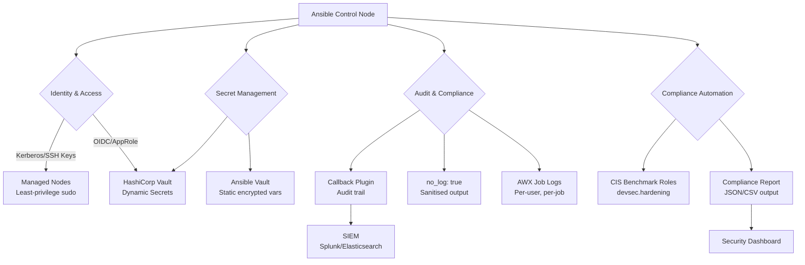
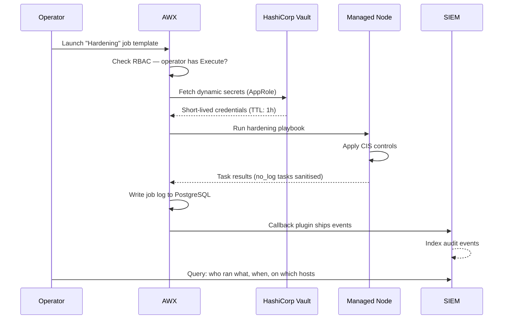

# Topic 27: Security Hardening

> 📍 Phase 5 — Architect / Expert | Topic 27 of 28 | File: `27-security-hardening.md`
> 🔗 Prev: `26-collections-development.md` | Next: `28-architecture-and-org-design.md`

---

## 🧠 Concept Overview

Ansible is powerful — and power requires responsibility. An Ansible playbook running with `become: true` across 500 servers can apply a critical security patch in minutes, or accidentally expose credentials in logs, grant excessive privilege through a misconfigured become chain, or trigger a security incident through a compromised dependency.

Security-first Ansible design is not an afterthought — it's an architectural stance. This topic covers the four pillars: least-privilege become strategy, output sanitisation with audit trails, CIS benchmark automation, and SIEM integration for compliance monitoring.

---

## 📖 In-Depth Explanation

### Subtopic 27.1 — Principle of Least Privilege — `become` Strategy

#### The `become` risk surface

Every `become: true` task elevates to root (or another privileged user). Root can: read `/etc/shadow`, modify `/etc/sudoers`, install malware, exfiltrate data, and destroy filesystems. The attack surface of Ansible is proportional to how broadly you grant `become`.

**The three become scopes — from broadest to tightest:**

```yaml
# ❌ Broadest — entire play runs as root
- name: Configure servers
  hosts: all
  become: true    # every single task runs as root

# Better — per-task become
- name: Configure servers
  hosts: all
  become: false   # default: no elevation

  tasks:
    - name: Read application config (no root needed)
      ansible.builtin.slurp:
        src: /opt/myapp/config.yml

    - name: Install package (needs root)
      ansible.builtin.apt:
        name: nginx
        state: present
      become: true    # only this task escalates

    - name: Write to app dir owned by deploy user (no root)
      ansible.builtin.copy:
        src: files/app.py
        dest: /opt/myapp/app.py
```

---

#### `become_user` — become a non-root privileged user

Never become root when a less-privileged user will do:

```yaml
tasks:
  - name: Run database migration as postgres user
    ansible.builtin.command: /opt/myapp/manage.py migrate
    become: true
    become_user: postgres    # elevate to postgres, not root

  - name: Restart app as deploy user
    ansible.builtin.service:
      name: myapp
      state: restarted
    become: true
    become_user: root    # systemctl actually needs root
```

---

#### Hardened sudoers — restrict what Ansible can do

Don't give the Ansible service account unrestricted `sudo`. Restrict it to only the commands needed:

```bash
# /etc/sudoers.d/ansible — restrict Ansible's privilege escalation
# Ansible service account can only run specific commands

# ❌ Don't do this — gives full root
ansible_svc ALL=(ALL) NOPASSWD: ALL

# ✅ Restrict to only what's needed
ansible_svc ALL=(ALL) NOPASSWD: /usr/bin/apt-get, /usr/bin/systemctl, /usr/sbin/nginx

# Even better: separate accounts per function
ansible_web  ALL=(ALL) NOPASSWD: /usr/bin/apt-get install nginx*, /usr/bin/systemctl * nginx
ansible_db   ALL=(ALL) NOPASSWD: /usr/bin/apt-get install postgresql*, /usr/bin/systemctl * postgresql
```

```yaml
# Ansible playbook to deploy hardened sudoers
- name: Configure Ansible sudoers (least privilege)
  ansible.builtin.blockinfile:
    path: /etc/sudoers.d/ansible
    create: true
    mode: '0440'
    validate: visudo -cf %s
    block: |
      Defaults:ansible_svc !requiretty
      ansible_svc ALL=(ALL) NOPASSWD: /usr/bin/apt-get, /usr/bin/dpkg, \
        /usr/bin/systemctl, /usr/sbin/service, /usr/sbin/nginx, \
        /usr/bin/install, /usr/bin/mkdir, /usr/bin/chown, /usr/bin/chmod
```

---

#### `become_method` options

| Method | Works via | Security notes |
|--------|-----------|---------------|
| `sudo` | `/usr/bin/sudo` | Default; most auditable; requires sudoers config |
| `su` | `/bin/su` | Older; requires target user password |
| `pbrun` | PowerBroker | Enterprise PAM; full audit trail |
| `pfexec` | Solaris | Solaris-specific |
| `runas` | Windows | Windows equivalent of sudo |
| `doas` | OpenBSD | Minimal sudo alternative |

For regulated environments, use `pbrun` or integrate with CyberArk/Delinea — they log every privileged command to a PAM audit trail.

---

### Subtopic 27.2 — No-log, Sanitising Output, Audit Trail with Callbacks

#### `no_log: true` — suppress sensitive task output

```yaml
tasks:
  - name: Create database user with password
    community.postgresql.postgresql_user:
      name: appuser
      password: "{{ vault_db_password }}"
      state: present
    no_log: true    # password never appears in logs, AWX output, or -vvv

  - name: Configure application secrets
    ansible.builtin.template:
      src: secrets.env.j2    # template contains vault-sourced secrets
      dest: /etc/myapp/.env
      mode: '0600'
    no_log: true

  - name: Set API key in config
    ansible.builtin.lineinfile:
      path: /etc/myapp/config.yml
      regexp: '^api_key:'
      line: "api_key: {{ vault_api_key }}"
    no_log: true
```

> ⚠️ `no_log: true` suppresses ALL output for that task — including error messages. When debugging a `no_log` task that's failing, temporarily remove `no_log`, fix the issue, then restore it. Never leave `no_log: false` in production code.

---

#### `ANSIBLE_NO_LOG` — global output suppression

For tasks that generate large, sensitive outputs (full config files with secrets embedded):

```ini
# ansible.cfg — suppress all task output (extreme)
[defaults]
no_log = true    # global no_log — use with caution

# Better: per-environment in ansible.cfg or as env var
ANSIBLE_NO_LOG=true ansible-playbook site.yml
```

---

#### Sanitising registered variables

```yaml
tasks:
  - name: Get current secrets configuration
    ansible.builtin.command: cat /etc/myapp/secrets.conf
    register: secrets_output
    no_log: true                # suppress the register content from output

  - name: Use the result without exposing it
    ansible.builtin.template:
      src: app.conf.j2
      dest: /etc/myapp/app.conf
    vars:
      current_secrets: "{{ secrets_output.stdout }}"
    no_log: true
```

---

#### Audit trail via callback plugins

The `log_plays` callback writes a full audit log to disk:

```ini
# ansible.cfg
[defaults]
callbacks_enabled = log_plays, profile_tasks

[callback_log_plays]
log_folder = /var/log/ansible/playbook_runs
```

For enterprise audit trails, write a custom callback plugin (as covered in Topic 17) that ships to your SIEM:

```python
# callback_plugins/siem_audit.py — audit every task to Elasticsearch
class CallbackModule(CallbackBase):
    def v2_runner_on_ok(self, result):
        self._ship_to_siem({
            "event": "task_ok",
            "host": result._host.name,
            "task": result.task_name,
            "changed": result._result.get('changed', False),
            "timestamp": datetime.utcnow().isoformat(),
            "operator": os.environ.get('USER', 'unknown'),
            "playbook": self._playbook_name,
        })

    def v2_runner_on_failed(self, result, ignore_errors=False):
        self._ship_to_siem({
            "event": "task_failed",
            "host": result._host.name,
            "task": result.task_name,
            "msg": result._result.get('msg', ''),
            "timestamp": datetime.utcnow().isoformat(),
        })
```

---

### Subtopic 27.3 — CIS Benchmark Playbooks and Compliance Automation

The CIS (Center for Internet Security) Benchmarks define security configuration baselines for operating systems, databases, cloud services, and more. Automating them with Ansible turns point-in-time hardening into continuous compliance.

#### Using the `devsec.hardening` collection

The `devsec.hardening` collection (Galaxy) provides battle-tested CIS-aligned roles:

```bash
ansible-galaxy collection install devsec.hardening
```

```yaml
- name: Apply CIS hardening baseline
  hosts: all
  become: true

  roles:
    # OS hardening (kernel params, account policies, filesystem)
    - role: devsec.hardening.os_hardening
      vars:
        os_auth_pw_max_age: 90
        os_auth_pw_min_age: 1
        os_auth_retries: 5
        os_auth_lockout_time: 900
        ufw_manage_defaults: true

    # SSH hardening (disable root login, set ciphers/MACs)
    - role: devsec.hardening.ssh_hardening
      vars:
        ssh_permit_root_login: 'no'
        ssh_password_authentication: 'no'
        ssh_max_auth_tries: 3
        ssh_client_alive_interval: 300
        ssh_client_alive_count_max: 3

    # Nginx hardening (TLS settings, headers)
    - role: devsec.hardening.nginx_hardening

    # MySQL hardening
    - role: devsec.hardening.mysql_hardening
```

---

#### Writing your own CIS benchmark tasks

```yaml
# CIS Ubuntu 22.04 LTS — selected controls
- name: Apply CIS Level 1 controls
  hosts: ubuntu_servers
  become: true

  tasks:
    # CIS 1.1.1.1 — Disable unused filesystems
    - name: CIS 1.1.1.1 - Disable cramfs
      ansible.builtin.lineinfile:
        path: /etc/modprobe.d/CIS.conf
        line: "install cramfs /bin/true"
        create: true

    # CIS 1.5.1 — Set GRUB password
    - name: CIS 1.5.1 - Ensure bootloader password is set
      ansible.builtin.stat:
        path: /boot/grub/grub.cfg
      register: grub_cfg
      changed_when: false

    # CIS 3.1.1 — Disable IP forwarding
    - name: CIS 3.1.1 - Ensure IP forwarding is disabled
      ansible.posix.sysctl:
        name: net.ipv4.ip_forward
        value: '0'
        sysctl_set: true
        state: present
        reload: true

    # CIS 3.1.2 — Disable packet redirect sending
    - name: CIS 3.1.2 - Ensure packet redirect sending is disabled
      ansible.posix.sysctl:
        name: "{{ item }}"
        value: '0'
        sysctl_set: true
      loop:
        - net.ipv4.conf.all.send_redirects
        - net.ipv4.conf.default.send_redirects

    # CIS 5.2.1 — SSH Protocol (already 2 by default but verify)
    - name: CIS 5.2.8 - Set SSH idle timeout
      ansible.builtin.lineinfile:
        path: /etc/ssh/sshd_config
        regexp: "^ClientAliveInterval"
        line: "ClientAliveInterval 300"
      notify: Restart sshd

    # CIS 5.4.1.1 — Password expiry
    - name: CIS 5.4.1.1 - Set password expiry to 90 days
      ansible.builtin.lineinfile:
        path: /etc/login.defs
        regexp: "^PASS_MAX_DAYS"
        line: "PASS_MAX_DAYS 90"

    # CIS 6.1.2 — /etc/passwd permissions
    - name: CIS 6.1.2 - Ensure permissions on /etc/passwd are 644
      ansible.builtin.file:
        path: /etc/passwd
        owner: root
        group: root
        mode: '0644'

  handlers:
    - name: Restart sshd
      ansible.builtin.service:
        name: sshd
        state: restarted
```

---

#### Compliance reporting

```yaml
# Generate a compliance report without making changes
- name: Compliance audit (check mode)
  hosts: all
  become: true

  tasks:
    - name: Check sysctl settings
      ansible.builtin.command: sysctl net.ipv4.ip_forward
      register: ipfwd
      changed_when: false

    - name: Record compliance finding
      ansible.builtin.set_fact:
        compliance_findings: "{{ compliance_findings | default([]) + [finding] }}"
      vars:
        finding:
          control: "CIS 3.1.1"
          description: "IP forwarding disabled"
          status: "{{ 'PASS' if '= 0' in ipfwd.stdout else 'FAIL' }}"
          actual: "{{ ipfwd.stdout }}"

    - name: Write compliance report
      ansible.builtin.copy:
        content: "{{ compliance_findings | to_nice_json }}"
        dest: "/tmp/compliance_{{ inventory_hostname }}.json"
      delegate_to: localhost
      run_once: false
```

---

### Subtopic 27.4 — Integrating with SIEM and Secrets Backends

#### HashiCorp Vault as a secrets backend (dynamic secrets)

Instead of static vault-encrypted passwords, retrieve dynamic, short-lived credentials directly from HashiCorp Vault at playbook runtime:

```bash
ansible-galaxy collection install community.hashi_vault
pip install hvac
```

```yaml
vars:
  # Retrieve a dynamic database credential (valid for 1 hour)
  db_credentials: "{{ lookup('community.hashi_vault.hashi_vault',
    'database/creds/myapp-role',
    url='https://vault.example.com',
    auth_method='approle',
    role_id=vault_approle_role_id,
    secret_id=vault_approle_secret_id
  ) }}"

tasks:
  - name: Configure database connection with dynamic credentials
    ansible.builtin.template:
      src: db.conf.j2
      dest: /etc/myapp/db.conf
    vars:
      db_user: "{{ db_credentials.username }}"
      db_pass: "{{ db_credentials.password }}"
    no_log: true
```

---

#### Shipping Ansible events to a SIEM (Splunk/Elasticsearch)

```yaml
# Using the community.elastic.ecs callback plugin
# Or writing your own (Topic 17 callback plugin pattern)

# ansible.cfg
[defaults]
callbacks_enabled = community.elastic.ecs

[callback_ecs]
elasticsearch_url = https://elk.example.com:9200
elasticsearch_index = ansible-audit
elasticsearch_username = ansible-audit-writer
elasticsearch_password = {{ vault_elk_password }}
```

For Splunk:
```yaml
# ansible.cfg
[defaults]
callbacks_enabled = community.general.splunk

[callback_splunk]
url = https://splunk.example.com:8088/services/collector/event
authtoken = {{ vault_splunk_hec_token }}
include_milliseconds = true
```

---

## 🏗️ Architecture & System Design

Security-in-depth for Ansible:



---

## 🔄 Flow / Lifecycle



---

## 💻 Code Examples

### ✅ Example 1: Hardened playbook with security best practices

```yaml
- name: Apply security baseline (hardened)
  hosts: production_servers
  become: false    # no global become — elevate only when needed
  gather_facts: true

  pre_tasks:
    - name: Assert running as correct service account
      ansible.builtin.assert:
        that: ansible_user_id == 'ansible-svc'
        fail_msg: "Must run as ansible-svc, not {{ ansible_user_id }}"

    - name: Assert this is not a developer workstation
      ansible.builtin.assert:
        that: "'workstations' not in group_names"
        fail_msg: "Hardening playbook must not run on workstations"

  tasks:
    - name: Install security packages
      ansible.builtin.apt:
        name:
          - auditd
          - aide
          - rkhunter
          - ufw
          - fail2ban
        state: present
        update_cache: true
      become: true

    - name: Configure auditd rules
      ansible.builtin.blockinfile:
        path: /etc/audit/rules.d/ansible-hardening.rules
        create: true
        block: |
          # Monitor privileged commands
          -a always,exit -F path=/usr/bin/sudo -F perm=x -F auid>=1000 -F auid!=4294967295 -k privileged
          -a always,exit -F path=/usr/bin/su -F perm=x -k privileged
          # Monitor file access to sensitive files
          -w /etc/passwd -p wa -k identity
          -w /etc/shadow -p wa -k identity
          -w /etc/sudoers -p wa -k privileged
      become: true
      notify: Restart auditd

    - name: Set secure file permissions
      ansible.builtin.file:
        path: "{{ item.path }}"
        owner: root
        group: root
        mode: "{{ item.mode }}"
      loop:
        - { path: /etc/passwd,  mode: '0644' }
        - { path: /etc/shadow,  mode: '0000' }
        - { path: /etc/gshadow, mode: '0000' }
        - { path: /etc/sudoers, mode: '0440' }
      become: true

    - name: Configure UFW (deny all in, allow SSH)
      community.general.ufw:
        state: enabled
        policy: deny
        direction: incoming
      become: true

    - name: Allow SSH through UFW
      community.general.ufw:
        rule: allow
        port: '22'
        proto: tcp
      become: true

  handlers:
    - name: Restart auditd
      ansible.builtin.service:
        name: auditd
        state: restarted
      become: true
```

### ✅ Example 2: Automated CIS compliance check with report

```yaml
- name: CIS Compliance Check
  hosts: all
  become: false
  gather_facts: true

  tasks:
    - name: Initialise findings list
      ansible.builtin.set_fact:
        findings: []

    - name: CIS 3.1.1 — IP Forwarding disabled
      ansible.builtin.command: sysctl -n net.ipv4.ip_forward
      register: ip_forward
      changed_when: false
      become: true

    - name: Record CIS 3.1.1 finding
      ansible.builtin.set_fact:
        findings: "{{ findings + [{'id': 'CIS-3.1.1', 'desc': 'IP forwarding disabled',
          'status': 'PASS' if ip_forward.stdout.strip() == '0' else 'FAIL',
          'actual': ip_forward.stdout.strip(), 'expected': '0'}] }}"

    - name: CIS 5.2.8 — SSH idle timeout configured
      ansible.builtin.shell: grep -E "^ClientAliveInterval" /etc/ssh/sshd_config
      register: ssh_timeout
      changed_when: false
      failed_when: false

    - name: Record CIS 5.2.8 finding
      ansible.builtin.set_fact:
        findings: "{{ findings + [{'id': 'CIS-5.2.8', 'desc': 'SSH idle timeout',
          'status': 'PASS' if ssh_timeout.rc == 0 else 'FAIL',
          'actual': ssh_timeout.stdout | default('not configured')}] }}"

    - name: Write compliance report to controller
      ansible.builtin.copy:
        content: |
          # Compliance Report — {{ inventory_hostname }}
          # Generated: {{ ansible_date_time.iso8601 }}
          {{ findings | to_nice_json }}
        dest: "./reports/{{ inventory_hostname }}_compliance.json"
      delegate_to: localhost

    - name: Summary — hosts with failures
      ansible.builtin.debug:
        msg: |
          {{ inventory_hostname }}: {{ findings | selectattr('status', 'eq', 'FAIL') | list | length }} failing controls
      when: findings | selectattr('status', 'eq', 'FAIL') | list | length > 0
```

### ✅ Example 3: Dynamic secrets from HashiCorp Vault

```yaml
- name: Deploy database with dynamic credentials
  hosts: appservers
  gather_facts: false

  vars:
    vault_addr: https://vault.example.com
    vault_role_id: "{{ lookup('env', 'VAULT_ROLE_ID') }}"
    vault_secret_id: "{{ lookup('env', 'VAULT_SECRET_ID') }}"

  tasks:
    - name: Get dynamic DB credentials from HashiCorp Vault
      ansible.builtin.set_fact:
        db_creds: "{{ lookup(
          'community.hashi_vault.hashi_vault',
          'database/creds/myapp-readonly',
          url=vault_addr,
          auth_method='approle',
          role_id=vault_role_id,
          secret_id=vault_secret_id
        ) }}"
      no_log: true

    - name: Deploy database config with dynamic credentials
      ansible.builtin.template:
        src: db.conf.j2
        dest: /etc/myapp/db.conf
        mode: '0600'
        owner: myapp
      vars:
        db_username: "{{ db_creds.username }}"
        db_password: "{{ db_creds.password }}"
      no_log: true
      notify: Restart myapp
```

### ❌ Anti-pattern — Security anti-patterns to avoid

```yaml
# ❌ 1. Global become with no restriction
- hosts: all
  become: true    # every task gets root — unnecessary for read-only tasks

# ❌ 2. Printing secrets in debug tasks
- name: Debug - show vault password
  ansible.builtin.debug:
    msg: "Password is {{ db_password }}"    # logs in plain text!

# ❌ 3. Storing secrets in plaintext group_vars
# group_vars/production.yml:
db_password: SuperSecret123    # committed to Git!

# ❌ 4. Ignoring certificate validation
ansible_winrm_server_cert_validation: ignore    # MITM attack surface
ansible_ssl_verify: false

# ✅ Correct patterns:
# - become only on tasks that need it
# - no_log: true on all secret-handling tasks
# - All secrets in Ansible Vault or HashiCorp Vault
# - Always validate TLS certificates in production
```

---

## ⚙️ Configuration & Options

### Security-focused `ansible.cfg`

```ini
[defaults]
# Never log task details globally (override per-task with no_log: false for debugging)
# no_log = true    # too aggressive — use per-task no_log

# Audit log
callbacks_enabled = log_plays, community.elastic.ecs

# Prevent fact injection from untrusted hosts
allow_unsafe_lookups = false

# Timeout to prevent hung SSH sessions
timeout = 30

[ssh_connection]
# Use stronger SSH ciphers
ssh_args = -o Ciphers=chacha20-poly1305@openssh.com,aes256-gcm@openssh.com \
           -o MACs=hmac-sha2-512-etm@openssh.com \
           -o KexAlgorithms=curve25519-sha256@libssh.org \
           -o StrictHostKeyChecking=yes \
           -o ControlMaster=auto \
           -o ControlPersist=60s
```

### Key security modules reference

| Module | Security use case |
|--------|------------------|
| `ansible.posix.sysctl` | Kernel hardening parameters |
| `community.general.ufw` | Firewall management |
| `ansible.builtin.file` | File/dir permission hardening |
| `ansible.builtin.lineinfile` | Secure config file edits |
| `community.general.sudoers` | Granular sudoers management |
| `ansible.builtin.user` | Account management, password policy |
| `community.hashi_vault.hashi_vault` | Dynamic secret retrieval |
| `devsec.hardening.os_hardening` | CIS-aligned OS hardening role |

---

## 🧩 Patterns & Best Practices

**What experienced engineers do:**
- Apply `no_log: true` defensively — any task that touches credentials, private keys, or sensitive config gets it, even if you're not sure the value is secret
- Run compliance checks in `--check` mode on a schedule — treat compliance drift the same as configuration drift
- Use HashiCorp Vault or AWS Secrets Manager for frequently-rotated credentials — Ansible Vault is great for static secrets but doesn't rotate them
- Restrict the Ansible service account in sudoers to only the commands genuinely needed — review and tighten after every project iteration
- Ship all Ansible events to your SIEM — when a security incident occurs, you need to know exactly what Ansible did on which hosts and who triggered it

**What beginners typically get wrong:**
- Putting `become: true` at the play level "for convenience" — root is not convenience; it's risk surface
- Forgetting `no_log: true` on tasks that use `register` with sensitive data — the registered variable appears in `-vvv` output
- Using Ansible Vault for DB passwords that need rotation — Ansible Vault doesn't rotate; use a secrets manager
- Disabling TLS certificate validation for "ease" — `validate_certs: false` or `host_key_checking: false` in production is a MITM vulnerability
- Running compliance checks without fixing findings — a compliance report that nobody acts on is theatre, not security

**Senior-level nuance:**
- Compliance-as-code (CIS benchmarks in playbooks) is powerful but requires a remediation workflow: scan → report → ticket creation → remediation PR → re-scan. Without the full loop, findings accumulate. Integrate compliance reports with your ticketing system (Jira, ServiceNow) automatically.
- The `no_log: true` directive doesn't prevent secrets from appearing in Python tracebacks when Ansible itself encounters an exception. For extra protection in regulated environments, use dedicated secret injection mechanisms (HashiCorp Vault agent sidecar, AWS Secrets Manager environment injection) rather than passing secrets through Ansible variable scope at all.

---

## 🔗 How It Connects

- **Builds on:** `13-ansible-vault.md` — vault is the static secret layer; this topic adds dynamic secrets and output sanitisation | `25-cicd-integration.md` — CI pipelines need secure secrets handling matching these patterns
- **Leads to:** `28-architecture-and-org-design.md` — security hardening is one pillar of org-wide Ansible architecture
- **Related concepts:** Topic 17 (Custom callback plugins — the audit trail mechanism), Topic 21 (AWX RBAC — the access control layer), Topic 26 (Collections — hardening roles packaged as collection content)

---

## 🎯 Interview Questions (Conceptual)

**Q1: Why is `become: true` at the play level a security risk, and what is the alternative?**
> **A:** Play-level `become: true` escalates every task to root, including tasks that don't need it — like reading a config file, checking facts, or writing to a directory owned by a non-root user. This maximises root exposure time and blast radius. The alternative is `become: false` at the play level and adding `become: true` only to tasks that genuinely require elevated privileges. This follows the principle of least privilege.

**Q2: What does `no_log: true` do and what are its limitations?**
> **A:** `no_log: true` suppresses all input and output for a task from Ansible's logging — including verbose mode (`-vvv`), AWX job output, and callback plugins. Its limitations: it doesn't prevent secrets from appearing in Python exception tracebacks (when the module itself crashes), it makes debugging harder (you lose all task output, including error messages), and it doesn't protect values in the `register` variable from being used in subsequent tasks that don't have `no_log`.

**Q3: What is the CIS Benchmark and how does Ansible help enforce it?**
> **A:** CIS Benchmarks are consensus-developed security configuration guides for OS, databases, cloud platforms, and applications — published by the Center for Internet Security. Ansible enforces them by running benchmark controls as idempotent tasks: setting sysctl parameters, configuring file permissions, hardening SSH config, and enabling audit logging. Roles like `devsec.hardening` package these controls. Running in `--check` mode provides a compliance report; running normally remediates findings.

**Q4: What is the difference between Ansible Vault and HashiCorp Vault for secret management?**
> **A:** Ansible Vault encrypts secrets at rest in YAML files — useful for static, infrequently-changing credentials committed alongside playbooks. It has no rotation mechanism. HashiCorp Vault is a purpose-built secret management system that provides dynamic secrets (generated on-demand with short TTLs), automatic rotation, audit logging of every secret access, and fine-grained access policies. For frequently-rotated credentials (database passwords, API tokens), HashiCorp Vault is the right tool; Ansible Vault is for bootstrapping credentials and static configuration secrets.

**Q5: How would you detect if someone manually modified a production server outside of Ansible?**
> **A:** Run Ansible in `--check --diff` mode on a schedule against production. If any task reports `changed`, it means the actual state differs from the Git-defined desired state — someone or something changed the server outside Ansible. The `--diff` output shows exactly what changed. Combined with SIEM integration (which logs every Ansible run and who triggered it), you can distinguish "Ansible made this change as part of job #1234 triggered by user X" from "this was changed by an unknown process."

---

## 🧠 Scenario-Based Interview Problems

**Scenario 1: "Your security audit found that Ansible playbook output is being logged to a shared Splunk index, and database passwords from recent deployments are visible to all developers. How do you fix this?"**
> **Problem:** Sensitive data leaking through Ansible logging.
> **Approach:** (1) Immediately add `no_log: true` to all tasks that reference vault variables containing credentials. (2) Review all `ansible.builtin.debug` tasks — remove any that print sensitive vars. (3) Update the Splunk callback configuration to filter sensitive fields before shipping. (4) Rotate all exposed credentials immediately. (5) Audit the last 90 days of Splunk logs for any other sensitive data. Going forward: add `no_log: true` as a mandatory code review checklist item for any task referencing vault variables, and implement a pre-commit check using `detect-secrets` to catch accidental logging.
> **Trade-offs:** Aggressive `no_log` makes debugging harder. Create a non-production environment where `no_log` is removed for development, and restore it before PRs are merged.

**Scenario 2: "Your organisation needs to demonstrate CIS Level 1 compliance for 200 Linux servers to pass a SOC2 audit. The audit is in 3 months. How do you approach this with Ansible?"**
> **Problem:** Large-scale compliance remediation under a deadline.
> **Approach:** Month 1: Assessment. Run a compliance-check playbook in `--check --diff` mode to generate a JSON report for all 200 servers. Parse reports to get a finding count per control per host. Identify the 20% of controls that account for 80% of failures (Pareto analysis). Month 2: Remediation. Write playbooks for each failing control group. Apply to staging first, then production in rolling batches with `serial: 10%`. Month 3: Evidence collection. Re-run compliance check, generate passing reports, document the change management process (GitOps trail). For the audit, show: the compliance playbooks, the Git history of when they were applied, the AWX job logs showing who ran them, and the before/after compliance reports.
> **Trade-offs:** Some CIS controls (bootloader passwords, removable media) can't be automated or require manual steps — identify these early and document manual procedures. Automated compliance covers 90%; the remaining 10% needs a documented manual process.

---

## ⚡ Quick Notes — Revision Card

- 📌 Least privilege: `become: false` at play level, `become: true` only per task that needs it
- 📌 `become_user: postgres` = elevate to specific user, not always root
- 📌 Restrict sudoers to exact commands needed — `ansible_svc ALL=(ALL) NOPASSWD: /usr/bin/apt-get`
- 📌 `no_log: true` = suppress all task I/O from logs, verbose output, AWX, callbacks
- 📌 `log_plays` callback = write audit trail to disk | custom callback = ship to SIEM
- 📌 CIS Benchmarks = security baseline; `devsec.hardening` collection packages common controls
- 📌 Compliance-as-code = `--check` mode for audit, normal mode for remediation
- 📌 HashiCorp Vault lookup = dynamic short-lived secrets, auto-rotated, audit-logged
- 📌 `community.hashi_vault.hashi_vault` lookup = retrieve dynamic DB/API creds at runtime
- ⚠️ `no_log` suppresses error messages too — remove temporarily for debugging, restore before commit
- ⚠️ `validate_certs: false` and `host_key_checking: false` = MITM attack surface — never in production
- ⚠️ Ansible Vault doesn't rotate secrets — use HashiCorp Vault / AWS Secrets Manager for that
- 💡 Pre-commit `detect-secrets` hook = catches accidental secret commits before they reach remote
- 🔑 AWX + RBAC + no_log + SIEM callback = the four-layer audit and access control stack

---

## 🔖 References & Further Reading

- 📄 [Ansible Security Guide](https://docs.ansible.com/ansible/latest/security.html)
- 📄 [no_log — Keeping Secrets](https://docs.ansible.com/ansible/latest/reference_appendices/faq.html#how-do-i-keep-secret-data-in-my-playbook)
- 📄 [devsec.hardening collection](https://github.com/dev-sec/ansible-collection-hardening)
- 📄 [community.hashi_vault collection](https://docs.ansible.com/ansible/latest/collections/community/hashi_vault/index.html)
- 📝 [CIS Benchmarks](https://www.cisecurity.org/cis-benchmarks)
- 📝 [HashiCorp Vault + Ansible Integration](https://developer.hashicorp.com/vault/docs/agent-and-proxy/agent)
- 🎥 [Ansible Security Best Practices — AnsibleFest](https://www.youtube.com/watch?v=WlUaAgTLjLo)
- ➡️ Related in this course: [`26-collections-development.md`] · [`28-architecture-and-org-design.md`]

---
