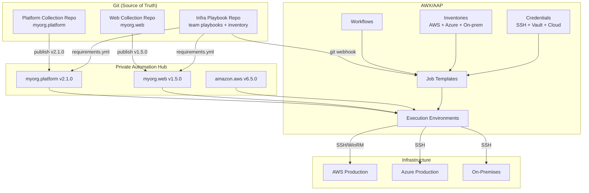
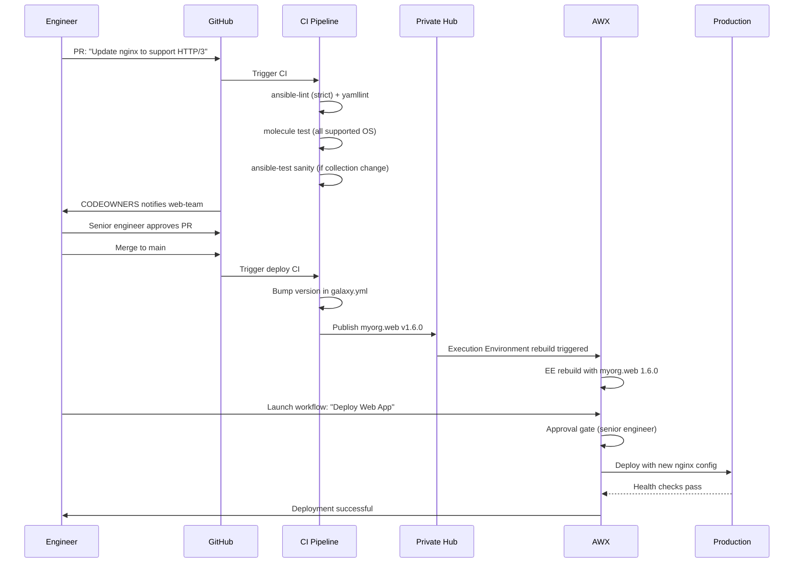

# Topic 28: Architecture & Org Design

> 📍 Phase 5 — Architect / Expert | Topic 28 of 28 | File: `28-architecture-and-org-design.md`
> 🔗 Prev: `27-security-hardening.md` | Next: *(end of course)*

---

## 🧠 Concept Overview

You've mastered every Ansible feature. Now comes the hardest question: **how do you design an Ansible platform that works for an entire organisation — with 50 engineers, 10 teams, 5 cloud providers, and 2,000 hosts — without becoming a maintenance nightmare?**

This is the architect's challenge. The technical decisions are table stakes. The real complexity is organisational: who owns what, how do teams collaborate without stepping on each other, when do you reach for Ansible vs Terraform vs Pulumi, and how do you govern automation at scale without creating a bureaucratic bottleneck?

This topic synthesises everything you've learned into a coherent architectural framework for enterprise Ansible.

---

## 📖 In-Depth Explanation

### Subtopic 28.1 — Repository Design: Monorepo vs Multi-repo vs Content Collections

#### Option 1: Monorepo — one repo for all Ansible content

```
ansible-monorepo/
├── inventories/
│   ├── production/
│   └── staging/
├── playbooks/
│   ├── webservers.yml
│   ├── databases.yml
│   └── site.yml
├── roles/
│   ├── nginx/
│   ├── postgresql/
│   └── myapp/
├── collections/          ← vendored dependencies
├── requirements.yml
├── ansible.cfg
└── .github/workflows/
```

**Pros:**
- Single source of truth — all automation in one place
- Easy cross-role dependencies — roles reference each other naturally
- One CI pipeline, one linting config, one `requirements.yml`
- PR history shows the full picture of every infrastructure change

**Cons:**
- Every team touches the same repo — PR bottlenecks at scale
- A broken role in `nginx/` can block a DB team's PR from merging
- Large repo gets slow to clone and search as it grows
- Harder to assign ownership — who "owns" `roles/nginx/`?

**Best for:** Small to medium organisations (up to ~5 teams, ~50 engineers), where the coordination overhead of multi-repo is higher than the conflicts from sharing.

---

#### Option 2: Multi-repo — one repo per team or domain

```
github.com/myorg/
├── ansible-platform/          ← shared infrastructure team repo
│   ├── roles/common/
│   ├── roles/monitoring/
│   └── playbooks/baseline.yml
├── ansible-web/               ← web team repo
│   ├── roles/nginx/
│   ├── roles/myapp/
│   └── playbooks/webservers.yml
├── ansible-data/              ← data team repo
│   ├── roles/postgresql/
│   ├── roles/redis/
│   └── playbooks/databases.yml
└── ansible-collections/       ← shared collections
    └── myorg.platform/
```

**Pros:**
- Clear ownership — each team owns their repo
- Independent CI pipelines — web team's broken tests don't block data team
- Independent versioning — web team can be on nginx role v3, data team on v2
- Smaller, faster repos

**Cons:**
- Cross-repo dependencies are painful — how does web role reference common role?
- Coordinating a cross-repo change (e.g. a security fix that touches 5 repos) is operationally complex
- Risk of divergence — each team develops slightly different patterns
- No single view of "what runs where"

**Best for:** Large organisations (10+ teams) where team autonomy matters more than coordination, or organisations with strict domain boundaries (separate compliance scopes per team).

---

#### Option 3: Content Collections — the modern standard

Shared automation is packaged as versioned collections. Each team publishes to Private Hub. Consumers declare `requirements.yml` dependencies.

```
github.com/myorg/
├── ansible-collection-platform/    ← published as myorg.platform
│   ├── plugins/modules/
│   ├── roles/common/
│   └── galaxy.yml  (version: 2.1.0)
├── ansible-collection-web/          ← published as myorg.web
│   ├── roles/nginx/
│   ├── roles/myapp/
│   └── galaxy.yml  (version: 1.5.0)
└── infrastructure-playbooks/        ← each team's playbook repo
    ├── requirements.yml
    │   # collections:
    │   #   - name: myorg.platform
    │   #     version: "2.1.0"
    │   #   - name: myorg.web
    │   #     version: "1.5.0"
    ├── playbooks/site.yml
    └── inventories/
```

**Pros:**
- Clear versioning and dependency declaration
- Teams consume stable, tested, published versions
- Breaking changes managed through semantic versioning
- Private Hub provides governance and access control
- Roles and modules are truly reusable across playbook repos

**Cons:**
- Publishing workflow adds friction to rapid iteration
- Version pinning means consumers must deliberately upgrade
- Requires Private Automation Hub infrastructure

**Best for:** Enterprise organisations with mature automation practices, compliance requirements, and dedicated platform engineering teams.

---

#### Recommended hybrid: pragmatic scaling model

```
Stage 1 (team starts):    Monorepo — simple, fast, no overhead
Stage 2 (3-5 teams):      Monorepo with clear directory ownership + CODEOWNERS
Stage 3 (5-10 teams):     Split shared roles/modules into a platform collection
Stage 4 (10+ teams):      Full multi-repo with collections and Private Hub
```

---

### Subtopic 28.2 — RBAC, Team Structure, and Role Ownership in AAP

#### Organisation structure in AWX/AAP

```
AAP Organisation: "MyOrg"
│
├── Platform Team (infrastructure/ansible platform owners)
│   ├── Owns: all collections, Execution Environments
│   ├── Manages: AWX itself, credentials, inventories
│   └── AWX Role: Org Admin
│
├── Web Team
│   ├── Owns: ansible-collection-web
│   ├── AWX Resources:
│   │   ├── Job Templates: "Deploy Web App", "Nginx Config Push"
│   │   ├── Inventory: "Web Production" (Use permission)
│   │   └── Credential: "Web SSH Key" (Use permission)
│   └── AWX Role: Execute on own templates, Read on shared resources
│
├── Data Team
│   ├── Owns: ansible-collection-data
│   ├── AWX Resources:
│   │   ├── Job Templates: "Deploy PostgreSQL", "DB Backup"
│   │   ├── Inventory: "Database Production" (Use permission)
│   │   └── Credential: "DB SSH Key" (Use permission)
│   └── AWX Role: Execute on own templates
│
└── Security Team
    ├── AWX Role: Auditor (read all, execute none — for compliance review)
    └── Owns: ansible-collection-security (hardening roles)
```

---

#### CODEOWNERS — Git-level ownership

```
# .github/CODEOWNERS
# Format: path   @github-username or @github-org/team

# Platform team owns shared infrastructure roles
/roles/common/              @myorg/platform-team
/roles/monitoring/          @myorg/platform-team
/inventory/                 @myorg/platform-team
/ansible.cfg                @myorg/platform-team
/.github/                   @myorg/platform-team

# Web team owns web-facing automation
/roles/nginx/               @myorg/web-team
/roles/myapp/               @myorg/web-team
/playbooks/webservers.yml   @myorg/web-team

# Data team owns database automation
/roles/postgresql/          @myorg/data-team
/roles/redis/               @myorg/data-team
/playbooks/databases.yml    @myorg/data-team

# Security team reviews all security-sensitive files
/roles/*/tasks/hardening*   @myorg/security-team
/playbooks/compliance.yml   @myorg/security-team
```

With CODEOWNERS, any PR that modifies `/roles/nginx/` requires approval from `@myorg/web-team` — enforced by GitHub/GitLab.

---

### Subtopic 28.3 — Multi-Cloud and Multi-DC Orchestration Patterns

#### Pattern 1: Single inventory, cloud-aware grouping

```yaml
# inventory/aws_ec2.yml + inventory/azure_rm.yml + inventory/constructed.yml
# All sources merged — constructed builds cross-cloud groups

# Playbook targets logical groups, not cloud-specific ones
- name: Deploy web application
  hosts: all_webservers    # constructed group: includes AWS + Azure web servers
  roles:
    - myorg.web.nginx
    - myorg.web.myapp
```

---

#### Pattern 2: Per-cloud play structure

```yaml
# site.yml — explicit per-cloud plays
- name: Deploy to AWS web servers
  hosts: aws_webservers
  gather_facts: true
  vars:
    cloud_provider: aws
    lb_type: alb
  roles:
    - myorg.platform.common
    - myorg.web.nginx

- name: Deploy to Azure web servers
  hosts: azure_webservers
  gather_facts: true
  vars:
    cloud_provider: azure
    lb_type: application_gateway
  roles:
    - myorg.platform.common
    - myorg.web.nginx
```

---

#### Pattern 3: AWX Automation Mesh for geo-distributed execution

```
Control Plane (London AWX)
    │
    ├─► Execution Node: EU West (Dublin)
    │   └─► Managed hosts: EU production
    │
    ├─► Execution Node: US East (Virginia)
    │   └─► Managed hosts: US production
    │
    └─► Hop Node: APAC DMZ (Singapore)
        └─► Execution Node: APAC (Tokyo)
            └─► Managed hosts: APAC production
```

Benefits: Managed hosts only need outbound connectivity to their nearest execution node. No VPN tunnels to the central control plane. Execution nodes handle latency-sensitive operations locally.

---

### Subtopic 28.4 — Deciding When NOT to Use Ansible (Terraform, Pulumi Trade-offs)

This is the most important architectural judgment an Ansible engineer can develop.

#### The IaC tool landscape

```
Tool            | Primary use case              | State?
────────────────|───────────────────────────────|──────────────
Terraform/OpenTofu | Infrastructure provisioning  | Yes (tfstate)
Pulumi          | Infrastructure provisioning    | Yes (cloud state)
Ansible         | Configuration management       | No
Chef/Puppet     | Configuration management       | Agent-based
Helm            | Kubernetes app deployment      | Yes (k8s secrets)
Argo CD         | GitOps for Kubernetes          | Yes (cluster state)
```

#### When Ansible is the right choice

✅ **Configuration of existing infrastructure** — install packages, render config files, manage services, deploy application code  
✅ **Ad-hoc operational tasks** — emergency patches, one-time migrations, compliance scans  
✅ **Bootstrapping new servers** — configure OS after Terraform provisions it  
✅ **Network device configuration** — routers, switches with CLI interfaces  
✅ **Windows management** — Group Policy alternatives, IIS deployment, registry management  
✅ **Multi-step orchestration** — coordinating across different systems in sequence  
✅ **Agentless environments** — where you can't install software on managed systems  

---

#### When Ansible is NOT the right choice

❌ **Creating cloud infrastructure** — use Terraform/Pulumi for EC2, VPCs, RDS, load balancers. Ansible can do it but has no state file — it can't track what it created or handle deletion cleanly.

```yaml
# ❌ Don't provision infrastructure with Ansible
- name: Create EC2 instances
  amazon.aws.ec2_instance:
    name: "web-{{ item }}"
    instance_type: t3.medium
    ...
  loop: [1, 2, 3]
# Problem: run again → creates 3 more instances (no state to check)

# ✅ Use Terraform for provisioning, Ansible for configuration
# terraform apply → creates EC2 → Ansible configures them
```

❌ **Kubernetes application deployment** — use Helm, Kustomize, Argo CD. Ansible has k8s modules but they're clunky compared to purpose-built tools.

❌ **Immutable infrastructure** — if you're baking AMIs with Packer and replacing servers instead of updating them, Ansible's in-place configuration model doesn't fit.

❌ **High-frequency changes** — Ansible playbooks run in seconds to minutes. If you need sub-second config updates (feature flags, rate limits), use application-level config systems.

---

#### The Terraform + Ansible handoff pattern

```
# Terraform provisions → outputs → Ansible configures

# terraform/main.tf
resource "aws_instance" "web" {
  count         = 3
  instance_type = "t3.medium"
  ami           = data.aws_ami.ubuntu.id
  tags = {
    Name        = "web-${count.index + 1}"
    Role        = "webserver"
    ManagedBy   = "ansible"
  }
}

output "web_instance_ips" {
  value = aws_instance.web[*].private_ip
}
```

```bash
# CI/CD pipeline: Terraform first, Ansible second
terraform apply -auto-approve
# Wait for instances to be healthy (SSM, EC2 health check)
sleep 60
# Dynamic inventory queries AWS — picks up the new instances
ansible-playbook -i inventory/aws_ec2.yml playbooks/webservers.yml
```

---

### Subtopic 28.5 — Ansible Governance: Linting Standards, Review Gates, Versioning

#### `ansible-lint` as a policy tool

```yaml
# .ansible-lint — org-wide policy enforcement
profile: production    # strictest profile

warn_list: []          # nothing is just a warning — everything fails or passes

# Custom rules
rules:
  no_shorthand:        # require FQCN for all modules
    type: warning
  risky-shell-pipe:    # flag shell pipes without set -o pipefail
    type: error

# Enforce naming conventions
task_name_prefix: ""   # no required prefix
var_naming_pattern: "^[a-z][a-z0-9_]*$"   # snake_case only
```

```bash
# Run in CI
ansible-lint --strict playbooks/ roles/    # --strict: warnings become errors

# Generate a SARIF report for GitHub Security tab
ansible-lint --format=sarif > ansible-lint.sarif
```

---

#### The RFC process for shared automation changes

For large organisations, a lightweight RFC (Request for Comments) process prevents surprise breaking changes:

```markdown
# RFC Template: Ansible Platform Change

## Summary
Brief description of the proposed change.

## Motivation
Why is this change needed? What problem does it solve?

## Proposed Change
Specific files, roles, or modules being changed.

## Breaking Changes
Will this break existing callers? What migration is needed?

## Rollout Plan
1. Publish to Private Hub as a minor version
2. Notify consuming teams via #ansible-platform Slack
3. Allow 2-week migration window
4. Bump major version with deprecation notice
5. Remove old interface in next major release

## Acceptance Criteria
What tests/checks prove this is working correctly?
```

---

#### Version governance model

```
Collection versioning policy:
  PATCH release:  Any team can publish after passing CI
  MINOR release:  Requires platform team review + changelog
  MAJOR release:  Requires RFC + 2-week migration period + platform team sign-off

Playbook repo branching:
  main:           Always deployable to staging
  tags (vX.Y.Z):  Deployable to production (requires tag)
  
Dependency pinning policy:
  requirements.yml: Exact versions pinned (2.1.0, not >=2.1.0)
  Quarterly review: Platform team bumps dependencies, tests, PRs to consuming repos
```

---

## 🏗️ Architecture & System Design

Enterprise Ansible architecture overview:



---

## 🔄 Flow / Lifecycle

The lifecycle of a production infrastructure change in a mature Ansible org:



---

## 💻 Code Examples

### ✅ Example 1: Platform team's `ansible.cfg` baseline (distributed to all teams)

```ini
# ansible.cfg — org-wide baseline
# Distributed via Platform team's onboarding playbook

[defaults]
collections_path    = ./collections:~/.ansible/collections
roles_path          = ./roles:~/.ansible/roles
inventory           = ./inventory
forks               = 50
gathering           = smart
fact_caching        = jsonfile
fact_caching_connection = /tmp/ansible_facts
fact_caching_timeout = 3600
stdout_callback     = yaml
callbacks_enabled   = profile_tasks, timer
retry_files_enabled = False
interpreter_python  = auto_silent

[ssh_connection]
pipelining          = True
ssh_args            = -o ControlMaster=auto -o ControlPersist=60s \
                      -o ControlPath=/tmp/ansible-ssh-%h-%p-%r \
                      -o StrictHostKeyChecking=yes

[inventory]
cache               = true
cache_plugin        = ansible.builtin.jsonfile
cache_connection    = /tmp/ansible_inventory_cache
cache_timeout       = 3600
```

### ✅ Example 2: Team onboarding playbook (platform-managed)

```yaml
# playbooks/onboard-new-engineer.yml
# Runs against 'localhost' to set up a developer's machine

- name: Set up Ansible development environment
  hosts: localhost
  connection: local
  gather_facts: true

  vars:
    ansible_version: "9.3.0"
    project_dir: "{{ ansible_env.HOME }}/projects/infrastructure"

  tasks:
    - name: Ensure Python venv exists
      ansible.builtin.pip:
        name:
          - "ansible=={{ ansible_version }}"
          - ansible-lint
          - yamllint
          - molecule
          - molecule-docker
        virtualenv: "{{ project_dir }}/venv"
        virtualenv_command: python3 -m venv

    - name: Clone infrastructure repo
      ansible.builtin.git:
        repo: git@github.com:myorg/infrastructure-playbooks.git
        dest: "{{ project_dir }}"
        version: main

    - name: Install Galaxy dependencies
      ansible.builtin.command: >
        {{ project_dir }}/venv/bin/ansible-galaxy
        collection install -r {{ project_dir }}/requirements.yml

    - name: Install pre-commit hooks
      ansible.builtin.command: >
        {{ project_dir }}/venv/bin/pre-commit install
      args:
        chdir: "{{ project_dir }}"

    - name: Configure AWS CLI profile
      ansible.builtin.blockinfile:
        path: "{{ ansible_env.HOME }}/.aws/config"
        create: true
        block: |
          [profile myorg-staging]
          role_arn = arn:aws:iam::123456789012:role/AnsibleEngineerRole
          source_profile = default
          region = eu-west-1

    - name: Show next steps
      ansible.builtin.debug:
        msg: |
          ✅ Development environment ready!
          Next steps:
          1. cd {{ project_dir }} && source venv/bin/activate
          2. ansible-playbook -i inventory/staging --check playbooks/site.yml
          3. Read docs at https://docs.myorg.com/ansible
```

### ✅ Example 3: Deprecation notice in a role (graceful API change)

```yaml
# roles/nginx/tasks/main.yml

# Deprecation: 'nginx_port' renamed to 'nginx_http_port' in v2.0.0
- name: Handle deprecated nginx_port variable
  ansible.builtin.set_fact:
    nginx_http_port: "{{ nginx_port }}"
  when: nginx_port is defined and nginx_http_port is not defined

- name: Warn if deprecated nginx_port variable is used
  ansible.builtin.debug:
    msg: >
      DEPRECATION WARNING: 'nginx_port' has been renamed to 'nginx_http_port'.
      'nginx_port' will be removed in v3.0.0.
      Update your group_vars/host_vars to use 'nginx_http_port' instead.
  when: nginx_port is defined
```

### ✅ Example 4: Decision playbook — Ansible vs Terraform gate

```yaml
# playbooks/infra_decision_gate.yml
# Run before any infrastructure task to assert the right tool is being used

- name: Validate this is a configuration task, not provisioning
  hosts: all
  gather_facts: false

  pre_tasks:
    - name: Assert we are not trying to create new infrastructure
      ansible.builtin.assert:
        that:
          - "'provision' not in ansible_run_tags"
        fail_msg: >
          Use Terraform (terraform/) for infrastructure provisioning.
          Ansible is for configuration management only.
          See: https://docs.myorg.com/infra-decisions
        success_msg: "Configuration management task confirmed"
```

---

## ⚙️ Configuration & Options

### Org-wide standards checklist

```
Repo standards:
  ✅ ansible.cfg committed to repo root
  ✅ requirements.yml with exact version pins
  ✅ .ansible-lint with 'production' profile
  ✅ .yamllint committed
  ✅ .pre-commit-config.yaml with ansible-lint + detect-secrets
  ✅ .github/CODEOWNERS defining team ownership
  ✅ CI pipeline: lint → molecule → deploy-staging → approve → deploy-production
  ✅ CHANGELOG.md for any shared roles/collections

Role standards:
  ✅ defaults/main.yml (not vars/) for user-facing config
  ✅ All variables namespaced: nginx_port not port
  ✅ README.md with variables table and example playbook
  ✅ Molecule tests on ≥2 OS platforms
  ✅ Tags: install, config, service on all tasks
  ✅ no_log: true on all tasks handling secrets

AWX standards:
  ✅ No direct ansible-playbook against production — AWX only
  ✅ Approval gate on all production job templates
  ✅ Credentials in AWX (not on engineer laptops)
  ✅ Job timeout set on all templates
  ✅ Notifications configured on failure
  ✅ RBAC: minimum Execute role for operators, Admin only for platform team
```

---

## 🧩 Patterns & Best Practices

**What architects do:**
- Start simple (monorepo) and add complexity only when the pain of the current approach is clear — premature collection packaging adds friction without benefit at small scale
- Document the decision of "Ansible vs Terraform vs Helm" for each type of resource — write it in your architecture decision records (ADRs) so future engineers understand the reasoning, not just the rule
- Treat the platform team's time as a shared resource — every new requirement that comes to the platform team should be evaluated for whether it can be self-served by product teams using well-designed collections
- Measure automation coverage — what percentage of your infrastructure changes go through Ansible vs. manual SSH? This metric should trend toward 100% over time
- Run quarterly "automation debt" reviews — find manual processes that should be automated and put them on the roadmap

**What organisations get wrong at scale:**
- The "Golden Hammer" failure: using Ansible for everything including infrastructure provisioning, Kubernetes deployments, and database schema migrations — each of which has better purpose-built tools
- Centralisation bottleneck: having one platform team own and review all Ansible changes — teams work around it with manual changes, negating the entire value
- Ungoverned sprawl: every team writes their own nginx role with no coordination — 10 different nginx implementations none of which are well-tested
- Tooling debt: running Ansible 2.9 in production because "it works" while missing five years of security patches and feature improvements

**The architect's north star:**
> *Every infrastructure change should be: proposed in Git, reviewed by a human, tested automatically, and applied by a machine — with a full audit trail.*

---

## 🔗 How It Connects

- **Builds on:** Every topic in this course — this is the synthesis
- **Leads to:** Your career as an Ansible architect — go build something remarkable
- **Related concepts:** All 27 preceding topics — this topic references them all

---

## 🎯 Interview Questions (Conceptual)

**Q1: When would you choose a monorepo for Ansible over a multi-repo approach?**
> **A:** Monorepo is the right choice when the organisation is small (under 5 teams), cross-team coordination is frequent, and the overhead of managing multiple repos outweighs the benefits of team autonomy. It's simpler, gives a single view of all automation, and makes cross-repo changes (security patches affecting many roles) trivially easy. Switch to multi-repo when PR bottlenecks are slowing teams down, or when different teams need different release cadences.

**Q2: What is the difference between Ansible and Terraform in terms of responsibility?**
> **A:** Terraform (and Pulumi) are provisioning tools — they create and manage infrastructure resources like EC2 instances, VPCs, databases, and load balancers. They maintain a state file that tracks what they've created. Ansible is a configuration management tool — it configures existing systems, installs packages, manages services, and deploys application code. The correct pattern is Terraform to provision, Ansible to configure. Ansible technically can provision cloud resources, but without a state file it can't track what it created, handle deletion, or manage drift reliably.

**Q3: What is an Execution Environment and why is it important for a multi-team organisation?**
> **A:** An Execution Environment (EE) is an OCI container image that bundles a specific version of Ansible Core, collections, and Python dependencies. For multi-team organisations, EEs solve the "works on my machine" problem: every team's jobs run in identical, reproducible containers regardless of what's on the AWX host or the engineer's laptop. Platform teams publish versioned EEs; product teams use them in AWX. When a collection needs upgrading, you update and publish a new EE version rather than updating every engineer's virtualenv.

**Q4: How do you prevent Ansible from becoming a maintenance burden in a large organisation?**
> **A:** Several practices: (1) Invest in a platform team that maintains shared collections and EEs — shared infrastructure shouldn't be everyone's side project. (2) Use a collection-based distribution model with versioning so teams can upgrade deliberately. (3) Enforce linting and Molecule testing in CI — no untested role enters production. (4) Use CODEOWNERS to ensure every file has an accountable owner. (5) Run quarterly automation reviews — find and retire unused playbooks, consolidate duplicate roles. (6) Document decisions (ADRs) so future engineers don't re-learn why choices were made.

**Q5: How do you handle a security vulnerability in a role that's used across 30 different playbooks in multiple repos?**
> **A:** If the role is packaged as a versioned collection: (1) Fix the vulnerability in the collection's code. (2) Publish a PATCH release (e.g. 2.1.1). (3) Notify all consuming repos via Slack/email. (4) Each team updates `requirements.yml` to pin the new version and deploys. If the role is in a monorepo: (1) Fix in-place and merge immediately — only one PR needed. This is where monorepo shines for security patches. For collections, the multi-step process is worth it for the isolation benefits, but security patches need a fast-track that bypasses normal RFC review delays.

---

## 🧠 Scenario-Based Interview Problems

**Scenario 1: "Your organisation has 8 teams all writing Ansible. You've discovered 12 different nginx roles across 8 repos. The CISO wants centralised security scanning for all Ansible runs. How do you architect a path forward?"**
> **Problem:** Governance and consolidation across a fragmented Ansible estate.
> **Approach:** This is a 6-month programme. Month 1-2: Audit. Map all 12 nginx roles — document their differences, identify the superset of features. Month 2-3: Platform. Platform team builds `myorg.platform.nginx` collection: superset of all 12 roles, fully parameterised, Molecule-tested, CIS-hardened. Month 3-4: Publish. Deploy Private Hub, publish collection v1.0.0, migrate 2 pilot teams. Month 4-5: Rollout. Migrate remaining teams with clear migration guides. Month 5-6: SIEM. Implement AWX callback plugin shipping all job events to the SIEM. Archive individual nginx roles. For the CISO: all Ansible runs via AWX, SIEM receives all events, audit trail is complete.
> **Trade-offs:** Platform team becomes a dependency and potential bottleneck. Establish a PR SLA (e.g. 48-hour review time) and empower teams to maintain their own sections of the collection via CODEOWNERS.

**Scenario 2: "A senior engineer proposes replacing all your Terraform with Ansible's EC2 modules to 'simplify the toolchain'. How do you respond architecturally?"**
> **Problem:** Tool consolidation that solves the wrong problem.
> **Approach:** The proposal addresses real pain (two tools to learn) but creates larger problems. Terraform has state management — it tracks created resources, can plan changes before applying, and handles deletions cleanly. Ansible has none of this for infrastructure provisioning. Running Ansible EC2 modules idempotently requires custom checking logic for every resource type; Terraform does this for hundreds of resource types out of the box. The "simplification" trades Terraform's learning curve for perpetual custom idempotency code. Counter-proposal: improve the Terraform/Ansible handoff experience — better documentation, a wrapper script, IaC templates that output Ansible-ready inventory. The right tool for provisioning is Terraform; the right tool for configuration is Ansible. Using both is not complexity — it's appropriate specialisation.
> **Trade-offs:** There is a valid use case for Ansible-only stacks: very small teams where Terraform's overhead genuinely isn't worth it, or organisations where Terraform expertise doesn't exist. In those cases, Ansible provisioning with careful idempotency patterns is better than no automation. Acknowledge the legitimate concern before explaining the architectural reasoning.

---

## ⚡ Quick Notes — Revision Card

- 📌 Monorepo = simple, single view, great for small orgs | Multi-repo = team autonomy, scales to large orgs
- 📌 Collections = the modern distribution unit for shared automation — versioned, namespaced, testable
- 📌 Private Automation Hub = vetted content, no internet dependency, RBAC, enterprise distribution
- 📌 CODEOWNERS = Git-level ownership — PRs to `/roles/nginx/` require web-team approval
- 📌 AWX RBAC: Org Admin (platform) → Execute (operators) → Use (credential reference only)
- 📌 Automation Mesh (AAP) = remote execution nodes — no VPN, managed hosts connect outbound only
- 📌 Ansible = configuration management | Terraform = infrastructure provisioning — never conflate
- 📌 Execution Environments = OCI containers with Ansible + collections — reproducible across all runners
- 📌 RFC process = governance for shared collection breaking changes
- 📌 Quarterly automation review = keep playbooks current, retire unused ones, consolidate duplicates
- ⚠️ Using Ansible to provision cloud infra = no state file, can't track drift, can't delete cleanly
- ⚠️ Centralising all Ansible approval in one team = bottleneck → teams bypass automation entirely
- ⚠️ Ungoverned multi-team Ansible = 10 nginx roles, none tested, all slightly wrong
- 💡 Scaling model: Monorepo → Monorepo+CODEOWNERS → Platform collection → Full multi-repo+Hub
- 🔑 Architect's north star: every infra change proposed in Git, reviewed by human, tested by CI, applied by machine, audited in SIEM

---

## 🔖 References & Further Reading

- 📄 [Ansible Best Practices](https://docs.ansible.com/ansible/latest/tips_tricks/ansible_tips_tricks.html)
- 📄 [AWX RBAC and Teams](https://ansible.readthedocs.io/projects/awx/en/latest/userguide/organizations.html)
- 📄 [Automation Mesh Architecture](https://access.redhat.com/documentation/en-us/red_hat_ansible_automation_platform/2.4/html/automation_mesh_for_managed_networks/index)
- 📝 [GitOps Principles](https://opengitops.dev/)
- 📝 [Infrastructure as Code patterns — Terraform + Ansible](https://developer.hashicorp.com/terraform/tutorials/aws/ansible)
- 🎥 [Scaling Ansible at Enterprise — AnsibleFest](https://www.youtube.com/watch?v=SLKhMPjkS8E)
- 📚 *Ansible for DevOps* — Jeff Geerling (Full book — excellent reference)
- 📚 *Infrastructure as Code* — Kief Morris (O'Reilly — broad IaC patterns)
- ➡️ End of course — you are now an Ansible Architect. Go build something remarkable.

---

## 🎓 Course Complete

Congratulations. You have completed **Ansible: From Zero to Architect**.

You now understand:
- **Fundamentals**: agentless architecture, idempotency, inventory, playbooks
- **Intermediate**: variables, facts, loops, handlers, templates, roles
- **Advanced**: vault, error handling, tags, imports, custom modules, testing, Galaxy
- **Senior/Production**: performance tuning, AWX/AAP, dynamic inventory, network automation, Windows, CI/CD
- **Architect**: collections development, security hardening, org design

The next step is building. Pick a real infrastructure problem, apply what you've learned, and iterate. Mastery comes from practice.

---
